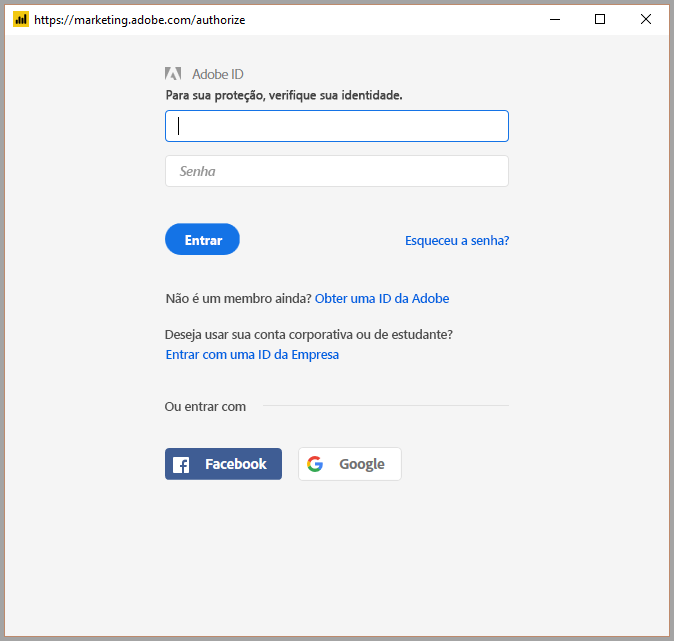
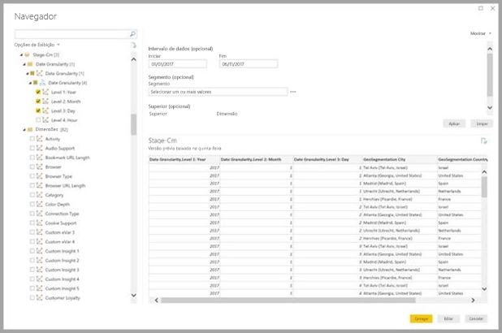
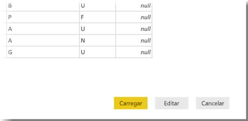

# Conectar-se ao Adobe Analytics no Power BI Desktop 
No **Power BI Desktop**, você pode se conectar ao **Adobe Analytics** e usar os dados subjacentes, assim como em qualquer outra fonte de dados no Power BI Desktop. 

## Conectar-se aos dados do Adobe Analytics
Para se conectar aos dados do **Adobe Analytics**, selecione **Obter Dados** na faixa de opções **Início** no Power BI Desktop. Selecione **Serviços Online** nas categorias à esquerda, e você verá o **Conector do Adobe Analytics**.

Na janela do **Adobe Analytics** que é exibida, selecione o botão **Entrar** e, em seguida, forneça suas credenciais para entrar em sua conta do Adobe Analytics. A janela de entrada do Adobe aparece, conforme mostrado na imagem a seguir.

Quando solicitado, insira o nome de usuário e a senha. Quando a conexão é estabelecida, você pode visualizar e selecionar várias dimensões e medidas na caixa de diálogo **Navegador** do Power BI para criar uma única saída de tabela. Você também pode fornecer os parâmetros de entrada necessários para os itens selecionados. 

Você pode **Carregar** a tabela selecionada, que leva toda a tabela para o **Power BI Desktop** ou você pode **Editar** a consulta, o que abre **Editor de Consultas** para filtrar e refinar o conjunto de dados que você deseja usar e, em seguida, carregar tal conjunto de dados refinado no **Power BI Desktop**.

## Próximas etapas
Há todos os tipos de dados aos quais você pode se conectar usando o Power BI Desktop. Para obter mais informações sobre fontes de dados, confira os seguintes recursos:

* [O que é o Power BI Desktop?](../fundamentals/desktop-what-is-desktop.md)
* [Fontes de dados no Power BI Desktop](desktop-data-sources.md)
* [Formatar e combinar dados com o Power BI Desktop](desktop-shape-and-combine-data.md)
* [Conectar-se a pastas de trabalho do Excel no Power BI Desktop](desktop-connect-excel.md)   
* [Inserir dados diretamente no Power BI Desktop](desktop-enter-data-directly-into-desktop.md)   
