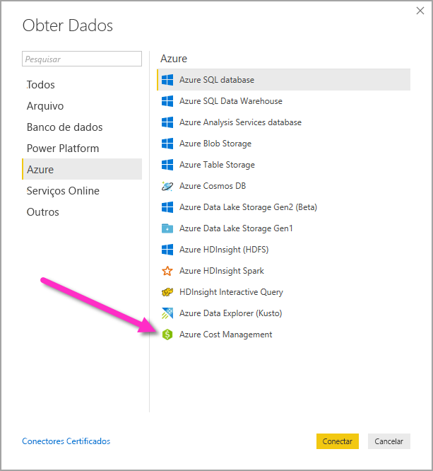
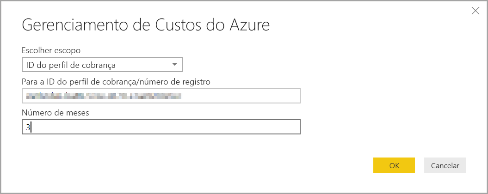
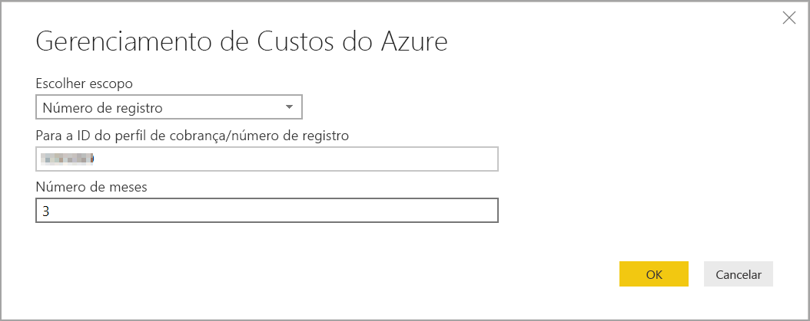
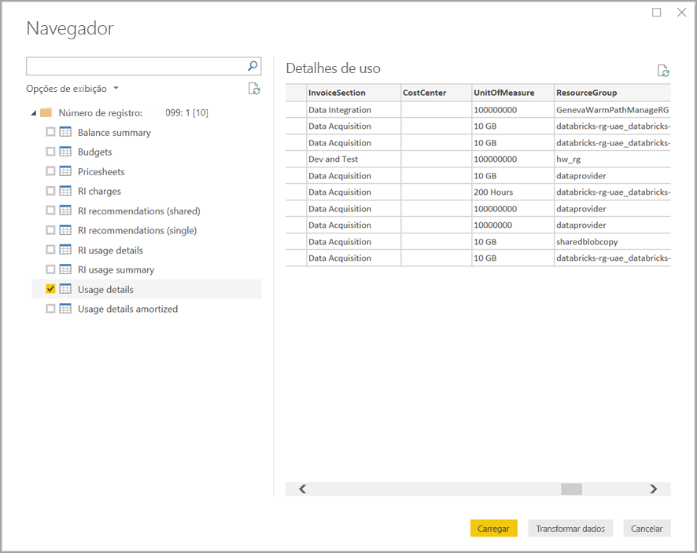

# Criar visuais e relatórios com o conector do Gerenciamento de Custos do Azure no Power BI Desktop

Você pode usar o conector de Gerenciamento de Custos do Azure para Power BI Desktop para criar visualizações e relatórios avançados e personalizados que ajudam a entender melhor seus gastos com o Azure. Atualmente, o conector do Gerenciamento de Custos do Azure dá suporte aos clientes com o [Contrato de Cliente da Microsoft](https://azure.microsoft.com/pricing/purchase-options/microsoft-customer-agreement/) ou um [Contrato Enterprise (EA)](https://azure.microsoft.com/pricing/enterprise-agreement/).  

O conector do Gerenciamento de Custos do Azure usa o OAuth 2.0 para autenticação com o Azure e identifica os usuários que usarão o conector. Os tokens gerados nesse processo são válidos por um período específico. O Power BI preserva o token para o próximo logon. O OAuth 2.0 é um padrão para o processo que ocorre nos bastidores para garantir o tratamento seguro dessas permissões. Para se conectar, você deve usar uma conta de [administrador de Enterprise](https://docs.microsoft.com/azure/billing/billing-understand-ea-roles) para contratos Enterprise ou uma de [Proprietário de conta de cobrança](https://docs.microsoft.com/azure/billing/billing-understand-mca-roles) para contratos de clientes da Microsoft. 

> [!NOTE]
> Esse conector substitui os conectores do [Azure Consumption Insights e do Gerenciamento de Custos do Azure (beta)](desktop-connect-azure-consumption-insights.md) anteriormente disponíveis. Relatórios criados com o conector anterior devem ser recriados usando esse conector.

## Conectar usando o Gerenciamento de Custos do Azure

Para usar o **conector de Gerenciamento de Custos do Azure** no Power BI Desktop, siga as etapas a seguir:

1.  Na faixa de opções **Página Inicial**, selecione **Obter Dados**.
2.  Selecione **Azure** na lista de categorias de dados.
3.  Selecione **Gerenciamento de Custos do Azure**.

    

4. Na caixa de diálogo exibida, insira a **ID do Perfil de Cobrança** para **Contratos de Clientes da Microsoft** ou o seu **Número de Inscrição** para **Contratos Enterprise (EA)** . 

## Conectar-se a uma conta do contrato de cliente da Microsoft 

Para se conectar com uma conta de **Contrato de Cliente da Microsoft**, você pode obter a **ID do perfil de cobrança** no portal do Azure:

1.  No [portal do Azure](https://portal.azure.com/), navegue para **Gerenciamento de Custos + Cobrança**.
2.  Selecione seu perfil de cobrança. 
3.  No menu**Configurações**, selecione **Propriedades** na barra lateral.
4.  Em **Perfil de cobrança**, copie a **ID**. 
5.  Para **Escolher Escopo** , selecione **ID do Perfil de Cobrança** e cole a ID do perfil de cobrança da etapa anterior. 
6.  Insira o número de meses e selecione **OK** .

    

7.  Quando solicitado, entre com sua conta de usuário e senha do Azure. 

## Conectar-se a uma conta de Contrato Agreement

Para se conectar com uma conta de Contrato Enterprise (EA), você pode obter sua ID de registro do portal do Azure:

1.  No [portal do Azure](https://portal.azure.com/), navegue para **Gerenciamento de Custos + Cobrança**.
2.  Selecione sua conta de cobrança.
3.  No menu **Visão geral**, copie a **ID da conta de cobrança**.
4.  Para **Escolher Escopo** , selecione **Número de Inscrição** e cole a ID da conta de cobrança da etapa anterior. 
5.  Insira o número de meses e, em seguida, selecione **OK** .

    

6.  Quando solicitado, entre com sua conta de usuário e senha do Azure. 

## Dados disponíveis por meio do conector

Após a autenticação bem-sucedida, uma janela **Navegador**  aparece com as seguintes tabelas de dados disponíveis:

| **Tabela** | **Descrição** |
| --- | --- |
| **Resumo de saldo** | Resumo do saldo do EA (Contratos Enterprise). |
| **Eventos de cobrança** | Um log de eventos de novas faturas, compras de crédito etc. Somente contrato com o cliente da Microsoft. |
| **Orçamentos** | Detalhes sobre o orçamento para ver os custos reais ou uso em relação às metas de orçamento existentes. |
| **Encargos** | Um resumo mensal do uso do Azure, encargos do marketplace e encargos cobrados separadamente. Somente contrato com o cliente da Microsoft. |
| **Lotes de crédito** | Detalhes da compra de lote do crédito Azure para o perfil de cobrança fornecido. Somente contrato com o cliente da Microsoft. |
| **Pricesheets** | As taxas aplicáveis por medidor do perfil de cobrança fornecido ou registro de EA. |
| **Encargos de RI** | Encargos associados às suas Instâncias Reservadas nos últimos 24 meses. |
| **Recomendações de RI (compartilhada)** | Recomendações de compra de Instância Reservada fornece com base em todas as tendências de uso de assinatura nos últimos 7, 30 ou 60 dias. |
| **Recomendações de RI (única)** | Recomendações de compra de Instância Reservada fornece com base em suas tendências de uso em uma assinatura única nos últimos 7, 30 ou 60 dias. |
| **Detalhes de uso da RI** | Detalhes de consumo para suas Instâncias Reservadas existentes no último mês. |
| **Resumo de uso da RI** | Porcentagem diária de uso de reserva do Azure. |
| **Detalhes de uso** | Um detalhamento das quantidades consumidas e dos encargos estimados para o perfil de cobrança fornecido no registro do EA. |
| **Detalhes de uso amortizados** | Um detalhamento das quantidades consumidas e dos encargos amortizados estimados para a ID do perfil de cobrança fornecida. |

Selecione uma tabela para ver uma visualização da caixa de diálogo. Selecione uma ou mais tabelas, marcando as caixas ao lado de seu nome e, em seguida, selecione **Carregar**.

Quando você seleciona **Carregar**, os dados são carregados no Power BI Desktop. 

Quando os dados selecionados são carregados, as tabelas de dados e os campos são mostrados no painel **Campos**.

## Próximas etapas

Você pode se conectar a vários tipos diferentes de fontes de dados com o Power BI Desktop. Para obter mais informações, consulte os seguintes artigos:

* [O que é o Power BI Desktop?](../fundamentals/desktop-what-is-desktop.md)
* [Fontes de dados no Power BI Desktop](desktop-data-sources.md)
* [Formatar e combinar dados com o Power BI Desktop](desktop-shape-and-combine-data.md)
* [Conectar-se a pastas de trabalho do Excel no Power BI Desktop](desktop-connect-excel.md)   
* [Inserir dados diretamente no Power BI Desktop](desktop-enter-data-directly-into-desktop.md)   
