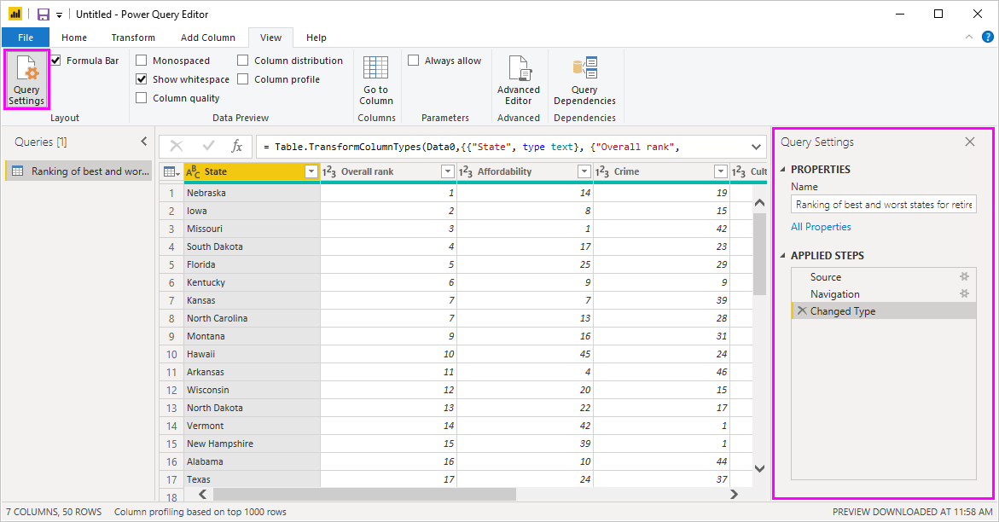
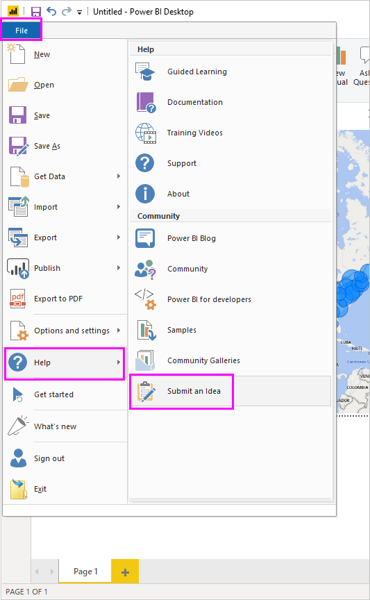

# Conectar-se a fontes de dados no Power BI Desktop

Com o Power BI Desktop você pode se conectar facilmente ao mundo dos dados, que está em constante expansão. Se não tiver o Power BI Desktop, você pode [baixá-lo](https://go.microsoft.com/fwlink/?LinkID=521662) e instalá-lo.

Há *todos os tipos* de fontes de dados disponíveis no Power BI Desktop. A imagem a seguir mostra como se conectar aos dados selecionando **Obter Dados** > **Outros** > **Web**.

## Exemplo de conexão a dados

Neste exemplo, nos conectaremos a uma fonte de dados **Web** .

Imagine que você está se aposentando. Você deseja morar em um lugar em que há muito sol, melhores opções de impostos e boa assistência médica. Ou… talvez você seja um analista de dados e queira usar essas informações para ajudar seus clientes, por exemplo, ajudar seu cliente fabricante de capas de chuva a direcionar as vendas para os lugares em que há *muita* chuva.

De qualquer modo, você encontra um recurso da Web que tenha dados interessantes sobre esses tópicos e muito mais:

[https://www.bankrate.com/finance/retirement/best-places-retire-how-state-ranks.aspx](https://www.bankrate.com/finance/retirement/best-places-retire-how-state-ranks.aspx)

Selecione **Obter Dados** > **Outros** > **Web**. Em **Da Web**, insira o endereço.

Ao selecionar **OK**, a funcionalidade *Consulta* do Power BI Desktop começa a trabalhar. O Power BI Desktop entra em contato com o recurso da Web e a janela **Navegador** retorna os resultados encontrados pela consulta nessa página da Web. Nesse caso, ela encontrou uma tabela e o Documento geral. Estamos interessados na tabela e, portanto, selecionamos a tabela na lista. A janela **Navegador** exibe uma visualização.

Neste ponto, você pode editar a consulta antes de carregar a tabela selecionando **Transformar Dados** na parte inferior da janela ou apenas carregar a tabela.

Selecione **Transformar Dados** para carregar a tabela e iniciar o Editor do Power Query. O painel **Configurações de Consulta** será exibido. Caso contrário, selecione **Exibir** na faixa de opções e **Configurações de Consulta** para exibir o painel **Configurações de Consulta**. Eis aqui a aparência que isso tem.

Todas essas pontuações são texto e não números, e precisamos que elas sejam números. Sem problemas. Basta clicar com o botão direito do mouse no cabeçalho da coluna e selecionar **Alterar Tipo** > **Número Inteiro** para alterá-los. Para escolher mais de uma coluna, primeiro selecione uma coluna, mantenha pressionada a tecla SHIFT, selecione outras colunas adjacentes e, em seguida, clique com o botão direito do mouse em um cabeçalho de coluna para alterar todas as colunas selecionadas. Use CTRL para selecionar colunas que não são adjacentes.

Em **Configurações de Consulta**, as **ETAPAS APLICADAS** refletirão as alterações feitas. Conforme você faz outras alterações nos dados, o Editor do Power Query registrará essas alterações na seção **ETAPAS APLICADAS**, as quais você poderá ajustar, revisitar, reorganizar ou excluir, conforme necessário.

Ainda podem ser feitas outras alterações na tabela após o carregamento, mas o que já fizemos é suficiente por enquanto. Quando terminar, selecione **Fechar e Aplicar** na faixa de opções **Página Inicial**, e o Power BI Desktop aplicará as alterações e fechará o Editor do Power Query.

Com o modelo de dados carregado, na exibição de **Relatório** no Power BI Desktop, podemos começar criando visualizações arrastando campos para a tela.

É claro que esse modelo é simples, com uma só conexão de dados. A maioria dos relatórios do Power BI Desktop terá conexões com diferentes fontes de dados, modeladas para atender às suas necessidades, com relações que produzem um modelo de dados avançado.

## Próximas etapas
Há inúmeras coisas que você pode fazer com o Power BI Desktop. Para obter mais informações sobre seus recursos, consulte as seguintes fontes:

* [O que é o Power BI Desktop?](../fundamentals/desktop-what-is-desktop.md)
* [Sobre o uso do Editor de Consulta no Power BI Desktop](../transform-model/desktop-query-overview.md)
* [Fontes de dados no Power BI Desktop](desktop-data-sources.md)
* [Formatar e combinar dados no Power BI Desktop](desktop-shape-and-combine-data.md)
* [Realizar tarefas comuns de consulta no Power BI Desktop](../transform-model/desktop-common-query-tasks.md)   

Deseja nos enviar comentários? Ótimo! Use o item de menu **Enviar uma Ideia** no Power BI Desktop ou visite os [Comentários da Comunidade](https://community.powerbi.com/t5/Community-Feedback/bd-p/community-feedback). Aguardamos seu contato!

