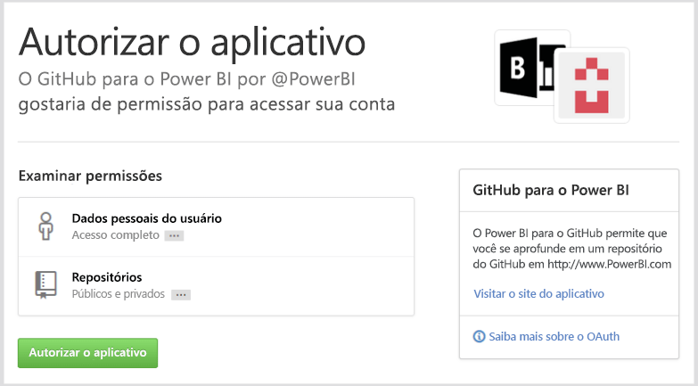
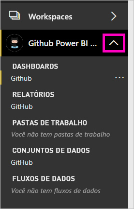
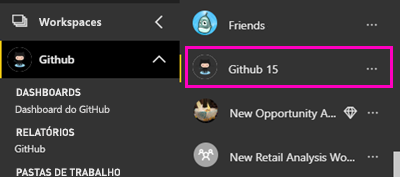
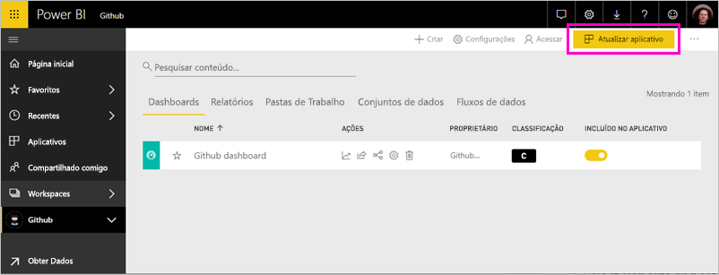

# Conectar-se ao GitHub com o Power BI
Este artigo explica como extrair seus dados da sua conta do GitHub com um aplicativo de modelo do Power BI. O aplicativo de modelo gera um workspace com um dashboard, um conjunto de relatórios e um conjunto de dados para permitir que você explore seus dados do GitHub. O aplicativo do GitHub para o Power BI mostra insights de seu repositório do GitHub, também conhecido como repositório, contendo dados sobre contribuições, problemas, solicitações pull e usuários ativos.

Depois de instalar o aplicativo de modelo, você pode alterar o dashboard e o relatório. Em seguida, pode distribuí-lo como um aplicativo para os colegas de sua organização.

Conecte-se ao [aplicativo de modelo do GitHub](https://app.powerbi.com/groups/me/getapps/services/pbi-contentpacks.pbiapps-github) ou leia mais sobre a [Integração do GitHub](https://powerbi.microsoft.com/integrations/github) com o Power BI.

Você também pode experimentar o [tutorial do GitHub](service-tutorial-connect-to-github.md). Ele instala dados reais do GitHub sobre o repositório público para a documentação de Power BI.

>[!NOTE]
>Este aplicativo de modelo exige que a conta do GitHub tenha acesso ao repositório. Mais detalhes sobre os requisitos abaixo.
>
>Este aplicativo de modelo não dá suporte ao GitHub Enterprise. 

## Como se conectar
[!INCLUDE [powerbi-service-apps-get-more-apps](../includes/powerbi-service-apps-get-more-apps.md)]
   
3. Selecione **GitHub** \> **Obter agora**.
4. Em **Instalar este aplicativo do Power BI?** selecione **Instalar**.
4. No painel **Aplicativos**, selecione o bloco **GitHub**.

    

6. Em **Introdução a seu novo aplicativo**, selecione **Conectar**.

    

5. Digite o nome do repositório e também o seu proprietário. Veja detalhes sobre [como encontrar esses parâmetros](#FindingParams) abaixo.
   
    

5. Insira suas credenciais do GitHub (essa etapa poderá ser ignorada se você já tiver entrado com seu navegador). 
6. Para o **Método de Autenticação**, selecione **oAuth2** \> **Entrar**. 
7. Siga as telas de autenticação do GitHub. Conceda ao aplicativo de modelo do GitHub para o Power BI permissão de acesso aos dados do GitHub.
   
   
   
    O Power BI se conecta ao GitHub e aos seus dados.  Os dados são atualizados uma vez por dia. Depois que o Power BI importa os dados, você vê os conteúdos de seu novo workspace do GitHub.

## Modificar e distribuir seu aplicativo

Você instalou o aplicativo de modelo do GitHub. Isso significa que você também criou o workspace do GitHub. No workspace, você pode alterar o relatório e o dashboard e, em seguida, distribuí-lo como um *aplicativo* para os colegas em sua organização. 

1. Selecione a seta ao lado do nome do workspace no painel de navegação. Você vê que o workspace contém um dashboard e um relatório.

    

8. Selecione o novo [dashboard do GitHub](https://powerbi.microsoft.com/integrations/github).    
    

3. Para exibir todo o conteúdo do seu novo workspace do GitHub, no painel de navegação, selecione **Workspaces** > **GitHub**.
 
   

    Esta exibição é a lista de conteúdo do workspace. No canto superior direito, você verá **Atualizar aplicativo**. Quando você estiver pronto para distribuir seu aplicativo para seus colegas, é aí que você começará. 

    

2. Selecione **Relatórios** e **Conjunto de dados** para ver os outros elementos no workspace.

    Leia sobre [como distribuir aplicativos](../collaborate-share/service-create-distribute-apps.md) para seus colegas.

## O que está incluído no aplicativo
Os dados a seguir estão disponíveis no GitHub no Power BI:     

| Nome da tabela | Descrição |
| --- | --- |
| Contribuições |A tabela de contribuições apresenta o total de adições, exclusões e confirmações criadas pelo colaborador agregadas por semana. Os 100 principais colaboradores são incluídos. |
| Questões |Lista todos os problemas do repositório selecionado e contém cálculos como os tempos total e médio para encerramento de um problema, Total de problemas em aberto e Total de problemas encerrados. Esta tabela estará vazia quando não houver nenhum problema no repositório. |
| Solicitações pull |Esta tabela contém todas as Solicitações Pull para o repositório e quem realizou a solicitação. Ela também contém cálculos de quantas solicitações pull abertas, fechadas e totais existem, quanto tempo demorou para efetuar o pull das solicitações e quanto tempo levou cada solicitação pull em média. Esta tabela estará vazia quando não houver nenhum problema no repositório. |
| Usuários |Esta tabela fornece uma lista de colaboradores ou usuários do GitHub que fizeram contribuições, arquivaram problemas ou resolveram Solicitações pull para o repositório selecionado. |
| Etapas |Contém todas as Etapas para o repositório selecionado. |
| DateTable |Esta tabela contém datas do presente e de anos no passado, que permitem a você analisar seus dados GitHub por data. |
| ContributionPunchCard |Essa tabela pode ser usada como um cartão perfurado de colaborações para o repositório selecionado. Ele mostra as confirmações por dia da semana e horas do dia. Esta tabela não está conectada a outras tabelas presentes no modelo. |
| RepoDetails |Esta tabela fornece detalhes sobre o repositório selecionado. |

## Requisitos do sistema
* A conta do GitHub que tem acesso ao repositório.  
* Permissão concedida ao Power BI para o aplicativo GitHub durante o primeiro logon. Confira os detalhes abaixo para revogar o acesso.  
* Chamadas à API suficientes disponíveis para extrair e atualizar os dados.
>[!NOTE]
>Este aplicativo de modelo não dá suporte ao GitHub Enterprise.

### Desautorizar Power BI
Para desautorizar a conexão do Power BI ao seu repositório do GitHub, você pode revogar o acesso no GitHub. Veja esse tópico de [Ajuda do GitHub](https://help.github.com/articles/keeping-your-ssh-keys-and-application-access-tokens-safe/#reviewing-your-authorized-applications-oauth) para detalhes.

## Localizando parâmetros
Você pode determinar o proprietário e o repositório consultando o repositório no próprio GitHub:

A primeira parte, "Azure", é o proprietário, enquanto a segunda parte, "azure-sdk-for-php", é o repositório em si.  Você vê esses mesmos dois itens na URL do repositório:

    <https://github.com/Azure/azure-sdk-for-php> .

## Solução de problemas
Se necessário, é possível verificar suas credenciais do GitHub.  

1. Em outra janela do navegador, vá para o site do GitHub e entre no GitHub. Você pode ver, no canto superior direito do site do GitHub, que você está conectado.    
2. No GitHub, navegue até a URL do repositório que você planeja acessar no Power BI. Por exemplo: https://github.com/dotnet/corefx.  
3. No Power BI, tente se conectar ao GitHub. Na caixa de diálogo Configurar o GitHub, use os nomes e o proprietário desse mesmo repositório.  

## Próximas etapas

* [Tutorial: Conectar-se a um repositório do GitHub com o Power BI](service-tutorial-connect-to-github.md)
* [Criar novos workspaces no Power BI](../collaborate-share/service-create-the-new-workspaces.md)
* [Instalar e usar aplicativos no Power BI](../consumer/end-user-apps.md)
* [Conectar-se a aplicativos do Power BI para serviços externos](service-connect-to-services.md)
* Dúvidas? [Experimente perguntar à Comunidade do Power BI](https://community.powerbi.com/)
