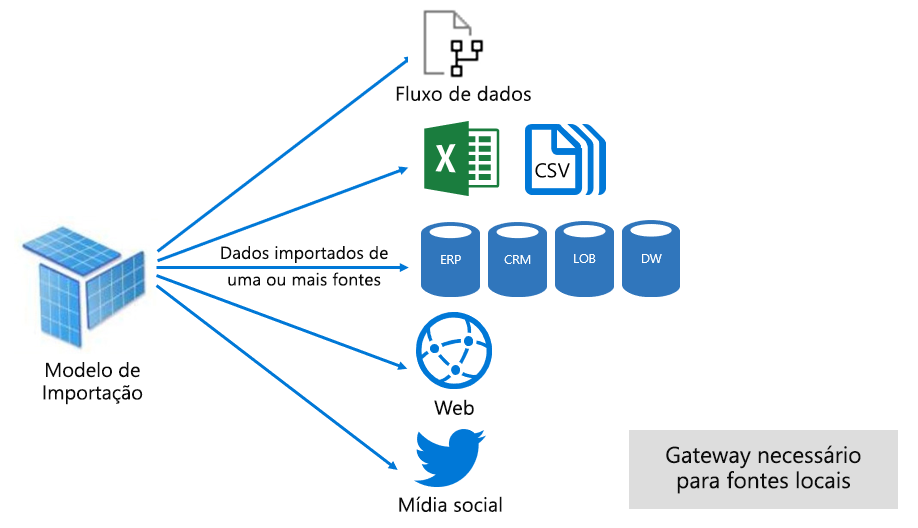
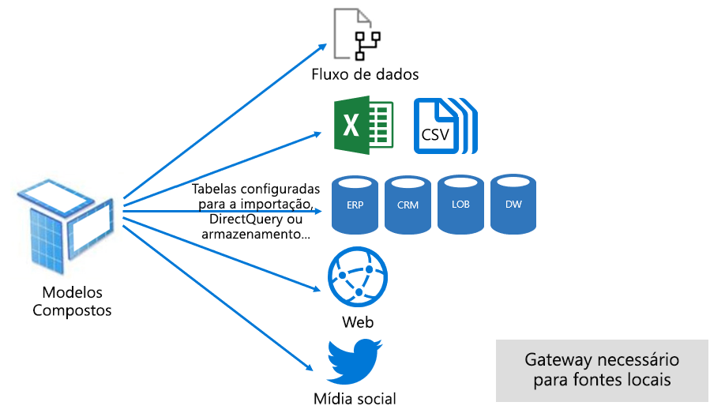

# Modos de conjunto de dados no serviço do Power BI

Este artigo fornece uma explicação técnica dos modos de conjunto de dados do Power BI. Essas informações se aplicam a conjuntos de dados que representam uma conexão dinâmica a um modelo de Analysis Services hospedado externamente e também a modelos desenvolvidos no Power BI Desktop. O artigo enfatiza a lógica de cada modo e possíveis impactos nos recursos de capacidade do Power BI.

Os três modos de conjunto de dados são:

- [Importação](#import-mode)
- [DirectQuery](#directquery-mode)
- [Composto](#composite-mode)

## Modo de importação

O modo de _Importação_ é o modo mais comum usado para desenvolver modelos. Ele proporciona um desempenho extremamente rápido graças à consulta na memória. Também oferece flexibilidade de design para modeladores e suporte a recursos específicos do serviço do Power BI (P e R, Insights Rápidos etc.). Devido a esses pontos fortes, ele é o modo padrão quando você cria uma nova solução do Power BI Desktop.

É importante entender que os dados importados são sempre armazenados em disco. Quando consultados ou atualizados, os dados devem ser totalmente carregados na memória da capacidade do Power BI. Uma vez na memória, os modelos de Importação podem obter resultados de consulta muito rapidamente. Também é importante entender que não há nenhum conceito de modelo de Importação que seja carregado parcialmente na memória.

Ao serem atualizados, os dados que são compactados e otimizados e, em seguida, armazenados em disco pelo mecanismo de armazenamento VertiPaq. Quando carregados do disco para a memória, é possível ver uma compactação de 10 vezes. Portanto, espera-se que 10 GB de dados de origem possam ser compactados em aproximadamente 1 GB. O tamanho do armazenamento em disco pode atingir uma redução de 20% do tamanho compactado. (A diferença no tamanho pode ser determinada comparando o tamanho do arquivo do Power BI Desktop com o uso da memória do Gerenciador de Tarefas do arquivo.)

A flexibilidade de design pode ser obtida de três maneiras. Os modeladores de dados podem:

- Integrar dados armazenando dados em cache de fluxos de dados e fontes externas, independentemente do tipo ou formato da fonte de dados
- Utilizar o conjunto inteiro das funções de [Linguagem de fórmula de consulta do Power Query](/powerquery-m/) (informalmente chamado de M) ao criar consultas de preparação de dados
- Utilizar todo o conjunto de funções de [DAX (Data Analysis Expressions)](/dax/) ao aprimorar o modelo com lógica de negócios. Há suporte para colunas calculadas, tabelas calculadas e medidas.

Conforme mostrado na imagem a seguir, um modelo de Importação pode integrar dados de diversos tipos de fonte de dados com suporte.

Porém, embora haja vantagens atraentes associadas aos modelos de Importação, também há desvantagens:

- O modelo inteiro deve ser carregado na memória antes que o Power BI consulte o modelo, o que poderá causar uma pressão nos recursos de capacidade disponíveis, especialmente à medida que o número e o tamanho dos modelos de Importação forem crescendo
- Os dados do modelo são apenas aqueles vigentes na atualização mais recente e, portanto, os modelos de Importação precisam ser atualizados, em geral, periodicamente
- Uma atualização completa removerá todos os dados de todas as tabelas e os recarregará a partir da fonte de dados. Essa operação pode ser dispendiosa em termos de tempo e recursos para o serviço do Power BI e as fontes de dados.

    > [!NOTE]
    > O Power BI pode obter uma atualização incremental para evitar truncar e recarregar tabelas inteiras. No entanto, esse recurso só tem suporte quando o conjunto de dados é hospedado em workspaces em capacidades Premium. Para obter mais informações, confira o artigo [Atualização incremental no Power BI Premium](../admin/service-premium-incremental-refresh.md).

Da perspectiva de um recurso do serviço do Power BI, os modelos de Importação exigem:

- Memória suficiente para carregar o modelo quando ele é consultado ou atualizado
- Processamento de recursos e recursos de memória adicionais para atualizar os dados

## Modo DirectQuery

O modo _DirectQuery_ é uma alternativa ao modo de Importação. Os modelos desenvolvidos no modo DirectQuery não importam dados. Em vez disso, eles contêm apenas metadados que definem a estrutura do modelo. Quando o modelo é consultado, as consultas nativas são usadas para recuperar os dados da fonte de dados subjacente.

Há dois motivos principais para considerar desenvolver um modelo DirectQuery:

- Quando os volumes de dados são muito grandes (mesmo quando são aplicados [métodos de redução de dados](../guidance/import-modeling-data-reduction.md)) para carregar em um modelo ou para uma atualização prática
- Quando os relatórios e painéis precisam fornecer dados "quase em tempo real", para além do que pode ser obtido dentro dos limites de atualização agendada. (Os limites de atualização agendada ocorrem oito vezes por dia para a capacidade compartilhada e 48 vezes por dia para a capacidade Premium.)

Há diversas vantagens associadas aos modelos DirectQuery:

- Os limites de tamanho do modelo de Importação não se aplicam
- Os modelos não exigem atualização
- Os usuários de relatórios verão os dados mais recentes ao interagirem com segmentações e filtros de relatório. Além disso, os usuários de relatórios podem atualizar o relatório inteiro para recuperar dados atuais.
- Relatórios em tempo real podem ser desenvolvidos usando o recurso de [Atualização automática de página](../create-reports/desktop-automatic-page-refresh.md)
- Os blocos de painel, quando baseados em modelos DirectQuery, podem ser atualizados automaticamente, a cada 15 minutos

No entanto, há algumas limitações associadas aos modelos do DirectQuery:

- As fórmulas DAX são limitadas a usar apenas funções que podem ser transpostas para consultas nativas compreendidas pela fonte de dados. Não há suporte para tabelas calculadas.
- Não há suporte para os recursos P e R e Insights Rápidos

Da perspectiva de um recurso do serviço do Power BI, os modelos DirectQuery exigem:

- Memória mínima para carregar o modelo (somente metadados) quando for consultado
- Às vezes, o serviço do Power BI deve usar recursos significativos do processador para gerar e processar consultas enviadas à fonte de dados. Quando essa situação ocorre, pode afetar a taxa de transferência, especialmente quando há usuários consultando o modelo ao mesmo tempo.

Para obter mais informações, confira [Usar o Direct Query no Power BI Desktop](desktop-use-directquery.md).

## Modo Composto

O modo _Composto_ pode combinar os modos de Importação e DirectQuery ou integrar várias fontes de dados DirectQuery. Os modelos desenvolvidos no modo Composto dão suporte à configuração do modo de armazenamento para cada tabela de modelo. Esse modo também oferece suporte a tabelas calculadas (definidas com DAX).

O modo de armazenamento de tabela pode ser configurado como Importação, DirectQuery ou Dual. Uma tabela configurada como modo de armazenamento Dual é ao mesmo tempo de Importação e DirectQuery, e essa configuração permite que o serviço do Power BI determine o modo mais eficiente a ser usado de acordo com cada consulta.

Os modelos Compostos oferecem o melhor dos modos de Importação e DirectQuery. Quando configurados adequadamente, eles podem combinar o alto desempenho de consultas de modelos na memória com a capacidade de recuperar dados de fontes de dados quase que em tempo real.

Os modeladores de dados que desenvolvem modelos Compostos provavelmente configuram tabelas de tipo de dimensão no modo de armazenamento Importação ou Dual, bem como tabelas de tipo de fato no modo DirectQuery. Para obter mais informações sobre as funções de tabela de modelo, confira [Entender o esquema em estrela e a importância para o Power BI](../guidance/star-schema.md).

Por exemplo, considere um modelo com uma tabela de tipo de dimensão **Produto** no modo Dual e uma tabela de tipo de fato **Vendas** no modo DirectQuery. A tabela **Produto** poderia ser consultada de forma rápida e eficiente na memória para renderizar uma segmentação de relatório. A tabela **Vendas** também pode ser consultada no modo DirectQuery com a tabela **Produto** relacionada. A última consulta pode habilitar a geração de uma única consulta SQL nativa e eficiente que une as tabelas **Produto** e **Vendas** e as filtra pelos valores de segmentação.

Em geral, para modelos Compostos, as vantagens e desvantagens associadas à Importação e ao DirectQuery dependem de como cada tabela é configurada.

Para obter mais informações, confira [Usar modelos compostos no Power BI Desktop](../transform-model/desktop-composite-models.md).

## Próximas etapas

- [Conjuntos de dados no serviço do Power BI](service-dataset-modes-understand.md)
- [Modo de armazenamento no Power BI Desktop](../transform-model/desktop-storage-mode.md)
- [Usar o DirectQuery no Power BI](desktop-directquery-about.md)
- [Usar modelos compostos no Power BI Desktop](../transform-model/desktop-composite-models.md)
- Mais perguntas? [Experimente perguntar à Comunidade do Power BI](https://community.powerbi.com/)
