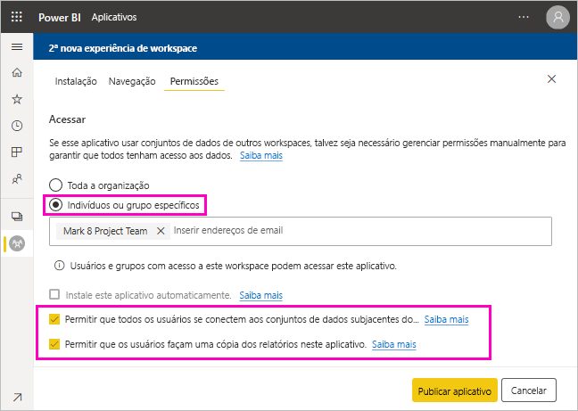

# Compartilhar um conjunto de dados (versão prévia)

Como um criador de *modelos de dados* no Power BI Desktop, você cria *conjuntos de dados* que podem ser distribuídos no serviço do Power BI. Em seguida, outros criadores de relatório podem usar seus conjuntos de valores como base para seus próprios relatórios. Neste artigo, você aprenderá a compartilhar seus conjuntos de dados. Para saber como conceder e remover o acesso aos seus conjuntos de dados compartilhados, leia sobre a [permissão Criar](service-datasets-build-permissions.md).

## Etapas para compartilhar seu conjunto de dados

1. Comece criando um arquivo .pbix com um modelo de dados no Power BI Desktop. Se pretende oferecer esse conjunto de dados para outras pessoas criarem relatórios, talvez você nem mesmo projete um relatório no arquivo .pbix.

    Uma melhor prática é salvar o arquivo .pbix em um grupo do Office 365.

1. Publique o arquivo .pbix em um [workspace da nova experiência](../collaborate-share/service-create-the-new-workspaces.md) no serviço do Power BI.
    
    Os outros membros desse workspace já podem criar relatórios em outros workspaces com base nesse conjunto de dados.

1. Você também pode [publicar um aplicativo](../collaborate-share/service-create-distribute-apps.md) usando esse workspace. Quando fizer isso, na página **Permissões**, especifique quem tem permissões e o que eles podem fazer.

    > [!NOTE]
    > Se você selecionar **Organização inteira**, ninguém da organização terá a permissão Criar. Esse problema já é conhecido. Em vez disso, especifique endereços de email em **Indivíduos ou grupos específicos**.  Caso você deseje que toda a sua organização tenha a permissão Criar, especifique um alias de email para toda a organização.

    

1. Selecione **Publicar aplicativo** ou **Atualizar aplicativo** se ele já tiver sido publicado.

## Acompanhar o uso do conjunto de dados

Quando você tiver um conjunto de dados compartilhado em seu workspace, talvez você precise saber quais relatórios em outros workspaces são baseados nele.

1. Na exibição de lista Conjuntos de dados, selecione **Exibir relacionados**.

    

1. A caixa de diálogo **Conteúdo relacionado** mostra todos os itens relacionados. Nessa lista, você verá os itens relacionados nesse workspace e em **Outros workspaces**.
 
    

## Próximas etapas

- [Usar conjuntos de dados em workspaces (versão prévia)](service-datasets-across-workspaces.md)
- Perguntas? [Experimente perguntar à Comunidade do Power BI](https://community.powerbi.com/)
