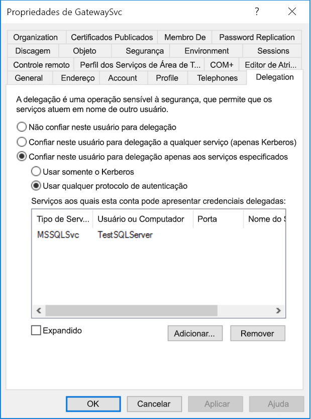
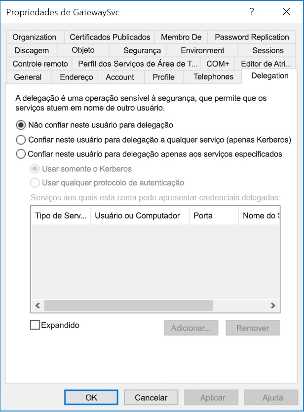
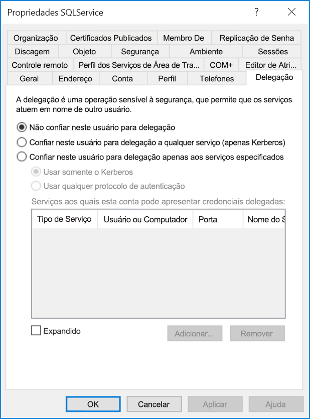
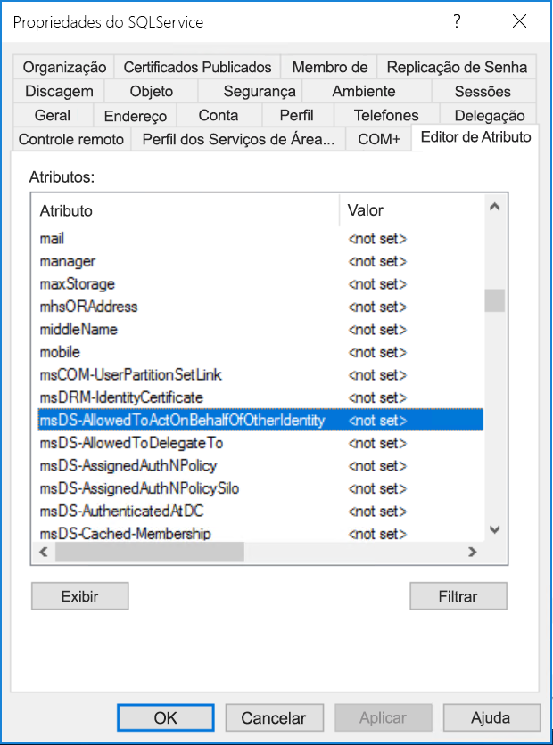
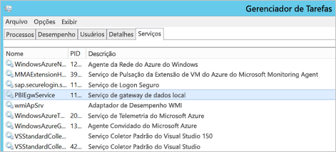

# <a name="configure-kerberos-based-sso-from-power-bi-service-to-on-premises-data-sources"></a>Configurar o SSO baseado em Kerberos do serviço do Power BI para fontes de dados locais

A habilitação do SSO facilita a atualização de dados de fontes locais em relatórios e dashboards do Power BI, respeitando as permissões no nível de usuário configuradas nessas fontes. Use a [delegação restrita de Kerberos](/windows-server/security/kerberos/kerberos-constrained-delegation-overview) para habilitar a conectividade ininterrupta de SSO. 

## <a name="prerequisites"></a>Pré-requisitos

Vários itens devem ser configurados para que a delegação restrita de Kerberos funcione corretamente, incluindo os _SPNs_ (nomes das entidades de serviço) e as configurações de delegação nas contas de serviço.

### <a name="install-and-configure-the-microsoft-on-premises-data-gateway"></a>Instalar e configurar o gateway de dados local da Microsoft

O gateway de dados local é compatível com atualização in-loco e com o _controle das configurações_ de gateway existentes.

### <a name="run-the-gateway-windows-service-as-a-domain-account"></a>executar o serviço Windows do gateway como uma conta de domínio

Em uma instalação padrão, o gateway é executado como uma conta de serviço local do computador, **NT Service\PBIEgwService**.


Para habilitar a delegação restrita de Kerberos, o gateway precisa ser executado como uma conta de domínio, a menos que a instância do Azure AD (Azure Active Directory) já esteja sincronizada com a instância do Active Directory local (usando o Azure AD DirSync/Connect). Para alternar para uma conta de domínio, confira [Mudar a conta de serviço de gateway](/data-integration/gateway/service-gateway-service-account).

> [!NOTE]
> Se o Microsoft Azure Active Directory Connect está configurado e as contas de usuário estão sincronizadas, o serviço do gateway não precisa executar pesquisas no Microsoft Azure Active Directory local no runtime. Em vez disso, basta usar o SID do serviço local para que o serviço de gateway conclua toda a configuração necessária no Azure AD. As etapas de configuração da delegação restrita de Kerberos descritas neste artigo são as mesmas exigidas no contexto do Azure AD. Elas são aplicadas ao objeto de computador do gateway (conforme identificado pelo SID do serviço local) no Azure AD em vez da conta de domínio.

## <a name="obtain-domain-admin-rights-to-configure-spns-setspn-and-kerberos-constrained-delegation-settings"></a>Ter direitos de administrador de domínio para definir configurações de SPNs (SetSPN) e da delegação restrita do Kerberos

Para definir configurações de SPNs e delegação de Kerberos, o administrador do domínio precisa evitar conceder direitos a pessoas que não têm direitos de administrador de domínio. Na seção a seguir, abordaremos as etapas de configuração recomendadas mais detalhadamente.

## <a name="configure-kerberos-constrained-delegation-for-the-gateway-and-data-source"></a>Configurar a delegação restrita de Kerberos para o gateway e a fonte de dados

Se necessário, configure um SPN para a conta de domínio do serviço do gateway como administrador do domínio e defina configurações de delegação na conta de domínio do serviço do gateway.

### <a name="configure-an-spn-for-the-gateway-service-account"></a>Configurar um SPN para a conta de serviço do gateway

Primeiro, determine se um SPN já foi criado para a conta de domínio usada como a conta de serviço do gateway:

1. Como administrador do domínio, inicie o snap-in **Usuários e Computadores do Active Directory** do MMC (Console de Gerenciamento Microsoft).

2. No painel esquerdo, clique com o botão direito do mouse no nome de domínio, selecione **Localizar** e insira o nome da conta de serviço do gateway.

3. No resultado da pesquisa, clique com o botão direito do mouse na conta de serviço do gateway e selecione **Propriedades**.

4. Se a guia **Delegação** estiver visível na caixa de diálogo **Propriedades**, isso indica que já foi criado um SPN e é possível pular para [Decidir o tipo de delegação restrita de Kerberos a ser usado](#decide-on-the-type-of-kerberos-constrained-delegation-to-use).

5. Se não houver uma guia **Delegação** na caixa de diálogo **Propriedades**, crie manualmente um SPN na conta para habilitá-la. Use a [ferramenta setspn](https://technet.microsoft.com/library/cc731241.aspx) fornecida com o Windows (é necessário ter direitos de administrador de domínio para criar o SPN).

   Por exemplo, imagine que a conta de serviço do gateway é **Contoso\GatewaySvc** e que o serviço de gateway está em execução em um computador chamado **MyGatewayMachine**. Para definir o SPN da conta de serviço do gateway, execute o seguinte comando:

   ```setspn -a gateway/MyGatewayMachine Contoso\GatewaySvc```

   Também é possível definir o SPN usando o snap-in **Usuários e Computadores do Active Directory** do MMC.
   
### <a name="add-gateway-service-account-to-windows-authorization-and-access-group-if-required"></a>Se for preciso, adicione uma conta de serviço do gateway ao Grupo de Acesso e Autorização do Windows

Em alguns cenários, a conta de serviço do gateway deve ser adicionada ao Grupo de Acesso e Autorização do Windows. Esses cenários incluem a proteção de segurança do ambiente do Active Directory e quando a conta de serviço do gateway e as contas de usuário que o gateway representará estiverem em domínios ou florestas separados. Apesar de não ser obrigatório, também é possível adicionar a conta de serviço do gateway ao Grupo de Acesso e Autorização do Windows em situações em que o domínio/floresta não tiver sido protegido.

Confira mais informações em [Grupo de Acesso e Autorização do Windows](/windows/security/identity-protection/access-control/active-directory-security-groups#bkmk-winauthaccess).

Para concluir esta etapa da configuração, para todo domínio que contiver usuários do Active Directory que você desejar que a conta de serviço do gateway possa representar:
1. Conecte-se a um computador no domínio e inicie o snap-in do MMC chamado Usuários e Computadores do Active Directory.
2. Localize o grupo **Grupo de Acesso e Autorização do Windows**, geralmente localizado no contêiner **Builtin**.
3. Clique duas vezes no grupo e clique na guia **Membros**.
4. Clique em **Adicionar** e altere o local do domínio para o domínio em que a conta de serviço do gateway reside.
5. Digite o nome da conta de serviço do gateway e clique em **Verificar Nomes** para verificar se a conta de serviço de gateway está acessível.
6. Clique em **OK**.
7. Clique em **Aplicar**.
8. Reinicie o serviço de gateway.

### <a name="decide-on-the-type-of-kerberos-constrained-delegation-to-use"></a>Decida o tipo de delegação restrita de Kerberos a ser usado

É possível definir as configurações de delegação para a delegação restrita de Kerberos padrão ou baseada em recursos. Use a delegação baseada em recursos (que exige o Windows Server 2012 ou versões posteriores) se a fonte de dados pertencer a um domínio diferente daquele do gateway. Para saber mais sobre as diferenças entre as duas abordagens de delegação, confira [Visão geral da delegação restrita de Kerberos](/windows-server/security/kerberos/kerberos-constrained-delegation-overview).

 De acordo com a abordagem que você quer usar, acesse uma das seguintes seções. Não conclua ambas as seções:
 - [Configurar a conta de serviço do gateway para delegação restrita de Kerberos padrão](#configure-the-gateway-service-account-for-standard-kerberos-constrained-delegation)
- [Configurar a conta de serviço do gateway para delegação restrita de Kerberos baseada em recursos](#configure-the-gateway-service-account-for-resource-based-kerberos-constrained-delegation). 

## <a name="configure-the-gateway-service-account-for-standard-kerberos-constrained-delegation"></a>Configurar a conta de serviço do gateway para delegação restrita de Kerberos padrão

> [!NOTE]
> Conclua as etapas nesta seção se quiser habilitar a [delegação restrita de Kerberos padrão](/windows-server/security/kerberos/kerberos-constrained-delegation-overview). Caso contrário, se quiser habilitar a delegação restrita de Kerberos baseada em recursos, conclua as etapas em [Configurar a conta de serviço do gateway para a delegação restrita de Kerberos baseada em recursos](#configure-the-gateway-service-account-for-resource-based-kerberos-constrained-delegation).

Agora, defina as configurações de delegação para a conta de serviço do gateway. Há diversas ferramentas que podem ser usadas para realizar essas etapas. Aqui, usaremos **Usuários e Computadores do Active Directory**, que é um snap-in do MMC para administrar e publicar informações no diretório. Ele está disponível nos controladores de domínio por padrão, mas também pode ser habilitado pela configuração de recursos do Windows.

Precisamos configurar a delegação restrita de Kerberos com o trânsito de protocolos. Com a delegação restrita, é preciso ser explícito sobre para quais serviços você permite que o gateway apresente credenciais delegadas. Por exemplo, somente o SQL Server ou o servidor SAP HANA aceita chamadas de delegação da conta de serviço do gateway.

Esta seção pressupõe que você já tenha configurado SPNs para as fontes de dados subjacentes (como SQL Server, SAP HANA, SAP BW, Teradata ou Spark). Para saber como configurar esses SPNs do servidor de fonte de dados, consulte a documentação técnica do respectivo servidor de banco de dados e confira a seção *Qual é o SPN do seu aplicativo?* na postagem no blog [Minha lista de verificação do Kerberos](https://techcommunity.microsoft.com/t5/SQL-Server-Support/My-Kerberos-Checklist-8230/ba-p/316160).

Nas etapas a seguir, suponhamos que haja um ambiente local com dois computadores no mesmo domínio: um computador do gateway e um servidor de banco de dados que executa o SQL Server já configurado para SSO baseado em Kerberos. As etapas podem ser adotadas para uma das demais fontes de dados compatíveis, desde que a fonte de dados já tenha sido configurada para logon único baseado em Kerberos. Neste exemplo, vamos usar as seguintes configurações:

* Domínio do Active Directory (Netbios): **Contoso**
* Nome do computador do gateway: **MyGatewayMachine**
* Conta de serviço do gateway: **Contoso\GatewaySvc**
* Nome do computador da fonte de dados do SQL Server: **TestSQLServer**
* Conta de serviço da fonte de dados do SQL Server: **Contoso\SQLService**

Defina as configurações de delegação da seguinte maneira:

1. Com direitos de administrador de domínio, abra o snap-in do MMC **Usuários e Computadores do Active Directory**.

2. Clique com o botão direito do mouse na conta de serviço do gateway (**Contoso\GatewaySvc**) e escolha **Propriedades**.

3. Selecione a guia **Delegação**.

4. Selecione **Confiar neste computador para delegação apenas a serviços especificados** > **Usar qualquer protocolo de autenticação**.

5. Em **Serviços aos quais esta conta pode apresentar credenciais delegadas**, selecione **Adicionar**.

6. Na nova caixa de diálogo, selecione **Usuários ou Computadores**.

7. Insira a conta de serviço da fonte de dados e selecione **OK**.

   Por exemplo, uma fonte de dados do SQL Server pode ter uma conta de serviço como *Contoso\SQLService*. Um SPN apropriado para a fonte de dados já deve ter sido definido nessa conta. 

8. Selecione o SPN que você criou para o servidor de banco de dados. 

   Em nosso exemplo, o SPN começa com *MSSQLSvc*. Se você tiver adicionado o SPN NetBIOS e o FQDN para o serviço de banco de dados, selecione ambos. Talvez você veja somente um.

9. Selecione **OK**. 

   Agora você deverá ver o SPN na lista de serviços para os quais a conta de serviço do gateway pode apresentar credenciais delegadas.

    

10. Para continuar o processo de configuração, vá para [Conceder direitos de política local da conta de serviço do gateway no computador do gateway](#grant-the-gateway-service-account-local-policy-rights-on-the-gateway-machine).

## <a name="configure-the-gateway-service-account-for-resource-based-kerberos-constrained-delegation"></a>Configurar a conta de serviço do gateway para delegação restrita de Kerberos baseada em recursos

> [!NOTE]
> Conclua as etapas nesta seção se quiser habilitar a [delegação restrita de Kerberos baseada em recursos](/windows-server/security/kerberos/kerberos-constrained-delegation-overview#resource-based-constrained-delegation-across-domains). Caso contrário, se quiser habilitar a delegação restrita de Kerberos padrão, conclua as etapas em [Configurar a conta de serviço do gateway para a delegação restrita de Kerberos padrão](#configure-the-gateway-service-account-for-standard-kerberos-constrained-delegation).

Use a [delegação restrita de Kerberos baseada em recursos](/windows-server/security/kerberos/kerberos-constrained-delegation-overview#resource-based-constrained-delegation-across-domains) para habilitar a conectividade de logon único no Windows Server 2012 e versões posteriores. Assim, você permite que os serviços de front-end e back-end estejam em domínios diferentes. Para que isso funcione, o domínio de serviço de back-end precisa confiar no domínio do serviço de front-end.

Nas etapas a seguir, suponhamos que haja um ambiente local com dois computadores em diferentes domínios: um gateway e um servidor de banco de dados que executa o SQL Server que já estava configurado para logon único baseado em Kerberos. As etapas podem ser adotadas para uma das demais fontes de dados compatíveis, desde que a fonte de dados já tenha sido configurada para logon único baseado em Kerberos. Neste exemplo, vamos usar as seguintes configurações:

* Domínio de front-end do Active Directory (NetBIOS): **ContosoFrontEnd**
* Domínio de back-end do Active Directory (NetBIOS): **ContosoBackEnd**
* Nome do computador do gateway: **MyGatewayMachine**
* Conta de serviço do gateway: **ContosoFrontEnd\GatewaySvc**
* Nome do computador da fonte de dados do SQL Server: **TestSQLServer**
* Conta de serviço da fonte de dados do SQL Server: **ContosoBackEnd\SQLService**

Conclua as seguintes etapas de configuração:

1. Use o snap-in do MMC **Usuários e Computadores do Active Directory** no controlador do domínio **ContosoFrontEnd** e verifique se não há configurações de delegação aplicadas à conta de serviço do gateway.

    

2. Use **Usuários e Computadores do Active Directory** no controlador do domínio **ContosoBackEnd** e verifique se não há configurações de delegação aplicadas à conta de serviço do back-end.

    

3. Na guia **Editor de Atributos** das propriedades da conta, verifique se o atributo **msDS-AllowedToActOnBehalfOfOtherIdentity** não está definido.

    

4. Em **Usuários e Computadores do Active Directory**, crie um grupo no controlador do domínio **ContosoBackEnd**. Adicione a conta de serviço do gateway **GatewaySvc** ao grupo **ResourceDelGroup**. 

    

5. Abra um prompt de comando e execute os seguintes comandos no controlador do domínio **ContosoBackEnd** para atualizar o atributo **msDS-AllowedToActOnBehalfOfOtherIdentity** da conta de serviço do back-end:

    ```powershell
    $c = Get-ADGroup ResourceDelGroup
    Set-ADUser SQLService -PrincipalsAllowedToDelegateToAccount $c
    ```

6. Em **Usuários e Computadores do Active Directory**, verifique se a atualização será refletida na guia **Editor de Atributos** nas propriedades da conta de serviço de back-end. 

## <a name="grant-the-gateway-service-account-local-policy-rights-on-the-gateway-machine"></a>Conceder direitos de política local da conta de serviço do gateway no computador do gateway

Por fim, no computador que executa o serviço do gateway (**MyGatewayMachine** em nosso exemplo), conceda à conta de serviço do gateway as políticas locais **Representar um cliente após autenticação** e **Atuar como parte do sistema operacional (SeTcbPrivilege)** . Execute essa configuração com o Editor de Política de Grupo Local (**gpedit.msc**).

1. No computador do gateway, execute: **gpedit.msc**.

2. Vá até **Política de Computador Local** &gt; **Configuração do Computador** &gt; **Configurações do Windows** &gt; **Configurações de Segurança** &gt; **Políticas Locais** &gt; **Atribuição de Direitos de Usuário**.

    

3. Em **Atribuição de Direitos de Usuário**, na lista de políticas, selecione **Representar um cliente após a autenticação**.

    
    
4. Clique com o botão direito do mouse na política, abra **Propriedades** e exiba a lista de contas. 

    A lista precisa incluir a conta de serviço do gateway (**Contoso\GatewaySvc** ou **ContosoFrontEnd\GatewaySvc**, dependendo do tipo de delegação restrita).

5. Em **Atribuição de Direitos de Usuário**, selecione **Atuar como parte do sistema operacional (SeTcbPrivilege)** na lista de políticas. Verifique se a conta de serviço do gateway está incluída na lista de contas.

6. Reinicie o processo do serviço do **gateway de dados local**.

### <a name="set-user-mapping-configuration-parameters-on-the-gateway-machine-if-necessary"></a>Definir parâmetros de configuração do mapeamento de usuário no computador do gateway (se necessário)

Se você não tem o Microsoft Azure Active Directory Connect configurado, siga estas etapas para mapear um usuário do serviço do Power BI para um usuário local do Active Directory. Cada usuário do Active Directory mapeado dessa maneira precisa ter permissões de logon único para sua fonte de dados. Para saber mais, confira o [vídeo do Guy in a Cube](https://www.youtube.com/watch?v=NG05PG9aiRw).

1. Abra o arquivo de configuração de gateway principal, Microsoft.PowerBI.DataMovement.Pipeline.GatewayCore.dll. Por padrão, esse arquivo é armazenado em C:\Arquivos de Programas\On-premises data gateway.

1. Defina **ADUserNameLookupProperty** como um atributo do Active Directory não utilizado. Use o `msDS-cloudExtensionAttribute1` nas etapas a seguir. Esse atributo só está disponível no Windows Server 2012 e versões posteriores. 

1. Defina **ADUserNameReplacementProperty** como `SAMAccountName` e, em seguida, salve o arquivo de configuração.

1. Na guia **Serviços** do Gerenciador de Tarefas, clique com o botão direito do mouse no serviço do gateway e selecione **Reiniciar**.

    

1. Para cada usuário do serviço do Power BI em que você deseja habilitar o SSO de Kerberos, defina a propriedade `msDS-cloudExtensionAttribute1` de um usuário local do Active Directory (com permissão de SSO na fonte de dados) como o nome de usuário completo (UPN) do usuário do serviço do Power BI. Por exemplo, se você entrar no serviço do Power BI como test@contoso.com e deseja mapear esse usuário para um usuário local do Active Directory com permissões de SSO, como test@LOCALDOMAIN.COM, defina o atributo `msDS-cloudExtensionAttribute1` desse usuário como test@contoso.com.

    Defina a propriedade `msDS-cloudExtensionAttribute1` com o snap-in do MMC "Usuários e Computadores do Active Directory":
    
    1. Como administrador de domínio, inicialize **Usuários e Computadores do Active Directory**.
    
    1. Clique com o botão direito do mouse no nome de domínio, selecione **Localizar** e digite o nome da conta do usuário local do Active Directory que você deseja mapear.
    
    1. Selecione a guia **Editor de Atributo**.
    
        Localize a propriedade `msDS-cloudExtensionAttribute1` e clique duas vezes nela. Defina o valor como o nome de usuário completo (UPN) do usuário que você usou para entrar no serviço do Power BI.
    
    1. Selecione **OK**.
    
        
    
    1. Selecione **Aplicar**. Verifique se o valor correto foi definido na coluna **Valor**.

## <a name="complete-data-source-specific-configuration-steps"></a>Concluir as etapas de configuração específicas da fonte de dados

O SAP HANA e o SAP BW têm requisitos e pré-requisitos de configuração adicionais específicos para cada fonte de dados e eles precisam ser atendidos antes de ser possível estabelecer uma conexão de SSO por meio do gateway com essas fontes de dados. Para saber mais, confira [Configuração do SAP HANA](service-gateway-sso-kerberos-sap-hana.md) e a [página de configurações do SAP BW – CommonCryptoLib (sapcrypto.dll)](service-gateway-sso-kerberos-sap-bw-commoncryptolib.md). Embora seja possível [configurar o SAP BW para uso com a biblioteca SNC gx64krb5](service-gateway-sso-kerberos-sap-bw-gx64krb.md), essa biblioteca não é recomendada porque já não é mais compatível com o SAP. Você deve usar CommonCryptoLib _ou_ gx64krb5 como sua biblioteca SNC. Não conclua as etapas de configuração para as duas bibliotecas.

> [!NOTE]
> Embora outras bibliotecas SNC também possam funcionar no SSO do BW, mas não têm mais suporte oficial da Microsoft.

## <a name="run-a-power-bi-report"></a>Executar um relatório do Power BI

Depois de concluir todas as etapas de configuração, use a página **Gerenciar Gateway** no Power BI para configurar a fonte de dados que será usada para SSO. Se há vários gateways, escolha o gateway configurado para o SSO do Kerberos. Em seguida, em **Configurações avançadas** para a fonte de dados, confira se a opção **Usar SSO via Kerberos para consultas de DirectQuery** ou **Usar SSO via Kerberos para consultas de DirectQuery e de Importação** está marcada para relatórios baseados em DirectQuery e se **Usar SSO via Kerberos para consultas de DirectQuery e de Importação** está marcada para relatórios baseados em Atualização.


Caso você publique um relatório baseado em DirectQuery do Power BI Desktop e o mapeie para uma fonte de dados que esteja com a opção **Usar SSO via Kerberos para consultas de DirectQuery** ou **Usar SSO via Kerberos para consultas de DirectQuery e de Importação** marcada, esse relatório usa dados que são acessíveis para o usuário mapeado para o usuário do (Azure) Active Directory que entra no serviço do Power BI.

Da mesma forma, caso você publique um relatório baseado em Atualização do Power BI Desktop e o mapeie para uma fonte de dados que esteja com a opção **Usar SSO via Kerberos para consultas de DirectQuery e de Importação** marcada, não precisa fornecer credenciais. A atualização é executada no contexto do Active Directory do proprietário do conjunto de dados.

No entanto, caso você mapeie para uma fonte de dados em que a opção **Usar SSO via Kerberos para consultas de DirectQuery e de Importação** não está marcada, a atualização usa as credenciais inseridas nos campos **Nome de usuário** e **Senha** quando você criou a fonte de dados. Em outras palavras, o SSO do Kerberos *não* é usado. 

 Ao publicar, escolha o gateway configurado para SSO caso haja vários gateways. 

Essa configuração funciona na maioria dos casos. No entanto, dependendo do ambiente, pode haver configurações diferentes com o Kerberos. Se o relatório ainda não for carregado, fale com o administrador de domínio para investigar o caso. Se a fonte de dados for o SAP BW, veja as seções de solução de problemas das páginas de configuração específicas da fonte de dados para [CommonCryptoLib](service-gateway-sso-kerberos-sap-bw-commoncryptolib.md#troubleshooting) e [gx64krb5/gsskrb5](service-gateway-sso-kerberos-sap-bw-gx64krb.md#troubleshooting), dependendo da biblioteca do SNC escolhida.

## <a name="next-steps"></a>Próximas etapas

Para saber mais sobre o gateway de dados local e o DirectQuery, confira estes recursos:

* [O que é um gateway de dados local?](/data-integration/gateway/service-gateway-onprem)
* [DirectQuery no Power BI](desktop-directquery-about.md)
* [Fontes de dados com suporte do DirectQuery](power-bi-data-sources.md)
* [DirectQuery e SAP BW](desktop-directquery-sap-bw.md)
* [DirectQuery e SAP HANA](desktop-directquery-sap-hana.md)
