# Tutorial: Criar um modelo de Machine Learning no Power BI

Neste artigo do tutorial, você usa o **Machine Learning Automatizado** para criar e aplicar um modelo de previsão binária no Power BI. O tutorial inclui orientações para a criação de um fluxo de dados do Power BI e o uso das entidades definidas no fluxo de dados para treinar e validar um modelo de machine learning diretamente no Power BI. Em seguida, usamos esse modelo na pontuação de novos dados para gerar previsões.

Primeiro, você criará um modelo de machine learning de Previsão Binária para prever a intenção de compra de compradores online com base em um conjunto de atributos da sessão online. Usamos um conjunto de dados de machine learning de referência neste exercício. Depois de treinar um modelo, o Power BI gera automaticamente um relatório de validação explicando os resultados do modelo. Em seguida, você pode examinar o relatório de validação e aplicar o modelo aos seus dados para pontuação.

Este tutorial consiste nas seguintes etapas:
> [!div class="checklist"]

> * Criar um fluxo de dados de entrada
> * Criar e treinar um modelo de machine learning
> * Examinar o relatório de validação do modelo
> * Aplicar o modelo a uma entidade de fluxo de dados
> * Usar a saída pontuada do modelo em um relatório do Power BI

## Criar um fluxo de dados de entrada

A primeira parte deste tutorial é criar um fluxo de dados com dados de entrada. Esse processo consiste em algumas etapas, conforme mostrado nas seções a seguir, começando pela obtenção de dados.

### Obter dados

A primeira etapa na criação de um fluxo de dados é ter suas fontes de dados prontas. Em nosso caso, usamos um conjunto de dados de machine learning de um conjunto de sessões online, algumas das quais culminaram em uma compra. O conjunto de dados contém um conjunto de atributos sobre essas sessões que usaremos para treinar nosso modelo.

Você pode baixar o conjunto de dados no site UC Irvine. Para os fins deste tutorial, também temos isso disponível no link a seguir: [online_shoppers_intention.csv](https://raw.githubusercontent.com/santoshc1/PowerBI-AI-samples/master/Tutorial_AutomatedML/online_shoppers_intention.csv).

### Criar as entidades

Para criar as entidades no fluxo de dados, entre no serviço do Power BI e navegue até um workspace na capacidade dedicada que tem a IA habilitada.

Se ainda não tem um workspace, você pode criar um no serviço do Power BI escolhendo **Workspaces** no menu do painel de navegação à esquerda e selecionando **Criar workspace** na parte inferior do painel exibido. Um painel é exibido à direita para inserir os detalhes do workspace. Insira um nome para o espaço de trabalho e escolha **Avançado**. Confirme se o workspace utiliza a Capacidade dedicada usando o botão de opção e se está atribuído a uma instância de capacidade dedicada que tenha a visualização de IA habilitada. Depois, selecione **Salvar**.

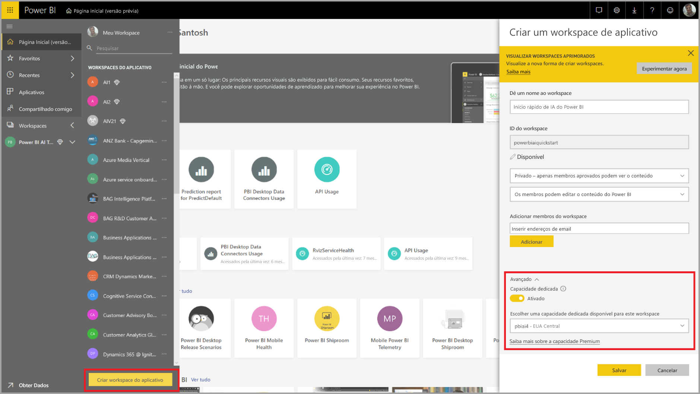

Após criar o espaço de trabalho, é possível escolher **Ignorar** na parte inferior direita da tela de Boas-vindas, conforme mostrado na imagem a seguir.

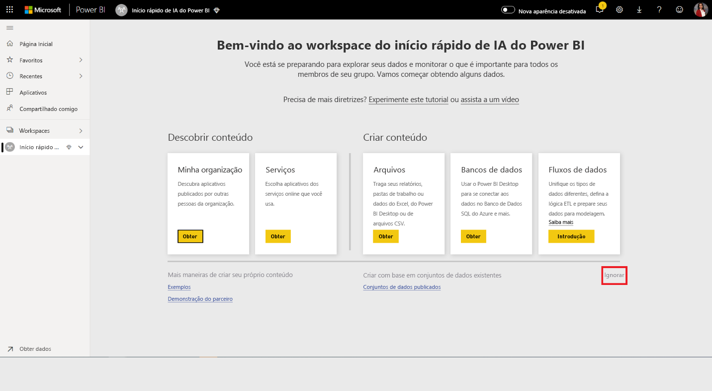

 Escolha o botão **Criar** no canto superior direito do espaço de trabalho. Em seguida, escolha **Fluxo de dados**.

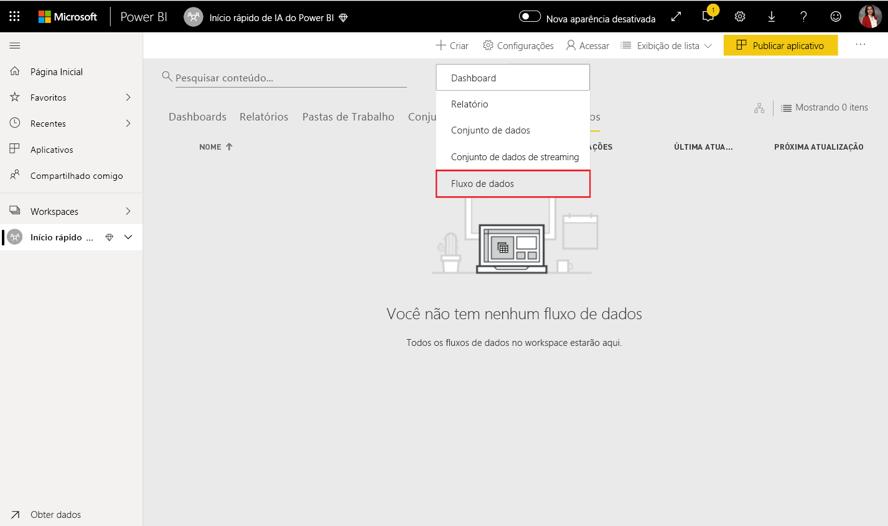

Selecione **Adicionar novas entidades**. Isso inicia o editor do **Power Query** no navegador.

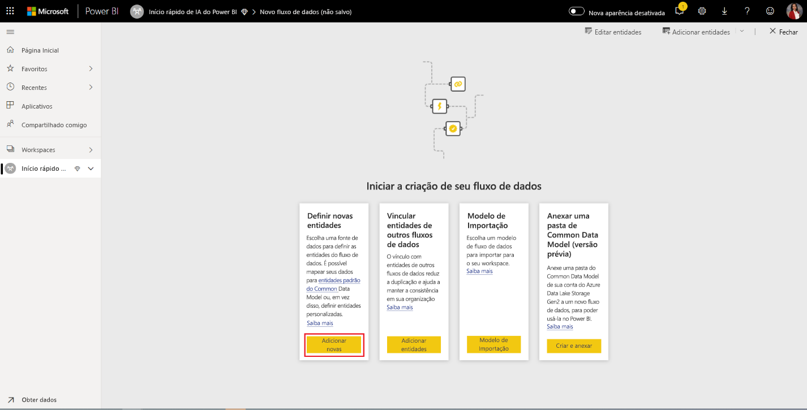

Escolha **Arquivo de texto/CSV** como uma fonte de dados, conforme mostrado na imagem a seguir.

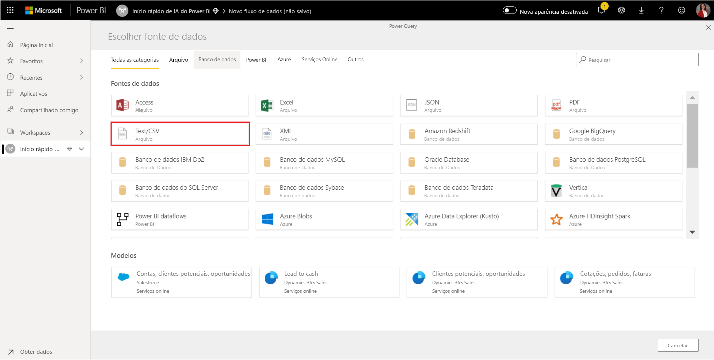

Na página **Conectar-se a uma fonte de dados** que aparece a seguir, cole o link para o arquivo _online_shoppers_intention. csv_ na caixa **URL ou Caminho do arquivo** e, em seguida, selecione **Avançar**.

`https://raw.githubusercontent.com/santoshc1/PowerBI-AI-samples/master/Tutorial_AutomatedML/online_shoppers_intention.csv`

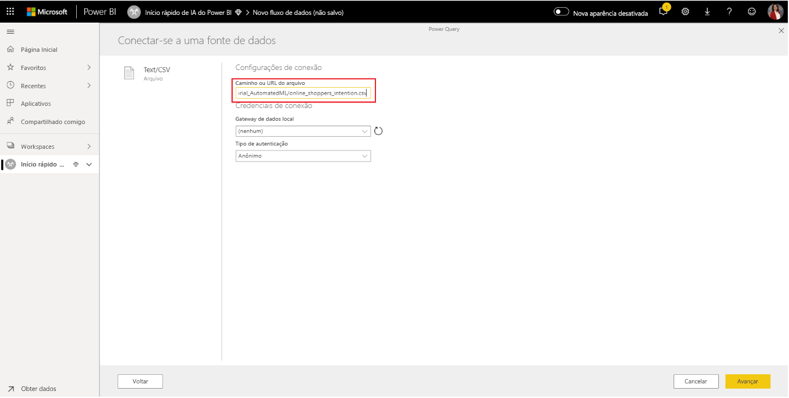

O Power Query Editor mostra uma versão prévia dos dados do arquivo CSV. Você pode renomear a consulta para um nome mais amigável alterando o valor na caixa Nome localizada no painel direito. Por exemplo, altere o nome da consulta para _Visitantes online_.

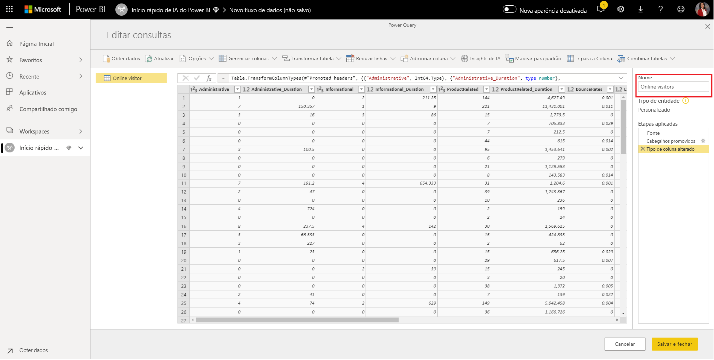

O Power Query infere automaticamente os tipos de colunas. Você pode alterar o tipo de coluna clicando no ícone de tipo de atributo na parte superior de cada cabeçalho de coluna. Neste exemplo, alteramos o tipo da coluna de Receita para Verdadeiro/Falso.

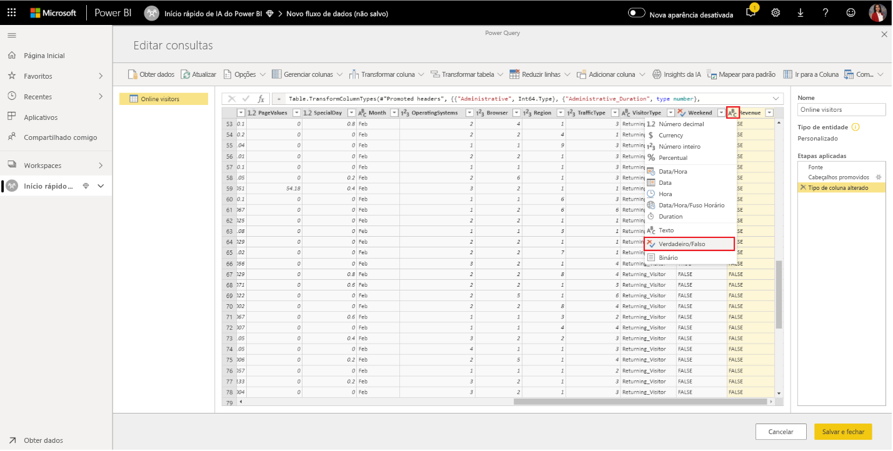

Escolha o botão **Salvar & fechar** para fechar o Power Query Editor. Forneça um nome para o fluxo de dados e, em seguida, escolha **Salvar** na caixa de diálogo, conforme mostrado na imagem a seguir.

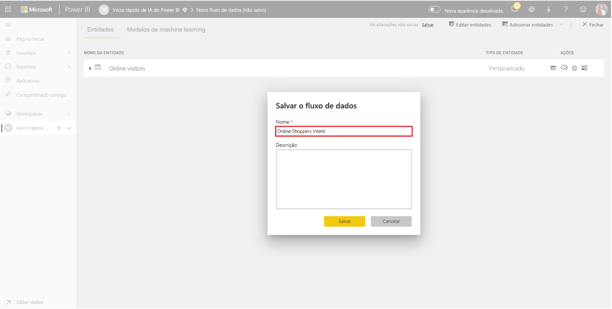

## Criar e treinar um modelo de machine learning

Para adicionar um modelo de machine learning, selecione o botão **Aplicar modelo ML** na lista **Ações** da entidade base que contém seus dados de treinamento e informações de rótulo e, em seguida, escolha **Adicionar um modelo de machine learning**.

A primeira etapa para criar o modelo de machine learning é identificar os dados históricos, incluindo o campo de resultado que você deseja prever. O modelo será criado de acordo com o que foi aprendido com esses dados.

No caso do conjunto de dados que estamos usando, este é o campo **Receita**. Escolha **Receita** como o valor do “Campo de resultado” e, em seguida, escolha **Avançar**.

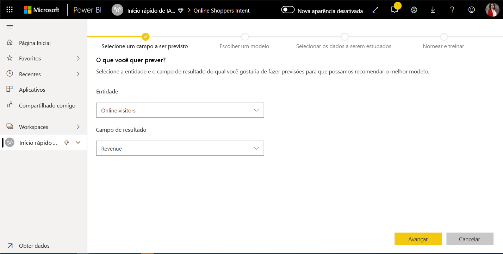

Em seguida, devemos escolher o tipo de modelo de machine learning a ser criado. O Power BI analisa os valores no campo de resultado que você identificou e sugere os tipos de modelos de machine learning que podem ser criados para prever esse campo.

Nesse caso, como estamos prevendo um resultado binário de se um usuário fará ou não uma compra, é recomendável fazer uma Previsão Binária. Como desejamos prever os usuários que farão uma compra, selecione Verdadeiro como o resultado da Receita em que você está mais interessado. Além disso, você pode fornecer rótulos amigáveis para os resultados que serão usados no relatório gerado automaticamente que resumirá os resultados da validação do modelo. Em seguida, selecione Avançar.

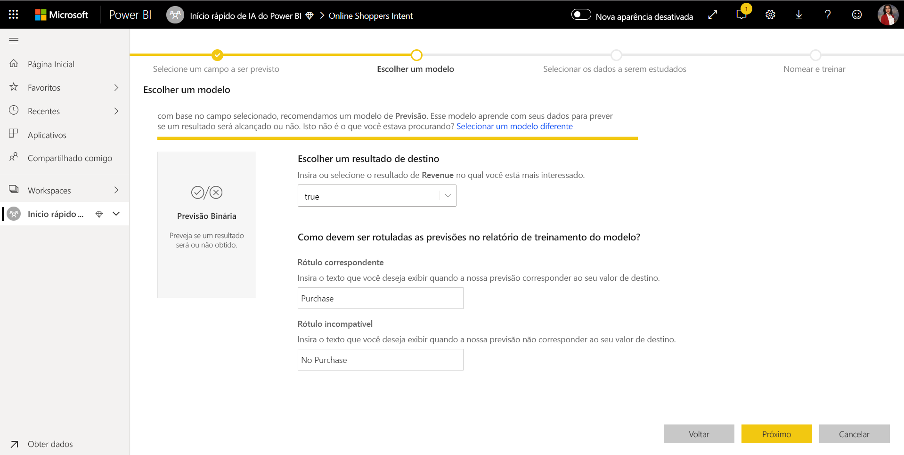

Na etapa seguinte, o Power BI faz um exame preliminar de uma amostra dos dados e sugere as entradas que podem produzir previsões mais precisas. Se o Power BI não recomendar um campo, será fornecida uma explicação ao lado dele. Você tem a opção de alterar as seleções para incluir apenas os campos que deseja que o modelo estude ou pode selecionar todos os campos marcando a caixa de seleção ao lado do nome da entidade. Escolha **Avançar** para aceitar as entradas.

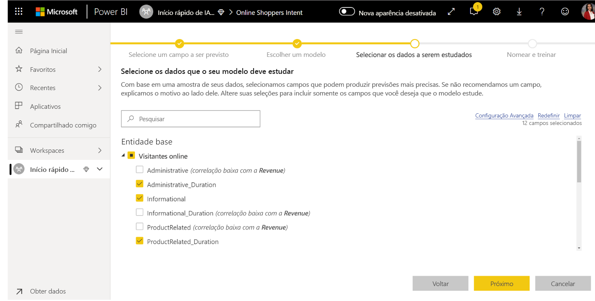

Na etapa final, devemos fornecer um nome para o modelo. Nomeie o modelo de _Previsão da Intenção de Compra_. Você pode optar por reduzir o tempo de treinamento para ver resultados rápidos ou aumentar o tempo gasto no treinamento para obter o melhor modelo. Em seguida, escolha **Salvar e treinar** para começar o treinamento do modelo.

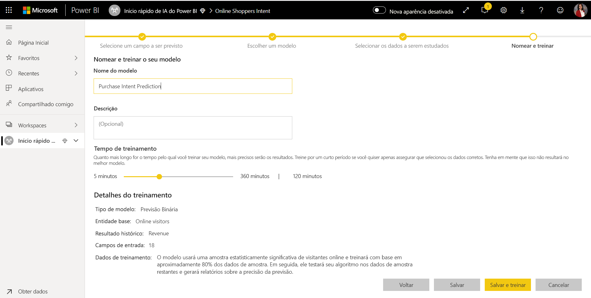

O processo de treinamento começará dando exemplos, normalizando seus dados históricos e dividindo seu conjunto de dados em duas novas entidades _Dados de treinamento da previsão de intenção de compra_ e _Dados de teste da previsão de intenção de compra_.

Dependendo do tamanho do conjunto de dados, o processo de treinamento pode levar de alguns minutos até o tempo previamente escolhido. Neste ponto, você pode ver o modelo na guia **Modelos de machine learning** do fluxo de dados. O status Pronto indica que o modelo foi colocado na fila para treinamento ou está em treinamento.

Pode, entretanto, confirmar que o modelo está sendo treinado e validado por meio do status do fluxo de dados. Isso é exibido como uma atualização de dados em andamento na guia **Fluxos de dados** do espaço de trabalho.

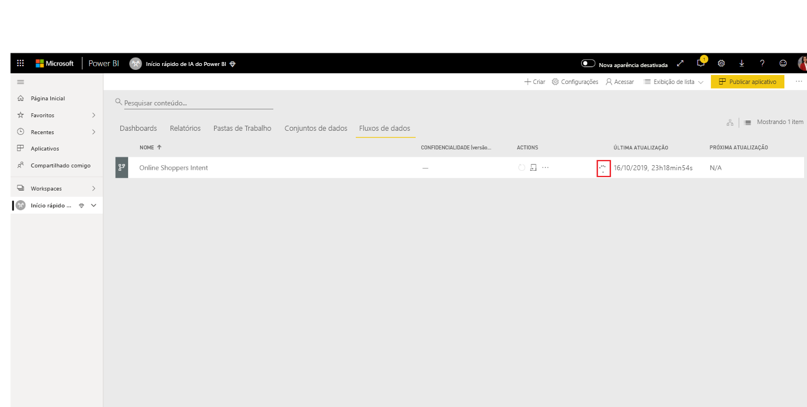

Após a conclusão do treinamento do modelo, o fluxo de dados exibe um tempo de atualização corrigido. Você pode confirmar se o modelo está treinado navegando até a guia **Modelos de machine learning** no fluxo de dados. O modelo que você criou deve exibir o status **Treinado** e o **horário do Último Treinamento** já deve estar atualizado.

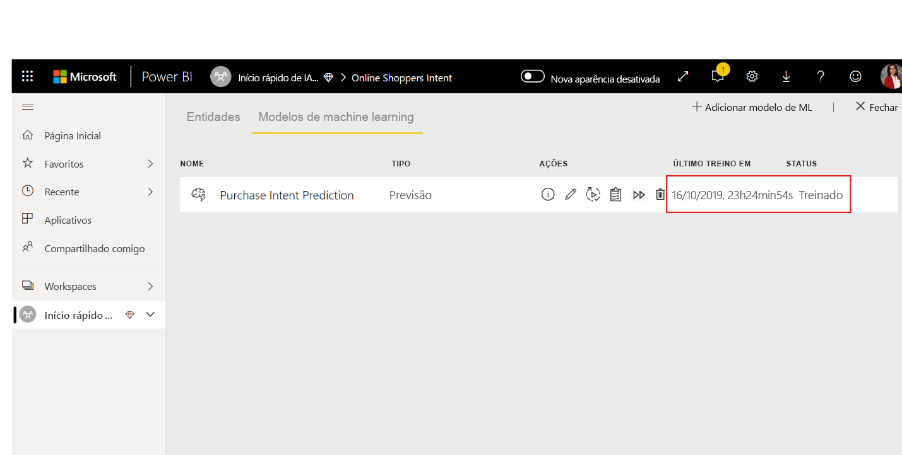

## Examinar o relatório de validação do modelo
Para examinar o relatório de validação de modelo, na guia Modelos de Machine Learning, escolha o botão Exibir relatório de treinamento na coluna Ações do modelo. Este relatório descreve qual a probabilidade do seu modelo de machine learning ser executado.

Na página **Desempenho do Modelo** do relatório, escolha **Ver principais influenciadores** para exibir os principais indicadores do modelo. Você pode escolher um dos indicadores para ver como a distribuição de resultados está associada a esse indicador.

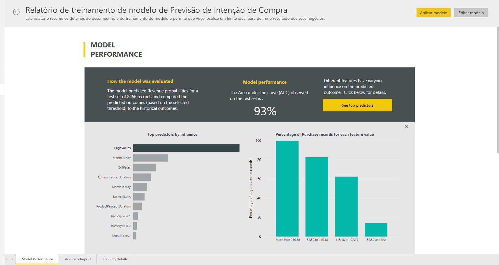

Usar a segmentação **Limite de probabilidade** na página Desempenho do modelo para examinar sua influência na Precisão e Recall do modelo.

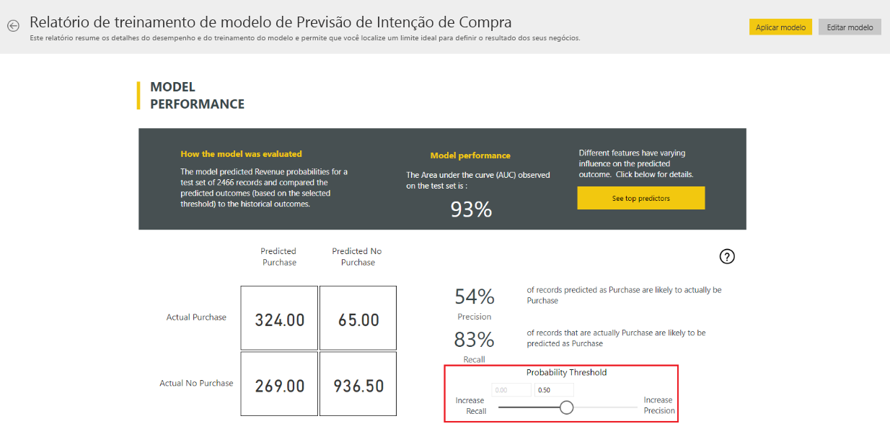

As outras páginas do relatório descrevem as métricas de desempenho estatístico para o modelo.

O relatório também contém uma página Detalhes do Treinamento, que descreve as diferentes iterações executadas, como os recursos foram extraídos das entradas e os hiperparâmetros do modelo final usado.

## Aplicar o modelo a uma entidade de fluxo de dados

Selecione o botão **Aplicar modelo** na parte superior do relatório para chamar esse modelo. Na caixa de diálogo **Aplicar**, especifique a entidade de destino que tem os dados de origem aos quais o modelo deve ser aplicado.

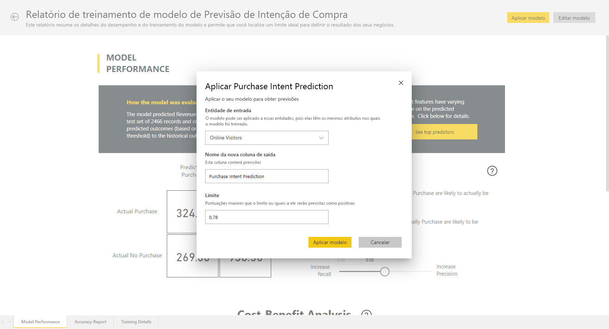

Quando solicitado, você deve **Atualizar** o fluxo de dados para exibir os resultados do modelo.

A aplicação do modelo criará duas novas entidades, uma com o sufixo **enriquecido < nome_modelo>** e outra com **enriquecido <nome_modelo> explicações**. Em nosso caso, aplicar o modelo à entidade **Visitantes Online** criará **Previsão de Intenção de Compra enriquecida de Visitantes Online**, que inclui a saída prevista do modelo, e **Explicações da Previsão de Intenção de Compra aprimorada de Visitantes Online**, que contém os principais influenciadores específicos do registro para a previsão. 

A aplicação de um Modelo de Previsão Binária adiciona quatro colunas com resultado previsto, pontuação de probabilidade, principais influenciadores específicos do registro para a previsão e o índice da explicação, sendo que cada um deles tem um prefixo com o nome da coluna especificado.  

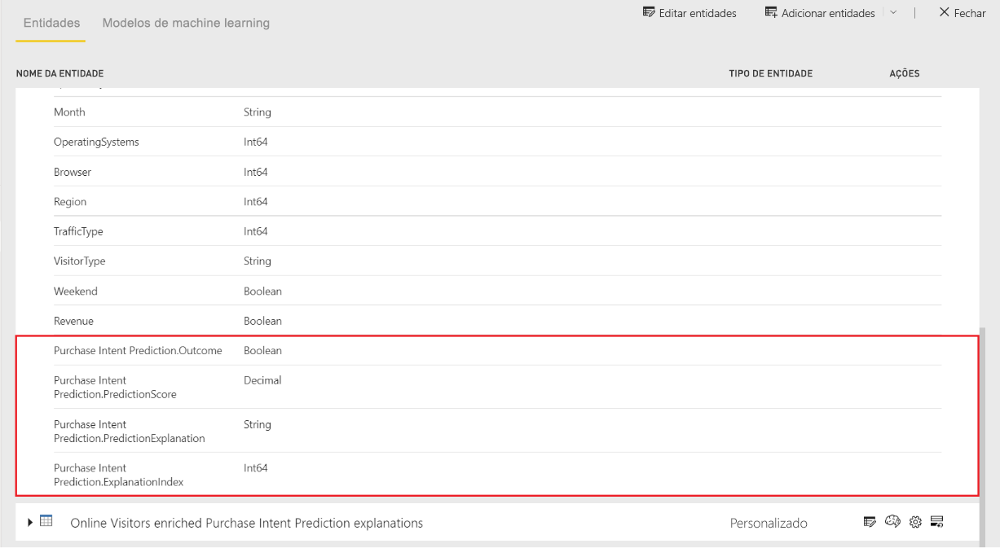

Após finalizar a conclusão da atualização do fluxo de dados, você pode escolher a entidade **Previsão de Intenção de Compra enriquecida de Visitantes Online** para exibir os resultados.

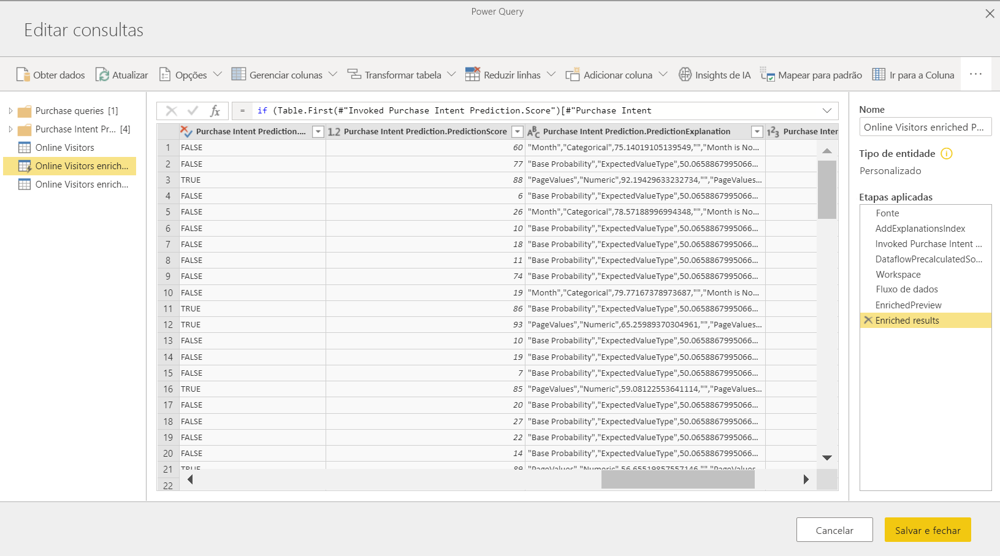

## Usar a saída pontuada do modelo em um relatório do Power BI

Para usar a saída pontuada do seu modelo de machine learning, conecte-se ao fluxo de dados no Power BI Desktop usando o conector de Fluxo de dados. A entidade **Previsão de Intenção de Compra enriquecida de Visitantes online** já pode ser usada para incorporar as previsões do seu modelo nos relatórios do Power BI.

## Próximas etapas

Neste tutorial, você criou e aplicou um modelo de previsão binária no Power BI usando estas etapas:

* Criar um fluxo de dados de entrada
* Criar e treinar um modelo de machine learning
* Examinar o relatório de validação do modelo
* Aplicar o modelo a uma entidade de fluxo de dados
* Usar a saída pontuada do modelo em um relatório do Power BI

Para saber mais sobre a automação do Machine Learning no Power BI, confira [Machine Learning Automatizado no Power BI](../transform-model/service-machine-learning-automated.md).
