# <a name="tutorial-use-cognitive-services-in-power-bi"></a>Tutorial: Usar Serviços Cognitivos no Power BI

O Power BI fornece acesso a um conjunto de funções dos Serviços Cognitivos do Azure para enriquecer seus dados na preparação de dados de autoatendimento para fluxos de dados. Os serviços atualmente com suporte são [Análise de Sentimento](https://docs.microsoft.com/azure/cognitive-services/text-analytics/how-tos/text-analytics-how-to-sentiment-analysis), [Extração de Frases-chave](https://docs.microsoft.com/azure/cognitive-services/text-analytics/how-tos/text-analytics-how-to-keyword-extraction), [Detecção de Idioma](https://docs.microsoft.com/azure/cognitive-services/text-analytics/how-tos/text-analytics-how-to-language-detection) e [Marcação de Imagem](https://docs.microsoft.com/azure/cognitive-services/computer-vision/concept-tagging-images). As transformações são executadas no serviço do Power BI e não exigem uma assinatura de Serviços Cognitivos do Azure. Este recurso requer o Power BI Premium.

As transformações de Serviços Cognitivos recebem suporte da [Preparação de dados de autoatendimento para fluxos de dados](https://powerbi.microsoft.com/blog/introducing-power-bi-data-prep-wtih-dataflows/). Use os exemplos do passo a passo para executar a análise de texto e a marcação da imagem abaixo para começar.

Neste tutorial, você aprenderá a:

> [!div class="checklist"]
> * Importar dados para um fluxo de dados
> * Avaliar sentimentos e extrair frases-chave de uma coluna de texto para um fluxo de dados
> * Conectar os resultados do Power BI Desktop


## <a name="prerequisites"></a>Pré-requisitos

Para concluir este tutorial, você precisará do seguinte: 

- Uma conta do Power BI. Se você não estiver inscrito no Power BI, [inscreva-se para uma avaliação gratuita](https://app.powerbi.com/signupredirect?pbi_source=web) antes de começar.
- Acesso a uma capacidade do Power BI Premium com a carga de trabalho de AI habilitada. Esta carga de trabalho fica desativada por padrão durante a visualização. Se você estiver em uma capacidade do Premium e os Insights de IA não forem exibidos, contate seu administrador de capacidade do Premium para habilitar a carga de trabalho de IA no portal de administração.

## <a name="text-analytics"></a>Análises de texto

Siga as etapas nesta seção para concluir a parte da análise de texto do tutorial.

### <a name="step-1-apply-sentiment-scoring-in-power-bi-service"></a>Etapa 1: Aplicar a pontuação de sentimento no Serviço do Power BI

Para começar, navegue até um workspace do Power BI com capacidade Premium e crie um novo fluxo de dados usando o botão **Criar** no canto superior direito da tela.

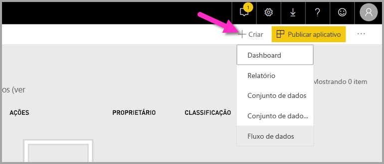

A caixa de diálogo de fluxo de dados mostra as opções para a criação de um novo fluxo de dados. Selecione **Adicionar novas entidades.** Em seguida, escolha **Texto/CSV** no menu de fontes de dados.

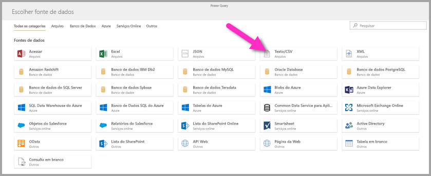

Cole esta URL no campo de URL: [https://pbiaitutorials.blob.core.windows.net/textanalytics/FabrikamComments.csv](https://pbiaitutorials.blob.core.windows.net/textanalytics/FabrikamComments.csv) e clique em **Avançar.**


Agora os dados estão prontos para uso na análise de texto e podemos usar a Pontuação de Sentimento e a Extração de Frases-chave na coluna de comentários do cliente.

No Power Query Editor, selecione **Insights de AI**

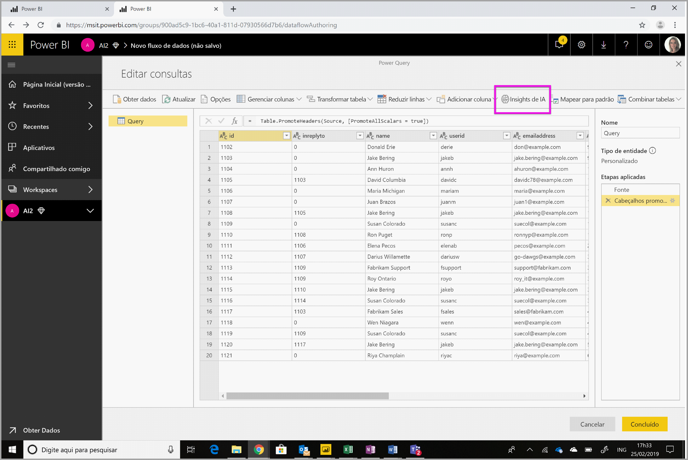

Expanda a pasta **Serviços Cognitivos** e selecione a função que você deseja usar. Este exemplo é a pontuação de sentimento da coluna de comentários, mas você pode seguir as mesmas etapas para experimentar a Detecção de Idioma e a Extração de Frases-chave.

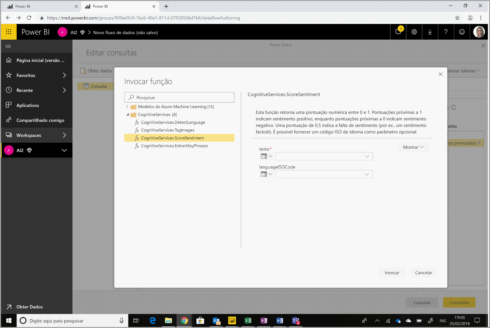

Depois que uma função é selecionada, os campos obrigatórios e opcionais serão exibidos. Para pontuar o sentimento das revisões de exemplo, selecione a coluna de revisões como entrada de texto. As informações de cultura são uma entrada opcional e exigem um formato ISO. Por exemplo, digite “en” se quiser que o texto seja tratado como inglês. Quando o campo estiver em branco, o Power BI detectará primeiro o idioma do valor de entrada antes da pontuação de sentimento.

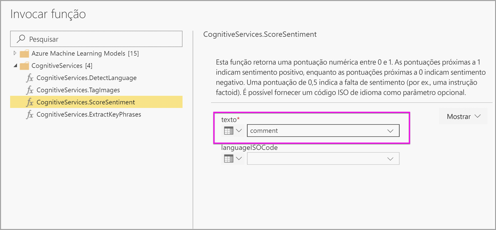

Agora selecione **Invocar** para executar a função. Uma nova coluna com a pontuação de sentimento para cada linha é adicionada à tabela. Você pode voltar aos **Insights de AI** para extrair as frases-chave do texto de revisão da mesma maneira.

Depois de concluir as transformações, altere o nome da consulta para “Comentários do cliente” e selecione **Concluído.**

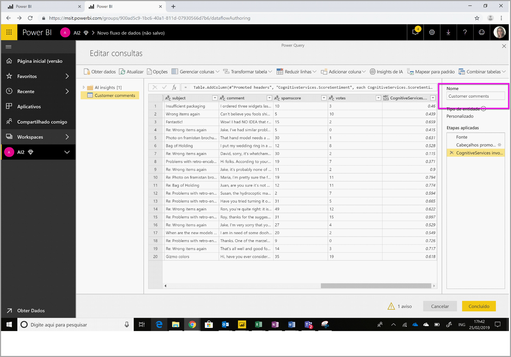

Em seguida, selecione **Salvar** o fluxo de dados e nomeie-o como Fabrikam. Selecione o botão **Atualizar Agora** que é exibido depois de salvar o fluxo de dados.

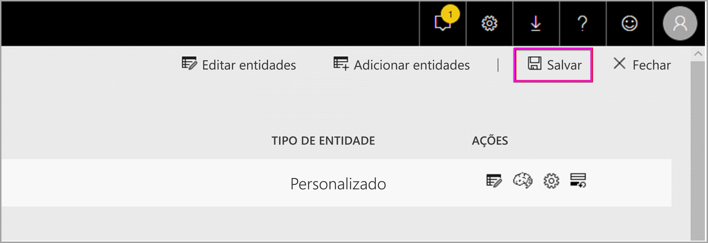

Depois de salvar e atualizar o fluxo de dados, você pode usá-lo em um relatório do Power BI.

### <a name="step-2-connect-from-power-bi-desktop"></a>Etapa 2: Conectar-se por meio do Power BI Desktop

Abra o Power BI Desktop. Na faixa de opções Página Inicial, selecione **Obter Dados.**

Navegue até o **Fluxos de dados do Power BI (Beta**) na seção do Power BI e selecione **Conectar.**

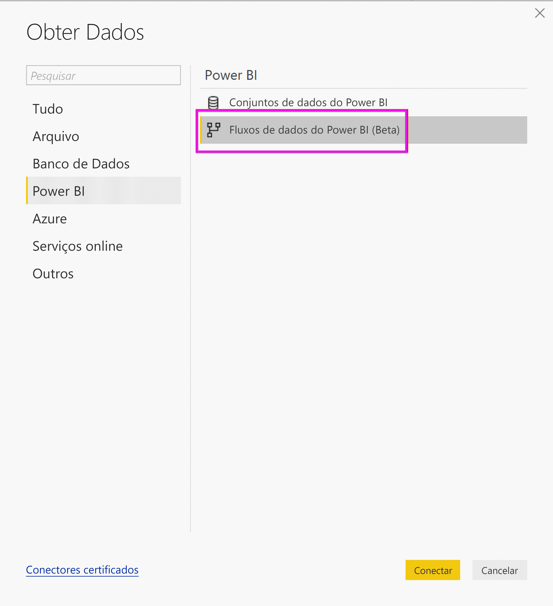

Como esta é uma versão prévia do recurso, o conector solicitará que você aceite as condições da versão prévia. Depois da aceitação, entre com sua conta de organização.

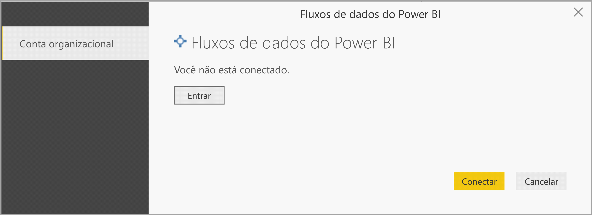

Selecione o fluxo de dados que acabou de criar. Navegue até a tabela Comentários do cliente e clique em **Carregar.**

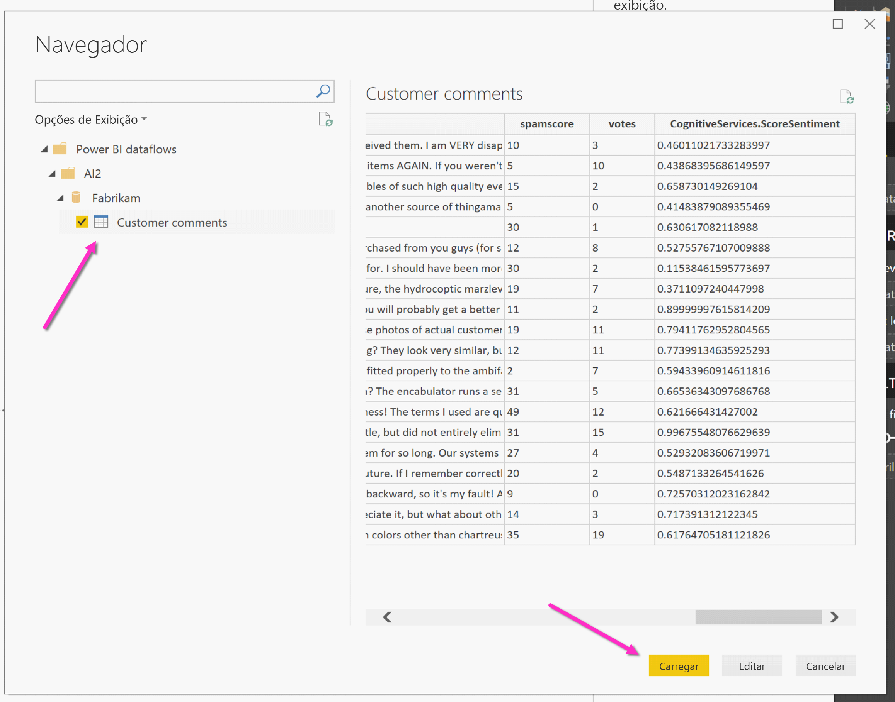

Agora os dados são carregados e você pode começar a criar um relatório.

## <a name="image-tagging"></a>Marcação de imagem

Navegue até um workspace do Power BI com capacidade Premium. Crie um novo fluxo de dados usando o botão **Criar** no canto superior direito da tela.

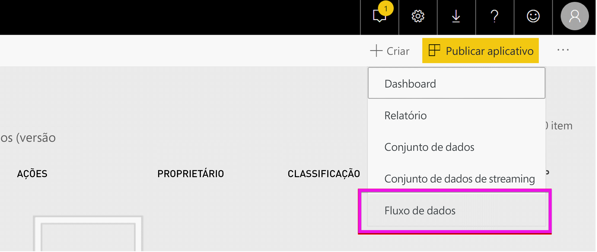

Selecione **Adicionar novas entidades**.

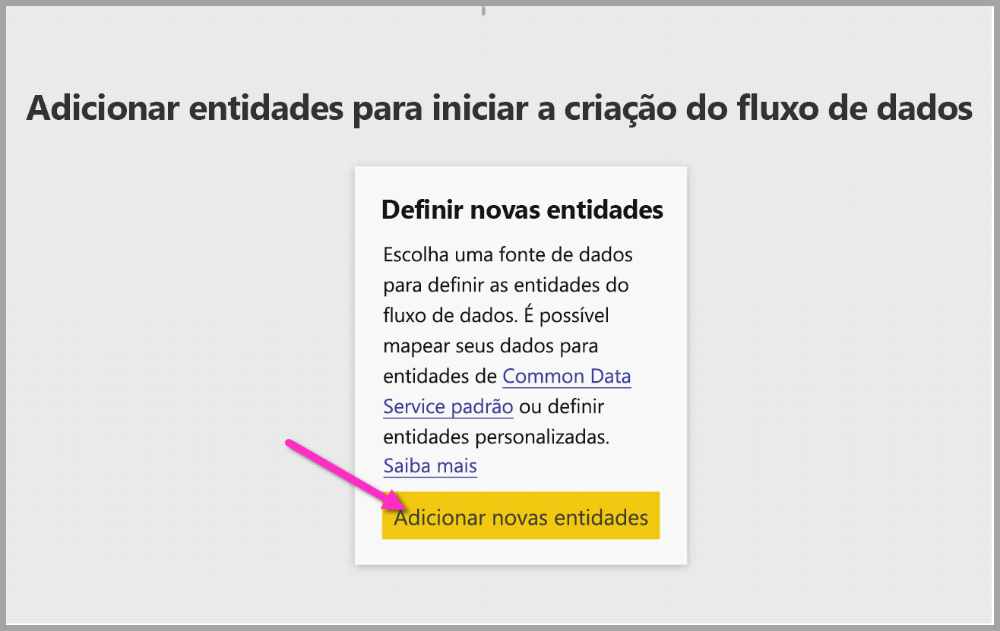

Quando for solicitado que você escolha uma fonte de dados, selecione **Consulta em branco.**

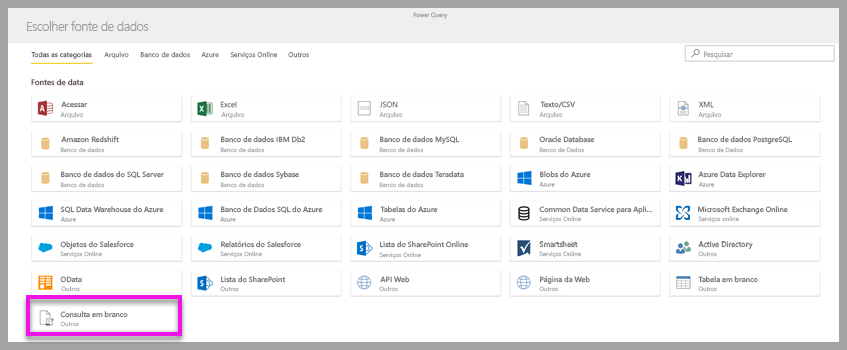

Copie a consulta abaixo no editor de consultas e clique em Avançar. Você pode substituir os caminhos da URL abaixo por outras imagens ou pode adicionar mais linhas. A função *Web.Contents* importa a URL da imagem como binário. Se você tiver uma fonte de dados com imagens armazenadas como binário, também poderá usá-las diretamente.


```python
let
  Source = Table.FromRows({
  { Web.Contents("https://images.pexels.com/photos/87452/flowers-background-butterflies-beautiful-87452.jpeg") },
  { Web.Contents("https://upload.wikimedia.org/wikipedia/commons/5/53/Colosseum_in_Rome%2C_Italy_-_April_2007.jpg") }}, { "Image" })
in
  Source
```

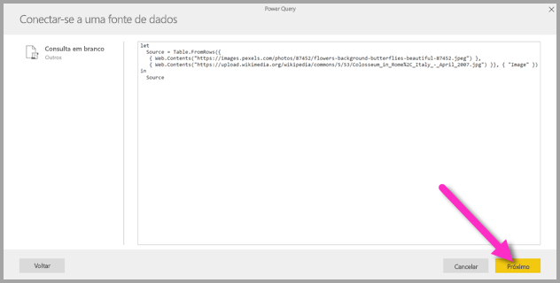

Quando as credenciais forem solicitadas, selecione *anônimo*.


Você verá a imagem a seguir.

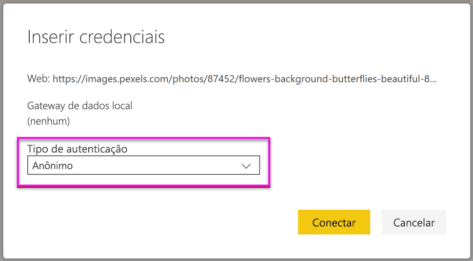

As credenciais serão solicitadas para cada página da Web.

No editor de consultas, selecione **Insights de AI**.

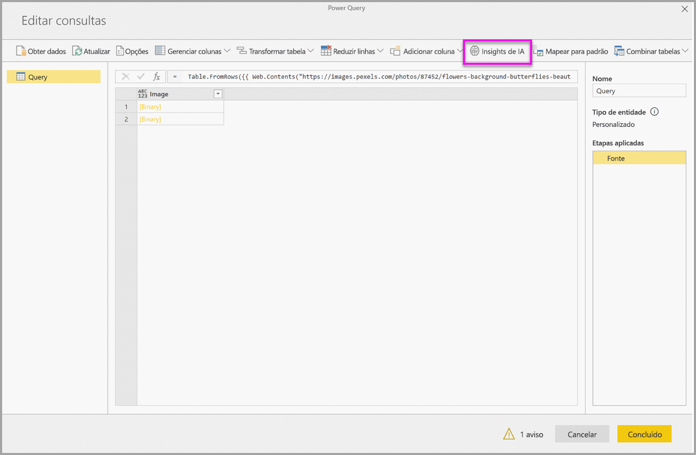

Entre com sua **conta organizacional**.

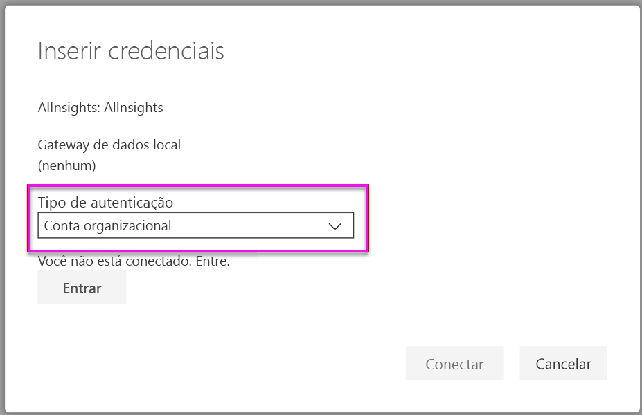

Selecione a função Marcar imagens, digite _[Binário]_ no campo de coluna e _en_ no campo de informações de cultura. 

> [!NOTE]
> No momento, não é possível escolher uma coluna usando uma lista suspensa, o que será resolvido assim que possível em uma versão prévia privada.

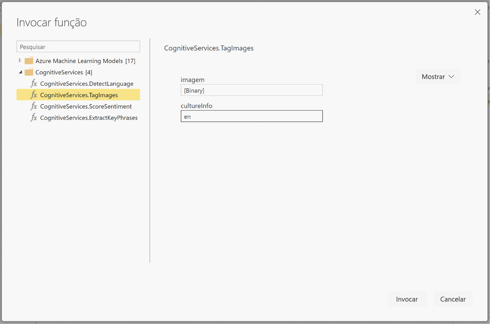

No editor de função, remova as aspas ao redor do nome da coluna. 

> [!NOTE]
> Remover as aspas é uma solução temporária, que será resolvida assim que possível na versão prévia.


A função retorna um registro com ambas as marcas em formato separado por vírgula e como um registro json. Selecione o botão de expansão para adicionar uma ou ambas como colunas à tabela.

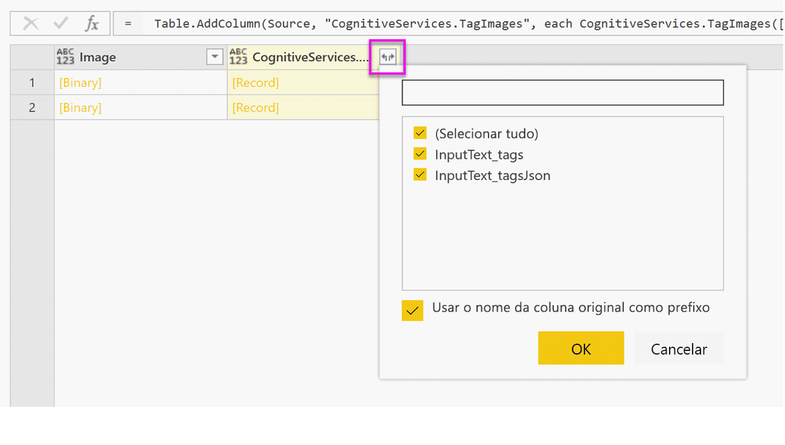

Selecione **Concluído** e salve o fluxo de dados. Depois de atualizar o fluxo de dados, você pode se conectar a ele do Power BI Desktop usando os conectores de fluxos de dados. (Consulte as etapas na página 5 deste documento).

## <a name="clean-up-resources"></a>Limpar recursos

Quando não for mais necessária, exclua essa consulta clicando duas vezes no nome da consulta no Power Query Editor e selecionando **Excluir**.

## <a name="next-steps"></a>Próximas etapas

Neste tutorial, você aplicou as funções de pontuação de sentimento e marcação de imagem a um fluxo de dados do Power BI. Saiba mais sobre os Serviços Cognitivos no Power BI nos artigos a seguir.

* [Serviços Cognitivos no Azure](https://docs.microsoft.com/azure/cognitive-services/)
* Introdução à [preparação de dados de autoatendimento em fluxos de dados](../transform-model/service-dataflows-overview.md)
* Saiba mais sobre o [Power BI Premium](https://powerbi.microsoft.com/power-bi-premium/)

Você também pode estar interessado nos artigos a seguir.

* [Tutorial: Invocar um modelo do Machine Learning Studio (clássico) no Power BI (versão prévia)](service-tutorial-invoke-machine-learning-model.md)
* [Integração do Azure Machine Learning no Power BI (versão prévia)](../transform-model/service-machine-learning-integration.md)
* [Serviços Cognitivos no Power BI (versão prévia)](../transform-model/service-cognitive-services.md)