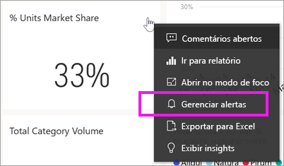
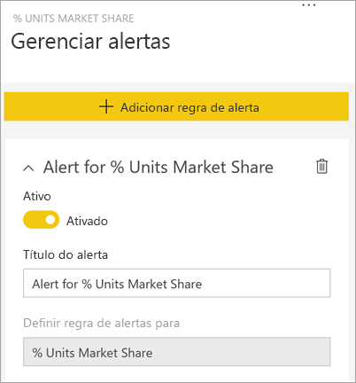
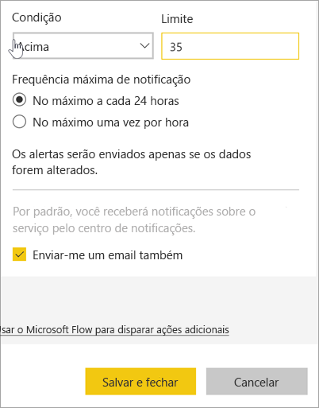
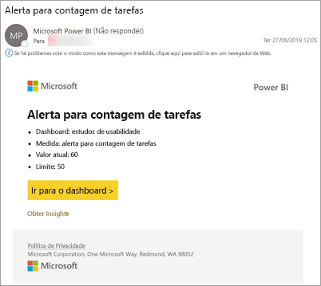
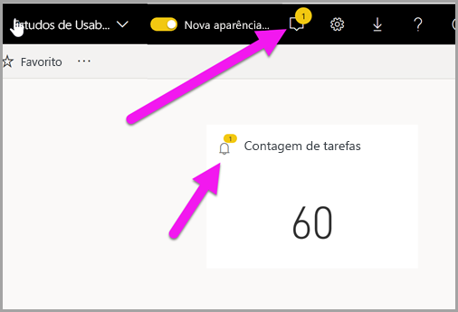
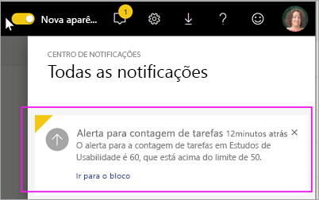
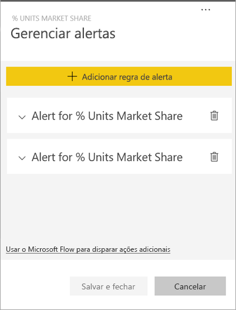
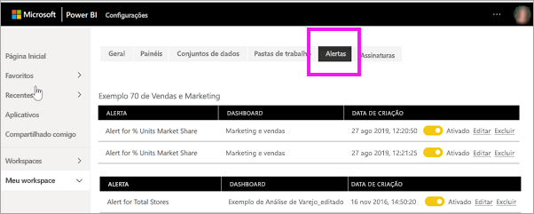

# Tutorial: definir alertas nos dashboards do Power BI

[!INCLUDE [power-bi-service-new-look-include](../includes/power-bi-service-new-look-include.md)]

Defina alertas para receber notificações quando os dados nos dashboards forem alterados além ou aquém dos limites definidos por você. Os alertas funcionam em medidores, KPIs e cartões. Este recurso ainda está em evolução, portanto, confira a [seção abaixo: Dicas e solução de problemas](#tips-and-troubleshooting).

Apenas você poderá ver os alertas que definir, mesmo se compartilhar seu dashboard. Os alertas de dados são totalmente sincronizados nas plataformas; defina e exiba alertas de dados [nos aplicativos móveis do Power BI](mobile/mobile-set-data-alerts-in-the-mobile-apps.md) e no serviço do Power BI. 

> [!WARNING]
> Esses alertas fornecem informações sobre seus dados. Se você exibir os dados do Power BI em um dispositivo móvel e esse dispositivo for roubado, será recomendável usar o serviço do Power BI para desligar todos os alertas.
> 

Este tutorial aborda o seguinte.
> [!div class="checklist"]
> * Quem pode definir alertas
> * Quais visuais são compatíveis com alertas
> * Quem pode ver meus alertas
> * Se os alertas funcionam no Power BI Desktop e Mobile
> * Como criar um alerta
> * Onde os alertas serão recebidos

Se você não estiver inscrito no Power BI, [inscreva-se para uma avaliação gratuita](https://app.powerbi.com/signupredirect?pbi_source=web) antes de começar.

Este exemplo usa um bloco de cartão do dashboard do aplicativo de exemplo Vendas e Marketing. Este aplicativo está disponível no [Microsoft AppSource](https://appsource.microsoft.com). Para ajuda ao obter o aplicativo, confira [Instalar e usar aplicativos com o Power BI](end-user-app-view.md).

1. Em um medidor, KPI ou bloco de cartão do dashboard, selecione as reticências.
   
   
2. Selecione o ícone de sino  ou **Gerenciar alertas** para adicionar um ou mais alertas para **Total de lojas**.

   

   
1. No painel **Gerenciar alertas**, selecione **+ Adicionar regra de alerta**.  Verifique se o controle deslizante está definido como **Ligado** e dê um título ao seu alerta. Os títulos ajudam a reconhecer facilmente seus alertas.
   
   
4. Role para baixo e insira os detalhes do alerta.  Neste exemplo, criaremos um alerta que notificará uma vez por dia caso a participação de mercado aumente ou ultrapasse 35. Os alertas serão exibidos em nossa Central de Notificações. Além disso, o Power BI vai nos enviar um email.
   
   
5. Selecione **Salvar e fechar**.
 
   > [!NOTE]
   > Os alertas funcionam somente em dados que estão atualizados. Depois que os dados são atualizados, o Power BI verifica se foi definido um alerta para esses dados. Se os dados atingirem um limite de alerta, um alerta será disparado. 
   > 

## Recebendo alertas
Quando os dados que estão sendo controlados atingem um dos limites que você definiu, várias coisas acontecerão. Primeiro, o Power BI verifica se passou mais de uma hora ou mais de 24 horas (dependendo da opção selecionada) desde o envio do último alerta. Enquanto os dados estiverem acima do limite, você receberá um alerta.

Em seguida, o Power BI enviará um alerta para o centro de notificações e, como opção, para o email. Cada alerta contém um link direto com seus dados. Selecione o link para ver o bloco relevante.  

1. Se tiver definido que o alerta deve lhe enviar um email, você verá algo parecido com isto na Caixa de Entrada. Esse é um alerta que definimos em um dashboard diferente, esse dashboard controla as tarefas concluídas pela equipe de Usabilidade.
   
   
2. O Power BI adiciona uma mensagem à sua **Central de Notificações** e adiciona um novo ícone de alerta no bloco aplicável.
   
   
3. Abra a Central de Notificações para ver os detalhes do alerta.
   
    
   
  

## Gerenciando alertas

Há várias maneiras de gerenciar seus alertas: No próprio bloco do painel, no menu Configurações do Power BI, em um bloco individual no [aplicativo móvel do Power BI no iPhone](mobile/mobile-set-data-alerts-in-the-mobile-apps.md) ou no [aplicativo móvel do Power BI para Windows 10](mobile/mobile-set-data-alerts-in-the-mobile-apps.md).

### No próprio bloco

1. Se você precisar alterar ou remover um alerta para um bloco, abra novamente a janela **Gerenciar alertas** selecionando o ícone de sino . Todos os alertas definidos para esse bloco são exibidos.
   
    .
2. Para modificar um alerta, selecione a seta à esquerda do nome do alerta.
   
    .
3. Para excluir um alerta, selecione a lixeira à direita do nome do alerta.
   
      

### No menu de configurações do Power BI

1. Selecione o ícone de engrenagem na barra de menus do Power BI.
   
    .
2. Em **Configurações**, selecione **Alertas**.
   
    
3. Aqui, é possível ativar e desativar alertas, abrir a janela **Gerenciar alertas** para fazer alterações ou excluir o alerta.

## Dicas e solução de problemas 

* Os alertas só podem ser definidos em medidores, KPIs e cartões.
* Se não for possível definir um alerta para um medidor, KPI ou cartão, fale com o administrador do sistema para obter ajuda. Às vezes, os alertas são desativados ou ficam indisponíveis para o dashboard ou para tipos específicos de blocos de dashboard.
* Os alertas funcionam somente em dados que estão atualizados. Eles não funcionam em dados estáticos. A maioria dos exemplos fornecidos pela Microsoft são estáticos. 

## Limpar recursos
Instruções para excluir alertas são explicadas acima. Resumindo, selecione o ícone de engrenagem na barra de menus do Power BI. Em **Configurações**, selecione **Alertas** e exclua o alerta.

> [!div class="nextstepaction"]
> [Definir alertas de dados no seu dispositivo móvel](mobile/mobile-set-data-alerts-in-the-mobile-apps.md)

