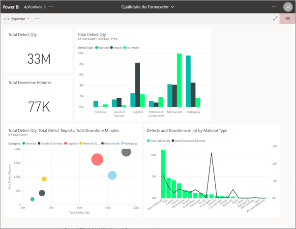
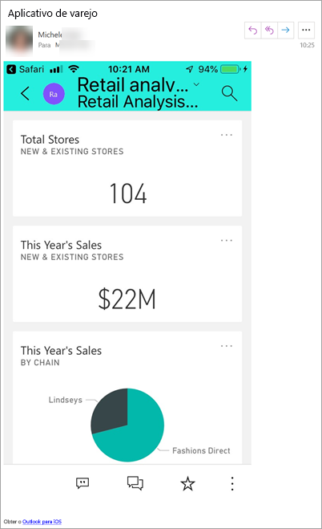
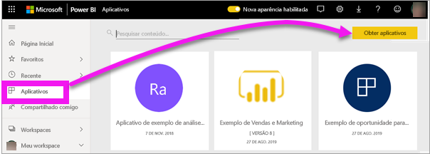
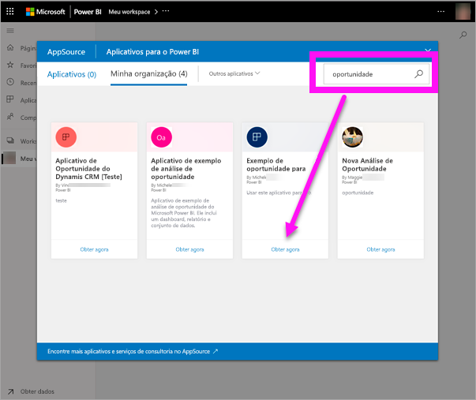
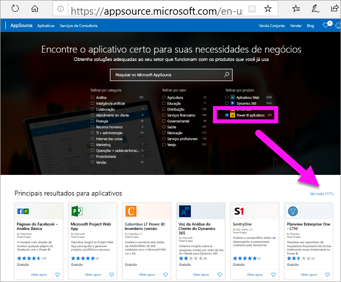
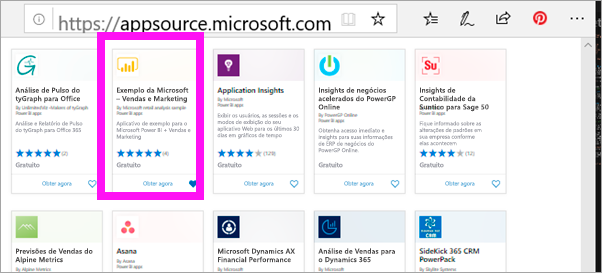
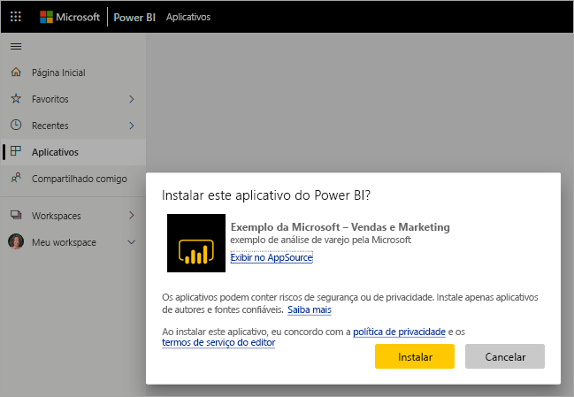
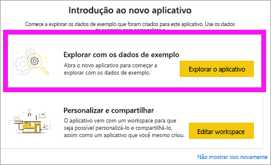

# Instalar e usar aplicativos com dashboards e relatórios no Power BI

[!INCLUDE [power-bi-service-new-look-include](../includes/power-bi-service-new-look-include.md)]

Agora que você tem uma [noção básica sobre aplicativos](end-user-apps.md), vamos aprender a abrir e interagir com os aplicativos. 

## Maneiras de obter um novo aplicativo
Há várias maneiras de obter um novo aplicativo. Um colega de designer de relatório pode instalar o aplicativo automaticamente em sua conta do Power BI ou enviar um link direto para um aplicativo. Você pode ir para AppSource e pesquisar aplicativos disponibilizados para você pelos designers de aplicativos tanto dentro quanto fora da empresa. 

No Power BI em seu dispositivo móvel, você só pode instalar um aplicativo de um link direto, e não do AppSource. Se o designer de aplicativo instalar o aplicativo automaticamente, você o verá na sua lista de aplicativos.

## Instalar um aplicativo por meio de um link direto
A maneira mais fácil de instalar um novo aplicativo é obter um link direto, no email, do designer de aplicativo.  

**No computador** 

Quando você seleciona o link no email, o serviço do Power BI ([https://powerbi.com](https://powerbi.com)) abre o aplicativo em um navegador. 

**No dispositivo móvel Android ou iOS** 

Quando você seleciona o link no email em seu dispositivo móvel, o aplicativo é instalado automaticamente e é aberto no aplicativo móvel. Talvez você precise entrar primeiro. 

## Obter o aplicativo no Microsoft AppSource
Você também pode localizar e instalar aplicativos do Microsoft AppSource. Apenas os aplicativos aos quais você tem acesso (ou seja, quando o autor do aplicativo forneceu permissão a você ou a todos) são exibidos.

1. Selecione **Aplicativos**  > **Obter aplicativos**. 
   
        
2. No AppSource, em **Minha organização**, pesquise para restringir os resultados e localize o aplicativo que você está procurando.
   
    
3. Selecione **Obter agora** para adicioná-lo à lista de Conteúdo de aplicativos. 

## Obter um aplicativo no site do Microsoft AppSource 

Neste exemplo, vamos abrir um dos aplicativos de exemplo da Microsoft. No AppSource, você encontrará aplicativos para vários dos serviços usados para administrar sua empresa.  Serviços como Salesforce, Microsoft Dynamics, Google Analytics, GitHub, Zendesk, Marketo e muito mais. Para saber mais, acesse [Aplicativos para serviços que você usa com o Power BI](../service-connect-to-services.md). 

1. Em um navegador, abra [https://appsource.microsoft.com](https://appsource.microsoft.com) e selecione **Aplicativos do Power BI**.

    

2. Selecione **Ver tudo** para exibir a lista de todos os aplicativos do Power BI disponíveis no AppSource no momento. Role ou pesquise o aplicativo chamado **Exemplo da Microsoft – Vendas e Marketing**.

    

3. Selecione **Obter agora** e concorde com os termos de uso.

    

4. Confirme que deseja instalar o aplicativo.

    

5. O serviço do Power BI exibirá uma mensagem quando o aplicativo for instalado. Selecione **Ir para o aplicativo** para abri-lo. De acordo com o designer que criou o aplicativo, será exibido o dashboard ou o relatório.

    

    Também é possível abrir o aplicativo diretamente na lista de conteúdo do aplicativo selecionando **Aplicativos** e escolhendo **Vendas e Marketing**.

    

6. Escolha se deseja explorar ou personalizar e compartilhar seu novo aplicativo. Como selecionamos um aplicativo de exemplo da Microsoft, vamos começar explorando. 

    

7.  Seu novo aplicativo é aberto com um dashboard. Em vez disso, o *designer* do aplicativo poderia ter o definido para abrir o relatório.  

    

## Interagir com os dashboards e relatórios no aplicativo
Reserve algum tempo para explorar os dados nos dashboards e relatórios que compõem o aplicativo. Você tem acesso a todas as interações padrão do Power BI, como filtragem, realce, classificação e busca detalhada.  Ainda está um pouco confuso com a diferença entre dashboards e relatórios?  Leia o [artigo sobre dashboards](end-user-dashboards.md) e o [artigo sobre relatórios](end-user-reports.md).  

## Atualizar um aplicativo 

Periodicamente, os criadores de aplicativos podem lançar novas versões dos aplicativos. A forma como você obtém a nova versão depende de como recebeu a original. 

* Se você obtiver o aplicativo por meio da sua organização, a atualização para a nova versão será totalmente transparente: você não precisará fazer nada. 

* Se você obtiver o aplicativo no AppSource, na próxima vez que abrir o aplicativo, verá uma faixa de notificação. A notificação permite que você saiba que uma nova versão está disponível. 

    1. Selecione **Obter** para fazer a atualização.  

        <!-- -->

    2. Quando precisar instalar o aplicativo atualizado, selecione **Instalar**. 

         

    3. Como você já tem uma versão desse aplicativo, decida se deseja substituir a versão existente ou se deseja instalar o aplicativo atualizado em um novo workspace.   

         

    > [!NOTE] 
    > A instalação de uma nova versão substitui as alterações que possam ter sido feitas nos relatórios e nos dashboards. Para manter seus relatórios e seus dashboard atualizados, salve-os com outro nome ou em uma localização diferente antes da instalação. 

    4. Depois de instalar a versão atualizada, selecione **Atualizar aplicativo** para concluir o processo de atualização. 

    <!-- -->

## Próximas etapas
* [Voltar para a visão geral de aplicativos](end-user-apps.md)
* [Exibir um relatório do Power BI](end-user-report-open.md)
* [Outras maneiras como o conteúdo é compartilhado com você](end-user-shared-with-me.md)
