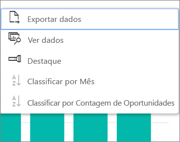

# Instalar e usar aplicativos com dashboards e relatórios no Power BI
Agora que você tem uma [noção básica sobre aplicativos](end-user-apps.md), vamos aprender a abrir e interagir com os aplicativos. 

## Maneiras de obter um novo aplicativo
Lembre-se de que há várias maneiras de obter um novo aplicativo. Um colega de designer de relatório pode instalar o aplicativo automaticamente em sua conta do Power BI ou enviar um link direto para um aplicativo. Então você pode ir para AppSource e procurar aplicativos disponíveis a você tanto dentro quanto fora da empresa. 

No Power BI em seu dispositivo móvel, você só pode instalar um aplicativo de um link direto, e não do AppSource. Se o autor do aplicativo instalar o aplicativo automaticamente, você o verá na sua lista de aplicativos.

## Instalar um aplicativo por meio de um link direto
A maneira mais fácil de instalar um novo aplicativo é obter um link direto, no email, do autor do aplicativo.  

**No computador** 

Quando você seleciona o link no email, o serviço do Power BI ([https://powerbi.com](https://powerbi.com)) é aberto em um navegador. Confirme que você deseja instalar o aplicativo e o Power BI abrirá a página de aterrissagem do aplicativo.

**No dispositivo móvel Android ou iOS** 

Quando você seleciona o link no email em seu dispositivo móvel, o aplicativo é instalado automaticamente e abre a lista de conteúdo do aplicativo no aplicativo móvel. 

## Obter o aplicativo no Microsoft AppSource
Você também pode localizar e instalar aplicativos do Microsoft AppSource. Apenas os aplicativos aos quais você tem acesso (ou seja, quando o autor do aplicativo forneceu permissão a você ou a todos) são exibidos.

1. Selecione **Aplicativos**  > **Obter aplicativos**. 
   
     
2. No AppSource, em **Minha organização**, você pode pesquisar para restringir os resultados e localizar o aplicativo que está procurando.
   
     
3. Selecione **Obter agora** para adicioná-lo à lista de Conteúdo de aplicativos. 

## Interagir com os dashboards e relatórios no aplicativo
Agora você pode explorar os dados nos dashboards e relatórios do aplicativo. Você tem acesso a todas as interações padrão do Power BI, como filtragem, realce, classificação e busca detalhada. Também é possível [exportar os dados para o Excel ](end-user-export-data.md) de uma tabela ou de outro visual em um relatório. Leia sobre como [interagir com relatórios no Power BI](end-user-reading-view.md). 

## Próximas etapas
* [Aplicativos do Power BI para serviços externos](end-user-connect-to-services.md)
* Dúvidas? [Experimente perguntar à Comunidade do Power BI](http://community.powerbi.com/)

