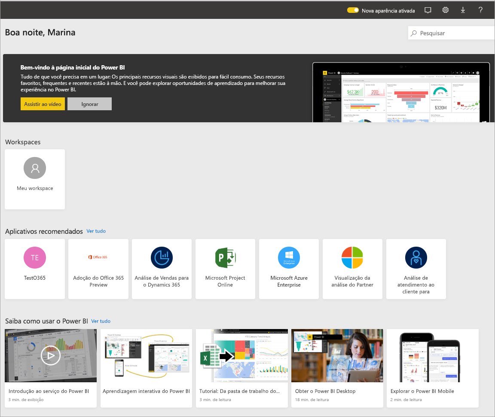
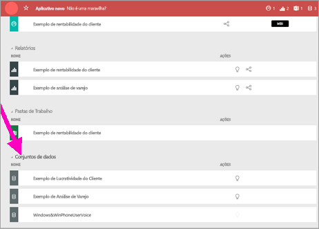
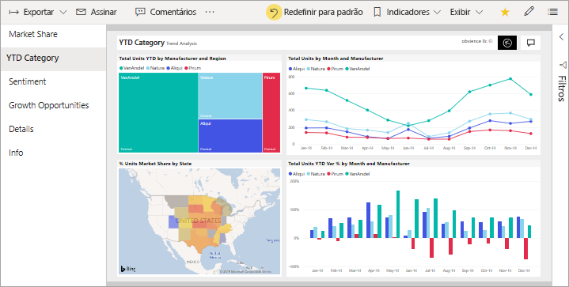
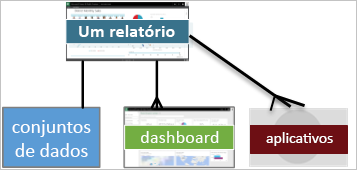
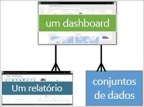
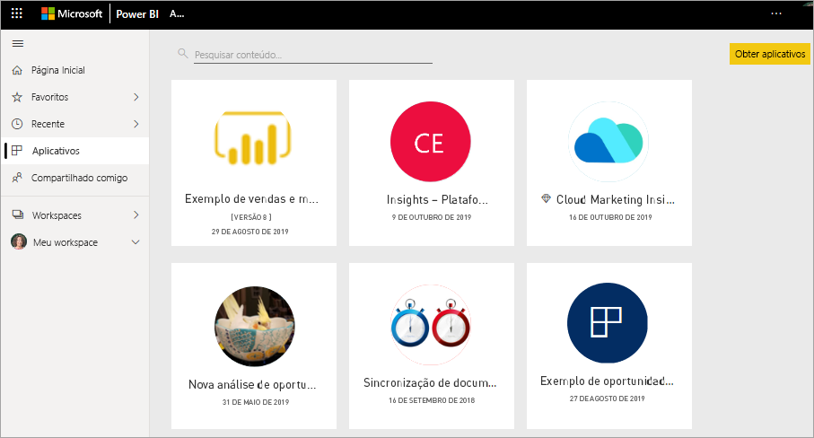
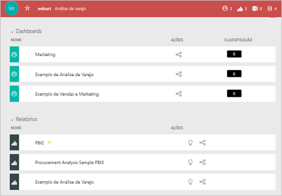

# Conceitos básicos para consumidores do serviço do Power BI

Este artigo pressupõe que você já tenha lido a [Visão geral do Power BI](../power-bi-overview.md) e tenha se identificado como um [consumidor ***do Power BI***](end-user-consumer.md). Os consumidores recebem o conteúdo do Power BI, como dashboards e relatórios, de seus colegas. Os consumidores usam o serviço do Power BI, que é a versão baseada em site do Power BI.

Você ouvirá, sem dúvida, o termo "Power BI Desktop" ou apenas "Desktop". É a ferramenta independente usada por *designers* que criam e compartilham painéis e relatórios com você. É importante saber que existem outras ferramentas do Power BI por aí. Contanto que você seja um consumidor, você só trabalhará com o serviço do Power BI. Este artigo se aplica apenas ao serviço do Power BI.

## Terminologia e conceitos

Este artigo não é um tour visual do Power BI, nem um tutorial prático. Em vez disso, ele é um artigo de visão geral para familiarizar você com a terminologia e os conceitos do Power BI. Ele vai ensinar a você o jargão e como são as coisas. Para um tour pelo serviço do Power BI e sua navegação, acesse [Início Rápido - Como explorar o serviço do Power BI](end-user-experience.md).

## Abrir o serviço do Power BI pela primeira vez

A maioria dos consumidores do Power BI obtém o serviço do Power BI porque 1) sua empresa compra licenças e 2) um administrador atribui as licenças a funcionários como você.

Para começar, abra um navegador e insira **app.powerbi.com**. Na primeira vez em que você abrir o serviço do Power BI, verá algo assim:

Conforme usar o Power BI, você personalizará o que vê ao abrir o site a cada vez. Por exemplo, algumas pessoas gostam que o Power BI abra na **Página Inicial**, enquanto outras têm um painel favorito que desejam ver primeiro. Não se preocupe, este artigo ensinará como personalizar sua experiência.

- [Apresentando a Página Inicial do Power BI & Pesquisa Global](https://powerbi.microsoft.com/blog/introducing-power-bi-home-and-global-search)

- [Painéis em destaque no serviço do Power BI](end-user-featured.md)

Mas, antes de avançarmos mais, vamos voltar e falar sobre os blocos de construção que compõem o serviço do Power BI.

_______________________________________________________

## Conteúdo do Power BI

### Introdução aos blocos de construção

Para um consumidor do Power BI, os cinco blocos de construção são: ***visualizações***, ***painéis***, ***relatórios***, ***aplicativos*** e ***conjuntos de dados***. Às vezes, eles são chamados de ***conteúdo*** do *Power BI*. O *conteúdo* existe em ***espaço de trabalhos***. Um fluxo de trabalho típico envolve todos os blocos de construção: Um *designer* do Power BI (em amarelo no diagrama abaixo) coleta dados de *conjuntos de dados*, leva esses dados para análise no Power BI, cria *relatórios* repletos de *visualizações* que realçam fatos e insights interessantes, fixa visualizações de relatórios em um painel e compartilha os relatórios e painéis com *consumidores* como você (em preto no diagrama abaixo). O *designer* os compartilha na forma de *aplicativos* ou outros tipos de conteúdo compartilhado.

Em sua forma mais básica:

-  Uma ***visualização*** (ou *visual*), é um tipo de gráfico criado pelos *designers* do Power BI. Os visuais exibem os dados dos *relatórios* e *conjuntos de dados*. Normalmente, os *designers* criam os visuais no Power BI Desktop.

    Para saber mais, confira [Interagir com as visualizações em relatórios, painéis e aplicativos](end-user-visualizations.md).

-  Um *conjunto de dados* é um contêiner de dados. Por exemplo, pode ser um arquivo do Excel da Organização Mundial de Saúde. Também pode ser um banco de dados de clientes de propriedade da empresa ou pode ser um arquivo do Salesforce.  

-  Um *painel* é uma única tela com textos, grafos e visuais interativos. Um dashboard coleta suas métricas mais importantes, em uma única tela, para contar uma história ou responder a uma pergunta. O conteúdo do dashboard vem de um ou mais relatórios e um ou mais conjuntos de dados.

    Para saber mais, confira [Dashboards para os consumidores do serviço do Power BI](end-user-dashboards.md).

-  Um *relatório* consiste em uma ou mais páginas de visuais interativos, texto e gráficos que juntos formam um único relatório. O Power BI baseia um relatório em um único conjunto de dados. Muitas vezes, o serviço organiza as páginas do relatório para abordar uma área de interesse central ou responder a uma única pergunta.

    Para saber mais, confira [Relatórios no Power BI](end-user-reports.md).

-  Um *aplicativo* é uma maneira de *designers* agruparem e compartilharem painéis e relatórios relacionados. Os *consumidores* recebem alguns aplicativos automaticamente, mas podem pesquisar outros aplicativos criados por colegas ou pela comunidade. Por exemplo, os serviços externos que talvez você já use, como o Google Analytics e o Microsoft Dynamics CRM, oferecem aplicativos do Power BI.

Para ser claro, se você for um novo usuário e tiver feito logon no Power BI pela primeira vez, ainda não verá nenhum painel, aplicativo ou relatório.

_______________________________________________________

## Conjuntos de dados

Um *conjunto de dados* é uma coleção de dados que os *designers* importam ou à qual se conectam para criar relatórios e dashboards. Como consumidor, você não interage diretamente com conjuntos de dados, mas é bom aprender como eles se encaixam no panorama geral.  

Cada conjunto de dados representa uma única fonte de dados. Por exemplo, a fonte pode ser uma pasta de trabalho do Excel no OneDrive, um conjunto de dados tabular local do SQL Server Analysis Services ou um conjunto de dados do Salesforce. O Power BI dá suporte a muitas fontes de dados diferentes.

Quando um designer compartilha um aplicativo com você, é possível ver quais conjuntos de dados estão incluídos com o aplicativo.

Um conjunto de dados...

- Pode ser usado repetidamente por um designer de relatórios para criar painéis e relatórios

- Pode ser usado para criar muitos relatórios diferentes

- Os visuais desse único conjunto de dados podem aparecer em muitos painéis diferentes

  

Para o próximo bloco de construção – visualizações.

_______________________________________________________

## Visualizações

Visualizações (também conhecidas como visuais) exibem insights que o Power BI descobriu nos dados. As visualizações tornam mais fácil interpretar o insight, pois seu cérebro pode compreender uma imagem mais rápido do que uma planilha de números.

Alguns exemplos das visualizações que você encontrará no Power BI são: cascata, faixa de opções, mapa de árvore, pizza, funil, cartão, dispersão e medidor:

   

Confira a [lista completa de visualizações incluídas com o Power BI](../power-bi-visualization-types-for-reports-and-q-and-a.md).

As visualizações chamadas de *visuais personalizados* também estão disponíveis na comunidade. Se você receber um relatório com um visual que não reconhece, provavelmente será um visual personalizado. Se você precisar de ajuda para interpretar o visual personalizado, procure o nome do relatório ou o *designer* do painel e entre em contato com eles.

Uma visualização em um relatório pode...

- aparecer várias vezes no mesmo relatório

- ser exibida em vários painéis diferentes

_______________________________________________________

## Relatórios

Um relatório do Power BI é composto por uma ou mais páginas de visualizações, grafos e texto. Todas as visualizações em um relatório vêm de um único conjunto de dados. Os *designers* compartilham relatórios com *consumidores* que [interagem com os relatórios na *Exibição de Leitura*](end-user-reading-view.md).

Um relatório pode...

- ser associado a vários painéis (blocos fixados por meio desse relatório podem aparecer em vários painéis).

- ser criado usando os dados de apenas um conjunto de dados.  

- fazer parte de vários aplicativos.

  

_______________________________________________________

## Dashboards

Um dashboard representa uma exibição personalizada de algum subconjunto dos conjuntos de dados subjacentes. Os *designers* criam dashboards e os compartilham com os *consumidores*, individualmente ou como parte de um aplicativo. Um painel consiste em uma única tela que possui *blocos*, gráficos e texto.

  

Um bloco é uma renderização de um visual que um *designer* *fixa*, por exemplo, de um relatório em um dashboard. Cada bloco fixado exibe uma [visualização](end-user-visualizations.md) que o designer criou com base em um conjunto de dados e fixou nesse painel. Um bloco também pode conter uma página inteira do relatório e dados de transmissão ao vivo ou um vídeo. Há muitas maneiras pelas quais *designers* adicionam blocos a painéis. Maneiras demais para abordar neste artigo de visão geral. Para saber mais, veja [Blocos do painel no Power BI](end-user-tiles.md).

Os consumidores não podem editar painéis. No entanto, você pode adicionar comentários, exibir os dados relacionados, defini-lo como favorito, assinar e muito mais.

Quais são algumas das finalidades dos dashboards?  Aqui estão algumas:

- para ver rapidamente todas as informações necessárias para tomar decisões

- para monitorar as informações mais importantes sobre seus negócios

- para garantir que todos os colegas estejam na mesma página, exibindo e usando as mesmas informações

- para monitorar a integridade uma empresa, produto, unidade de negócios, campanha de marketing, e assim por diante

- para criar uma exibição personalizada de um painel maior – todas as métricas que importam para você

**UM** painel...

- pode exibir visualizações de vários conjuntos de dados diferentes

- pode exibir visualizações de vários relatórios diferentes

- pode exibir visualizações fixadas de outras ferramentas (por exemplo, Excel)

  

_______________________________________________________

## Aplicativos

Essas coleções de dashboards e relatórios organizam o conteúdo relacionado em conjunto em um único pacote. Os *designers* do Power BI os criam e compartilham com pessoas, grupos uma organização inteira ou com o público. Como um consumidor, você pode ter certeza de que você e seus colegas estão trabalhando com os mesmos dados, uma única versão confiável da verdade.

Os aplicativos são fáceis de encontrar e de instalar no [serviço do Power BI](https://powerbi.com) e em seu dispositivo móvel. Depois de instalar um aplicativo, você não precisa se lembrar dos nomes dos muitos painéis diferentes. Eles estão todos juntos em um aplicativo em seu navegador ou em seu dispositivo móvel.

Esse aplicativo tem três dashboards relacionados e três relatórios relacionados que compõem um único aplicativo.

Com os aplicativos, sempre que o autor do aplicativo liberar atualizações, você verá automaticamente as alterações. O autor também controla a programação da frequência com que o Power BI atualiza os dados. Não é preciso se preocupar em mantê-lo atualizado.

Você pode obter aplicativos de algumas maneiras diferentes:

- O designer do aplicativo pode instalar o aplicativo automaticamente na sua conta do Power BI.

- O designer do aplicativo pode enviar um link direto para um aplicativo.

- Você pode procurá-lo no [Microsoft AppSource](https://appsource.microsoft.com/marketplace/apps?product=power-bi), onde é possível visualizar todos os aplicativos que pode acessar.

No Power BI em seu dispositivo móvel, você só pode instalar aplicativos de um link direto e não do AppSource. Se o designer de aplicativo instalar o aplicativo automaticamente, você o verá na sua lista de aplicativos.

Depois de instalar o aplicativo, basta selecioná-lo na sua lista de aplicativos e selecionar o painel ou relatório para abrir e explorar primeiro.

Espero que este artigo tenha fornecido uma compreensão dos blocos de construção que compõem o serviço do Power BI para os consumidores.

## Próximas etapas

- Analise e marque o [Glossário](end-user-glossary.md)

- [Faça um tour pelo serviço do Power BI](end-user-experience.md)

- Leia a [visão geral do Power BI escrita especialmente para os consumidores](end-user-consumer.md)

- Assista a um vídeo em que Will analisa os conceitos básicos e oferece um tour pelo serviço do Power BI.

    <iframe width="560" height="315" src="https://www.youtube.com/embed/B2vd4MQrz4M" frameborder="0" allowfullscreen></iframe>
