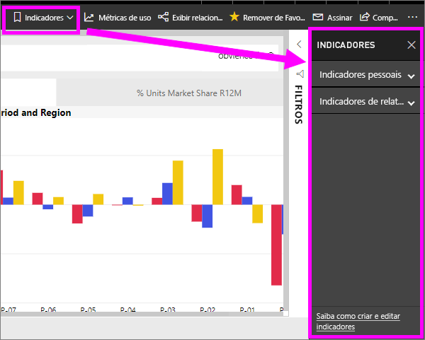
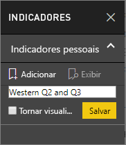

# Quais são os indicadores?
Indicadores capturam a exibição de uma página de relatório, inclusive filtros, segmentações de dados e o estado dos visuais configurada no momento. Quando você seleciona um indicador, Power BI levado de volta à exibição. Há dois tipos de indicadores - aqueles você cria por conta própria e aqueles criados pelo relatório *designers*.

## Usar indicadores para compartilhar insights e criar histórias no Power BI 
Há muitos usos para indicadores. Digamos que você descobrir um insight interessante e deseja preservá-los – criar um indicador para que você possa retornar posteriormente. Necessário sair e deseja preservar seu trabalho atual, crie um indicador. Você também pode tornar um indicador na sua exibição padrão do relatório, cada vez que você retornar, o modo de exibição da página do relatório é aberto pela primeira vez. 

Você também pode criar uma coleção de indicadores, organizá-los na ordem desejada e, posteriormente, percorrer cada indicador em uma apresentação para realçar uma série de insights que contam uma história.  

## Usando indicadores
Para abrir o painel de indicadores, selecione **indicadores** na barra de menus. Para retornar ao modo de exibição publicado original do relatório, selecione **Redefinir para padrão**.

### Indicadores de relatório
Se o relatório *designer* incluídos indicadores de relatório, você vai encontrá-los na **relatar indicadores** título. 

Selecione um indicador para alterar esse modo de exibição de relatório. 

### Indicadores pessoais

Quando você cria um indicador, os seguintes elementos são salvos com o indicador:

* A página atual
* Filtros
* A segmentação de dados, incluindo o tipo de segmentação de dados (por exemplo, menu suspenso ou lista) e o estado de segmentação de dados
* Estado de seleção visual (como filtros de realce cruzado)
* Ordem de classificação
* Local de análise
* Visibilidade (de um objeto, usando o painel **Seleção**)
* Os modos de foco ou de **Destaque** de qualquer objeto visível

Configure uma página de relatório da maneira que você deseja que ela seja exibida no indicador. Depois que a página de relatório e os visuais forem organizados como você deseja, selecione **Adicionar** no painel **Indicadores** para adicionar um indicador. Neste exemplo, adicionamos alguns filtros de região e data. 

**Power BI** cria um indicador e concede a ele um nome genérico ou um nome que você inserir. Você pode *renomeie*, *excluir*, ou *atualizar* um indicador selecionando as reticências ao lado do nome do indicador e, em seguida, selecionando a ação no menu que aparece.

Quando você tiver um indicador, você pode exibi-lo simplesmente selecionando o indicador de **indicadores** painel. 

<!--
## Arranging bookmarks
As you create bookmarks, you might find that the order in which you create them isn't necessarily the same order you'd like to present them to your audience. No problem, you can easily rearrange the order of bookmarks.

In the **Bookmarks** pane, simply drag-and-drop bookmarks to change their order, as shown in the following image. The yellow bar between bookmarks designates where the dragged bookmark will be placed.

The order of your bookmarks can become important when you use the **View** feature of bookmarks, as described in the next section. 

-->

## Indicadores como uma apresentação de slides
Para apresentar ou exibir indicadores, na ordem, selecione **modo de exibição** da **indicadores** painel para começar uma apresentação de slides.

Quando se está no modo **Exibição**, há alguns recursos a observar:

1. O nome do indicador aparece na barra de título de indicador, que aparece na parte inferior da tela.
2. A barra de título de indicador tem setas que permitem que você mova para o indicador anterior ou para o próximo.
3. Você pode sair do modo de **Exibição** selecionando **Sair** no painel **Indicadores** ou então selecionando o **X** encontrado na barra de título de indicador. 

Quando se está no modo **Exibição**, é possível fechar o painel **Indicadores** (clicando no X no painel) para fornecer mais espaço para a apresentação. E enquanto se está no modo de **Exibição**, todos os visuais são interativos e estão disponíveis para realce cruzado, exatamente como eles seriam ao interagir com eles fora desse modo. 

<!--
## Visibility - using the Selection pane
With the release of bookmarks, the new **Selection** pane is also introduced. The **Selection** pane provides a list of all objects on the current page and allows you to select the object and specify whether a given object is visible. 

You can select an object using the **Selection** pane. Also, you can toggle whether the object is currently visible by clicking the eye icon to the right of the visual. 

When a bookmark is added, the visible status of each object is also saved based on its setting in the **Selection** pane. 

It's important to note that **slicers** continue to filter a report page, regardless of whether they are visible. As such, you can create many different bookmarks, with different slicer settings, and make a single report page appear very different (and highlight different insights) in various bookmarks.

## Bookmarks for shapes and images
You can also link shapes and images to bookmarks. With this feature, when you click on an object, it will show the bookmark associated with that object. This can be especially useful when working with buttons; you can learn more by reading the article about [using buttons in Power BI](desktop-buttons.md). 

To assign a bookmark to an object, select the object, then expand the **Action** section from the **Format Shape** pane, as shown in the following image.

Once you turn the **Action** slider to **On** you can select whether the object is a back button, a bookmark, or a Q&A command. If you select bookmark, you can then select which of your bookmarks the object is linked to.

There are all sorts of interesting things you can do with object-linked bookmarking. You can create a visual table of contents on your report page, or you can provide different views (such as visual types) of the same information, just by clicking on an object.

When you are in editing mode you can use ctrl+click to follow the link, and when not in edit mode, simply click the object to follow the link. 

## Bookmark groups

Beginning with the August 2018 release of **Power BI Desktop**, you can create and use bookmark groups. A bookmark group is a collection of bookmarks that you specify, which can be shown and organized as a group. 

To create a bookmark group, hold down the CTRL key and select the bookmarks you want to include in the group, then click the ellipses beside any of the selected bookmarks, and select **Group** from the menu that appears.

**Power BI Desktop** automatically names the group *Group 1*. Fortunately, you can just double-click on the name and rename it to whatever you want.

With any bookmark group, clicking on the bookmark group's name only expands or collapses the group of bookmarks, and does not represent a bookmark by itself. 

When using the **View** feature of bookmarks, the following applies:

* If the selected bookmark is in a group when you select **View** from bookmarks, only the bookmarks *in that group* are shown in the viewing session. 

* If the selected bookmark is not in a group, or is on the top level (such as the name of a bookmark group), then all bookmarks for the entire report are played, including bookmarks in any group. 

To ungroup bookmarks, just select any bookmark in a group, click the ellipses, and then select **Ungroup** from the menu that appears. 

Note that selecting **Ungroup** for any bookmark from a group takes all bookmarks out of the group (it deletes the group, but not the bookmarks themselves). So to remove a single bookmark from a group, you need to **Ungroup** any member from that group, which deletes the grouping, then select the members you want in the new group (using CTRL and clicking each bookmark), and select **Group** again. 
-->

## Limitações e considerações
Nesta versão dos **indicadores**, há algumas limitações e considerações a serem lembradas.

* A maioria dos visuais personalizados deve funcionar bem com indicadores. Se você tiver problemas com o uso de indicadores e de um visual personalizado, entre em contato com o criador do visual personalizado e peça que adicione suporte a indicadores ao seu visual. 
* Se você adicionar um visual em uma página de relatório depois de criar um indicador, o visual será exibido em seu estado padrão. Isso também significa que, se você introduzir uma segmentação em uma página em que você tiver criado indicadores anteriormente, a segmentação se comportará em seu estado padrão.
* A movimentação de visuais após a criação de um indicador se refletirá nele. 
* Em geral, os indicadores não serão afetados se o relatório *designer* atualiza ou republica o relatório. No entanto, se o designer faz alterações importantes para o relatório, como a remoção de campos usados por um indicador, em seguida, você receberá uma mensagem de erro na próxima vez que você tentar abrir esse indicador. 

<!--
## Next steps
spotlight?
-->
