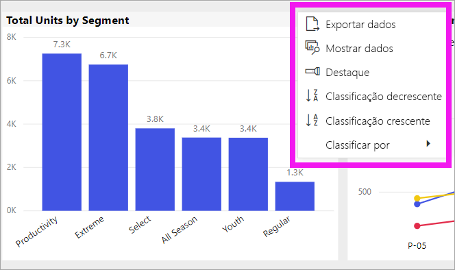

# Altere como um gráfico é classificado em um relatório do Power BI

[!INCLUDE [power-bi-service-new-look-include](../includes/power-bi-service-new-look-include.md)]

No serviço do Power BI, é possível alterar a aparência de um visual classificando-o por diferentes campos de dados. Ao alterar a maneira como você classifica um visual, é possível realçar as informações que você deseja transmitir e garantir de que o visual reflita essa tendência (ou ênfase).

Se estiver usando dados numéricos (como valores de vendas) ou dados de texto (como nomes de estado), você pode classificar suas visualizações da forma que quiser e fazer com que elas tenham a aparência desejada. O Power BI oferece muita flexibilidade para a classificação e menus rápidos para você usar. Em qualquer visual, selecione **Mais ações** (...) e o campo que você quer classificar.

Não é possível classificar os visuais de um dashboard. Em um relatório do Power BI, você pode classificar a maioria das visualizações em ordem alfabética pelos nomes das categorias no gráfico ou pelos valores numéricos de cada categoria. Por exemplo, este gráfico é classificado alfabeticamente pela categoria **nome de loja**.

É fácil alterar a classificação de uma categoria (nome do repositório) para um valor (vendas por pés quadrados).

1. Selecione **Mais ações** (...) e **Classificar por > Vendas por metro quadrado**.
2. Se necessário, selecione **Mais ações** (...) novamente e **Classificar em ordem decrescente**. O campo usado para classificar ficará em negrito e terá uma barra amarela.

   

> [!NOTE]
> Nem todos os visuais podem ser classificados. Por exemplo, os seguintes visuais não podem ser classificados: mapa de árvore, mapa, mapa coroplético, dispersão, medidor, cartão e cascata.

## Salvar as alterações feitas na ordem de classificação
Os relatórios do Power BI retêm os filtros, divisões, classificações e outras alterações de exibição de dados que você fizer. Portanto, se você sair de um relatório e retornar mais tarde, suas alterações serão salvas.  Se você quiser reverter as alterações para as configurações do designer do relatório, selecione **Redefinir para padrão** na barra de menus superior. 

No entanto, se o botão **Redefinir para padrão** estiver esmaecido, significará que o designer do relatório desabilitou a funcionalidade de salvar (persistir) as alterações.

## Classificando o uso de outros critérios
Às vezes, você deseja classificar o visual usando um campo diferente (não incluído no visual) ou outros critérios.  Por exemplo, talvez você queira classificar por mês (e não em ordem alfabética) ou talvez queira classificar por números inteiros em vez de por dígitos (exemplo, 0, 1, 9, 20 e não 0, 1, 20, 9).  O designer do relatório poderá atualizar o conjunto de dados para habilitar esse tipo de classificação. As informações de contato do designer podem ser encontradas ao selecionar o nome do relatório na barra de cabeçalho.

## Próximas etapas
Mais sobre [Visualizações nos relatórios do Power BI](end-user-visualizations.md).

[Power BI – conceitos básicos](end-user-basic-concepts.md)
