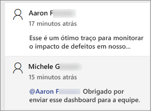
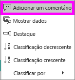

# Adicionar comentários a um painel ou relatório
Adicionar um comentário de pessoal ou iniciar uma conversa sobre um painel ou relatório com seus colegas. O recurso **comentário** é apenas uma das maneiras como um *consumidor* pode colaborar com outras pessoas. 

## Como usar o recurso Comentários
Comentários podem ser adicionados a um dashboard inteiro, para elementos visuais individuais em um painel, para uma página de relatório e para elementos visuais individuais em uma página de relatório. Adicione um comentário geral ou um comentário destinadas a colegas específicas.  

Quando você adiciona um comentário a um relatório, o Power BI captura os valores de filtro e de segmentação de dados atuais. Isso significa que, quando você seleciona ou responde a um comentário, a página de relatório ou visual do relatório pode ser alterada para mostrar a você o filtro e seleções de segmentação de dados que estavam ativas quando o comentário foi inicialmente adicionada.  

Por que isso é importante? Digamos que um colega aplicou um filtro que revelou um insight interessante que ele deseja compartilhar com a equipe. Sem o filtro selecionado, o comentário não pode fazer sentido. 

### Adicionar um comentário geral a um painel ou relatório
Os processos para adicionar comentários a um painel ou relatório são semelhantes. Neste exemplo, estamos usando um dashboard. 

1. Abrir um relatório ou dashboard do Power BI e selecione o **comentários** ícone. Isso abre a caixa de diálogo Comentários.

    

    Aqui podemos ver que o criador do dashboard já adicionou um comentário geral.  Qualquer pessoa com acesso a esse dashboard pode ver este comentário.

    

2. Para responder, selecione **Responder**, digite sua resposta e selecione **Postar**.  

    

    Por padrão, o Power BI direciona sua resposta ao colega que iniciou o thread de comentários, neste caso, Aaron F. 

    

 3. Se você quiser adicionar um comentário que não faz parte de um thread existente, digite seu comentário no campo de texto superior.

    

    Os comentários a esse dashboard agora têm esta aparência.

    

### Adicionar um comentário a um painel específico ou visual do relatório
Além de adicionar comentários a um painel inteiro ou para uma página inteira do relatório, você pode adicionar comentários para blocos de dashboard individual e visuais de relatórios individuais. Os processos são semelhantes e, neste exemplo, estamos usando um relatório.

1. Focalize o visual e selecione o as reticências (…).    
2. No menu suspenso, selecione **Adicionar um comentário**.

      

3.  O **comentários** caixa de diálogo é aberta e os outros visuais na página são cinza. Esse visual ainda não tem nenhum comentário. 

      

4. Digite seu comentário e selecione **Postar**.

      

    - Em um relatório de página, selecionando um comentário que foi feito em um visual realça visual (veja acima).

    - Em um painel, o ícone de gráfico  nos informa que um comentário está vinculado a um visual específico. Os comentários que se aplicam para o painel inteiro não tem um ícone especial. Selecionando o ícone de gráfico destaca o visual relacionado no painel.

        

5. Selecione **Fechar** para voltar para o dashboard ou relatório.

### Consiga a atenção de seus colegas usando o sinal @
Se você estiver criando uma captura de dashboard, relatório, bloco ou visual comentário, atenção de seus colegas usando o "\@" símbolo.  Quando você digita o "\@" símbolo, o Power BI abre uma lista suspensa onde você pode procurar e selecionar pessoas de sua organização. Qualquer nome verificado precedido pelo símbolo "\@" aparece em fonte azul. 

Esta é uma conversa que estou tendo com o *designer* da visualização. Ele usa o símbolo @ para garantir que eu veja o comentário. Eu sei que esse comentário é para mim. Ao abrir o dashboard do aplicativo no Power BI, eu seleciono **Comentários** no cabeçalho. O painel **Comentários** exibe nossa conversa.

  

## Próximas etapas
Voltar para as [visualizações para consumidores](end-user-visualizations.md)    
<!--[Select a visualization to open a report](end-user-open-report.md)-->
