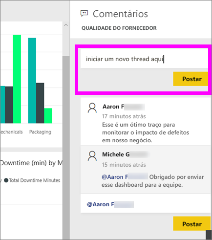
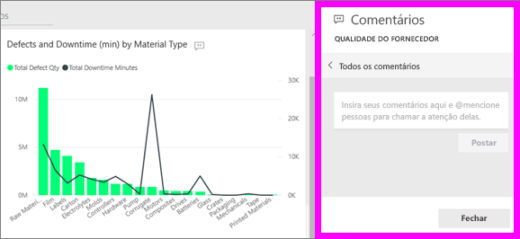
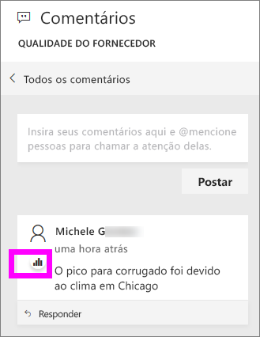
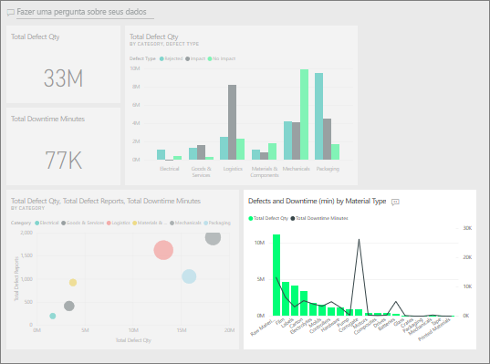

# Adicionar comentários a um dashboard
Adicione um comentário pessoal ou inicie uma conversa sobre um dashboard com seus colegas. O recurso **comentário** é apenas uma das maneiras como um *consumidor* pode colaborar com outras pessoas. 

## Como usar o recurso Comentários
Comentários podem ser adicionados a todo um dashboard ou a visuais separados em um dashboard. Adicione um comentário geral ou um comentário direcionado a colegas específicos.  

### Adicionar um comentário geral de dashboard
1. Abra um dashboard do Power BI e selecione o ícone **Comentários**. Isso abre a caixa de diálogo Comentários.

    

    Aqui podemos ver que o criador do dashboard já adicionou um comentário geral.  Qualquer pessoa com acesso a esse dashboard pode ver este comentário.

    

2. Para responder, selecione **Responder**, digite sua resposta e selecione **Postar**.  

    

    Por padrão, o Power BI direciona sua resposta ao colega que iniciou o thread de comentários, neste caso, Aaron F. 

    

 3. Se você quiser adicionar um comentário de dashboard que não faça parte de um thread existente, digite seu comentário no campo de texto superior.

    

    Os comentários a esse dashboard agora têm esta aparência.

    

### Adicionar um comentário a um visual de dashboard específico
1. Focalize o visual e selecione o as reticências (…).    
2. No menu suspenso, selecione **Adicionar um comentário**.

      

3.  A caixa de diálogo **Comentários** é aberta. Esse visual ainda não tem nenhum comentário. 

      

4. Digite seu comentário e selecione **Postar**.

      

    O ícone de gráfico  informa que este comentário está vinculado a um visual específico. Selecione o ícone para realçar o visual relacionado no dashboard.

    

5. Selecione **Fechar** para voltar para o dashboard ou relatório.

### Consiga a atenção de seus colegas usando o sinal @
Se você estiver criando comentários de dashboard ou comentando sobre um visual específico, chame a atenção de seus colegas usando o símbolo "@".  Quando você digita o símbolo "@", o Power BI abre uma lista suspensa na qual você pode procurar e selecionar pessoas de sua organização. Qualquer nome verificado precedido pelo símbolo "@" aparece em fonte azul. 

Esta é uma conversa que estou tendo com o *designer* da visualização. Ele usa o símbolo @ para garantir que eu veja o comentário. Eu sei que esse comentário é para mim. Ao abrir o dashboard do aplicativo no Power BI, eu seleciono **Comentários** no cabeçalho. O painel **Comentários** exibe nossa conversa.

  

## Próximas etapas
Voltar para as [visualizações para consumidores](end-user-visualizations.md)    
<!--[Select a visualization to open a report](end-user-open-report.md)-->