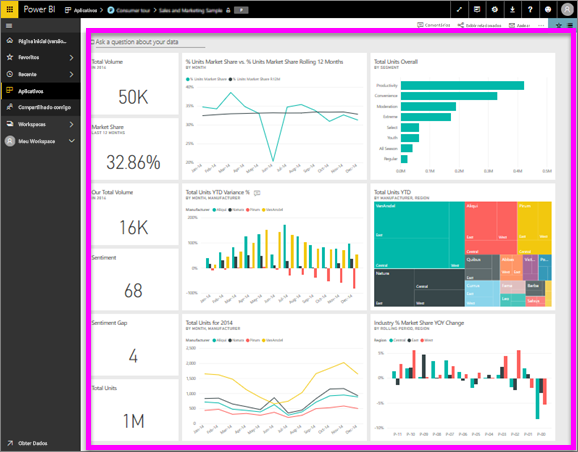

# Exibir um dashboard
Os consumidores do Power BI gastam muito tempo para exibir dashboards. Os dashboards são projetados para realçar as informações específicas de relatórios e conjuntos de dados subjacentes. E os consumidores de Power BI usam essas informações para acompanhamento, monitoramento, responder perguntas, testes e muito mais para tomar decisões de negócios controladas por dados.

O Power BI Pro é necessário para compartilhar dashboards e para exibir dashboards compartilhados.

## Abra um dashboard
Dashboards podem ser abertos de vários locais do serviço do Power BI.  O segredo é descobrir qual conteúdo é um dashboard (em vez de um relatório, por exemplo). Depois de identificar um dashboard, abri-lo é muito simples – basta clicar nele e o dashboard preencherá a tela do Power BI.

|              |         |
|------------|--------------------------------|
|      |A maneira mais fácil de identificar um dashboard é procurar este  ícone de dashboard. Quando você localizar conteúdo com este ícone, selecione-o para abrir o dashboard. |
|                    |          |

 

<!--insert aGIF-->

Você pode encontrar os dashboards em todos os contêineres na barra de navegação à esquerda. 
- **Home** (Visualização)
- **Favoritos** – se tiver [definido um dashboard como favorito](end-user-favorite.md)
- **Recente** – se tiver visitado um dashboard recentemente
- **Aplicativos** – a maioria dos aplicativos contém dashboards e relatórios
- **Compartilhado comigo** – se um colega [compartilhou um dashboard com você](end-user-shared-with-me.md)
- **Meu workspace** – se tiver baixado algum [exemplo do Power BI](../sample-datasets.md)

## Próximas etapas
* Fique à vontade com os dashboards fazendo um tour em um dos nossos [dashboards de exemplo](../sample-tutorial-connect-to-the-samples.md).
* Saiba mais sobre [blocos de dashboard](end-user-tiles.md) e o que acontece quando você seleciona um.
* Deseja acompanhar um bloco de dashboard individual e receber um email quando ele alcançar um certo limite? [Criar alertas em blocos](end-user-alerts.md).
* Divirta-se fazendo perguntas ao seu dashboard. Aprenda como usar o [Power BI Q&A](end-user-q-and-a.md) para fazer perguntas sobre os dados e receba uma resposta na forma de uma visualização. 