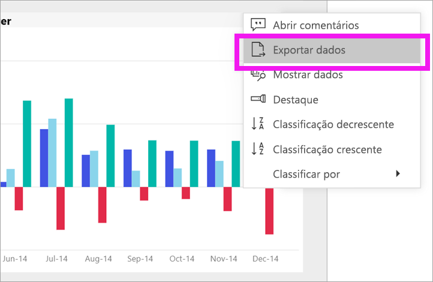

# Exportar dados do visual
Se você gostaria de ver os dados que são usados para criar um visual [você pode exibir os dados no Power BI](end-user-show-data.md) ou exportá-los para o Excel. A opção de exportação de dados requer um determinado tipo ou licença e editar permissões para o conteúdo. Se você não pode exportar, verifique com seu administrador do Power BI. 

## De um visual em um dashboard do Power BI

1. Iniciar em um dashboard do Power BI. Aqui, estamos usando o painel do ***exemplo de Marketing e venda*** aplicativo. Você pode [baixar esse aplicativo da AppSource.com](https://appsource.microsoft.com/en-us/product/power-bi/microsoft-retail-analysis-sample.salesandmarketingsample-preview?flightCodes=e2b06c7a-a438-4d99-9eb6-4324ce87f282).

    

2. Passe o mouse sobre um visual para revelar as reticências (...) e clique para exibir o menu de ação.

    

3. Selecione **exportar para o Excel**.

4. O que acontece em seguida depende do navegador que você está usando. Você pode ser solicitado a salvar o arquivo ou o seu pode ver um link para o arquivo exportado na parte inferior do navegador. 

    

5. Abra o arquivo no Excel.  

    

## De um visual em um relatório
Você pode exportar dados de um visual em um relatório como arquivo. csv ou. xlsx (Excel) formato. 

1. Em um dashboard, selecione um bloco para abrir o relatório subjacente.  Neste exemplo, vamos selecionar o mesmo visual, como mostrado acima, *% Var. Acumulada Total de unidades*. 

    

    Uma vez que este bloco foi criado a partir o *exemplo de vendas e Marketing* relatório, que é o relatório que é aberta. E, então, ele abre a página que contém o visual do bloco selecionado. 

2. Selecione o bloco no relatório. Observe que o **filtros** painel à direita. Este visual tem filtros aplicados. Para saber mais sobre filtros, consulte [usar filtros em um relatório](end-user-report-filter.md).

    

3. Selecione as elipses no canto superior direito da visualização. Escolher **exportar dados**.

    

4. Você verá opções para exportar dados resumido ou dados subjacente. Se você estiver usando o *exemplo de vendas e marketing* aplicativo, **os dados subjacentes** será desabilitada. Mas você pode encontrar relatórios em que as duas opções são habilitadas. Aqui está uma explicação da diferença.

    **Dados resumidos**: Selecione esta opção se você quiser exportar dados para o que você vê no visual.  Esse tipo de exportação mostra apenas os dados que foi usados para criar o visual. Se o visual tem filtros aplicados, os dados exportados também serão filtrados. Por exemplo, para este visual, sua exportação incluirá somente dados para 2014 e a região central e apenas os dados para quatro dos fabricantes: VanArsdel, Natura, Aliqui e Prirum.
  

    **Os dados subjacentes**: Selecione esta opção se você quiser exportar dados para o que você vê no visual **plus** dados adicionais do conjunto de dados subjacente.  Isso pode incluir os dados contidos no conjunto de dados, mas não usados no visual. 

    

5. O que acontece em seguida depende do navegador que você está usando. Você pode ser solicitado a salvar o arquivo ou o seu pode ver um link para o arquivo exportado na parte inferior do navegador. 

    

7. Abra o arquivo no Excel. Compare a quantidade de dados exportados para os dados que exportamos do mesmo visual no painel. A diferença é que essa exportação inclui **os dados subjacentes**. 

    

