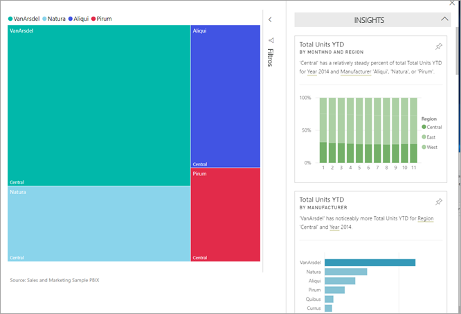
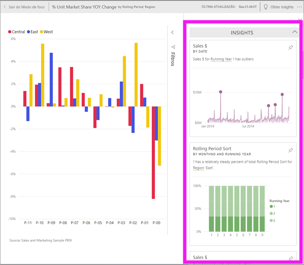
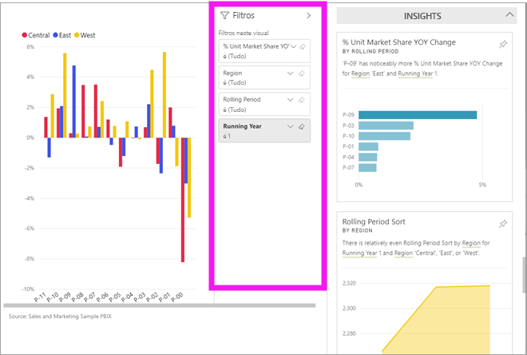
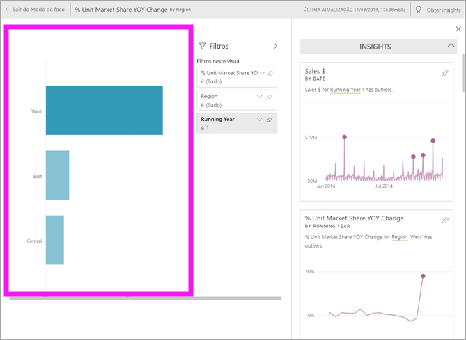
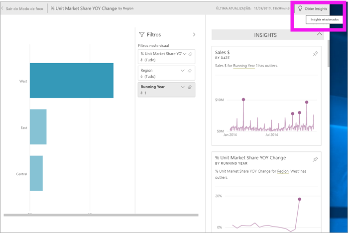

# Exibir insights de dados em blocos do painel com o Power BI

[!INCLUDE[consumer-appliesto-yyny](../includes/consumer-appliesto-yyny.md)]

Cada bloco de [visual](end-user-tiles.md) em seu dashboard é uma porta de entrada para exploração de dados. Quando você seleciona um bloco, ele abre um relatório ou [abre a seção de P e R](end-user-q-and-a.md), em que você pode filtrar, classificar e examinar o conjunto de dados do relatório. E quando você executa insights, o Power BI faz a exploração de dados para você.

Execute insights para gerar visuais interativos e interessantes com base em seus dados. Insights podem ser executados em um bloco de dashboard específico, e você pode até mesmo executar insights em um insight.

O recurso Insights tem como base um crescente [conjunto de algoritmos analíticos avançados](end-user-insight-types.md), desenvolvido em conjunto com o Microsoft Azure for Research, os quais continuaremos a usar para permitir que mais pessoas encontrem informações em seus próprios dados de maneiras novas e intuitivas.

## Executar insights em um bloco do painel
Quando você executar insights em um bloco do dashboard, o Power BI pesquisa apenas os dados usados para criar esse bloco de dashboard único. 

1. [Abra um dashboard](end-user-dashboards.md).
2. Passe o mouse sobre um bloco. Selecione **Mais opções** (...) e **Exibir insights**. 

    

3. O bloco é aberto no [modo de foco](end-user-focus.md) com os cartões de insights exibidos à direita.    
   
        
4. Algum insight desperta seu interesse? Selecione esse cartão de insights para se aprofundar ainda mais. O insight selecionado aparece à esquerda e novos insights, com base apenas nos dados daquele único insight, são exibidos à direita.    

 ## Interagir com os cartões de insights
Depois que você tiver um insight aberto, continue a explorar.

   * Filtre esse visual na tela.  Para exibir os filtros, no canto superior direito, selecione a seta para expandir o painel Filtros.

      
   
   * Execute insights no cartão de insight em si. Isso é conhecido como **insights relacionados**. Selecione um cartão de insight para ativá-lo. Ele será exibido na tela de relatório.
   
      
   
   * No canto superior direito, selecione o ícone de lâmpada  ou **Obter insights**. O insight é exibido à esquerda e novos cartões, com base apenas nos dados daquele único insight, são exibidos à direita.
     
     
     
Para retornar ao relatório, no canto superior esquerdo, selecione **Sair do modo de foco**.

## Considerações e solução de problemas
- **Exibir insights** não funciona com todos os tipos de bloco do dashboard. Por exemplo, ele não está disponível para visuais personalizados.<!--[custom visuals](end-user-custom-visuals.md)-->

## Próximas etapas
Saiba mais sobre os [tipos de Insights Rápidos disponíveis](end-user-insight-types.md)

