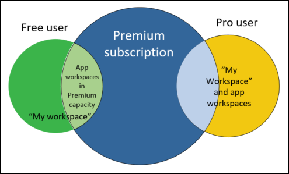
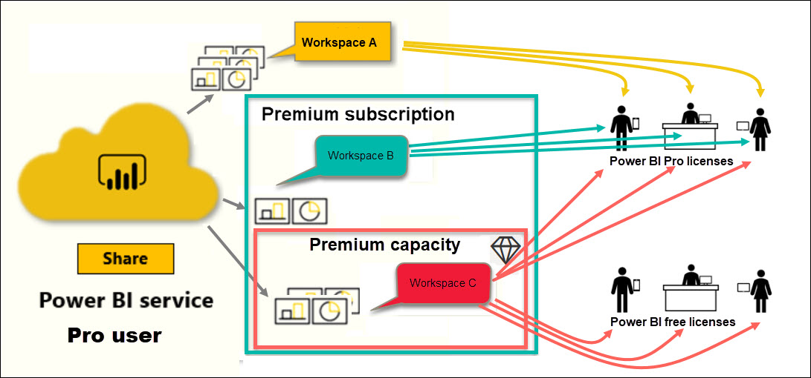
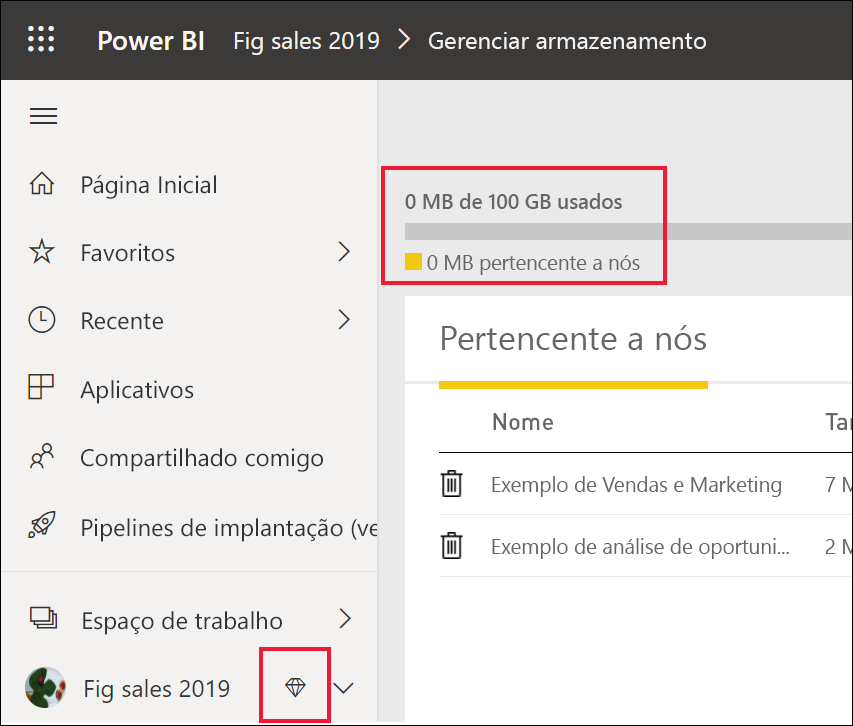

# Tipos de licenças do Power BI

[!INCLUDE[consumer-appliesto-ynnn](../includes/consumer-appliesto-ynnn.md)]

Como *consumidor*, você usa o serviço do Power BI para explorar relatórios e dashboards a fim de tomar decisões de negócios. Se você usa o Power BI há algum tempo ou tem conversado com seus colegas *designers*, provavelmente já sabe que há alguns recursos que só funcionam se você tem um determinado tipo de licença ou assinatura. 

Este artigo explica as diferenças entre licenças de usuário e assinaturas de organização (gratuitas, Pro, Premium e capacidade Premium) e como elas funcionam juntas. Você também saberá como descobrir qual combinação de licença e assinatura está usando.  

Começaremos examinando as duas categorias de licenças – por usuário e assinaturas organizacionais. Nosso ponto de partida serão os recursos padrão disponíveis em cada um. Em seguida, veremos como o administrador do Power BI e os proprietários de conteúdo podem usar funções e permissões para modificar os recursos de assinatura e licença padrão. 

Por exemplo, mesmo que sua licença permita, o administrador pode limitar sua capacidade de executar ações, como exportar dados, usar consultas de linguagem natural de P e R ou publicar na Web. E também veremos que quando um *designer* de relatório atribui conteúdo a um [espaço de trabalho](end-user-workspaces.md), ele pode designar você a uma função de espaço de trabalho. As funções determinam o que você pode e não pode fazer nesse workspace. O *designer* pode ajustar ainda mais os limites da sua licença usando as configurações de permissão. Em outras palavras... é complicado. Espero que este artigo explique um pouco, se não toda, a confusão.

## Licenças por usuário
O primeiro tipo de licença é uma licença **por usuário**. Cada usuário do serviço do Power BI tem uma licença gratuita ou uma licença Pro. Determinados recursos são reservados para usuários com licenças Pro.  

- **Uma licença do Power BI Pro (sem uma assinatura Premium)** permite que um usuário colabore, crie e compartilhe conteúdos com usuários Pro. Somente usuários com uma licença Pro podem publicar relatórios, assinar dashboards e relatórios e colaborar com colegas em workspaces. 

    

    O Power BI Pro é uma licença individual de usuário que permite que eles leiam e interajam com relatórios e painéis publicados por outras pessoas no serviço do Power BI. Os usuários com esse tipo de licença podem compartilhar conteúdo e colaborar com outros usuários do Power BI Pro. Somente os usuários do Power BI Pro podem publicar ou compartilhar conteúdo com outros usuários ou consumir conteúdo criado por outros usuários. A exceção a isso é o conteúdo hospedado na [capacidade do Power BI Premium](#understanding-premium-and-premium-capacity). Para saber mais, confira [Capacidade do Power BI Premium](#understanding-premium-and-premium-capacity) abaixo. Normalmente, as licenças Pro são usadas por *designers* de relatório e desenvolvedores. 

- **Uma licença do Power BI gratuita e autônoma (sem uma assinatura Premium)** , embora avançada, é destinada a usuários que estão começando a usar o Power BI ou àqueles que criam conteúdo para uso próprio. Confira [Inscrever-se no serviço do Power BI como indivíduo](../service-self-service-signup-for-power-bi.md).   

    Uma licença de usuário autônoma gratuita é perfeita para alguém que usa exemplos da Microsoft para conhecer o Power BI. Usuários com licenças autônomas gratuitas não podem ver conteúdo compartilhado por outras pessoas nem compartilhar o próprio conteúdo com outros usuários do Power BI. 

    

    Todos os clientes com uma licença autônoma gratuita podem atualizar para uma [licença de avaliação gratuita do Power BI Pro](../service-self-service-signup-for-power-bi.md). A versão de avaliação fornece todo os recursos e funcionalidades de um usuário do Power BI Pro.

    

- **Uma licença gratuita do Power BI com uma assinatura Premium** Quando uma organização possui uma assinatura Premium, administradores e usuários Pro podem atribuir espaços de trabalho à *capacidade Premium* e conceder aos usuários gratuitos acesso a esses espaços de trabalho. Um workspace em uma capacidade Premium é um espaço em que os usuários Pro podem compartilhar e colaborar com usuários do nível gratuito, sem exigir que esses usuários tenham contas Pro. Dentro desses espaços de trabalho, os usuários gratuitos têm permissões elevadas e podem colaborar, compartilhar e exportar dados, além de assinar, interagir com filtros e muito mais. 

Está claro até aqui?  OK. Vamos ver a **capacidade Premium** mais detalhadamente.

## Como funciona o nível Premium e a capacidade Premium
A capacidade Premium é uma assinatura **organizacional**. Pense nela como adicionar uma camada de recursos e funcionalidade a todas as licenças **por usuário** do Power BI em uma organização. 

Quando uma organização adquire uma licença Premium, o administrador normalmente atribui licenças Pro aos funcionários que criarão e compartilharão conteúdo. Além disso, o administrador atribui licenças gratuitas a todos que consumirão esse conteúdo. Os usuários Pro criam [espaços de trabalho de aplicativo](end-user-workspaces.md) e adicionam conteúdo (painéis, relatórios, aplicativos) a esses espaços de trabalho. Para permitir que usuários gratuitos colaborem nesses espaços de trabalho, o administrador ou usuário Pro os salva na *capacidade Premium*. 

Quando uma organização adquire uma licença Premium, ela recebe a capacidade no serviço do Power BI alocado exclusivamente a ela. Ela não é compartilhada por outras organizações. A capacidade tem suporte de hardware dedicado totalmente gerenciado pela Microsoft. As organizações podem optar por aplicar sua capacidade dedicada de forma ampla ou alocá-la para workspaces específicos. Uma organização pode ter essa capacidade aplicada a todos os espaços de trabalho ou apenas a algumas. Você pode identificar um espaço de trabalho na capacidade Premium aplicada por um ícone de losango .  Um workspace em uma capacidade Premium é um espaço em que os usuários Pro podem compartilhar e colaborar com usuários do nível gratuito, sem exigir que esses usuários tenham contas Pro. 

Na capacidade Premium, as licenças Pro ainda são necessárias para os designers de conteúdo. Os designers criam espaços de trabalho de aplicativo, conectam-se a fontes de dados, modelam dados e criam relatórios e painéis que são compartilhados diretamente ou empacotados e compartilhados como aplicativos. Os usuários sem uma licença Pro ainda podem acessar um espaço de trabalho de aplicativo no Power BI Premium, desde que esse espaço de trabalho tenha *capacidade* Premium e seu proprietário conceda permissão.

No diagrama abaixo, o lado esquerdo representa os usuários Pro que criam e compartilham conteúdo em espaços de trabalho de aplicativo. 

- O **Espaço de Trabalho A** foi criado em uma organização que não possui uma assinatura Premium. 

- O **Espaço de Trabalho B** foi criado em uma organização que possui uma assinatura Premium, embora esse espaço de trabalho específico não tenha sido salvo na capacidade Premium. O workspace não tem o ícone de losango.

- O **Espaço de Trabalho C** foi criado em uma organização que possui uma assinatura Premium e foi salvo na capacidade Premium. Esse workspace tem um ícone de losango.  

O *designer* do Power BI Pro pode compartilhar e colaborar com outros usuários Pro em qualquer um dos três espaços de trabalho. Desde que o designer compartilhe o workspace com toda a organização ou atribua funções de workspace aos usuários Pro. 

O usuário do Power BI Pro só pode compartilhar e colaborar com usuários gratuitos usando o Espaço de Trabalho C. O espaço de trabalho deve ter capacidade Premium aplicada a ela para que os usuários gratuitos possam acessá-lo. No workspace, o designer atribui funções a colaboradores: *Administrador*, *Membro*, *Colaborador* ou *Visualizador*. Sua função determina as ações que você pode executar no workspace. Os *consumidores* do Power BI costumam receber a função de *Visualizador*. Para saber mais, confira [Workspaces para consumidores do Power BI](end-user-workspaces.md).

## Descubra qual é sua licença e assinatura
Existem várias maneiras de consultar suas informações de licença e assinatura do Power BI. 

Primeiro, determine qual licença de **usuário** você tem.

- Determinadas versões do Microsoft Office incluem uma licença Power BI Pro.  Para ver se sua versão do Office inclui o Power BI, acesse [o portal do Office](https://portal.office.com/account) e selecione **Assinaturas**.

    O primeiro usuário, Pradtanna, tem Office 365 E5, que inclui uma licença Power BI Pro.

    

    Esse segundo usuário, Zalan, tem uma licença gratuita do Power BI. 

    

Em seguida, verifique se sua conta também faz parte de uma assinatura Premium. Qualquer um dos usuários acima, Pro ou gratuito, pode pertencer a uma organização que tem uma licença Premium.  Vamos conferir nosso segundo usuário, Zalan.  

- No serviço do Power BI, selecione **Meu workspace** e selecione o ícone de engrenagem no canto superior direito. Escolha **Gerenciar armazenamento pessoal**.

    

    As licenças **por usuário**, Pro ou gratuita, fornecem 10 GB de armazenamento na nuvem que podem ser usados para hospedar relatórios do Power BI ou pastas de trabalho do Excel. Caso você veja mais de 10 GB, isso significa que você é membro de uma conta organizacional com uma licença Premium.

    

    Lembre-se de que, na página do portal do Office, a licença de usuário do Zalan era do Power BI (gratuito). Mas, como sua organização comprou uma assinatura Premium, no serviço do Power BI, Zalan não tem só 10 GB de armazenamento, como tem 100 GB disponíveis. Como *consumidor* em uma organização com uma licença Premium, desde que o *designer* coloque o workspace na capacidade Premium, Zalan pode visualizar conteúdo compartilhado, colaborar com colegas, trabalhar com aplicativos e muito mais. O alcance das permissões dele é definido pelo administrador do Power BI e pelo designer de conteúdo. Observe que um usuário Pro já compartilhou um workspace com Zalan. O ícone de losango informa que esse workspace está armazenado na capacidade Premium. 

   
## Noções básicas sobre funções de workspace
Até agora, analisamos licenças por usuário, assinaturas Premium, espaços de trabalho de aplicativo e capacidade Premium. Agora, vamos dar uma olhada nas funções de *workspace*.

Como este é um artigo para *consumidores* do Power BI, temos o seguinte cenário:

-  Você é um usuário *gratuito* em uma organização que tem uma assinatura do Power BI Premium. 
- Um usuário do Power BI Pro criou uma coleção de painéis e relatórios e publicou essa coleção como um *aplicativo* para toda a sua organização.  
- Os aplicativos estão nos *espaços de trabalho* e estes têm a capacidade Premium aplicada a ele.    
- O workspace desse aplicativo tem um dashboard e dois relatórios.
- O usuário Pro nos atribuiu a função de **Visualizador**.

### A função de Visualizador
As funções permitem que os *designers* do Power BI gerenciem quem pode fazer o que em um workspace, para que as equipes possam colaborar. Uma dessas funções é a de **Visualizador**. 

Quando o workspace está em uma capacidade do Power BI Premium, os usuários com a função de visualizador podem acessar o workspace, mesmo se não tiverem uma licença do Power BI Pro. Como a função de Visualizador não pode acessar ou exportar os dados subjacentes, é uma maneira segura de interagir com painéis, relatórios e aplicativos.

> [!TIP]
> Para saber mais sobre as outras funções (Administrador, Membro e Colaborador), confira [Criar um novo workspace](../service-new-workspaces.md).

## Próximas etapas
[Sou *consumidor* do Power BI?](end-user-consumer.md)    
[Saiba mais sobre espaços de trabalho](end-user-workspaces.md)    
<!--[View Power BI features by license type](end-user-features.md) -->

