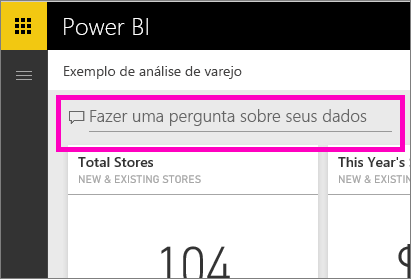
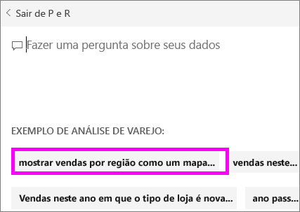

# P e R para **consumidores** do Power BI
## O que é P e R?
Às vezes, a maneira mais rápida de obter uma resposta de seus dados é fazer uma pergunta usando o idioma natural. Por exemplo, "qual foi o total de vendas no ano passado".  
Use P e R para explorar seus dados do Excel usando recursos intuitivos em idioma natural e receba as respostas na forma de quadros e gráficos. P e R é diferente de um mecanismo de pesquisa - P e R fornece apenas resultados sobre os dados no Power BI.

A **P e R do Power BI** só dá suporte a responder consultas em linguagem natural perguntadas em inglês. Há uma versão prévia disponível para espanhol que pode ser habilitada pelo administrador do Power BI.

A **P e R do Power BI** está disponível com uma licença Pro ou Premium. 
>

A pergunta é apenas o começo.  Divirta-se viajando através de seus dados refinando ou expandindo sua pergunta, revelando informações novas de confiança, concentrando-se em detalhes e diminuindo o zoom para uma exibição mais ampla. Você vai se deliciar com as ideias e descobertas feitas.

A experiência é verdadeiramente interativa... e rápida! Equipada com um armazenamento na memória, a resposta é quase instantânea.

## Onde posso usar as P e R?
Você encontrará as P e R em dashboards no serviço do Power BI, na parte inferior do dashboard no Power BI Mobile e acima da visualização no Power BI Embedded. A menos que o designer tenha lhe concedido permissões de edição, você poderá usar as P e R para explorar dados, mas não poderá salvar nenhuma visualização criada com as P e R.

## Como o recurso de P e R sabe como responder a perguntas?
As P e R procuram respostas em todos os conjuntos de dados associados ao dashboard. Se um conjunto de dados tiver um bloco no dashboard, as P e R buscarão as respostas no conjunto de dados. 

## Por onde começo?
Primeiro, familiarize-se com o conteúdo. Veja as visualizações no dashboard e no relatório. Tenha uma ideia do tipo e do intervalo de dados que estão disponíveis para você. Depois, volte para o dashboard e coloque o cursor na caixa de perguntas. Isso abrirá a tela de P e R.

 

* Se os valores e os rótulos do eixo de visualizações incluem “vendas”, “conta”, “mês” e “oportunidades”, é possível fazer perguntas como: "qual *conta* tem a melhor *oportunidade*” ou “mostre as *vendas* por mês como um gráfico de barras".

* Se você tiver dados de desempenho do site do Google Analytics, poderá perguntar às P e R sobre o tempo gasto em uma página da Web, o número de visitas únicas à página e as taxas de participação do usuário. Ou, se você estiver consultando dados demográficos, você pode fazer perguntas sobre idade e renda doméstica por local.

Na parte inferior da tela, você verá outros itens úteis. Para cada conjunto de dados, as P e R mostram as palavras-chave e, às vezes, até mesmo alguns exemplos ou sugestões de perguntas. Selecione qualquer um desses para adicioná-los à caixa de perguntas. 

Outra maneira que as P e R ajudam você a fazer perguntas é com prompts, preenchimento automático e dicas visuais. 

 

### Qual visualização que faz perguntas e um uso?
Perguntas e respostas escolhe a melhor visualização com base nos dados que estão sendo exibidos. Às vezes, os dados no conjunto de dados subjacente são definidos como um determinado tipo ou categoria e isso ajuda a P e R saber como exibi-los. Por exemplo, se os dados são definidos como um tipo de data, é mais provável que sejam exibidos como um gráfico de linhas. Dados que são categorizados como uma cidade são mais prováveis de ser exibidos como um mapa.

Você também pode informar ao P e R a visualização que será usada, adicioná-la à sua pergunta. Mas tenha em mente que não será sempre possível exibir os dados no tipo de visualização que você solicitou. As P e R mostrarão a você uma lista de tipos de visualização viáveis.

## Considerações e solução de problemas
**Pergunta**: Eu não vejo as P e R neste painel.    
**Resposta 1**: se você não vê uma caixa de pergunta, verifique primeiro suas configurações. Para fazer isso, selecione o ícone de engrenagem no canto superior direito da barra de ferramentas do Power BI.   

Em seguida, escolha **Configurações** > **Dashboards**. Verifique se há uma marca de seleção ao lado de **Mostrar a caixa de pesquisa de P e R neste dashboard**.
  

**Resposta 2**: às vezes, o *designer* do painel ou o administrador desativam as P e R. Verifique com eles se elas poderão ser reativadas.   

**Pergunta**: Não estou obtendo os resultados que gostaria de ver ao digitar uma pergunta.    
**Resposta**: entre em contato com o *designer* do painel. Há muitas coisas que o designer pode fazer para melhorar os resultados de P e R. Por exemplo, o designer pode renomear as colunas no conjunto de dados usando termos que são facilmente compreendidos (`CustomerFirstName` em vez de `CustFN`). Já que o designer conhece muito bem o conjunto de dados, ele também pode elaborar perguntas úteis e adicioná-los à tela de P e R.

## Próximas etapas

