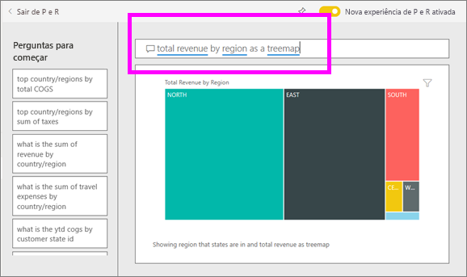
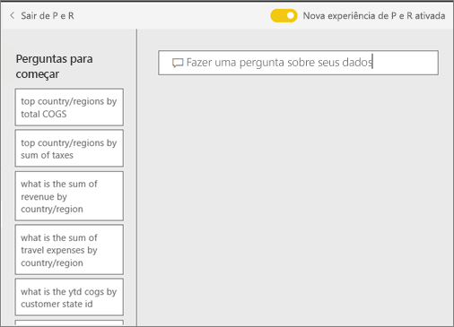
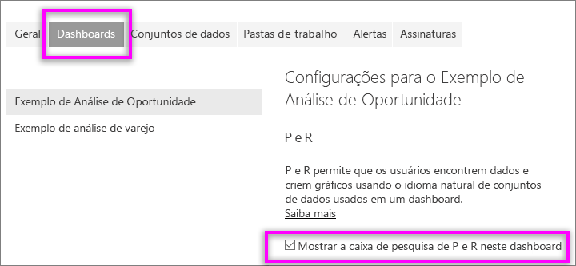

# P e R para **consumidores** do Power BI
## O que é P e R?
Às vezes, a maneira mais rápida de obter uma resposta de seus dados é fazer uma pergunta usando o idioma natural. Por exemplo, "qual foi o total de vendas no ano passado".

Use P e R para explorar seus dados do Excel usando recursos intuitivos em idioma natural e receba as respostas na forma de quadros e gráficos. P e R é diferente de um mecanismo de pesquisa - P e R fornece apenas resultados sobre os dados no Power BI.

A **P e R do Power BI** está disponível com uma licença Pro ou Premium.  [P e R nos aplicativos móveis do Power BI](mobile/mobile-apps-ios-qna.md) e [P e R com o Power BI Embedded](../developer/qanda.md) são abordadas em artigos separados. No momento, a **P e R do Power B** só dá suporte a responder a consultas em linguagem natural frequentes em inglês, embora haja uma visualização disponível para espanhol que pode ser habilitada pelo administrador do Power BI.

A pergunta é apenas o começo.  Divirta-se viajando através de seus dados refinando ou expandindo sua pergunta, revelando informações novas de confiança, concentrando-se em detalhes e diminuindo o zoom para uma exibição mais ampla. Você vai se deliciar com as ideias e descobertas feitas.

A experiência é verdadeiramente interativa... e rápida! Equipada com um armazenamento na memória, a resposta é quase instantânea.

## Onde posso usar as P e R?
Você encontrará a P e R em painéis no serviço do Power BI, na parte inferior do painel no Power BI Mobile. A menos que o designer tenha lhe concedido permissões de edição, você poderá usar as P e R para explorar dados, mas não poderá salvar nenhuma visualização criada com as P e R.

## Usar a P e R em um painel no serviço do Power BI
No serviço do Power BI (app.powerbi.com), um painel contém blocos fixados de um ou mais conjuntos de dados, portanto, você pode fazer perguntas sobre os dados contidos em qualquer um desses conjuntos de dados. Para ver quais relatórios e conjuntos de dados foram usados para criar o painel, selecione **Exibir relacionados** na barra de menus.

## Por onde começo?
Primeiro, familiarize-se com o conteúdo. Dê uma olhada nos visuais no painel e no relatório. Tenha uma ideia do tipo e do intervalo de dados que estão disponíveis para você. 

Por exemplo:

* Se os valores e os rótulos do eixo de um visual incluem "vendas", "conta", "mês" e "oportunidades", é possível fazer perguntas como: "qual *conta* tem a melhor *oportunidade*” ou “mostre as *vendas* por mês como um gráfico de barras".

* Se você tiver dados de desempenho do site do Google Analytics, poderá perguntar às P e R sobre o tempo gasto em uma página da Web, o número de visitas únicas à página e as taxas de participação do usuário. Ou, se você estiver consultando dados demográficos, você pode fazer perguntas sobre idade e renda doméstica por local.

Quando você estiver familiarizado com os dados, volte ao painel e coloque o cursor na caixa de perguntas. Isso abrirá a tela de P e R.

 

Mesmo antes de começar a digitar, a P e R exibe uma nova tela com sugestões para ajudá-lo a formar sua pergunta. Você vê frases e perguntas contendo nomes das tabelas nos conjuntos de dados subjacentes e poderá até mesmo ver perguntas *em destaque** criadas pelo proprietário do conjunto de dados.

Você pode selecionar qualquer uma para adicioná-la à caixa de pergunta e, depois, refiná-la para encontrar uma resposta específica. 

Outra maneira que as P e R ajudam você a fazer perguntas é com prompts, preenchimento automático e dicas visuais. 

 

### Qual visualização que faz perguntas e um uso?
Perguntas e respostas escolhe a melhor visualização com base nos dados que estão sendo exibidos. Às vezes, os dados no conjunto de dados subjacente são definidos como um determinado tipo ou categoria e isso ajuda a P e R saber como exibi-los. Por exemplo, se os dados são definidos como um tipo de data, é mais provável que sejam exibidos como um gráfico de linhas. Dados que são categorizados como uma cidade são mais prováveis de ser exibidos como um mapa.

Você também pode informar à P e R o visual que será usado, adicionando-o à sua pergunta. Mas tenha em mente que não será sempre possível exibir os dados no tipo de visual que você solicitou. A P e R mostrará a você uma lista de tipos de visual viáveis.

## Considerações e solução de problemas
**Pergunta**: Eu não vejo as P e R neste painel.    
**Resposta 1**: se você não vê uma caixa de pergunta, verifique primeiro suas configurações. Para fazer isso, selecione o ícone de engrenagem no canto superior direito da barra de ferramentas do Power BI.   

Em seguida, escolha **Configurações** > **Dashboards**. Verifique se há uma marca de seleção ao lado de **Mostrar a caixa de pesquisa de P e R neste dashboard**.    
  

**Resposta 2**: às vezes, o *designer* do painel ou o administrador desativam as P e R. Verifique com eles se elas poderão ser reativadas.   

**Pergunta**: Não estou obtendo os resultados que gostaria de ver ao digitar uma pergunta.    
**Resposta**: entre em contato com o *designer* do painel. Há muitas coisas que o designer pode fazer para melhorar os resultados de P e R. Por exemplo, o designer pode renomear as colunas no conjunto de dados usando termos que são facilmente compreendidos (`CustomerFirstName` em vez de `CustFN`). Já que o designer conhece muito bem o conjunto de dados, ele também pode elaborar perguntas úteis e adicioná-los à tela de P e R.

## Próximas etapas
[Dicas de P e R para consumidores do Power BI](end-user-q-and-a.md)
