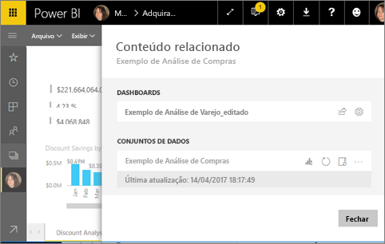

# Exibir conteúdo relacionado no serviço do Power BI
O painel **Conteúdo relacionado** mostra como o conteúdo do serviço do Power BI (dashboards, relatórios e conjuntos de dados) está interconectado. O painel de Conteúdo Relacionado também é uma plataforma de lançamento para executar ações. Daqui, você pode atualizar, renomear, gerar insights e muito mais. Selecione um dashboard ou relatório relacionado e abra-o no workspace do Power BI.   

No Power BI, os relatórios são gerados a partir de conjuntos de dados, visualizações de relatórios são fixadas em painéis e os elementos visuais dos painéis nos redirecionam aos relatórios. Mas como saber quais painéis hospedam elementos visuais do seu relatório de Marketing? E como localizar esses dashboards? O seu painel Compras utiliza elementos visuais de mais de um conjunto de dados? Nesse caso, que nomes receberam e como é possível abri-los e editá-los? Seu conjunto de dados de RH está sendo usado em algum relatório ou painel? Ou, pode ser movido sem desfazer links? Perguntas como essas podem ser todas respondidas no painel **Conteúdo relacionado**.  O painel exibe o conteúdo relacionado, permite que você tenha controle sobre o conteúdo e navegue facilmente pelo conteúdo relacionado.

> [!NOTE]
> O recurso de conteúdo relacionado não funciona em conjuntos de dados de streaming.
> 
> 

## Exibir o conteúdo relacionado de um dashboard
Assista Exibirá o conteúdo relacionado de um dashboard. Em seguida, siga as instruções passo a passo abaixo do vídeo para experimentar sozinho com o conjunto de dados exemplo de Análise de compras.

<iframe width="560" height="315" src="https://www.youtube.com/embed/B2vd4MQrz4M#t=3m05s" frameborder="0" allowfullscreen></iframe>

É preciso ter no mínimo permissões de *exibição* em um dashboard para abrir o painel **Conteúdo relacionado**. Neste exemplo, estamos usando o [Exemplo de Análise de Compras](../sample-procurement.md).

**Método 1**

Em um espaço de trabalho, selecione a guia **Painéis** e, em seguida, selecione o ícone **Exibição relacionada** .

 

**Método 2**

Com um dashboard aberto, selecione    na barra de menus superior.

O painel **Conteúdo relacionado** é aberto. O painel mostra todos os relatórios com visualizações fixadas no dashboard e seus conjuntos de dados associados. Nesse painel, há visualizações de três relatórios diferentes fixadas, e os relatórios se baseiam em três conjuntos de dados diferentes.

Neste ponto, você pode controlar diretamente o conteúdo relacionado.  Por exemplo, selecione um nome de relatório para abri-lo.  Para relatórios listados, selecione um ícone para [analisar no Excel](../service-analyze-in-excel.md), [renomear](../service-rename.md) ou [obter insights](end-user-insights.md). Para um conjunto de dados, selecione um ícone para [criar um novo relatório](../service-report-create-new.md), [atualizar](../refresh-data.md), renomear, [analisar no Excel](../service-analyze-in-excel.md), [obter insights](end-user-insights.md) ou abrir a janela **Configurações** do conjunto de dados.  

## Exibir o conteúdo relacionado de um relatório
É preciso ter no mínimo permissões de *exibição* em um relatório para abrir o painel **Conteúdo relacionado**. Neste exemplo, estamos usando o [Exemplo de Análise de Compras](../sample-procurement.md).

**Método 1**

Em um workspace, selecione a guia **Relatórios** e, em seguida, selecione o ícone **Exibir relacionados**.

 

**Método 2**

Abra o relatório no [Modo de exibição de leitura](end-user-reading-view.md) e selecione o  na barra de menus superior.

O painel **Conteúdo relacionado** é aberto. O painel mostra o conjunto de dados associado e todos os dashboards com pelo menos um bloco fixado extraído do relatório. Neste relatório, há visualizações fixadas em dois dashboards diferentes.

Neste ponto, você pode controlar diretamente o conteúdo relacionado.  Por exemplo, selecione um nome de dashboard para abri-lo.  Em qualquer painel da lista, selecione um ícone para [compartilhar o painel com outras pessoas](../service-share-dashboards.md) ou abrir a janela **Configurações** do painel. Para o conjunto de dados, selecione um ícone para [criar um novo relatório](../service-report-create-new.md), [atualizar](../refresh-data.md), renomear, [analisar no Excel](../service-analyze-in-excel.md), [obter insights](end-user-insights.md) ou abrir a janela **Configurações** do conjunto de dados.  

## Exibir o conteúdo relacionado de um conjunto de dados
É preciso ter no mínimo permissões de *exibição* em um conjunto de dados para abrir o painel **Conteúdo relacionado**. Neste exemplo, estamos usando o [Exemplo de Análise de Compras](../sample-procurement.md).

Em um espaço de trabalho, selecione a guia **Conjuntos de dados** e, em seguida, localize o ícone **Exibição relacionada** .

Selecione o ícone para abrir o painel **Conteúdo relacionado**.

Neste ponto, você pode controlar diretamente o conteúdo relacionado. Por exemplo, selecione um nome de dashboard ou de relatório para abri-lo.  Em qualquer painel da lista, selecione um ícone para [compartilhar o painel com outras pessoas](../service-share-dashboards.md) ou abrir a janela **Configurações** do painel. Para relatórios, selecione um ícone para [analisar no Excel](../service-analyze-in-excel.md), [renomear](../service-rename.md) ou [obter insights](end-user-insights.md).  

## Limitações e solução de problemas
* Se você não vir "Exibição relacionada", procure pelo ícone . Selecione o ícone para abrir o painel **Conteúdo relacionado**.
* Para abrir o Conteúdo relacionado de um relatório, é preciso estar na [exibição de Leitura](end-user-reading-view.md).
* O recurso Conteúdo relacionado não funciona em conjuntos de dados de streaming.

## Próximas etapas
* [Introdução ao serviço do Power BI](../service-get-started.md)
* Mais perguntas? [Experimente a Comunidade do Power BI](http://community.powerbi.com/)

