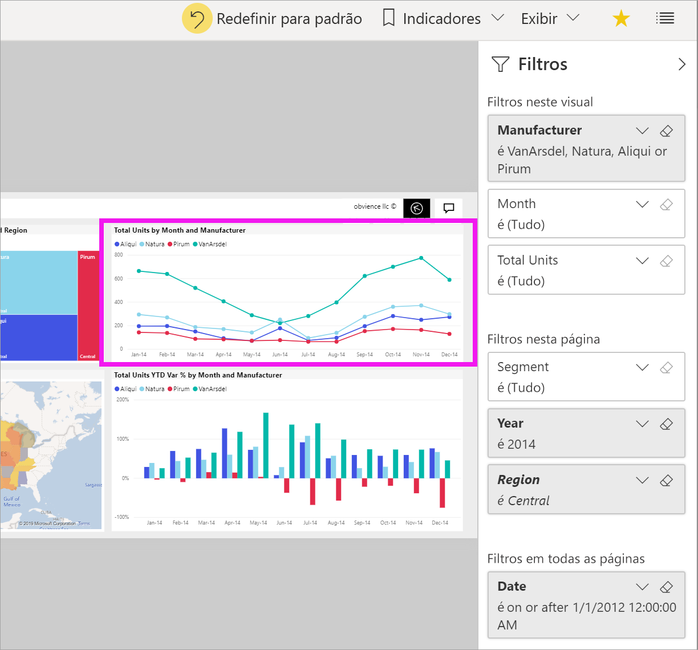
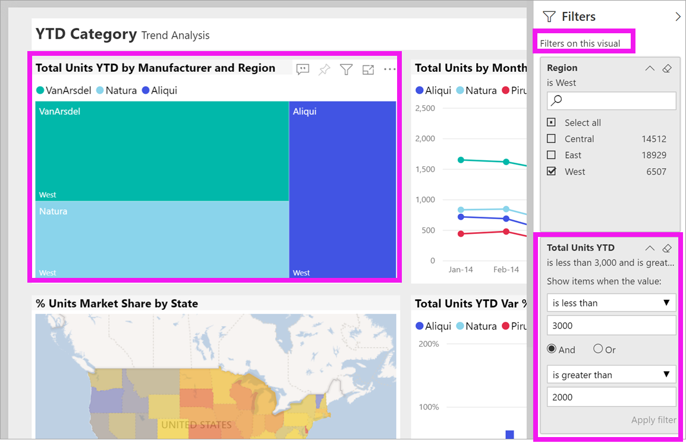

# Faça um tour pelo painel Filtros do relatório

[!INCLUDE[consumer-appliesto-yyny](../includes/consumer-appliesto-yyny.md)]

[!INCLUDE [power-bi-service-new-look-include](../includes/power-bi-service-new-look-include.md)]

Este artigo oferece uma visão geral do painel **Filtros** do relatório no serviço do Power BI. Use os filtros para descobrir novos insights em seus dados.

Há muitas maneiras diferentes para filtrar os dados no Power BI. Para obter mais informações sobre filtros, consulte [Filtros e realce em relatórios do Power BI](../power-bi-reports-filters-and-highlighting.md).

## Trabalhar com o painel de Filtros do relatório

Quando um colega compartilhar um relatório com você, não se esqueça de examinar o painel **Filtros**. Às vezes, ele está recolhido na borda direita do relatório. Selecione-o para expandi-lo.

O painel **Filtros** contém os filtros que o *designer* de relatórios adicionou ao relatório. *Consumidores* como você podem interagir com os filtros existentes e salvar as alterações, mas não podem adicionar novos filtros ao relatório. Por exemplo, na captura de tela acima, o designer adicionou três filtros no nível de página: **Segmento é Tudo**, **Ano é 2014** e **Região é Central**. Você pode interagir e alterar esses filtros, mas não pode adicionar um quarto filtro no nível de página.

No serviço do Power BI, os relatórios de mantêm as alterações feitas no painel **Filtros**. O serviço realiza essas alterações por meio da versão móvel do relatório. 

Para redefinir o painel **Filtros** para os padrões do designer, selecione **Redefinir para padrão** na barra de menus superior.

 

> [!NOTE]
> Se você não vir a opção **Redefinir para o padrão**, ela poderá ter sido desabilitada pelo *designer* de relatório. O *designer* também pode bloquear filtros específicos para que você não possa alterá-los.

## Exibir todos os filtros para uma página de relatório

O painel **Filtros** exibe todos os filtros adicionados pelo designer ao relatório. O painel **Filtros** também é a área em que você pode exibir informações sobre os filtros e interagir com eles. Salve as alterações que você faz ou use **Redefinir para padrão** a fim de reverter para as configurações originais do filtro.

Se houver alterações que você gostaria de salvar, também será possível criar um indicador pessoal. Para obter mais informações, consulte [O que são indicadores?](end-user-bookmarks.md).

O painel **Filtros** exibe e gerencia vários tipos de filtro de relatório: relatório, página de relatório e visual.

Neste exemplo, selecionamos um visual que tem três filtros. A página de relatório também tem filtros, listados sob o título **Filtros nesta página**. Além disso, todo o relatório tem um filtro para **Data**.

Alguns filtros têm a opção **(Tudo)** ao lado deles. **(Tudo)** significa que todos os valores serão incluídos no filtro. Na captura de tela acima, **Segment(All)** informa que essa página do relatório inclui dados sobre todos os segmentos de produtos. 

Qualquer pessoa que exibir este relatório pode interagir com esses filtros.

### Exibir apenas estes filtros aplicados a um visual

Para obter uma análise aprofundada dos filtros aplicados a um visual específico, passe o mouse sobre o visual para revelar o ícone de filtro . Selecione esse filtro para ver um pop-up com todos os filtros, segmentações etc., que afetam esse visual. Os filtros no pop-up incluem os mesmos filtros exibidos no painel **Filtros**, além de filtragem adicional que afeta o visual selecionado.

Estes são os tipos de filtros que essa exibição pode mostrar:

- Filtros básicos
- Segmentações
- Realce cruzado
- Filtragem cruzada
- Filtros avançados
- Primeiros N filtros
- Filtros de Data Relativa
- Sincronizar segmentadores
- Incluir/Excluir filtros
- Filtros passados por uma URL

Neste exemplo:
1. **Incluído** informa que o visual foi filtrado de forma cruzada. Isso significa que os Estados de Utah, Colorado e Texas foram selecionados em um dos outros visuais nesta página de relatório. Nesse caso, é o mapa. A seleção desses três Estados eliminou a exibição dos dados de todos os outros Estados no gráfico de barras selecionado.  

1. **Data** é um filtro aplicado a todas as páginas neste relatório e

1. **Região é Central** e **Ano é 2014** são filtros aplicados a esta página de relatório e

4. **Fabricante é VanArsdel, Natura, Aliqui ou Pirum** é um filtro aplicado a esse visual.

### Pesquisar em um filtro

Às vezes, um filtro pode ter uma longa lista de valores. Use a caixa de pesquisa para localizar e selecionar o valor desejado.

### Exibir detalhes do filtro

Para entender um filtro, dê uma olhada nos valores e nas contagens disponíveis.  Veja os detalhes do filtro focalizando e selecionando a seta ao lado do nome do filtro.
  

### Alterar as seleções do filtro

É uma forma de pesquisar insights de dados é interagir com os filtros. Você pode alterar as seleções do filtro usando a seta suspensa ao lado do nome do campo.  Dependendo do filtro e tipo de dados que o Power BI está filtrando, suas opções variam de simples seleções em uma lista para identificar intervalos de datas ou números. No filtro avançado abaixo, alteramos o filtro **Total de unidades acumulado no ano** no mapa de árvore para ficar entre 2.000 e 3.000. Observe que essa alteração remove Pirum do mapa de árvore.
  

> [!TIP]
> Para selecionar mais de um valor de filtro por vez, mantenha pressionada a tecla CTRL. A maioria dos filtros dá suporte à seleção múltipla.

### Redefinir filtro para o padrão

Se você quiser reverter todas as alterações feitas aos filtros, selecione **Redefinir para padrão** na barra de menus superior.  Essa seleção reverte os filtros para o estado original, conforme definido pelo designer de relatórios.

### Limpar um filtro

Para redefinir um filtro para (Tudo), desmarque-o selecionando o ícone de borracha ao lado do nome do filtro.

  
<!--  too much detail for consumers

## Types of filters: text field filters
### List mode
Ticking a checkbox either selects or deselects the value. The **All** checkbox can be used to toggle the state of all checkboxes on or off. The checkboxes represent all the available values for that field.  As you adjust the filter, the restatement updates to reflect your choices. 

Note how the restatement now says "is Mar, Apr or May".

### Advanced mode
Select **Advanced Filtering** to switch to advanced mode. Use the dropdown controls and text boxes to identify which fields to include. By choosing between **And** and **Or**, you can build complex filter expressions. Select the **Apply Filter** button when you've set the values you want.  

## Types of filters: numeric field filters
### List mode
If the values are finite, selecting the field name displays a list.  See **Text field filters** &gt; **List mode** above for help using checkboxes.   

### Advanced mode
If the values are infinite or represent a range, selecting the field name opens the advanced filter mode. Use the dropdown and text boxes to specify a range of values that you want to see. 

By choosing between **And** and **Or**, you can build complex filter expressions. Select the **Apply Filter** button when you've set the values you want.

## Types of filters: date and time
### List mode
If the values are finite, selecting the field name displays a list.  See **Text field filters** &gt; **List mode** above for help using checkboxes.   

### Advanced mode
If the field values represent date or time, you can specify a start/end time when using Date/Time filters.  

-->

## Próximas etapas

Saiba como e por que os [visuais executam filtro cruzado e realce cruzado entre si em uma página de relatório](end-user-interactions.md)