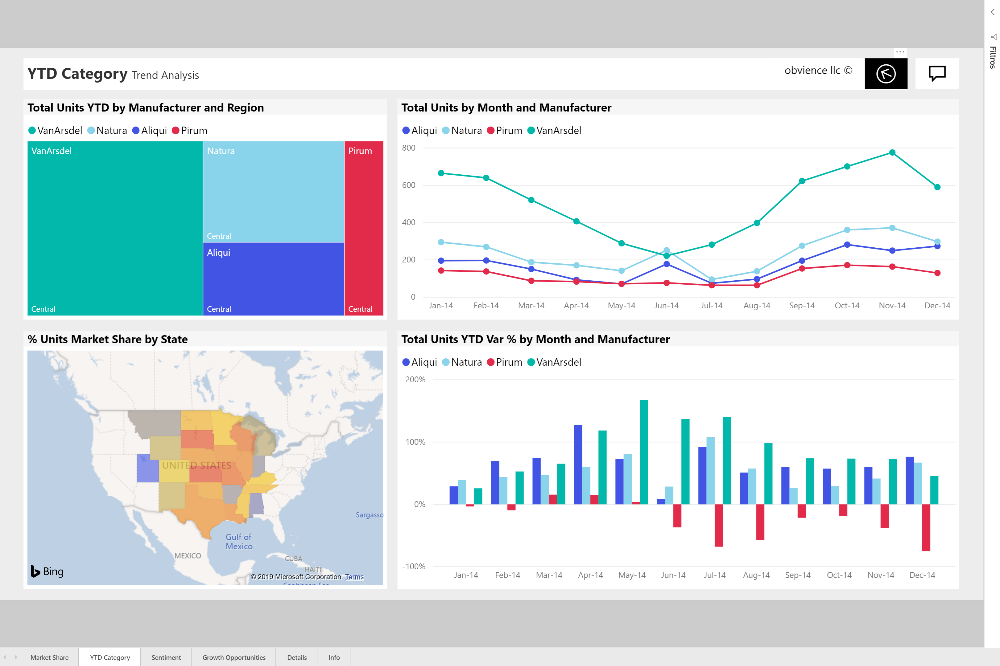

# Alterar a exibição de uma página de relatório
Relatórios são exibidos em vários dispositivos diferentes com diferentes tamanhos de tela e proporções.  Alterar a maneira como uma página de relatório é exibida para atender às suas necessidades.    

## Explorar menu Exibir
As opções no menu Exibir oferecem flexibilidade para exibir páginas de relatório no tamanho e largura que você escolher.

- Digamos que você está exibindo um relatório em um dispositivo pequeno e é difícil ver títulos e legendas.  Selecione **modo de exibição** > **tamanho real** para aumentar o tamanho da página do relatório. Use as barras de rolagem para mover-se o relatório. 

    

- Outra opção é ajustar o relatório para a largura da tela, selecionando **ajustar à largura**. Isso ainda pode exigir o uso de uma barra de rolagem vertical.

  

- Se você não deseja que qualquer barras de rolagem, mas deseja fazer o melhor uso de seu tamanho da tela.  Selecione **ajustar à página**.

   

   
- A última opção, **tela inteira**, exibe a página de relatório sem barras de menu e cabeçalhos. Tela inteira pode ser uma boa opção para pequenas telas em que os detalhes são difíceis de ver.  Tela inteira também pode ser uma boa opção ao projetar páginas do relatório em telas grandes de pessoas para exibir, mas não interagir.  

    

Quando você sair do relatório, suas configurações de exibição não serão salvas, mas reverte para o padrão. Se for importante para você para salvar essas configurações, use [indicadores](end-user-bookmarks.md). 

## Próximas etapas
[Criar relatórios para Cortana](../service-cortana-answer-cards.md)
