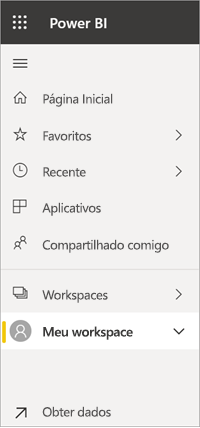
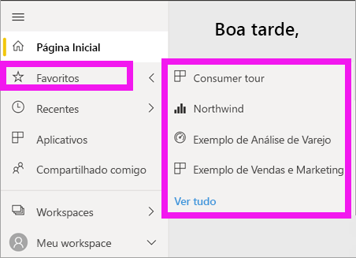

# Navegação: pesquisando, buscando e classificando seu conteúdo no serviço do Power BI
Há muitas maneiras de navegar pelo seu conteúdo no serviço do Power BI. O conteúdo é organizado dentro do seu workspace por tipo: dashboards e relatórios.  E o conteúdo também é organizado por uso: favoritos, recentes, aplicativos, compartilhado comigo e em destaque. Para uma parada de navegação, a *Página Inicial* do Power BI organiza o conteúdo todo em uma única página. Esses caminhos diferentes em seu conteúdo permitem que você localize rapidamente aquilo de que precisa no serviço do Power BI.  

## Navegação em workspaces

*Consumidores* do Power BI normalmente têm apenas um workspace: **Meu Workspace**. O **Meu workspace** somente terá conteúdo se você tiver baixado os exemplos da Microsoft ou criado ou baixado seus próprios dashboards, relatórios ou aplicativos.  

No **Meu workspace**, o serviço do Power BI separa seu conteúdo por tipo: dashboards, relatórios, pastas de trabalho e conjuntos de dados. Você verá essa organização quando selecionar um workspace. Neste exemplo, **Meu workspace** contém um dashboard, um relatório, nenhuma pasta de trabalho e um conjunto de dados.

________________________________________
## Navegação usando o campo Pesquisar
Use a exibição de conteúdo **Meu workspace** para pesquisar, filtrar e classificar seu conteúdo. No campo Pesquisar, digite todo ou parte do nome de um dashboard, relatório, pasta de trabalho ou proprietário.  

Se você tiver apenas alguns conteúdos, não será necessário pesquisar e classificar.  Porém, quando você tem longas listas de dashboards e relatórios, verá que pesquisa e classificação são extremamente úteis. Por exemplo, a lista de relatórios abaixo tem 83 itens. 

Você também pode classificar o conteúdo por nome ou por proprietário. Observe a seta para cima à direita de **Nome**. No momento, estamos classificando 83 itens em ordem alfabética por nome, em ordem crescente. Para alterar a ordem de classificação para decrescente, selecione **Nome**. A seta para cima muda para uma seta para baixo.

Nem todas as colunas podem ser classificadas. Passe o mouse sobre os cabeçalhos de coluna para descobrir quais podem ser classificados.

___________________________________________________________________
## Navegação usando a barra de navegação esquerda
A barra de navegação esquerda classifica seu conteúdo de maneiras que o ajudam a encontrar o que precisa rapidamente.  

- O conteúdo que é compartilhado com você está disponível em **Compartilhado comigo**.
- Seu conteúdo exibido mais recentemente está disponível em **Recentes**. 
- Seus aplicativos podem ser encontrados selecionando **Aplicativos**.
- **Home** é uma exibição de página única do seu conteúdo mais importante e o conteúdo e fontes de aprendizado sugeridas.

Além disso, você pode marcar o conteúdo como [favorito](end-user-favorite.md) e [em destaque](end-user-featured.md). Escolha um dashboard ou relatório que você acredita que exibirá com mais frequência e defina-o como o conteúdo *em destaque*. Cada vez que você abrir o serviço do Power BI, seu dashboard em destaque será exibido primeiro. Você tem uma série de dashboards e aplicativos que visita com frequência? Ao defini-los como favoritos, eles ficarão sempre disponíveis na sua barra de navegação à esquerda.

.

## Considerações e solução de problemas
* Para conjuntos de dados, a opção **Classificar por** não está disponível pelo proprietário.

## Próximas etapas
[Classificar visuais em relatórios](end-user-change-sort.md)

Mais perguntas? [Experimente a Comunidade do Power BI](http://community.powerbi.com/)
