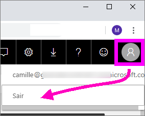

# Entrar no serviço do Power BI

## Contas do Power BI
Antes de poder entrar no Power BI, você precisará de uma conta. Há duas maneiras de obter a conta do Power BI. A primeira é quando sua empresa compra de licenças do Power BI para seus funcionários. E a segunda é quando indivíduos se inscrevem gratuitamente para licenças pessoais ou avaliações gratuitas. Este artigo aborda o primeiro cenário.

## Entrar pela primeira vez

### Etapa um: abrir um navegador
O serviço do Power BI é executado em um navegador.  Portanto, a primeira etapa é abrir seu navegador favorito e digitar **app.powerbi.com**.

### Etapa dois: digitar o endereço de email
Na primeira vez em que entrar, será solicitado que você insira seu endereço de email.  Este é o endereço de email corporativo ou de estudante que foi usado para se inscrever no Power BI.  

Procure na caixa de entrada por um email do administrador do Power BI. A maioria dos administradores enviará um email de boas-vindas contendo sua senha temporária. Use essa conta de email para entrar. 

 
### Etapa três: criar uma nova senha
Se o administrador do Power BI enviou a você uma senha temporária, insira-a no campo **Senha atual**. Se você ainda não recebeu essa senha em email, entre em contato com o administrador do Power BI.

O Power BI lembrará de suas credenciais e você não precisará inserir seu nome de usuário (endereço de email) na próxima vez que entrar. 

### Etapa quatro: examinar sua Página Inicial
Em sua primeira visita, o Power BI abre sua Página **Inicial**. Se a página **Inicial** não se abrir, selecione-a no painel de navegação à esquerda. 

Na Página Inicial, você verá todo o conteúdo que tiver permissão para usar. A princípio, poderá não haver muito conteúdo em sua página inicial, mas não se preocupe, isso mudará quando você começar a usar o Power BI com seus colegas. 

Se não quiser que o Power BI abra a Página Inicial, você poderá [definir um relatório ou um dashboard **Em destaque**](end-user-featured.md) para ser aberto em vez dela. 

## Interagir com o conteúdo de modo seguro
Como um ***consumidor***, outras pessoas compartilharão conteúdo com você e você poderá interagir com esse conteúdo para explorar os dados e tomar decisões de negócios.  Ao filtrar, segmentar, assinar, exportar e redimensionar conteúdo, não se preocupe – seu trabalho não está afetando o conjunto de dados subjacente nem o conteúdo compartilhado original (dashboards e relatórios). O Power BI é um espaço seguro para exploração e experimentação. Isso não significa que você não é possível salvar suas alterações – você pode fazê-lo. Mas essas alterações afetam apenas a **sua** exibição do conteúdo. E reverter para o modo de exibição padrão original é tão fácil quanto clicar em um botão.

## Sair do serviço do Power BI
Quando você fecha ou sai do Power BI, suas alterações são salvas para que você possa recomeçar bem do ponto em que parou.

Para fechar o Power BI, basta fechar a guia do navegador em que você está trabalhando. 

 

Se você compartilha um computador, é recomendável sair sempre que fechar o Power BI.  Para sair, no canto superior direito, selecione sua imagem de perfil e escolha **Sair**. Caso contrário, quando você terminar, basta fechar a guia do navegador.

 

## Considerações e solução de problemas
- Se você se inscrever no Power BI como um indivíduo, entre com o endereço de email que usou para se inscrever.

- Se você usar o Power BI com mais de uma conta, será solicitado que selecione uma conta em uma lista e insira uma senha ao entrar. 

## Próximas etapas
[Exibir um aplicativo do Power BI](end-user-app-view.md)
