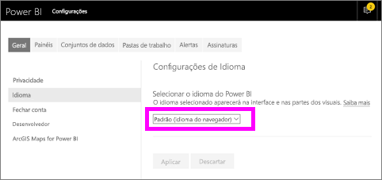
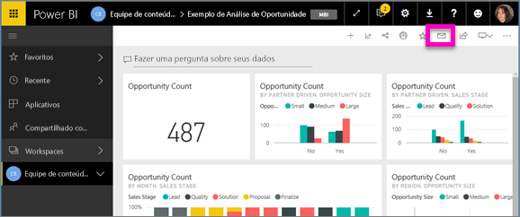
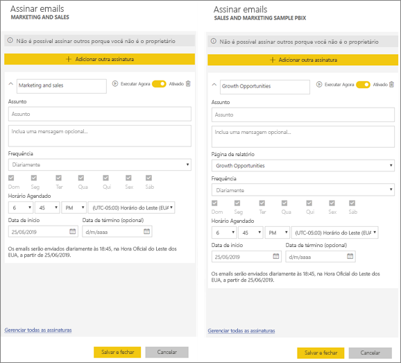
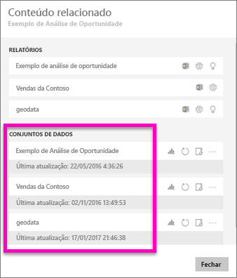
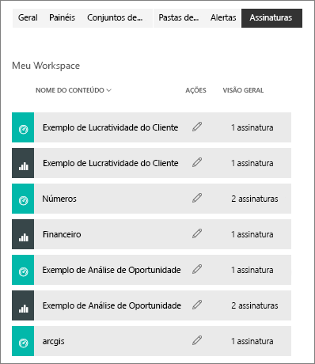

# Assinar um relatório ou painel no serviço do Power BI 
Nunca foi tão fácil manter-se atualizado sobre seus dashboards e relatórios mais importantes. Assine as páginas de relatório e os dashboards mais importantes para você, e o Power BI enviará um email com um instantâneo para sua caixa de entrada. Informe ao Power BI a frequência com que deseja receber os emails: diária, semanal ou quando os dados forem atualizados. Você pode até mesmo definir um horário específico para o Power BI enviar os emails ou executá-lo agora.  

O instantâneo e o email usarão o idioma definido nas configurações do Power BI (confira [Idiomas e países/regiões com suporte para o Power BI](../supported-languages-countries-regions.md)). Se nenhum idioma for definido, o Power BI usará o idioma de acordo com a configuração de localidade no navegador atual. Para obter ou definir sua preferência de idioma, selecione o ícone de engrenagem  > **Configurações > Geral > Idioma**. 

Quando você receber o email, ele incluirá um link para "acessar o relatório ou o dashboard". Em dispositivos móveis com aplicativos do Power BI instalados, a seleção desse link iniciará o aplicativo (ao contrário da ação padrão de abrir o relatório ou o dashboard no site do Power BI).

## Requisitos
**Criar** uma assinatura por conta própria exige uma licença do Power BI Pro. Os usuários que exibem conteúdo em um espaço de trabalho ou aplicativo Premium também podem assinar conteúdo localizado lá, mesmo sem uma licença do Power BI Pro. **Assinar outras** só está disponível para o proprietário do painel. 

## Assine um dashboard ou uma página de relatório
Se você estiver assinando um dashboard ou um relatório, o processo será semelhante. O mesmo botão permite que você assine os dashboards e relatórios do serviço do Power BI.
 
.

1. Abra o dashboard ou o relatório.
2. Na barra de menus superior, selecione **Assinar** ou selecione o ícone de envelope .
   
   

   
    
    A tela à esquerda é exibida quando você está em um dashboard e seleciona **Assinar**. A tela à direita é exibida quando você está em uma página de relatório e seleciona **Assinar**. Para assinar mais de uma página em um relatório, selecione **Adicionar outra assinatura** e selecione uma página diferente. 

4. Use o controle deslizante amarelo para ativar e desativar a assinatura.  Definir o controle deslizante como Desativado não exclui a assinatura. Para excluir a assinatura, selecione o ícone de cesto de lixo.

5. Outra opção é adicionar os detalhes da mensagem de email ou o assunto. 

5. Selecione uma **Frequência** para sua assinatura.  Você pode escolher Diária, Semanal ou Após a atualização de dados (Diária).  Para receber o email de assinatura somente em determinados dias, selecione **Semanal** e escolha em quais dias você gostaria de recebê-lo.  Por exemplo, se você quiser receber o email de assinatura somente em dias úteis, selecione **Semanal** como a sua frequência e desmarque as caixas Sáb e Dom.   

6. Agende a hora em que o email é enviado, selecionando Diária ou Semanal para a sua frequência e inserindo uma **Hora** **Agendada** para a assinatura.  Esta hora refere-se ao momento em que o trabalho de assinatura é iniciado. Podem ser necessários alguns minutos antes que o email seja entregue em sua caixa de entrada em alguns cenários.    

7. Agende as datas de início e de término, inserindo-as nos respectivos campos. Por padrão, a hora de início para sua assinatura será a data em que você a criar, enquanto a data de término será um ano depois. Quando uma assinatura atinge uma data de término, ela é interrompida até que você a habilite novamente.  Você receberá notificações antes da data de término agendada, perguntando se você deseja estendê-la.     

8. Para examinar a sua assinatura e testá-la, selecione **Executar agora**.  Isso envia o email a você imediatamente. 

8. Se tudo estiver correto, selecione **Salvar e fechar** para salvar a assinatura. Você receberá um email e um instantâneo do painel ou do relatório no agendamento que definir. Todas as assinaturas com a frequência definida para **Após a atualização de dados** somente enviarão um email após a primeira atualização agendada naquele dia.
   
   
   
    Atualizar a página de relatório não atualiza o conjunto de dados. Somente o proprietário do conjunto de dados pode atualizá-lo manualmente. Para pesquisar o nome do proprietário dos conjuntos de dados subjacentes, selecione **Exibir relacionados** na barra de menus superior ou pesquise o email da assinatura original.
   
    

## Gerenciar suas assinaturas
Você só pode gerenciar as assinaturas criadas por você. Selecione **Assinar** novamente e escolha **Gerenciar todas as assinaturas** no canto inferior esquerdo (veja as capturas de tela acima). 

Uma assinatura será encerrada se a licença Pro expirar, se o dashboard ou o relatório for excluído pelo proprietário ou se a conta de usuário usada para criar a assinatura for excluída.

## Considerações e solução de problemas
* Os dashboards com mais de 25 blocos fixos ou quatro páginas de relatório dinâmico fixas podem não ser renderizados totalmente nos emails de assinatura enviados aos usuários. Sugerimos que você contate o designer do dashboard e solicite que ele reduza os blocos fixados para menos de 25 e os relatórios dinâmicos fixados para menos de quatro para garantir que o email seja renderizado corretamente.  
* Para assinaturas de email do dashboard, se algum bloco tiver a RLS (Segurança em Nível de Linha) aplicada, esse bloco não será exibido.  Para assinaturas de email do relatório, se o conjunto de dados usar a RLS, não será possível criar uma assinatura.
* Se os links em seu email (para o conteúdo) pararem de funcionar, talvez o conteúdo tenha sido excluído. No email, embaixo da captura de tela, você pode procurar se você se assinou ou se alguém assinou você. Se foi outra pessoa, peça para esse colega de trabalho cancelar os emails ou assinar você novamente.
* As assinaturas da página de relatório são vinculadas ao nome da página de relatório. Se você assinar uma página de relatório e ela for renomeada, você precisará recriar sua assinatura.
* Se você não conseguir usar o recurso de assinatura, entre em contato com o administrador do sistema. Sua organização pode ter desabilitado esse recurso para autenticação ou por outros motivos.  
* Assinaturas de email não dão suporte à maioria dos [visuais personalizados](../power-bi-custom-visuals.md).  A exceção é para os visuais personalizados que foram [certificados](../power-bi-custom-visuals-certified.md).  
* No momento, as assinaturas de email não dão suporte a visuais personalizados da plataforma R.  
* Especificamente para assinaturas de dashboards, alguns tipos de blocos ainda não são compatíveis.  Eles incluem: blocos de streaming, blocos de vídeo, blocos de conteúdo da Web personalizado.     
* As assinaturas poderão falhar em dashboards ou relatórios com imagens extremamente grandes devido aos limites de tamanho de email.    
* O Power BI pausa a atualização automaticamente em conjuntos de dados associados a dashboards e relatórios que não foram visitados há mais de dois meses.  No entanto, se você adicionar uma assinatura a um dashboard ou um relatório, ele não ficará em pausa mesmo que não seja visitado.
* Em raras ocasiões, as assinaturas de email podem levar mais de quinze minutos para serem entregues aos destinatários.  Caso isso aconteça, recomendamos a execução da atualização de dados e da assinatura de email em momentos diferentes para garantir a entrega em tempo hábil.  Se o problema persistir, contate o suporte do Power BI.

## Próximas etapas

[Pesquisar e classificar conteúdo](end-user-search-sort.md)
