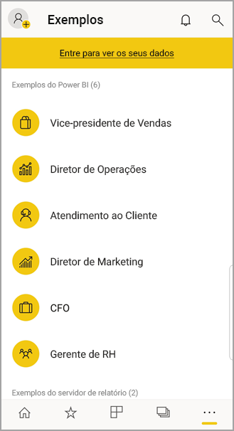
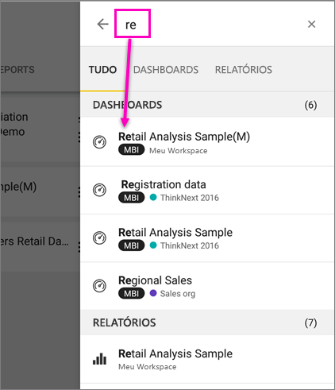
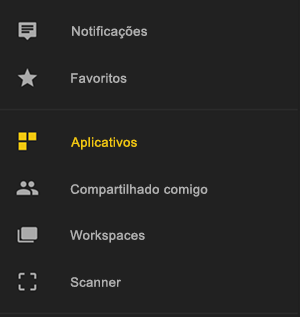
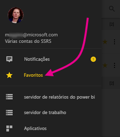
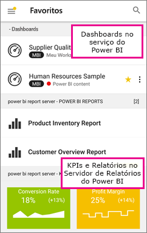

# Introdução ao aplicativo móvel do Power BI em dispositivos Android
O aplicativo Android para Microsoft Power BI oferece a experiência móvel do BI para Power BI, Servidor de Relatório do Power BI e Reporting Services. Exiba e interaja com os dashboards de sua empresa localmente e na nuvem em qualquer lugar, com acesso móvel dinâmico e habilitado para toque. Explore os dados em dashboards e compartilhe com seus colegas em mensagens de email ou de texto. 

Crie relatórios do Power BI no Power BI Desktop e publique-os:

* [Publique-os no serviço do Power BI](../../fundamentals/power-bi-overview.md) e crie dashboards.
* [Publique-os localmente no Servidor de Relatórios do Power BI](../../report-server/quickstart-create-powerbi-report.md).

Em seguida, no aplicativo do Power BI para Android, você interage com os dashboards e relatórios, localmente ou na nuvem.

Descubra as [novidades nos aplicativos móveis do Power BI](../../mobile-whats-new-in-the-mobile-apps.md).

## Pré-requisitos

### Obtenha o aplicativo

[Baixe o aplicativo do Power BI para Android](https://go.microsoft.com/fwlink/?LinkID=544867) no Google Play.
  
O Power BI pode ser executado em diferentes dispositivos Android que executam o sistema operacional Android 5.0 ou posterior. Para verificar seu dispositivo, acesse **Configurações** > **Sobre o dispositivo** > **Versão do Android**. 

**Iniciar ao abrir o aplicativo**    
Mesmo sem se inscrever ou se conectar, depois de abrir o aplicativo é possível percorrer as páginas de entrada para obter uma visão geral rápida daquilo que você pode fazer com o aplicativo do Power BI em seu dispositivo Android. Toque em **Ignorar** para exibir e explorar os exemplos e obter experiência prática com o aplicativo. É possível [voltar para os exemplos](mobile-android-app-get-started.md#try-the-power-bi-and-reporting-services-samples) sempre que desejar por meio da página inicial de dashboards.

Descubra as [novidades nos aplicativos móveis do Power BI](../../mobile-whats-new-in-the-mobile-apps.md).

## Inscrever-se no serviço do Power BI na Web
Se você ainda não se inscreveu, acesse o [serviço do Power BI (https://powerbi.com/)](https://powerbi.com/)) para se inscrever em sua conta e criar e armazenar dashboards e relatórios, além de reunir dados. Em seguida, entre no Power BI de seu dispositivo Android para ver seus próprios dashboards, de qualquer lugar.

1. No serviço do Power BI, toque em [Inscrever-se](https://go.microsoft.com/fwlink/?LinkID=513879) para criar uma conta do Power BI.
2. Comece a [criar seus próprios dashboards e relatórios](../../service-get-started.md).

## Introdução ao aplicativo do Power BI em seu dispositivo
1. No dispositivo Android, na tela inicial, abra o aplicativo do Power BI para Android.
   
   
2. Para exibir seus painéis e relatórios do Power BI, toque em **Power BI**.  
   
   Se você receber uma mensagem dizendo que o Power BI não consegue conectá-lo, consulte ["Could not authenticate because your corporate SSL certificate is untrusted"](mobile-android-app-error-corporate-ssl-account-is-untrusted.md) (Não foi possível autenticar porque o seu certificado SSL corporativo não é confiável) para obter detalhes sobre como resolver o problema.

   Para exibir os relatórios e KPIs do Servidor de Relatório do Power BI e do Reporting Services, toque em **Servidor de Relatório**.
   
   

## Experimente os exemplos do Power BI e Reporting Services
Mesmo sem se inscrever, você pode experimentar os exemplos do Power BI e Reporting Services. Depois de baixar o aplicativo, você pode exibir os exemplos ou começar. Volte para os exemplos sempre que quiser, nos painéis na página inicial.

### Exemplos do Power BI
Você pode exibir e interagir com os exemplos de dashboard do Power BI, mas há algumas coisas que você não pode fazer com eles. Você não pode abrir relatórios atrás dos dashboards, compartilhar os exemplos com outras pessoas ou adicioná-los aos seus favoritos.

1. Toque no botão de navegação global  no canto superior esquerdo.
2. Toque em **Configurações** > **Descubra nossas amostras**, em seguida, escolha uma função e explore o dashboard de exemplo para essa função.  
   
   

### Exemplos de relatórios móveis do Reporting Services
1. Toque no botão de navegação global  no canto superior esquerdo.
2. Toque em **Exemplos do Reporting Services**, em seguida, abra os relatórios de varejo ou a pasta de relatórios de vendas para explorar seus KPIs e relatórios móveis.
   
   

## Pesquisar um dashboard ou relatório
* Toque na lupa no canto superior direito e, em seguida, digite o termo a ser localizado.
  
    
  
    Por padrão, ele pesquisa todos os dashboards e relatórios, mas você pode pesquisar apenas um ou outro.

## Encontre seu conteúdo nos aplicativos móveis do Power BI
Seus dashboards e relatórios são armazenados em locais diferentes nos aplicativos móveis do Power BI, dependendo de onde eles vieram. Leia sobre [finding your content in the mobile apps](../../mobile-apps-quickstart-view-dashboard-report.md) (localizando seu conteúdo em aplicativos móveis). Além disso, a qualquer momento, você pode pesquisar por qualquer coisa que você tenha nos aplicativos móveis do Power BI. 

## Exibir seus dashboards, KPIs e relatórios favoritos
Na página Favoritos nos aplicativos móveis, você verá todos os seus dashboards favoritos do Power BI, juntamente com os KPIs e relatórios do Servidor de Relatório do Power BI e do Reporting Services. Quando você torna um painel *favorito* no aplicativo móvel do Power BI, você pode acessá-lo de todos os seus dispositivos, incluindo o serviço do Power BI no seu navegador. 

* Toque em **Favoritos**.
  
   
  
   Seus favoritos do Power BI e do portal da Web do Servidor de Relatório do Power BI e do Reporting Services estão todos nesta página.
  
   

Leia mais sobre [favoritos nos aplicativos móveis do Power BI](mobile-apps-favorites.md).

## Suporte corporativo para aplicativos móveis do Power BI
As organizações podem usar o Microsoft Intune para gerenciar dispositivos e aplicativos, incluindo os aplicativos móveis do Power BI para Android e iOS.

O Microsoft Intune permite que as organizações controlem itens, como exigir um PIN de acesso, controlar como os dados serão manipulados pelo aplicativo e até mesmo criptografar dados de aplicativo quando ele não estiver em uso.

> [!NOTE]
> Se você usar o aplicativo móvel do Power BI no dispositivo Android e sua organização tiver configurado o Microsoft Intune MAM, a atualização de dados em segundo plano estará desligada. Na próxima vez que você entrar no aplicativo, o Power BI atualiza os dados do serviço do Power BI na Web.
> 
> 

Leia mais sobre [configuring Power BI mobile apps for Android with Microsoft Intune (Configurar aplicativos móveis do Power BI para Android com o Microsoft Intune)](../../service-admin-mobile-intune.md). 

## Próximas etapas
Aqui estão algumas outras coisas que podem ser feitas no aplicativo do Power BI para dispositivos Android, com dashboards e relatórios no Power BI e KPIs e relatórios no Servidor de Relatórios do Power BI ou no portal da Web do Reporting Services.

### Painéis e relatórios do Power BI
* Exiba [seus aplicativos](../../service-create-distribute-apps.md).
* Veja seus [dashboards](../../mobile-apps-view-dashboard.md).
* Explore os [blocos nos dashboards](../../mobile-tiles-in-the-mobile-apps.md).
* Abra [relatórios do Power BI](../../mobile-reports-in-the-mobile-apps.md).
* Exiba [seus aplicativos](../../service-create-distribute-apps.md).
* [Anote e compartilhe blocos](mobile-annotate-and-share-a-tile-from-the-mobile-apps.md).
* Compartilhe [dashboards](../../mobile-share-dashboard-from-the-mobile-apps.md).
* [Digitalize um código QR do Power BI](../../mobile-apps-qr-code.md) com seu telefone Android para abrir um bloco ou um relatório do dashboard relacionado. 
* Exiba [notificações sobre atualizações à sua conta do Power BI](../../mobile-apps-notification-center.md), tais como painéis que os colegas compartilham com você.

### Relatórios e KPIs nos portais da Web do Servidor de Relatório do Power BI e do Reporting Services
* [Exibir KPIs e relatórios no portal da Web](mobile-app-ssrs-kpis-mobile-on-premises-reports.md) no aplicativo móvel do Power BI para dispositivos Android.
* Crie [KPIs no portal da Web](https://docs.microsoft.com/sql/reporting-services/working-with-kpis-in-reporting-services).
* Criar [relatórios no Power BI Desktop e publicá-los no portal da Web do Servidor de Relatório do Power BI](../../report-server/quickstart-create-powerbi-report.md)

### Consulte também
* [Baixe o aplicativo Android](https://go.microsoft.com/fwlink/?LinkID=544867) na loja de aplicativos Android.
* [O que é o Power BI?](../../fundamentals/power-bi-overview.md)
* Dúvidas? [Experimente perguntar à Comunidade do Power BI](https://community.powerbi.com/)

