# Exibir KPIs e relatórios locais do servidor de relatório nos aplicativos móveis do Power BI

Os aplicativos móveis do Power BI entregam acesso móvel dinâmico e habilitado para toque às suas informações comerciais locais no Servidor de Relatório do Power BI e no SSRS (SQL Server 2016 Reporting Services).

Aplica-se a:

|  |  |  |  |
|:--- |:--- |:--- |:--- |
| iPhones |iPads |Telefones Android |Tablets Android |

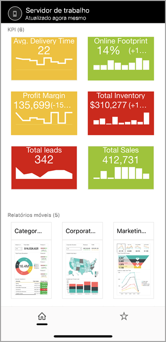

## As coisas mais importantes primeiro
**Os aplicativos móveis são onde você exibe o conteúdo do Power BI, não onde você o cria.**

* Você e outros criadores de relatório em sua organização [criam relatórios do Power BI com o Power BI Desktop e, em seguida, publicam-nos no portal da Web do Servidor de Relatório do Power BI](../../report-server/quickstart-create-powerbi-report.md). 
* Crie [KPIs diretamente no portal da Web](https://docs.microsoft.com/sql/reporting-services/working-with-kpis-in-reporting-services), organize-os em pastas e marque seus favoritos para que você possa localizá-los facilmente. 
* É possível [criar relatórios móveis do Reporting Services](https://docs.microsoft.com/sql/reporting-services/mobile-reports/create-mobile-reports-with-sql-server-mobile-report-publisher) com o Publicador de Relatórios Móveis do SQL Server 2016 Enterprise Edition e publique-os no [portal da Web do Reporting Services](https://docs.microsoft.com/sql/reporting-services/web-portal-ssrs-native-mode).  

Em seguida, nos aplicativos móveis do Power BI, conecte até cinco servidores de relatórios para exibir relatórios e KPIs do Power BI, organizados em pastas ou coletados como favoritos. 

## Explorar exemplos nos aplicativos móveis sem uma conexão com o servidor
Mesmo que você não tenha acesso a um portal da Web do Reporting Services, ainda é possível explorar os recursos de KPIs e relatórios móveis do Reporting Services. 

1. Toque na imagem do seu perfil no canto superior esquerdo e, em seguida, toque em **Configurações** no painel de contas que desliza para fora.

2. Na página de configurações que é aberta, toque em **amostras do Reporting Services** e, em seguida, navegue para interagir com KPIs e relatórios móveis da amostra.
   
   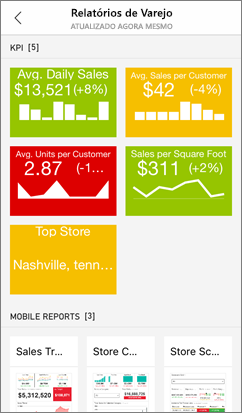

## Conectar-se a um servidor de relatório local
É possível exibir relatórios locais do Power BI, relatórios móveis do Reporting Services e KPIs nos aplicativos móveis do Power BI. 

1. Em seu dispositivo móvel, abra o aplicativo do Power BI.
2. Se você ainda não tiver entrado no Power BI, toque em **Servidor de Relatório**.
   
   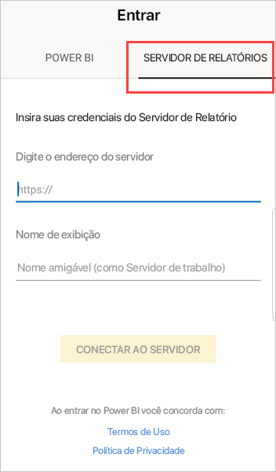
   
   Se já estiver conectado ao seu aplicativo do Power BI, toque na imagem do seu perfil no canto superior esquerdo e, em seguida, toque em **Configurações** no painel de contas que desliza para fora.
3. Na página de configurações que é aberta, toque em **Conectar ao servidor**.
   
    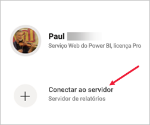

    O aplicativo móvel precisa acessar o servidor de alguma forma. Há algumas maneiras de fazer isso:
     * Permanecer na mesma rede usando VPN é a maneira mais fácil.
     * É possível usar um proxy de aplicativo Web para se conectar de fora da organização. Consulte [Usando OAuth para se conectar ao Reporting Services](mobile-oauth-ssrs.md) para mais detalhes.
     * Abra uma conexão (porta) no firewall.

4. Preencha o endereço do servidor e dê um nome amigável ao servidor, se desejar. Use este formato para o endereço do servidor:
   
     `https://<servername>/reports`
   
     OU
   
     `https://<servername>/reports`
   
   Inclua **http** ou **https** na frente a cadeia de conexão.
   
    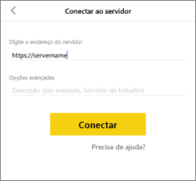
5. Depois de digitar o endereço do servidor e o nome amigável opcional, toque em **Conectar** e preencha seu nome de usuário e senha quando solicitado.
6. Agora, você vê o servidor no painel Conta – neste exemplo, chamado de "Servidor de trabalho".
   
   

## Conectar-se a um servidor de relatório local no iOS ou Android

Se você estiver exibindo o Power BI no aplicativo móvel do iOS ou Android, seu administrador de TI poderá ter definido uma política de configuração de aplicativos. Nesse caso, sua experiência de conexão com o servidor de relatório será mais simples e você não precisará fornecer muitas informações quando se conectar com um servidor de relatório. 

1. Uma mensagem informará que o aplicativo móvel está configurado com um servidor de relatório. Toque em **Entrar**.

    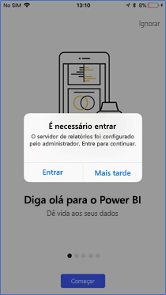

2.  Na página **Conectar-se ao servidor**, os detalhes do servidor de relatório já estão preenchidos. Toque em **Conectar**.

    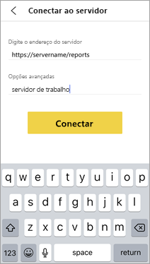

3. Digite uma senha para autenticar e, em seguida, toque em **Entrar**. 

    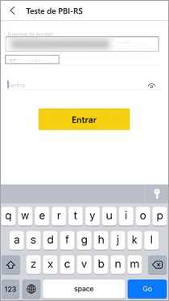

Agora, é possível exibir e interagir com as KPIs e os relatórios do Power BI armazenados no servidor de relatório.

## Exibir relatórios e KPIs do Power BI no aplicativo Power BI
Relatórios do Power BI, relatórios móveis do Reporting Services e KPIs são exibidos nas mesmas pastas que eles estão no portal da Web do Reporting Services. 

* Toque em um relatório do Power BI . Ele é aberto no modo paisagem e é possível interagir com ele no aplicativo do Power BI.

    > [!NOTE]
  > Fazer drill down e up não está habilitado nos relatórios do Power BI em um Servidor de Relatórios do Power BI.
  
    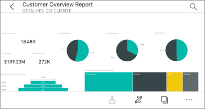
* No Power BI Desktop, os proprietários de relatório podem [otimizar um relatório](../../create-reports/desktop-create-phone-report.md) para os aplicativos móveis do Power BI. Em seu telefone celular, os relatórios otimizados têm um ícone especial chamado  e um layout.
  
    
* Toque em um KPI para vê-lo no modo de foco.
  
    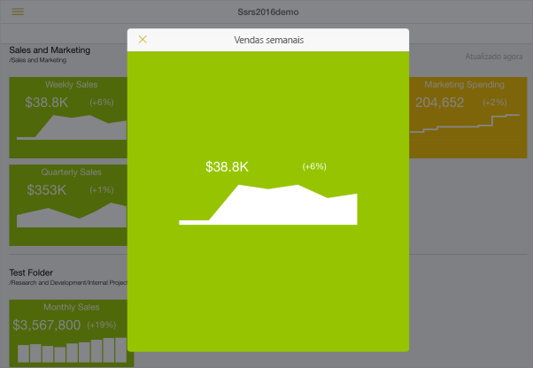

## Exibir seus KPIs e relatórios favoritos
É possível marcar KPIs e relatórios como favoritos no portal da Web e, em seguida, exibi-los em uma pasta conveniente em seu dispositivo móvel, juntamente com seus dashboards favoritos do Power BI.

* Toque em **Favoritos** na barra de navegação.
  
   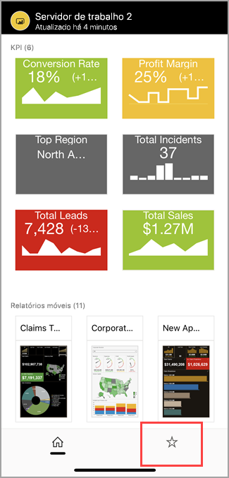
  
   Seus KPIs e relatórios favoritos do portal da Web estão todos nesta página, juntamente com os dashboards do Power BI no serviço do Power BI:
  
   

## Remover uma conexão a um servidor de relatório
1. Abra o painel de contas, toque em **Configurações**.
2. Toque no nome do servidor ao qual você não deseja se conectar.
3. Toque **Remover servidor**.

## Próximas etapas
* [O que é o Power BI?](../../fundamentals/power-bi-overview.md)  
* Perguntas? [Experimente perguntar à Comunidade do Power BI](https://community.powerbi.com/)
