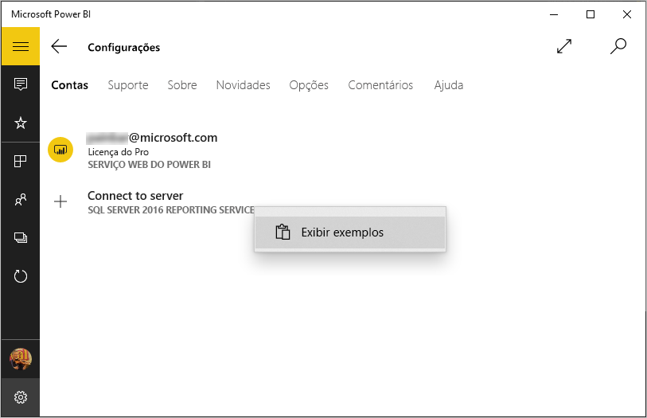
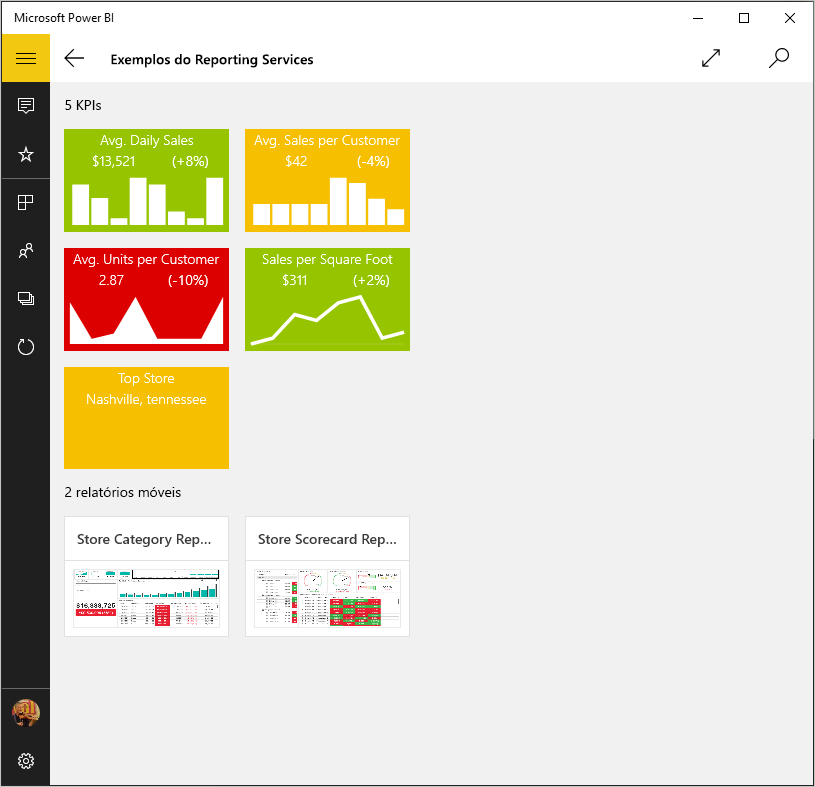
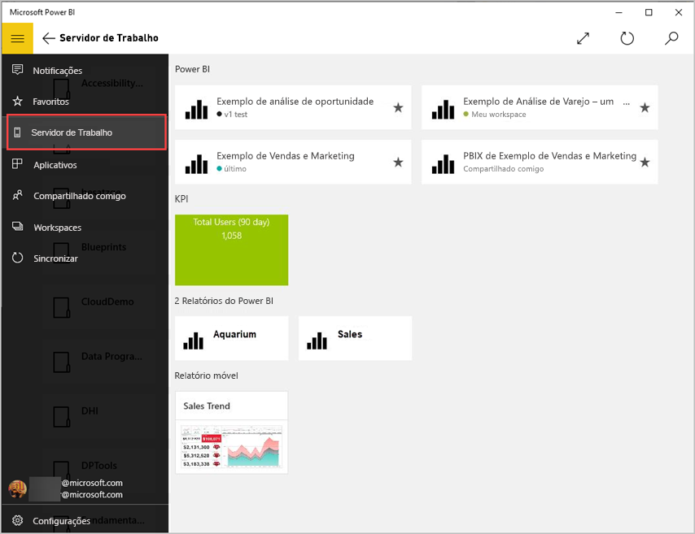
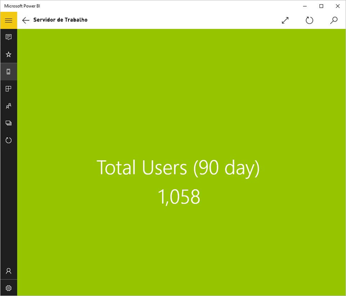
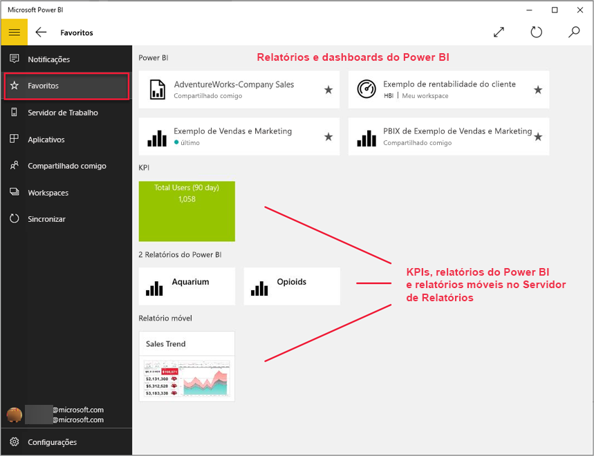

# Exibir KPIs e relatórios locais no aplicativo Power BI para Windows
O aplicativo do Power BI para Windows 10 oferece acesso móvel dinâmico e habilitado para toque às suas informações corporativas locais importantes, no SQL Server 2016 Reporting Services. 

## As coisas mais importantes primeiro
[Crie relatórios móveis do Reporting Services](https://msdn.microsoft.com/library/mt652547.aspx) com o Publicador de Relatórios Móveis do Microsoft SQL Server 2016 Enterprise Edition e publique-os no [portal da Web do Reporting Services](https://msdn.microsoft.com/library/mt637133.aspx). Crie KPIs diretamente no portal da Web. Organize-os em pastas e marque seus favoritos para que você possa encontrá-los com facilidade. 

Em seguida, no aplicativo do Power BI para Windows 10, exiba relatórios do Power BI, relatórios móveis e KPIs, organizados em pastas ou coletados como favoritos. 

> [!NOTE]
> Seu dispositivo precisa estar executando o Windows 10. O aplicativo funciona melhor em dispositivos com pelo menos 1 GB de RAM e 8 GB de armazenamento interno.

>[!NOTE]
>O suporte de aplicativo móvel Power BI para **telefones que usam o Windows 10 Mobile** será descontinuado em 16 de março de 2021. [Saiba mais](https://go.microsoft.com/fwlink/?linkid=2121400)

## Explorar amostras sem um servidor do SQL Server 2016 Reporting Services
Mesmo que você não tenha acesso a um portal da Web do Reporting Services, ainda é possível explorar os recursos de relatórios móveis do Reporting Services.

1. No dispositivo Windows 10, abra o aplicativo Power BI.
2. Toque no botão de navegação global  no canto superior esquerdo.
3. Toque no ícone **Configurações**, clique com o botão direito do mouse ou toque e segure em **Conectar-se ao servidor** e, depois, toque em **Exibir amostras**.
   
   
4. Abra a pasta Relatórios de Varejo ou Relatórios de Vendas para explorar seus KPIs e relatórios móveis.
   
   

Navegue pelas amostras para interagir com KPIs e relatórios móveis.

## Conectar-se a um servidor de relatório do Reporting Services
1. Na parte inferior do painel de navegação, toque em **Configurações** 
2. Toque em **Conectar ao servidor**.
3. Preencha o endereço do servidor e seu nome de usuário e senha. Use este formato para o endereço do servidor:
   
     `https://<servername>/reports` OU `https://<servername>/reports`
   
   > [!NOTE]
   > Inclua **http** ou **https** no início da cadeia de conexão.
   > 
   > 
   
    Toque em **Opção avançada** para dar um nome ao servidor, se desejar.
4. Toque na marca de seleção para se conectar. 
   
   Agora você vê o servidor no painel de navegação.
   
   
   
   >[!TIP]
   >Toque no  a qualquer momento para mudar entre seus relatórios móveis e dashboards do Reporting Services no serviço do Power BI. 
   > 

## Exibir KPIs e relatórios móveis do Reporting Services no aplicativo Power BI
Relatórios do Power BI (versão prévia), relatórios móveis e KPIs do Reporting Services são exibidos nas mesmas pastas em que estão armazenados, no portal da Web do Reporting Services.

* Toque em um KPI para vê-lo no modo de foco.
  
    
* Toque em um relatório móvel para abri-lo e interagir com ele no aplicativo Power BI.
  
    

## Exibir seus KPIs e relatórios favoritos
Você pode marcar KPIs, relatórios móveis e relatórios do Power BI como favoritos no portal da Web do Reporting Services, e exibi-los em uma pasta fácil de encontrar no dispositivo Windows 10, juntamente com seus relatórios e dashboards favoritos do Power BI.

* Toque em **Favoritos**.
  
   
  
   Todos os seus favoritos do portal da Web são mostrados nesta página.
  
Leia mais sobre [favoritos nos aplicativos móveis do Power BI](mobile-apps-favorites.md).

## Remover uma conexão a um servidor de relatório
Você pode estar conectado apenas a um servidor de relatório por vez no aplicativo móvel Power BI. Se você quiser se conectar a um servidor diferente, precisará desconectar-se do atual.

1. Na parte inferior do painel de navegação, toque em **Configurações** 
2. Toque e segure o nome do servidor ao qual você não deseja se conectar.
3. Toque **Remover servidor**.
   
    

## Criar KPIs e relatórios móveis do Reporting Services
Você não cria KPIs nem relatórios móveis do Reporting Services no aplicativo móvel do Power BI. Crie-os no Publicador de Relatórios Móveis do SQL Server e em um portal da Web do SQL Server 2016 Reporting Services.

* [Crie seus próprios relatórios móveis do Reporting Services](https://msdn.microsoft.com/library/mt652547.aspx) e publique-os em um portal da Web do Reporting Services.
* Criar [KPIs em um portal da Web do Reporting Services](https://msdn.microsoft.com/library/mt683632.aspx)

## Próximas etapas
* [Introdução ao aplicativo móvel do Power BI para Windows 10](mobile-windows-10-phone-app-get-started.md)  
* [O que é o Power BI?](../../fundamentals/power-bi-overview.md)  
* Dúvidas? [Experimente perguntar à Comunidade do Power BI](https://community.powerbi.com/)

