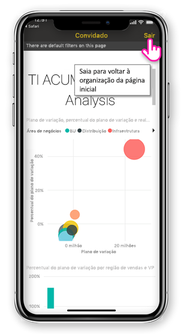

# Exibir conteúdo do Power BI compartilhado com você de uma organização externa

O Power BI integra-se ao Azure Active Directory Business-to-business (Azure AD B2B) para permitir a distribuição segura de conteúdo do Power BI a usuários convidados fora da organização. E usuários convidados externos podem usar o aplicativo móvel do Power BI para acessar o conteúdo do Power BI compartilhado com eles. 

Aplica-se a:

|  |  |  |  |
|:--- |:--- |:--- |:--- |
| iPhones |iPads |Telefones Android |Tablets Android |

## Acessando conteúdo compartilhado

**Primeiro, você precisa que alguém de uma organização externa compartilhe um item com você.** Quando alguém [compartilha um item com você](../../service-share-dashboards.md), seja da mesma organização ou de uma organização externa, você recebe um email com um link para esse item compartilhado. Seguir esse link em seu dispositivo móvel abre o aplicativo móvel do Power BI. Se reconhecer que o item foi compartilhado de uma organização externa, o aplicativo se reconectará a essa organização com sua identidade. Em seguida, o aplicativo carrega todos os itens que foram compartilhados com você dessa organização.

> [!NOTE]
> Se esse for o primeiro item compartilhado com você como usuário convidado externo, você precisará reivindicar o convite em um navegador. Você não pode reivindicar o convite no aplicativo do Power BI.

Enquanto você estiver conectado a uma organização externa, um cabeçalho preto aparecerá no aplicativo. Esse cabeçalho indica que você não está conectado à sua organização principal. Para se conectar à sua organização principal, saia do modo convidado.

Embora você precise ter um link de artefato do Power BI para se conectar a uma organização externa, depois que o modo do seu aplicativo for alternado, você poderá acessar todos os itens compartilhados com você (não apenas o item que você abriu do email). Para ver todos os itens que você pode acessar na organização externa, vá até o menu do aplicativo e selecione **Compartilhado comigo**. Em **Aplicativos**, você encontra também os aplicativos que pode usar.

## Limitações

- Os usuários precisam ter uma conta ativa do Power BI e um locatário de página inicial.
- Os usuários precisam estar conectados a seu locatário de página inicial do Power BI para que possam acessar o conteúdo compartilhado com eles de um locatário externo.
- Não há suporte para o acesso condicional e para outras políticas do Intune no Azure AD B2B e no Power BI Mobile. Isso significa que o aplicativo impõe apenas as políticas da organização principal, se houver.
- As notificações por push são recebidas somente do site da organização principal (mesmo quando o usuário está conectado como um convidado a uma organização externa). Abrir a notificação reconecta o aplicativo ao site de da organização principal do usuário.
- Se o usuário desligar o aplicativo, quando reaberto, o aplicativo se conectará automaticamente à organização principal do usuário.
- Quando conectado a uma organização externa, algumas ações são desabilitadas: itens favoritos, alertas de dados, comentários e compartilhamento.
- Dados offline não ficam disponíveis enquanto o usuário está conectado a uma organização externa.
- Se você tiver o aplicativo Portal da Empresa instalado em seu dispositivo, o dispositivo deverá ser registrado.
