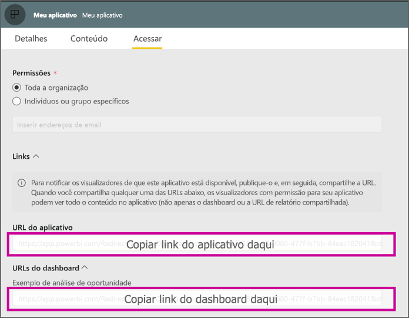

# <a name="create-a-link-to-a-specific-location-in-the-power-bi-mobile-apps"></a>Criar um link para um local específico nos aplicativos móveis do Power BI
Você pode usar os links para acessar diretamente a itens específicos no Power BI: Relatório, o painel e lado a lado.

Há basicamente dois cenários para usar os links no Power BI Mobile: 

* Para abrir o Power BI, do **fora do aplicativo**e acessar o conteúdo específico (painel/relatório/aplicativo). Isso geralmente é um cenário de integração, quando você deseja abrir o Power BI para celulares de outro aplicativo. 
* Para **navegue** dentro do Power BI. Isso é geralmente quando você deseja criar uma navegação personalizada no Power BI.


## <a name="use-links-from-outside-of-power-bi"></a>Use os links de fora do Power BI
Quando você usa um link de fora do aplicativo do Power BI, você deseja certificar-se de que ele seja aberto pelo aplicativo, e se o aplicativo não estiver instalado no dispositivo e, em seguida, para oferecer ao usuário para instalá-lo. Criamos um formato de link especial para oferecer suporte a exatamente isso. Esse formato de link, garantirá que o dispositivo estiver usando o aplicativo para abrir o link, e se o aplicativo não estiver instalado no dispositivo, ele oferecerá o usuário a ir para a loja para obtê-lo.

O link deve começar com o seguinte  
```html
https://app.powerbi.com/Redirect?[**QUERYPARAMS**]
```

> [!IMPORTANT]
> Se o seu conteúdo é hospedado no datacenter especial, como análise do governo, China, etc. O link deve começar com o endereço do Power BI à direita, como `app.powerbigov.us` ou `app.powerbi.cn`.   
>


O **parâmetros de consulta** são:
* **ação** (obrigatório) = OpenApp / OpenDashboard / OpenTile / AbrirRelatório
* **appId** = se você quiser abrir um relatório ou painel que fazem parte de um aplicativo 
* **groupObjectId** = se você quiser abrir um relatório ou painel que fazem parte do espaço de trabalho (mas não meu espaço de trabalho)
* **dashboardObjectId** = ID de objeto do painel de controle (se a ação for OpenDashboard ou OpenTile)
* **reportObjectId** = ID de objeto de relatório (se a ação é AbrirRelatório)
* **tileObjectId** = ID de objeto de bloco (se a ação é OpenTile)
* **reportPage** = se você quiser abrir a seção de relatório específico (se a ação é AbrirRelatório)
* **ctid** = item ID da organização (relevante para o cenário B2B. Isso pode ser omitido se o item pertence à organização do usuário).

**Exemplos:**

* Link do aplicativo abrir 
  ```html
  https://app.powerbi.com/Redirect?action=OpenApp&appId=appidguid&ctid=organizationid
  ```

* Abrir o painel que é parte de um aplicativo 
  ```html
  https://app.powerbi.com/Redirect?action=OpenDashboard&appId=**appidguid**&dashboardObjectId=**dashboardidguid**&ctid=**organizationid**
  ```

* Abra o relatório que faz parte de um espaço de trabalho
  ```html
  https://app.powerbi.com/Redirect?Action=OpenReport&reportObjectId=**reportidguid**&groupObjectId=**groupidguid**&reportPage=**ReportSectionName**
  ```

### <a name="how-to-get-the-right-link-format"></a>Como obter o formato de link à direita

#### <a name="links-of-apps-and-items-in-app"></a>Links de aplicativos e itens no aplicativo

Para **aplicativos e relatórios e painel que fazem parte de um aplicativo**, a maneira mais fácil de obter o link é ir para o espaço de trabalho do aplicativo e escolha "Atualizar aplicativo". Isso abrirá a experiência de "Aplicativo de publicação" e, na guia acesso, você encontrará uma **Links** seção. Expandir que seção e você verá a lista do aplicativo e links de todo o seu conteúdo que pode ser usado para acessá-los diretamente.



#### <a name="links-of-items-not-in-app"></a>Links de itens fora do aplicativo 

Para relatórios e painéis que não fazem parte de um aplicativo, você precisa extrair as IDs da URL do item.

Por exemplo, para localizar o caractere de 36 **dashboard** ID de objeto, navegue até o painel específico no serviço do Power BI 

```html
https://app.powerbi.com/groups/me/dashboards/**dashboard guid comes here**?ctid=**organization id comes here**`
```

Para localizar o caractere de 36 **relatório** ID de objeto, navegue até o relatório específico no serviço do Power BI.
Este é um exemplo de relatório de "Meu espaço de trabalho"

```html
https://app.powerbi.com/groups/me/reports/**report guid comes here**/ReportSection3?ctid=**organization id comes here**`
```
A URL acima também contém a página de relatório específico **"ReportSection3"** .

Este é um exemplo de um relatório de espaço de trabalho (não meu espaço de trabalho)

```html
https://app.powerbi.com/groups/**groupid comes here**/reports/**reportid comes here**/ReportSection1?ctid=**organizationid comes here**
```

## <a name="use-links-inside-power-bi"></a>Use os links dentro do Power BI

Links dentro do Power BI estão trabalhando nos aplicativos móveis exatamente como no serviço do Power BI.

Se você quiser adicionar link para seu relatório que aponta para outro item do Power BI, você pode copiar apenas essa URL do item da barra de endereços do navegador. Leia mais sobre [como adicionar um hiperlink a uma caixa de texto em um relatório](https://docs.microsoft.com/power-bi/service-add-hyperlink-to-text-box).

## <a name="use-report-url-with-filter"></a>Use a URL de relatório com filtro
Mesmo que o serviço do Power BI, aplicativos móveis do Power BI também dar suporte a URL de relatório que contém um parâmetro de consulta de filtro. Você pode abrir um relatório no aplicativo móvel do Power BI e filtrá-los para um estado específico. Por exemplo, essa URL abre o relatório de vendas e filtrá-los por região

```html
https://app.powerbi.com/groups/me/reports/**report guid comes here**/ReportSection3?ctid=**organization id comes here**&filter=Store/Territory eq 'NC'
```

Leia mais sobre [como criar um parâmetro de consulta para filtrar relatórios](https://docs.microsoft.com/power-bi/service-url-filters).

## <a name="next-steps"></a>Próximas etapas
Seus comentários nos ajudam a decidir o que implementar no futuro, portanto, não se esqueça de votar em outros recursos que você gostaria de ver em aplicativos móveis do Power BI. 

* [Aplicativos do Power BI para dispositivos móveis](mobile-apps-for-mobile-devices.md)
* Siga @MSPowerBI no Twitter
* Participe da conversa na [Comunidade do Power BI](http://community.powerbi.com/)
* [O que é o Power BI?](../../power-bi-overview.md)

