# Analista virtual de P e R nos aplicativos iOS – Power BI

A maneira mais fácil de saber mais sobre os dados é fazer perguntas sobre eles com suas próprias palavras. Neste artigo, você faz perguntas e visualiza informações em destaque sobre dados de exemplo com o analista virtual de P e R no aplicativo móvel do Microsoft Power BI no iPad, no iPhone e no iPod Touch. 

Aplica-se a:

|  |  |
|:--- |:--- |
| iPhones |iPads |

O analista virtual de P e R é uma experiência de BI para conversas que acessa os dados subjacentes de P e R no serviço do Power BI [(https://powerbi.com)](https://powerbi.com). Ele sugere análises de dados e você pode digitar ou falar suas próprias perguntas.

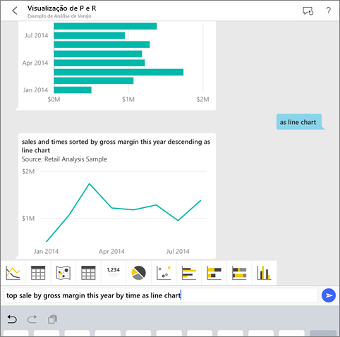

Se você não estiver inscrito no Power BI, [inscreva-se para uma avaliação gratuita](https://app.powerbi.com/signupredirect?pbi_source=web) antes de começar.

## Pré-requisitos

* **Instalar o aplicativo Power BI para iOS**: [Baixar o aplicativo para iOS](https://go.microsoft.com/fwlink/?LinkId=522062) em seu iPhone ou iPad.
Essas versões dão suporte ao aplicativo do Power BI para iOS:
    * iPad com iOS 11 ou posterior.
    * iPhone 5 e posteriores com iOS 11 ou posterior.
* **Baixar os exemplos de Análise de Varejo e Análise de Oportunidade**: A primeira etapa deste início rápido é baixar os exemplos de Análise de Varejo e Análise de Oportunidade no serviço do Power BI. [Saiba como baixar um exemplo](./mobile-apps-download-samples.md) em sua conta do Power BI para começar a usar o serviço. Escolha o Exemplo de Análise de Varejo e o Exemplo de Análise de Oportunidade.

Depois de concluir os pré-requisitos, você estará pronto para experimentar o analista virtual de P e R.

## Tente fazer perguntas sobre seu iPhone ou iPad
1. Na barra de navegação inferior no iPhone ou no iPad, toque no botão Workspaces , vá até Meu Workspace e abra o dashboard Exemplo de Análise de Varejo.

2. Toque no ícone do analista virtual da P e R  no menu de ação na parte inferior da página (na parte superior da página em um iPad).
     O analista virtual da P e R oferece algumas sugestões para começar.
3. Digite **Mostrar**, toque em **Vendas** na lista de sugestões > **Enviar** .

    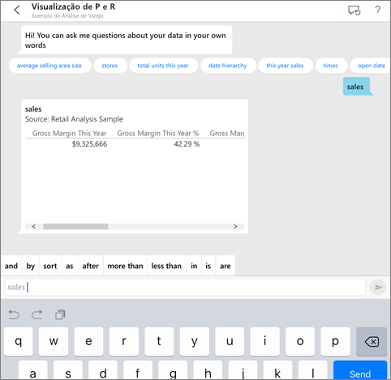
4. Toque em **Por** nas palavras-chave, em seguida, toque em **Item** na lista de sugestões > **Enviar** .

    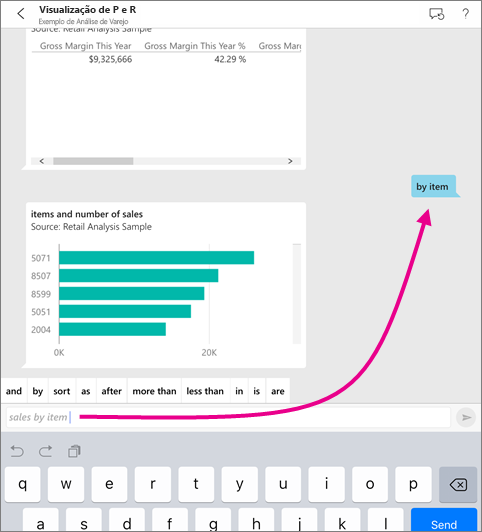
5. Toque em **Como** nas palavras-chave, toque no ícone de gráfico de coluna , em seguida, toque em **Enviar** .
6. Toque por alguns segundos o gráfico exibido, em seguida, toque em **Expandir**.

    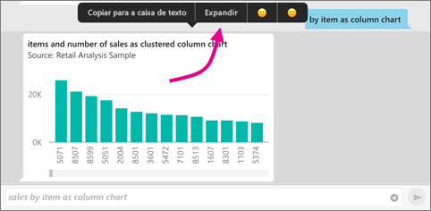

    O gráfico será aberto no modo de foco no aplicativo.

    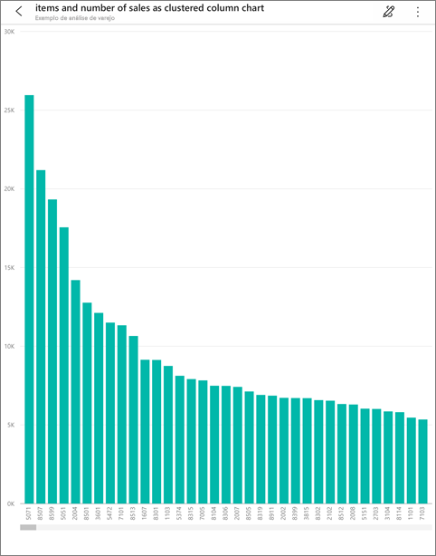
7. Toque na seta no canto superior esquerdo para voltar para a janela de chat do analista virtual da P e R.
8. Toque no X à direita da caixa de texto para excluir o texto e começar novamente.
9. Tente uma nova pergunta: Toque em **Topo** nas palavras-chave, toque em **venda por $ médio/unidade** > **Enviar** .

    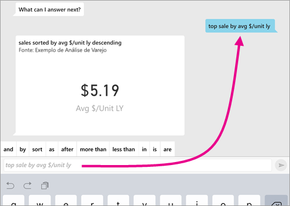
10. Selecione **Por** nas palavras-chave, toque em **Tempo** na lista de sugestões na parte superior > **Enviar** .

     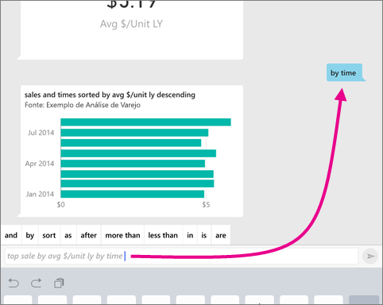
11. Digite **Como**, selecione o ícone de gráfico de linha  na lista de sugestões > **Enviar** .

    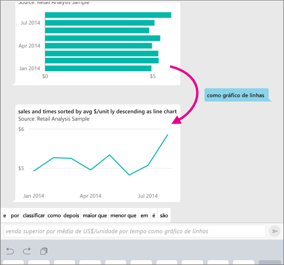

## Tente falar suas perguntas
Agora você pode fazer perguntas sobre seus dados no aplicativo móvel Power BI falando, em vez de digitando.

1. Tocar no ícone do analista virtual da P e R  no menu de ação na parte inferior da página (na parte superior da página em um iPad).
2. Toque no ícone de microfone .

    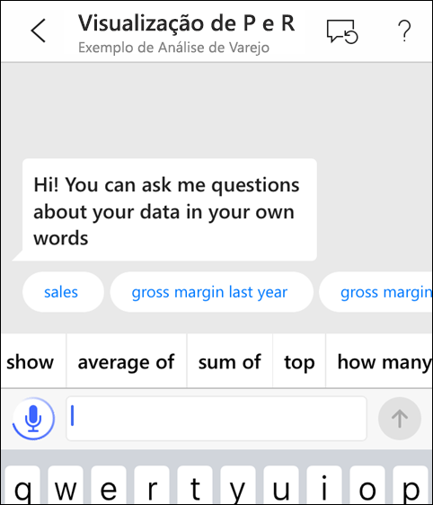

1. Quando o ícone de microfone estiver ativo, comece a falar. Por exemplo, diga “preço da unidade médio por hora” e, em seguida, toque em **Enviar** .

    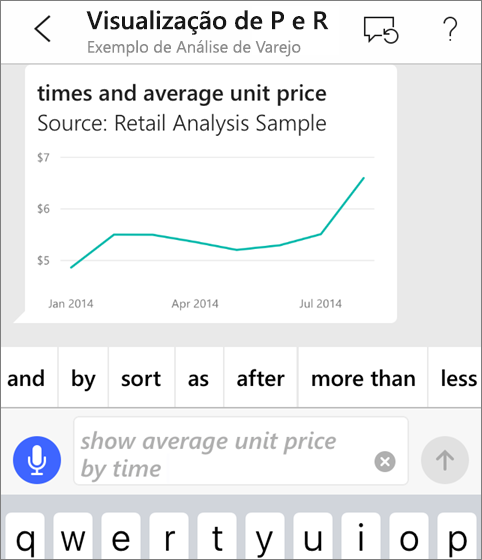

### Perguntas sobre privacidade ao usar a conversão de fala em texto?
Consulte a seção Reconhecimento de Fala de [Novidades no iOS](https://go.microsoft.com/fwlink/?linkid=845624) nos Guias do desenvolvedor do Apple iOS.

## Ajuda e comentários
* Precisa de ajuda? Diga "Olá" ou "Ajuda", e você receberá assistência sobre como fazer uma nova pergunta.
* Importa-se de fornecer comentários sobre os resultados? Toque por alguns segundos o gráfico ou outro resultado e, em seguida, toque na carinha feliz ou triste.

    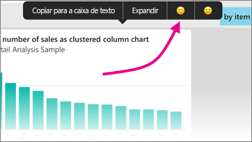

    Seus comentários são anônimos e nos ajudam a melhorar nossas respostas para as perguntas.

## Melhorar os resultados do analista virtual da P e R
Melhore os resultados que você e seus clientes recebem ao usar o analista virtual da P e R em um conjunto de dados fazendo perguntas mais específicas ou aprimorando o conjunto de dados.

### Como fazer perguntas
* Siga estas [dicas para fazer perguntas na P e R](../end-user-q-and-a-tips.md), no serviço do Power BI ou no analista virtual da P e R em seu aplicativo móvel iOS.

### Como aprimorar o conjunto de dados
* Aprimore o conjunto de dados no Power BI Desktop ou no serviço do Power BI para [fazer com que seus dados funcionem bem com o analista virtual da P e R](../../service-prepare-data-for-q-and-a.md).

## Próximas etapas
* [Q&A no serviço do Power BI](../end-user-q-and-a.md)
* Dúvidas? Consulte a [seção Aplicativos móveis da comunidade do Power BI](https://go.microsoft.com/fwlink/?linkid=839277)
