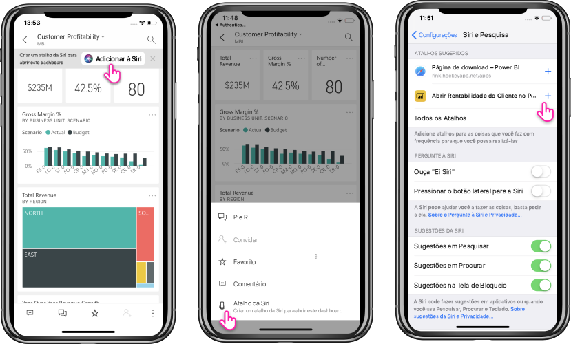
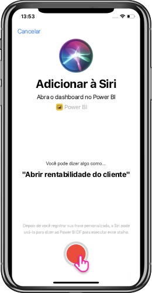

# Como usar Atalhos da Siri no aplicativo Power BI Mobile para iOS

Use Atalhos da Siri para acessar diretamente o conteúdo do Power BI que você precisa.

Para obter acesso fácil e rápido aos relatórios ou dashboards que você usa com frequência, use a integração dos Atalhos da Siri. Crie um atalho para o item e, então, você poderá pedir à Siri para iniciá-lo sempre que precisar ver os dados.

## Criar atalho da Siri para um relatório ou dashboard

Há três maneiras de criar atalhos da Siri para seus relatórios e dashboards:

- Uma faixa com uma opção **Adicionar à Siri** será adicionada aos seus relatórios e dashboards usados com frequência. Toque na ação para abrir a página **Adicionar à Siri**.
    
- Use a ação **Atalho da Siri** no menu de ações **Relatório** ou **Dashboard** (...).
    
- Use os **Atalhos sugeridos** nas configurações do dispositivo (**Configuração do Dispositivo** > **Siri e Pesquisa**). Você pode adicionar um atalho para o item da sugestão usando o botão de sinal de adição (+).
     
     

Para um relatório do Power BI, o atalho vai capturar a página atual que você está exibindo ao criar o atalho. 

Todas as opções abrirão a página **Adicionar à Siri**. Nessa página, você precisará registrar uma frase que você usará posteriormente com a Siri para abrir o relatório ou o dashboard. 
   

    

## Usar Atalhos da Siri para exibir relatório ou dashboard

Depois de criar um atalho, sempre que você quiser acessar o dashboard ou o relatório para o qual criou um atalho, basta pedir à Siri.
Ative a Siri e forneça a frase que você registrou para o atalho. A Siri iniciará o Power BI e acessará o relatório ou o dashboard solicitado. 

Para um relatório do Power BI, você será levado até a página que foi capturada quando você criou o atalho.

  
  

## Editar a frase de atalho da Siri 
Você pode editar sua frase de atalho usando o botão **Atalho da Siri** no menu de ações do **Relatório** ou **Dashboard** (...). A página de atalho da Siri será aberta com uma opção para **Regravar frase**. 

## Excluir Atalho da Siri 
Para excluir um atalho, acesse o item e, no menu de ações (...), toque na ação **Atalho da Siri**. A página **Atalho da Siri** será aberta. Escolha **Excluir Atalho**.

> [!NOTE]
> A integração dos Atalhos da Siri com o aplicativo do Power BI está disponível para iPhone e iPad que executam iOS12 e versões posteriores.
> 

## Próximas etapas
Saiba mais sobre o aplicativo móvel do Power BI fazendo o seguinte: 

* Baixe o [aplicativo móvel do Power BI para iPhone](https://go.microsoft.com/fwlink/?LinkId=522062)
* Siga [@MSPowerBI no Twitter](https://twitter.com/MSPowerBI)
* Participe da conversa na [Comunidade do Power BI](https://community.powerbi.com/)

