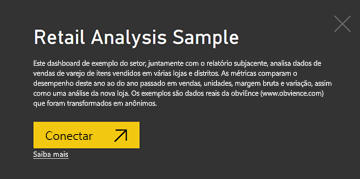
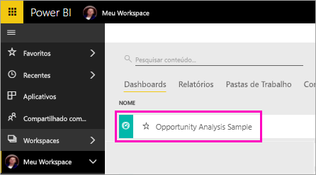
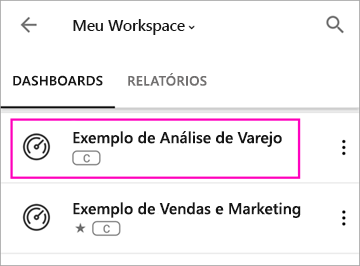
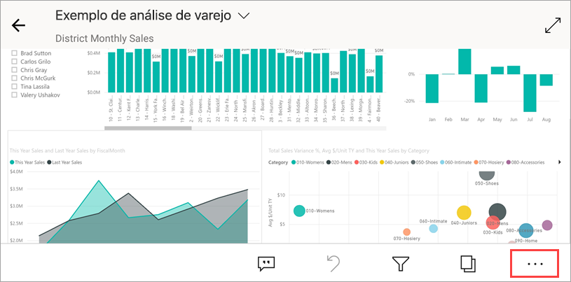
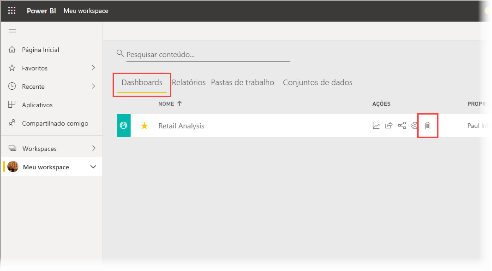

# Início Rápido: Explorar dashboards e relatórios nos aplicativos móveis do Power BI
Neste início rápido, você explora um dashboard e um relatório de exemplo no aplicativo móvel do Power BI em um telefone Android. Você também pode acompanhar em outros aplicativos móveis. 

Aplica-se a:

|  |  |  |  |
|:--- |:--- |:--- |:--- |
| iPhone | iPad | Android | Windows 10 |

Painéis são um portal para o ciclo de vida e processos de sua empresa. Um painel é uma visão geral, um único lugar para monitorar o estado atual do negócio. Relatórios são uma exibição interativa de seus dados, com elementos visuais representando diferentes descobertas e ideias obtidas por meio desses dados. 

## Pré-requisitos

### Inscrever-se no Power BI
Se você não estiver inscrito no Power BI, [inscreva-se para uma avaliação gratuita](https://app.powerbi.com/signupredirect?pbi_source=web) antes de começar.

### Instale o aplicativo do Power BI para Android
[Baixe o aplicativo do Power BI para Android](http://go.microsoft.com/fwlink/?LinkID=544867) no Google Play.

O Power BI funciona em dispositivos Android que executam o sistema operacional Android 5.0 ou posterior. Para verificar seu dispositivo, acesse **Configurações** > **Sobre o dispositivo** > **Versão do Android**.

### Baixar a amostra da Análise de Varejo
A primeira etapa do início rápido é baixar a amostra de Análise de Varejo no serviço do Power BI.

1. Abra o serviço do Power BI no navegador (app.powerbi.com) e entre.

1. Selecione o ícone de navegação global para abrir o painel de navegação esquerdo.

    

2. No painel de navegação esquerdo, selecione **Workspaces** > **Meu Workspace**.

    

3. No canto inferior esquerdo, selecione **Obter Dados**.
   
    

3. Na página Obter Dados, selecione o ícone **Exemplos**.
   
   

4. Selecione **Exemplo de Análise de Varejo**.
 
    
 
8. Selecione **Conectar**.  
  
   
   
5. O Power BI importa a amostra, adicionando um novo dashboard, relatório e conjunto de dados a Meu Workspace.
   
   

OK, você está pronto para exibir o exemplo em seu dispositivo Android.

## Exibir um dashboard em seu dispositivo Android
1. Em seu dispositivo Android, abra o aplicativo do Power BI e entre usando as credenciais de sua conta do Power BI, as mesmas usadas no serviço do Power BI no navegador.

1.  Toque no botão de navegação global .

2.  Toque em **Workspaces** > **Meu Workspace**

    

3. Toque no dashboard Exemplo de Análise de Varejo para abri-lo.
 
    
   
    Uma notação embaixo de cada nome de dashboard (neste exemplo, a letra “C”) mostra como os dados em cada dashboard são classificados. Leia mais sobre [classificação de dados no Power BI](../../service-data-classification.md).

    Os painéis do Power BI parecem um pouco diferentes em seu telefone Android. Todos os blocos aparecem com a mesma largura e são dispostos um após o outro, de cima para baixo.

4. Toque no ícone de estrela  na barra de título para tornar este um dashboard um favorito.

    Quando você marcar um favorito no aplicativo móvel, ele será um favorito no serviço do Power BI e vice-versa.

4. Role para baixo e toque no gráfico de linhas "Vendas deste ano, vendas do ano passado".

    

    Ele é aberto no modo de foco.

7. No modo de foco, toque em abr. no gráfico. Você verá os valores referentes a abril exibidos na parte superior do gráfico.

    

8. Toque no ícone de Relatório  no canto superior direito. O relatório relacionado a esse bloco será aberto no modo paisagem.

    

9. Toque na bolha amarela "040 – Juniors" no gráfico de bolhas. Está vendo como isso realça os valores relacionados nos outros gráficos? 

    

10. Passe o dedo para cima para ver a barra de ferramentas na parte inferior e, em seguida, toque no ícone de lápis.

    

11. Toque no ícone smiley na barra de ferramentas Anotar e adicione alguns smileys à sua página de relatório.
 
    

12. Toque em **Compartilhar** no canto superior direito.

1. Preencha os endereços de email e adicione uma mensagem se desejar.  

    

    Você pode compartilhar esse instantâneo com qualquer pessoa dentro ou para de sua organização. Se a pessoa estiver em sua organização e tiver sua própria conta do Power BI, ela também poderá abrir o relatório de exemplo de Análise de Varejo.

## Limpar recursos

Depois de concluir este início rápido, você poderá excluir o dashboard, o relatório e o conjunto de dados de exemplo de Análise de Varejo, se desejar.

1. Abra o serviço do Power BI (app.powerbi.com) e entre.

2. No painel de navegação esquerdo, selecione **Workspaces** > **Meu Workspace**.

    Está vendo a estrela amarela indicando que é um favorito?

3. Na guia **Dashboards**, selecione o ícone de lata de lixo de **Excluir**, ao lado do dashboard Análise de Varejo.

    

4. Selecione a guia **Relatórios** e faça o mesmo com o relatório de Análise de Varejo.

5. Selecione a guia **Conjuntos de Dados** e faça o mesmo com o conjunto de dados de Análise de Varejo.

## Próximas etapas

Neste início rápido, você explorou um dashboard e um relatório de exemplo em seu dispositivo Android. Leia mais sobre como trabalhar no serviço do Power BI. 

> [!div class="nextstepaction"]
> [Início Rápido: Explorando o serviço do Power BI](../end-user-experience.md)

