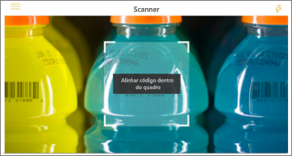
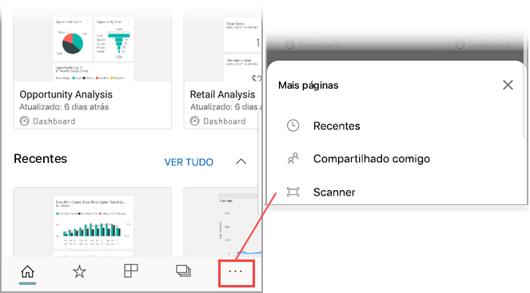

# Digitalizar um código de barras com seu dispositivo no aplicativo móvel do Power BI
A digitalização de códigos de barras no mundo real o leva para as informações de BI filtradas no aplicativo móvel do Power BI.

Aplica-se a:

|  |  |  |  |
|:--- |:--- |:--- |:--- |
|iPhones |iPads |Telefones Android |Tablets Android |

Digamos que um colega tenha [marcado um campo de código de barras em um relatório do Power BI Desktop](../../transform-model/desktop-mobile-barcodes.md) e compartilhou esse relatório com você. 

Quando você digitaliza o código de barras de um produto com o scanner no aplicativo do Power BI no seu dispositivo, você vê o relatório (ou a lista de relatórios) com esse código de barras. Você pode abrir o relatório filtrado nesse código de barras.

## Digitalizar um código de barras com o scanner do Power BI
1. Na barra de navegação, toque em **Mais opções** (…) e, em seguida, toque em **Scanner**.

    

2. Se a câmera não estiver habilitada, você precisa aprovar o aplicativo do Power BI para usar a câmera. Essa é uma única aprovação. 
4. Aponte o scanner para um código de barras em um produto. Você verá uma lista dos relatórios associados a esse código de barras.
5. Toque no nome do relatório para abri-lo no dispositivo, filtrado automaticamente de acordo com esse código de barras.

## Filtrar por outros códigos de barras enquanto estiver em um relatório
Ao observar um relatório filtrado por um código de barras no dispositivo, é recomendável filtrar o mesmo relatório por um código de barras diferente.

* Se o ícone de código de barras tiver um filtro , o filtro estará ativo e o relatório já será filtrado por um código de barras. 
* Se o ícone não contiver um filtro , o filtro não estará ativo e o relatório não será filtrado por um código de barras. 

De qualquer forma, toque no ícone para abrir um pequeno menu com um scanner flutuante.

* Focalize o scanner no novo item para alterar o filtro do relatório para um valor de código de barras diferente. 
* Selecione **Limpar filtro de código de barras** para voltar ao relatório não filtrado.
* Selecione **Filtrar por códigos de barras recentes** para mudar o filtro de relatório para um dos códigos de barras digitalizados na sessão atual.

## Problemas com a digitalização de um código de barras
Aqui estão algumas mensagens que você poderá ver quando digitalizar um código de barras em um produto.

### "Não foi possível filtrar o relatório..."
O relatório que você escolher filtrar baseia-se em um modelo de dados que não inclui esse valor de código de barras. Por exemplo, o produto “água mineral” não está incluído no relatório.  

### Todos os visuais do relatório ou alguns deles não contêm nenhum valor
O valor de código de barras digitalizado já existe no modelo, mas todos os visuais do relatório ou alguns deles não contêm esse valor e, portanto, a filtragem retornará um estado vazio. Tente procurar em outras páginas do relatório ou editar seus relatórios no Power BI Desktop para que ele contenha esse valor 

### "Parece que você não tem relatórios que possam ser filtrados por códigos de barras."
Isso significa que você não tem nenhum relatório habilitado para código de barras. O scanner de código de barras pode filtrar apenas relatórios que têm uma coluna marcada como **Código de barras**.  

Verifique se você ou o proprietário do relatório marcou uma coluna como **Código de barras** no Power BI Desktop. Saiba mais sobre como [marcar um campo de código de barras no Power BI Desktop](../../transform-model/desktop-mobile-barcodes.md)

### "Não foi possível filtrar o relatório. Parece que esse código de barras não existe nos dados do relatório."
O relatório que você escolher filtrar baseia-se em um modelo de dados que não inclui esse valor de código de barras. Por exemplo, o produto “água mineral” não está incluído no relatório. Você poderá digitalizar um produto diferente, escolher outro relatório (se houver mais de um relatório disponível) ou exibir o relatório não filtrado. 

## Próximas etapas
* [Marcar um campo de código de barras no Power BI Desktop](../../transform-model/desktop-mobile-barcodes.md)
* [Blocos de Dashboard no Power BI](../end-user-tiles.md)
* [Dashboards no Power BI](../end-user-dashboards.md)
