# Exibir painéis e relatórios nos aplicativos móveis do Power BI
Aplica-se a:

|  |  |  |  | 
|:--- |:--- |:--- |:--- |:--- |
| [iPhones](mobile-apps-view-dashboard.md#view-dashboards-on-your-iphone) |[iPads](mobile-apps-view-dashboard.md#view-dashboards-on-your-ipad) |[Telefones Android](mobile-apps-view-dashboard.md#view-dashboards-on-your-android-phone) |[Tablets Android](mobile-apps-view-dashboard.md#view-dashboards-on-your-android-tablet) |

Painéis são um portal para o ciclo de vida e processos de sua empresa. Um painel é uma visão geral, um único lugar para monitorar o estado atual do negócio.

## Criar dashboards no serviço do Power BI (https://powerbi.com)
**Você não cria dashboards nos aplicativos móveis.** 

Para ver painéis e relatórios em seu dispositivo móvel, é necessário criar ou se conectar a eles em um navegador da Web. 

1. Vá até o serviço do Power BI ([https://www.powerbi.com](https://www.powerbi.com)) e [inscreva-se para ter uma conta](../../service-self-service-signup-for-power-bi.md).
2. [Crie seus próprios dashboards e relatórios do Power BI](../../service-get-started.md) ou conecte-se a [aplicativos Power BI](../../service-connect-to-services.md) existentes para uma variedade de serviços, como [Microsoft Dynamics CRM](../../service-connect-to-microsoft-dynamics-crm.md).

Este é um dashboard do Power BI no serviço do Power BI:

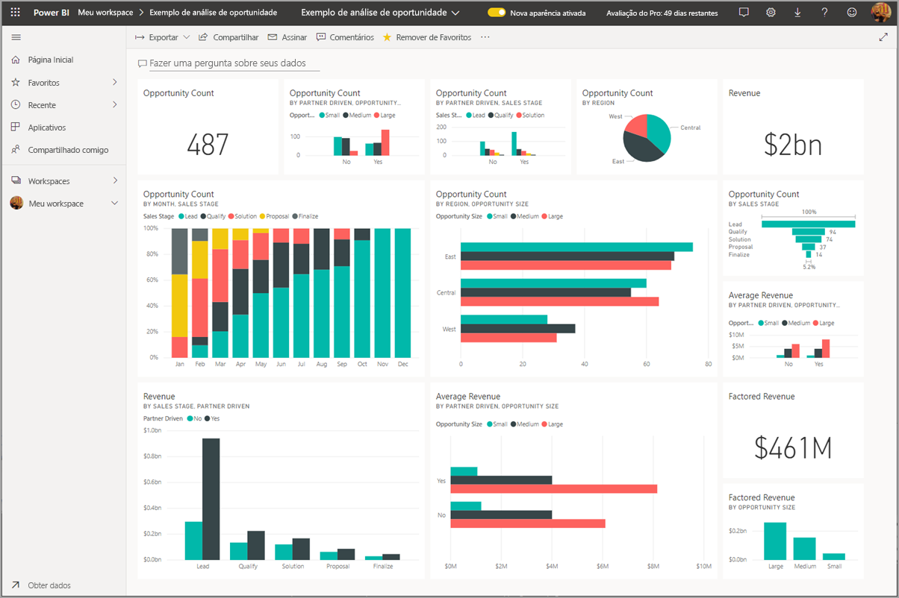

## Exibir painéis em seu iPhone
1. Abra o aplicativo Power BI em seu iPhone e entre.
   
   Precisa [baixar o aplicativo do iPhone](https://go.microsoft.com/fwlink/?LinkId=522062) da Apple App Store?
2. Toque em um painel para abri-lo.  
   
    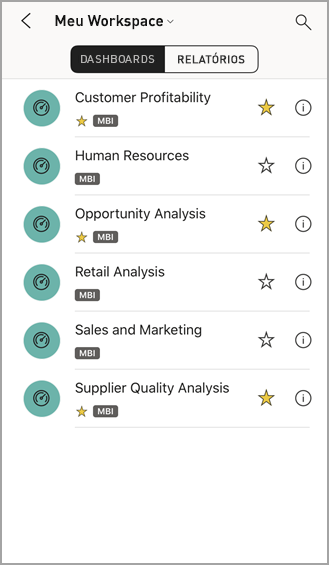
   
   * As estrelas amarelas  mostram quais dashboards são favoritos. 
   * A notação embaixo de cada nome de dashboard (neste caso, "MBI")  mostra como os dados em cada dashboard são classificados. Leia mais sobre [classificação de dados no Power BI](../../service-data-classification.md).
   
   Por padrão, os dashboards do Power BI parecem um pouco diferentes em seu iPhone. Todos os blocos aparecem com o mesmo tamanho e são dispostos um após o outro, de cima para baixo.
   
    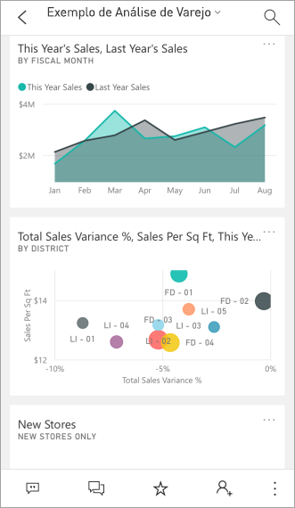
   
   > [!TIP]
   > Se você for o proprietário do dashboard, no serviço do Power BI, poderá [criar uma exibição do dashboard, especificamente para telefones](../../service-create-dashboard-mobile-phone-view.md) no modo retrato. 
   > 
   > 
   
    Ou, se preferir, basta virar seu telefone para os lados para exibir o dashboard no modo paisagem no seu telefone.
   
    
3. Passe o dedo para cima e para baixo para ver todos os blocos no painel. Você pode:
   
   * [Toque em um bloco](mobile-tiles-in-the-mobile-apps.md) para abri-lo o modo de foco e interagir com ele.
   * Toque na estrela  para [torná-lo um favorito](mobile-apps-favorites.md).
   * Toque em **Convidar**  para [convidar um colega](mobile-share-dashboard-from-the-mobile-apps.md) para exibir seu dashboard.
   * [Sincronize o dashboard com o Apple Watch](mobile-apple-watch.md).
4. Para voltar à lista de dashboards, toque na seta ao lado do título do dashboard e, em seguida, toque em **Meu Workspace**.
   
   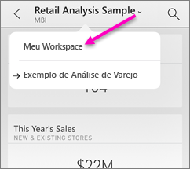

### Exiba painéis no modo paisagem no seu iPhone
Você também pode virar seu telefone para os lados para exibir os dashboards no modo paisagem. O layout do dashboard muda de uma série de blocos para uma exibição de todo o dashboard&#151. Você vê todos os blocos do dashboard da mesma forma que no serviço do Power BI.

Você pode usar o gesto de "pinçar" para ampliar e reduzir áreas diferentes do seu painel e o movimento panorâmico para navegar por ele. Além disso, também é possível [tocar em um bloco](mobile-tiles-in-the-mobile-apps.md) para abri-lo no modo foco e interagir com os dados.

## Exibir painéis em seu iPad
1. Abra o aplicativo Power BI.
   
   Precisa [baixar o aplicativo iPad](https://go.microsoft.com/fwlink/?LinkId=522062) na Apple App Store primeiro?
2. Toque em **Dashboards** na parte superior do aplicativo.  
   
   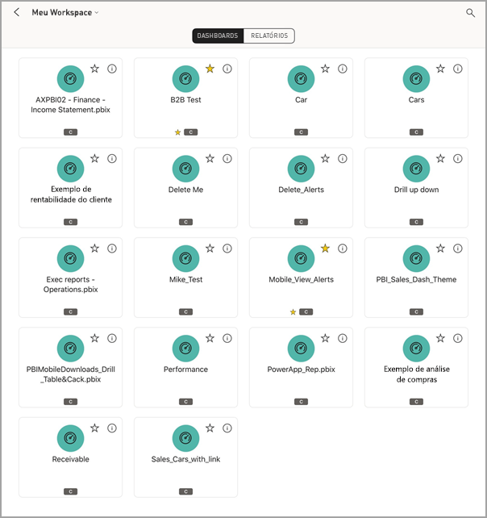
   
   * As estrelas amarelas  mostram quais dashboards são favoritos. 
   * A notação embaixo de cada nome de dashboard (neste caso, "MBI")  mostra como os dados em cada dashboard são classificados. Leia mais sobre [classificação de dados no Power BI](../../service-data-classification.md).
3. Você pode compartilhar um dashboard em seu workspace. Toque nas reticências ( **...** ) no canto inferior direito do bloco do dashboard e toque em **Convidar Outras Pessoas**.
   
   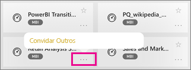
4. Você também pode tocar em um dashboard para abri-lo e ver os blocos. No dashboard, é possível interagir com:
   
   * [Toque em um bloco para interagir](mobile-tiles-in-the-mobile-apps.md) com ele.
   * [Abrir os relatórios](mobile-reports-in-the-mobile-apps.md) subjacentes aos blocos.
   * [Convidar outras pessoas para exibir o dashboard](mobile-share-dashboard-from-the-mobile-apps.md).
   * [Anotar e compartilhar um instantâneo](mobile-annotate-and-share-a-tile-from-the-mobile-apps.md) de um bloco.
5. Para voltar ao Meu Workspace, toque no nome do dashboard no canto superior esquerdo e, em seguida, toque em **Meu Workspace**.
   
   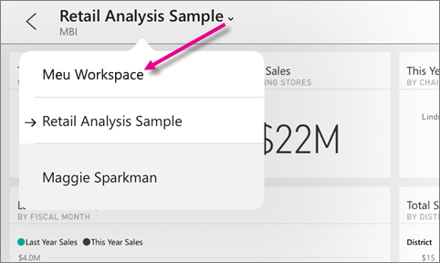

## Exibir painéis no seu telefone Android
1. Abra o aplicativo Power BI em seu telefone Android e entre.
   
   Precisa [baixar o aplicativo Android](https://go.microsoft.com/fwlink/?LinkID=544867) primeiro?
2. Toque em um painel para abri-lo.   
   
   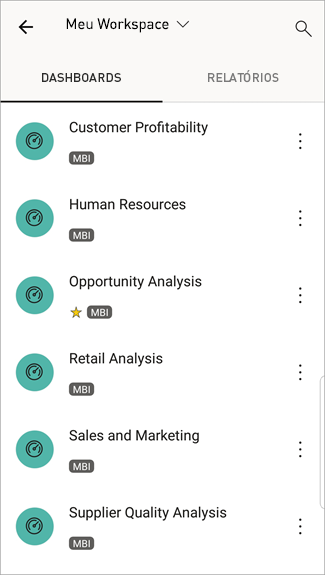

    As estrelas amarelas  mostram quais dashboards são favoritos. 

    Uma notação embaixo de um nome de dashboard (neste caso, "MBI")  mostra como os dados em cada dashboard são classificados. Leia mais sobre [classificação de dados no Power BI](../../service-data-classification.md).

    Os painéis do Power BI parecem um pouco diferentes em seu telefone Android. Todos os blocos aparecem com a mesma largura e são dispostos um após o outro, de cima para baixo.

    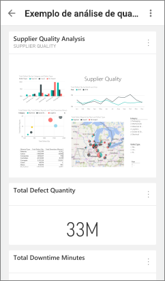

    Se você for o proprietário do dashboard, no serviço do Power BI, poderá [criar uma exibição do dashboard, especificamente para telefones](../../service-create-dashboard-mobile-phone-view.md) no modo retrato. 

1. Enquanto estiver no dashboard, você pode tocar no botão vertical **Mais opções** (...), ao lado do nome, para convidar um colega, atualizar ou obter informações sobre o dashboard:
   
   
2. Passe o dedo para cima e para baixo para ver todos os [blocos no dashboard](mobile-tiles-in-the-mobile-apps.md). 
3. Para voltar para a página inicial de dashboards, toque no nome do dashboard para abrir a trilha de localização. Em seguida, toque em **Meu Workspace**.   

## Exibir dashboards em seu tablet Android
1. Abra o aplicativo do Power BI em seu tablet Android e entre.
   
   Precisa [baixar o aplicativo Android](https://go.microsoft.com/fwlink/?LinkID=544867) primeiro?
2. Toque em um painel para abri-lo.   
   
   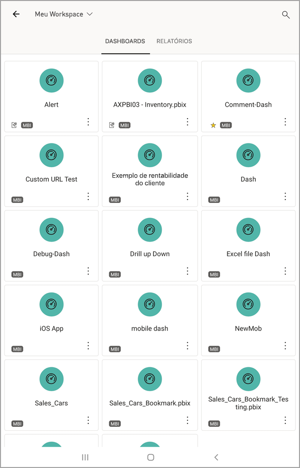
   
   * As estrelas amarelas  mostra quais dashboards são favoritos. 
   * A notação embaixo de cada nome de dashboard (neste caso, "MBI")  mostra como os dados em cada dashboard são classificados. Leia mais sobre [classificação de dados no Power BI](../../service-data-classification.md).
3. Enquanto estiver no dashboard, você pode tocar no botão vertical **Mais opções** (...), ao lado do nome, para convidar um colega, atualizar ou obter informações sobre o dashboard:
   
   
4. Passe o dedo para cima e para baixo para ver todos os [blocos no dashboard](mobile-tiles-in-the-mobile-apps.md). 
   
   Você pode usar o gesto de "pinçar" para ampliar e reduzir áreas diferentes do seu painel e o movimento panorâmico para navegar por ele. Além disso, também é possível [tocar em um bloco](mobile-tiles-in-the-mobile-apps.md) para abri-lo no modo foco e interagir com os dados.
5. Para voltar para a página inicial dos dashboards, toque no nome do dashboard para abrir a trilha de navegação estrutural e, em seguida, toque em **Meu Workspace**:
   
    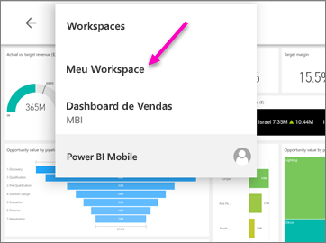

    Você pode usar o gesto de "pinçar" para ampliar e reduzir áreas diferentes do seu painel e o movimento panorâmico para navegar por ele. Além disso, também é possível [tocar em um bloco](mobile-tiles-in-the-mobile-apps.md) para abri-lo no modo foco e interagir com os dados.

## Criar uma exibição de telefone de um dashboard no serviço do Power BI
Se você for o proprietário do dashboard, *no serviço do Power BI*, poderá criar uma exibição do dashboard, especificamente para telefones no modo retrato. 

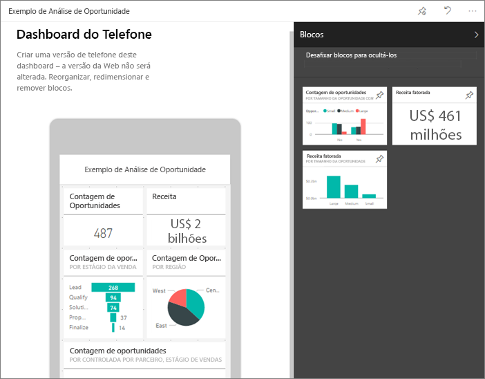

Leia mais sobre como [criar uma exibição de telefone de um dashboard](../../service-create-dashboard-mobile-phone-view.md).

## Próximas etapas
* [Baixar o aplicativo Android](https://go.microsoft.com/fwlink/?LinkID=544867) no Google Play  
* [Introdução ao aplicativo do Android para o Power BI](mobile-android-app-get-started.md)  
* [O que é o Power BI?](../../fundamentals/power-bi-overview.md)
* Dúvidas? [Experimente perguntar à Comunidade do Power BI](https://community.powerbi.com/)

