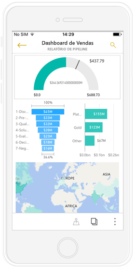
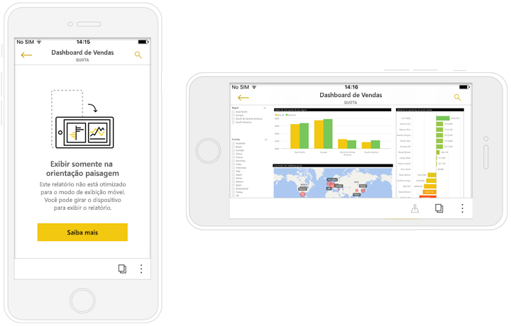
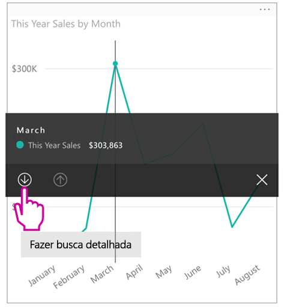
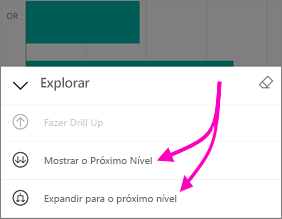
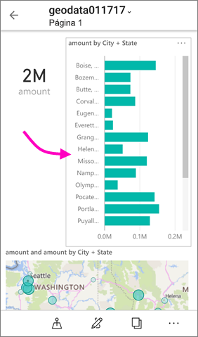
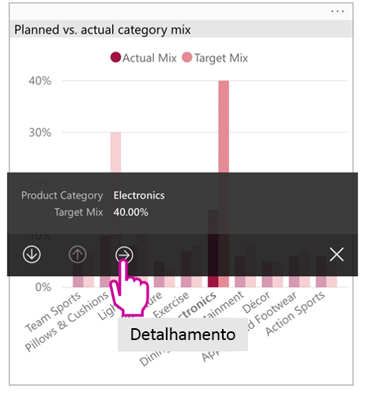
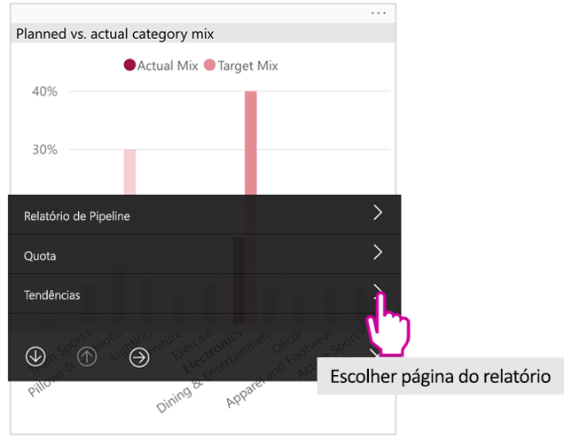

# Exibir relatórios do Power BI otimizados para seu telefone

Aplica-se a:

|  |  |
|:--- |:--- |
| iPhones |Telefones Android |

Quando você exibe um relatório do Power BI em seu telefone, o Power BI verifica se o relatório foi otimizado para telefones. Em caso afirmativo, o Power BI abre automaticamente o relatório otimizado na Exibição Retrato.

Se um relatório otimizado para telefone não existir, o relatório será aberto, mas no modo de exibição de paisagem não otimizada. Mesmo em um relatório otimizado para telefones, se você mudar a orientação do telefone, o relatório será aberto na exibição não otimizada com o layout original do relatório. Se somente algumas páginas forem otimizadas, você encontrará uma mensagem na exibição de retrato, indicando que o relatório está disponível em paisagem.

Todos os outros recursos de relatórios do Power BI ainda funcionam em relatórios otimizados para telefones. Leia mais sobre o que você pode fazer em:

* [Relatórios sobre iPhones](mobile-reports-in-the-mobile-apps.md). 
* [Relatórios sobre telefones Android](mobile-reports-in-the-mobile-apps.md).

## Filtrar a página de relatório em um telefone
Se um relatório otimizado para telefone tiver filtros definidos, quando ele for exibido em um telefone, será possível utilizar esses filtros. O relatório é aberto em seu telefone, filtrado para os valores que estão sendo filtrados no relatório na Web. Você verá uma mensagem informando que existem filtros ativos na página. É possível alterar os filtros no seu telefone.

1. Toque no ícone de filtro  na parte inferior da página. 
2. Use a filtragem básica ou avançada para ver os resultados em que você está interessado.
   
    

## Elementos visuais com realce cruzado
O realce cruzado de visuais na Exibição Retrato funciona da maneira que no serviço do Power BI e em telefones na Exibição Paisagem: quando você seleciona dados em um visual, dados relacionados são realçados em outros visuais nessa página.

Leia mais sobre [filtragem e realce no Power BI](../../power-bi-reports-filters-and-highlighting.md).

## Selecionar elementos visuais
Em relatórios de telefone quando você seleciona um elemento visual, o relatório realça o elemento visual e foca nele, neutralizando gestos da tela.

Com o visual selecionado, você executar ações como rolar no elemento visual. Para cancelar a seleção de um elemento visual, basta tocar em qualquer parte fora da área do elemento visual.

## Abrir elementos visuais em modo de foco
Os relatórios do telefone também oferecem um modo de foco: Você obtém uma exibição mais ampla de um único visual e o explora com mais facilidade.

* Em um relatório de telefone, toque no botão de reticências ( **...** ) no canto superior direito de um visual > **Expandir para o modo de foco**.
  
    

O que você faz no modo de foco é transferido para a tela de relatório e vice-versa. Por exemplo, se você realçar um valor em um visual e, em seguida, retornar para o relatório inteiro, o relatório será filtrado para o valor realçado no visual.

Algumas ações somente são possíveis no modo de foco, devido às restrições de tamanho de tela:

* **Detalhar** as informações exibidas em um visual. Leia mais sobre como [fazer drill-down e up](mobile-apps-view-phone-report.md#drill-down-in-a-visual) em um relatório de telefone abaixo.
* **Classifique** os valores no elemento visual.
* **Reverter**: desmarque as etapas de exploração que você efetuou em um visual e reverta para a definição estabelecida quando o relatório foi criado.
  
    Para limpar toda a exploração de um visual, toque no botão de reticências ( **...** ) > **Reverter**.
  
    
  
    A reversão está disponível no nível do relatório, limpando toda a exploração de todos os visuais ou, no nível do visual, limpando toda a exploração do visual selecionado.   

## Fazer drill down em um visual
Se os níveis hierárquicos forem definidos em um visual, você poderá fazer drill down nas informações detalhadas exibidas em um visual e, em seguida, fazer backup. [Adicione o drill-down em um visual](../end-user-drill.md) no serviço do Power BI ou no Power BI Desktop.

Há alguns tipos de drill down:

### Drill down em um valor
1. Dê um toque longo (tocar e segurar) em um ponto de dados de um visual.
2. A dica de ferramenta será exibida e, se a hierarquia for definida, o rodapé da dica de ferramenta mostrará a seta de drill down e up.
3. Toque na seta para baixo para fazer drill down

    
    
4. Toque na seta para cima para fazer drill up.

### Analisar o próximo nível
1. Em um relatório em um telefone, toque no botão de reticências ( **...** ) no canto superior direito > **Expandir para o modo de foco**.
   
    
   
    Neste exemplo, as barras mostram os valores de estados.
2. Toque no ícone Explorar  no canto inferior esquerdo.
   
    
3. Toque em **Mostrar o próximo nível** ou em **Expandir para o próximo nível**.
   
    
   
    Agora as barras mostram os valores para as cidades.
   
    
4. Se você tocar na seta no canto superior esquerdo, você voltará ao relatório de telefone com os valores ainda expandidos para um nível inferior.
   
    
5. Para voltar ao nível original, toque no botão de reticências ( **...** ) novamente > **Reverter**.
   
    

## Executar uma consulta drill-through de um valor
O drill-through conecta os valores de uma página de relatório a outras páginas de relatório. Quando você executa uma consulta drill-through de um ponto de dados para outra página de relatório, os valores de ponto de dados são usados para filtrar a página detalhada ou eles estarão no contexto dos dados selecionados.
Os autores de relatório podem [definir o drill-through](https://docs.microsoft.com/power-bi/desktop-drillthrough) ao criar o relatório.

1. Dê um toque longo (tocar e segurar) em um ponto de dados de um visual.
2. A dica de ferramenta será exibida e, se o drill-through estiver definido, o rodapé da dica de ferramenta mostrará a seta de drill-through.
3. Toque na seta para fazer drill-through

    

4. Escolher a página de relatório para fazer drill-through

    

5. Use o botão Voltar no cabeçalho do aplicativo para voltar à página na qual você iniciou a navegação.

## Próximas etapas
* [Criar relatórios otimizados para os aplicativos de telefone do Power BI](../../desktop-create-phone-report.md)
* [Criar uma exibição de telefone de um dashboard no Power BI](../../service-create-dashboard-mobile-phone-view.md)
* [Criar visuais responsivos otimizados para qualquer tamanho](../../visuals/desktop-create-responsive-visuals.md)
* Mais perguntas? [Experimente perguntar à Comunidade do Power BI](http://community.powerbi.com/)

