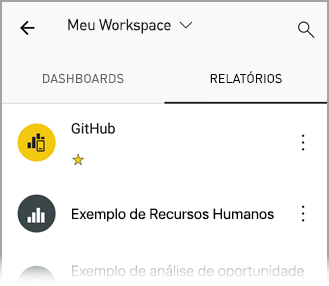
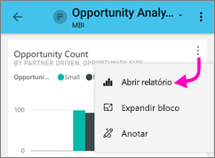

# Explorar relatórios nos aplicativos móveis do Power BI
Aplica-se a:

|  |  |  |  |  |
|:--- |:--- |:--- |:--- |:--- |
| iPhones |iPads |Telefones Android |Tablets Android |Dispositivos Windows 10 |

Um relatório do Power BI é uma exibição interativa de seus dados, com visuais representando diferentes descobertas e informações obtidas desses dados. A exibição de relatórios nos aplicativos móveis do Power BI é a terceira etapa de um processo de três etapas.

1. [Criar relatórios no Power BI Desktop](../../desktop-report-view.md). Você pode até mesmo [otimizar um relatório para telefones](mobile-apps-view-phone-report.md) no Power BI Desktop. 
2. Publique esses relatórios para o serviço do Power BI [(https://powerbi.com)](https://powerbi.com) ou [Servidor de Relatórios do Power BI](../../report-server/get-started.md).  
3. Em seguida, interagir com esses relatórios nos aplicativos móveis do Power BI.

## Abrir um relatório do Power BI no aplicativo móvel
Os relatórios do Power BI são armazenados em locais diferentes no aplicativo móvel, dependendo de onde eles foram obtidos. Eles podem estar em Aplicativos, Compartilhado comigo, Workspaces (incluindo Meu Workspace) ou em um servidor de relatório. Às vezes, você percorre um dashboard relacionado para obter um relatório e, às vezes, ele é listado.

Em listas e menus, você encontrará um ícone ao lado de um nome de relatório, que o ajuda a entender que esse item é um relatório. 

 

Há dois ícones para relatórios em aplicativos do Power BI Mobile:

*  indica um relatório que apresenta na orientação paisagem no aplicativo e que tem a mesma aparência no navegador.

*  Indica um relatório que tem pelo menos uma página de relatório otimizada para telefone, que é apresentada em retrato. 

> [!NOTE]
> Segurando seu telefone em paisagem, você sempre obterá o layout de paisagem, mesmo se a página do relatório tiver um layout para telefone. 

Para obter um relatório de um dashboard, toque nas reticências (...) no canto superior direito de um bloco > **Abrir relatório**.
  
  
  
  nem todos os blocos podem ser abertos em um relatório. Por exemplo, os blocos criados por meio de uma pergunta na caixa de P e R não abrem relatórios quando você toca neles. 
  
## Interagir com relatórios
Depois de abrir um relatório no aplicativo, você pode começar a trabalhar com ele. Há muitas coisas que você pode fazer com o relatório e seus dados. No rodapé do relatório, você encontrará ações a serem executadas no relatório. Ao tocar e tocar de modo prolongado nos dados mostrados no relatório, você pode dividir os dados.

### Usando toque e toque longo
O toque é igual a um clique do mouse. Portanto, se desejar realizar um realce cruzado do relatório com base em um ponto de dados, toque nesse ponto de dados.
Tocar em um valor de segmentação faz com que esse valor fique selecionado e divide o restante do relatório por esse valor. Tocar em um link, botão ou indicador o ativará com base na ação definida pelo autor.

Você provavelmente observou que, quando você toca em um visual, uma borda é exibida. No canto superior direito da borda, você vê reticências (...). Tocar nelas abre um menu com ações que você pode realizar nesse visual.

### Dica de ferramenta e ações de análise

Quando você realizar um toque longo (tocar e segurar) um ponto de dados, uma dica de ferramenta aparecerá apresentando os valores que esse ponto de dados representa. 

Se o relatório autor configurou a dica de ferramenta da página de relatório, a dica de ferramenta padrão será substituída por aquela da página de relatório.

> [!NOTE]
> As dicas de ferramentas de relatório são compatíveis com dispositivos com mais de 640 pixels de tamanho e visor de 320. Se o dispositivo for menor, o aplicativo usará as dicas de ferramenta padrão.

Os autores de relatório podem definir hierarquias nos dados e relações entre as páginas de relatório. A hierarquia permite fazer drill down, fazer drill up e detalhar outra página de relatório partindo de um visual e um valor. Assim, quando realizar toque longo em um valor, além da dica de ferramenta, as opções de análise relevantes serão exibidas no rodapé. 

Com o *detalhamento*, quando você toca em uma parte específica de um visual, o Power BI leva a uma página diferente no relatório, filtrada com o valor tocado. O autor de um relatório pode definir uma ou mais opções de detalhamento, cada uma levando a uma página diferente. Você pode escolher para qual delas deseja exibir o detalhamento. O botão voltar retorna à página anterior do relatório.

Veja como [Adicionar o detalhamento no Power BI Desktop](../../desktop-drillthrough.md).
   
   > [!IMPORTANT]
   > No aplicativo Power BI Mobile, os visuais de análise de matriz e de tabela são habilitados somente por meio de um valor de célula, não por cabeçalhos de coluna e linha.
   
   
   
### Usando as ações no rodapé do relatório
O rodapé do relatório tem ações que você pode realizar na página de relatório atual ou em todo o relatório. O rodapé tem acesso rápido às ações mais úteis, sendo que todas as ações podem ser acessadas por meio das reticências (...).

As ações que você pode realizar no rodapé são:
1) Redefinir o filtro de relatório e as seleções de realce cruzado de volta para seu estado original.
2) Abrir o painel de conversa para exibir ou adicionar comentários sobre o relatório em questão.
3) Abrir o painel de filtro para exibir e modificar o filtro aplicado atualmente no relatório.
4) Listar todas as páginas no relatório. Tocar no nome da página carregará e apresentará essa página.
Você pode percorrer páginas de relatório passando o dedo da borda da tela para o centro.
5) Exibir todas as ações de relatório.

#### Todas as ações de relatório
Tocar na opção ... no rodapé do relatório abre todas as ações que você pode realizar em um relatório. 

Algumas das ações podem ser desabilitadas, pois elas dependem das funcionalidades específicas do relatório.
Por exemplo:
1) **Filtrar por localização atual** será habilitado se os dados no relatório tiverem sido categorizados por autor com dados geográficos. [Veja como identificar dados geográficos no relatório](https://docs.microsoft.com/power-bi/desktop-mobile-geofiltering).
2) A **verificação para filtrar o relatório por código de barras** só será habilitada se o conjunto de relatórios estiver marcado como código de barras. [Como marcar códigos de barras no Power BI Desktop](https://docs.microsoft.com/power-bi/desktop-mobile-barcodes). 
3) **Convidar** estará habilitado somente se você tiver permissão para compartilhar este relatório com outras pessoas. Você terá permissão somente se for o proprietário do relatório ou tiver recebido permissão para recompartilhamento pelo proprietário.
4) **Anotar e compartilhar** poderá estar desabilitado se houver uma [política de proteção do Intune](https://docs.microsoft.com/intune/app-protection-policies) em sua organização que proibiu o compartilhamento por meio do aplicativo Power BI Mobile. 

## Próximas etapas
* [Exibir e interagir com relatórios do Power BI otimizados para seu telefone](mobile-apps-view-phone-report.md)
* [Criar uma versão de um relatório otimizado para telefones](../../desktop-create-phone-report.md)
* Dúvidas? [Experimente perguntar à Comunidade do Power BI](http://community.powerbi.com/)

