# Definir alertas de dados nos aplicativos móveis do Power BI
Aplica-se a:

|  |  |  |  |  |
|:--- |:--- |:--- |:--- |:--- |
| iPhones |iPads |Telefones Android |Tablets Android |Dispositivos Windows 10 |

Você pode definir alertas em painéis nos aplicativos móveis do Power BI e no serviço do Power BI. Os alertas notificam quando dados em um bloco são alterados além dos limites definidos. Os alertas funcionam em blocos que contêm um único número, como cartões e medidores, mas não em dados de streaming. É possível definir alertas de dados no seu dispositivo móvel e vê-los no serviço do Power BI e vice-versa. Só você pode ver os alertas de dados que você definir, mesmo que você compartilhe um painel ou um instantâneo de um bloco.

Você pode definir alertas em blocos se tiver uma licença do Power BI Pro ou se o dashboard compartilhado estiver com capacidade de Premium. 

> [!WARNING]
> Notificações de alerta controladas por dados fornecem informações sobre seus dados. Se o dispositivo for roubado, recomendamos que você vá para o serviço do Power BI para desligar todas as regras de alerta controladas por dados. 
> 
> Saiba mais sobre o [gerenciamento de alertas de dados no serviço do Power BI](../../service-set-data-alerts.md).
> 
> 

## Alertas de dados em um iPhone ou iPad
### Definir um alerta em um iPhone ou iPad
1. Toque em um número ou bloco em um dashboard para abri-lo em modo de foco.  
   
   
2. Toque no ícone de sino  para adicionar um alerta.  
3. Toque em **Adicionar regra de alerta**.
   
   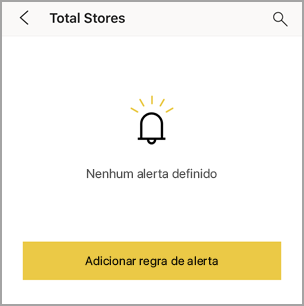
4. Opte por receber alertas acima ou abaixo de um valor e defina o valor.
   
   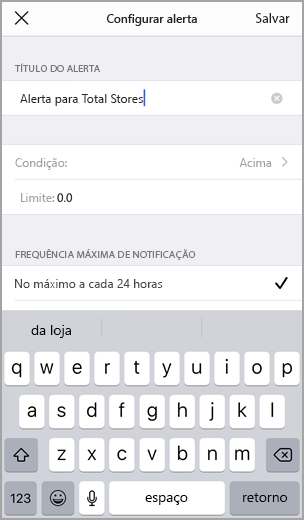
5. Decida se deseja receber por hora ou alertas diários e se também deseja receber um email quando um alerta for enviado.
   
   > [!NOTE]
   > Você não recebe alertas a cada hora ou diariamente, a menos que os dados estejam realmente atualizados no momento.
   > 
   > 
6. Também é possível alterar o título do alerta.
7. Toque em **Salvar**.
8. Um único bloco pode ter alertas para valores acima e abaixo dos limites. Em **Gerenciar alertas**, toque em **Adicionar regra de alerta**.
   
   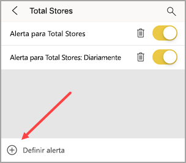

### Gerenciar alertas no seu iPhone ou iPad
Você pode gerenciar os alertas individuais no seu dispositivo móvel ou [gerenciar todos os alertas no serviço do Power BI](../../service-set-data-alerts.md).

1. Em um dashboard, toque em um bloco de números ou medidores que tenha um alerta.  
   
   

2. Toque no ícone de sino .  
3. Toque no nome do alerta para editá-lo, toque no controle deslizante para desligar os alertas de email ou toque na lata de lixo para excluir o alerta.
   
    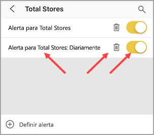

## Alertas de dados em um dispositivo Android
### Definir um alerta em um dispositivo Android
1. No dashboard do Power BI, toque em um bloco de número ou medidor para abri-lo.  
2. Toque no ícone de sino  para adicionar um alerta.  
   
   
3. Toque no ícone de mais (+).
   
   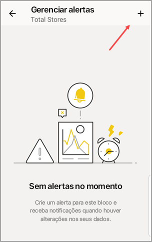
4. Opte por receber alertas acima ou abaixo de um valor e digite o valor.
   
   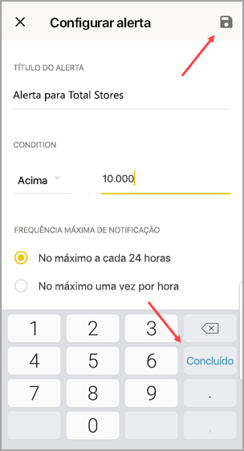
5. Toque em **Concluído**.
6. Decida se deseja receber por hora ou alertas diários e se também deseja receber um email quando um alerta for enviado.
   
   > [!NOTE]
   > Você não recebe alertas a cada hora ou diariamente, a menos que os dados estejam realmente atualizados no momento.
   > 
   > 
7. Também é possível alterar o título do alerta.
8. Toque em **Salvar**.

### Gerenciar alertas em um dispositivo Android
Você pode gerenciar os alertas individuais no aplicativo móvel do Power BI ou [gerenciar todos os alertas no serviço do Power BI](../../service-set-data-alerts.md).

1. Em um dashboard, toque em um bloco de cartões ou medidores que tenha um alerta.  
2. Toque no ícone sólido de sino .  
3. Toque no alerta para alterar um valor ou desativá-lo.
   
    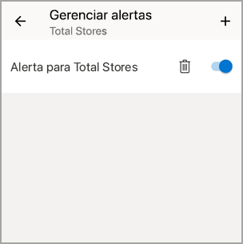
4. Toque no ícone de adição (+) para adicionar outro alerta no mesmo bloco.
5. Para excluir completamente o alerta, toque no ícone de lixo .

## Alertas de dados em um dispositivo Windows

>[!NOTE]
>O suporte de aplicativo móvel Power BI para **telefones que usam o Windows 10 Mobile** será descontinuado em 16 de março de 2021. [Saiba mais](https://go.microsoft.com/fwlink/?linkid=2121400)

### Definir alertas de dados em um dispositivo Windows
1. Toque em um bloco de números ou medidores em um dashboard para abri-lo.  
2. Toque no ícone de sino  para adicionar um alerta.  
   
   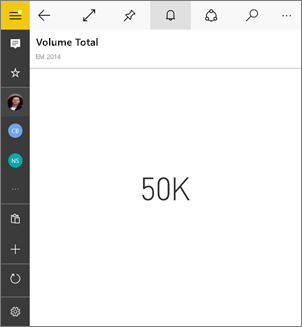
3. Toque no ícone de mais (+).
   
   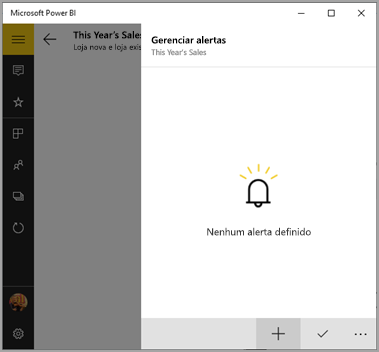
4. Opte por receber alertas acima ou abaixo de um valor e digite o valor.
   
   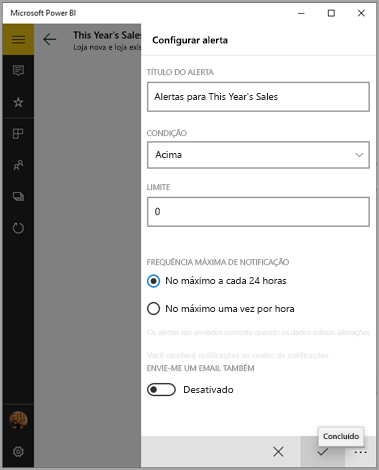
5. Decida se deseja receber por hora ou alertas diários e se também deseja receber um email quando um alerta for enviado.
   
   > [!NOTE]
   > Você não recebe alertas a cada hora ou diariamente, a menos que os dados estejam realmente atualizados no momento.
   > 
   > 
6. Também é possível alterar o título do alerta.
7. Toque na marca de seleção.
8. Um único bloco pode ter alertas para valores acima e abaixo dos limites. Em **Gerenciar alertas**, toque no sinal de mais (+).
   
   

### Gerenciar alertas em um dispositivo Windows
Você pode gerenciar os alertas individuais no aplicativo móvel do Power BI ou [gerenciar todos os alertas no serviço do Power BI](../../service-set-data-alerts.md).

1. Em um dashboard, toque em um bloco de cartões ou medidores que tenha um alerta.  
2. Toque no ícone de sino .  
   
   
3. Toque no alerta para alterar um valor ou desativá-lo.
   
    
4. Para excluir completamente o alerta, clique com o botão direito do mouse ou toque e segure > **Excluir**.

## Recebendo alertas
Você recebe alertas na [Central de Notificações](mobile-apps-notification-center.md) do Power BI no seu dispositivo móvel ou no serviço do Power BI, juntamente com as notificações sobre novos dashboards que alguém compartilhou com você.

As fontes de dados geralmente são configuradas para atualização diária, embora algumas sejam atualizadas com mais frequência. Quando os dados no dashboard forem atualizados, se os dados que estão sendo controlados atingirem um dos limites que você definiu, várias coisas acontecerão.

1. O Power BI verifica se passou mais de uma hora ou mais de 24 horas (dependendo da opção selecionada) desde o envio do último alerta.
   
   Enquanto os dados estiverem acima do limite, você receberá um alerta a cada uma hora ou a cada 24 horas.
2. Se tiver definido que o alerta deve lhe enviar um email, você verá algo parecido com isto na Caixa de Entrada.
   
   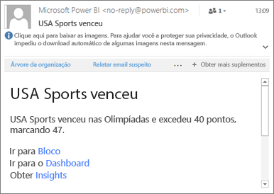
3. O Power BI adiciona uma mensagem ao seu [Centro de notificações](mobile-apps-notification-center.md) e adiciona um ponto amarelo ao ícone de sino  na barra de título (iOS e Android) ou ao botão de navegação global  (dispositivos Windows 10).

4. Toque no ícone de sino  ou no botão de navegação global  para [abrir seu **Centro de notificações**](mobile-apps-notification-center.md) e ver os detalhes do alerta.
   
     

> [!NOTE]
> Os alertas funcionam somente em dados que estão atualizados. Depois que os dados são atualizados, o Power BI verifica se foi definido um alerta para esses dados. Se os dados atingirem um limite de alerta, um alerta será disparado.
> 
> 

## Dicas e solução de problemas
* Não há suporte atualmente para alertas para blocos do Bing ou blocos de cartões com medidas de data/hora.
* Os alertas funcionam apenas com dados numéricos.
* Os alertas funcionam somente em dados que estão atualizados. Eles não funcionam em dados estáticos.
* Os alertas não funcionam com blocos que contêm dados de streaming.

## Próximas etapas
* [Gerenciar seus alertas no serviço do Power BI](../../service-set-data-alerts.md)
* [Central de Notificações do Power BI Mobile](mobile-apps-notification-center.md)
* Dúvidas? [Experimente perguntar à Comunidade do Power BI](https://community.powerbi.com/)

