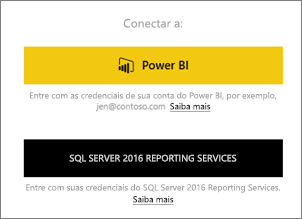
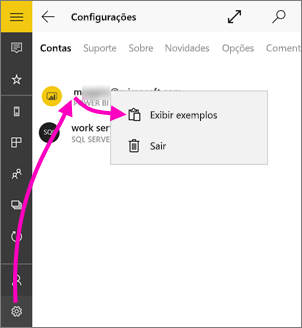
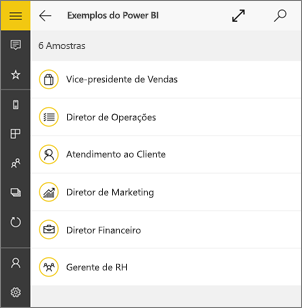
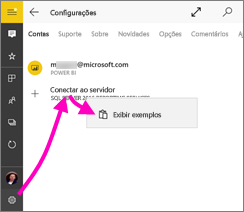
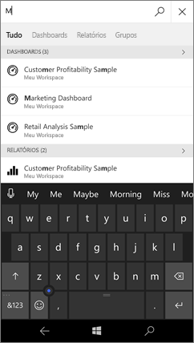
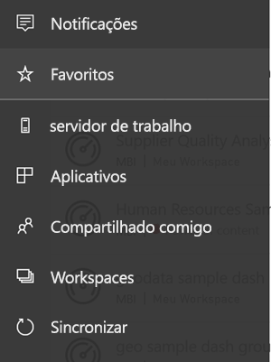
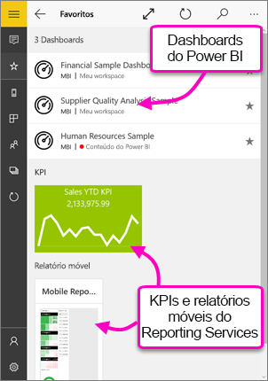

# Introdução ao aplicativo móvel do Power BI para Windows 10
O aplicativo móvel do Power BI para Windows 10 leva o Power BI para seu bolso, com acesso móvel atualizado e sensível ao toque a suas informações corporativas. Veja e interaja com seus dashboards da empresa de qualquer lugar &#151; diretamente na [tela inicial do Windows](mobile-pin-dashboard-start-screen-windows-10-phone-app.md).

Você [cria painéis e relatórios sobre o serviço do Power BI](../../service-get-started.md) com os seus dados. 

Em seguida, interaja com seus painéis e relatórios, explore os dados e compartilhe-os, tudo com o aplicativo móvel Power BI para Windows 10.

## As coisas mais importantes primeiro
* [**Obtenha o aplicativo móvel do Power BI para Windows 10**](http://go.microsoft.com/fwlink/?LinkID=526478) na Windows Store.
  
  Seu dispositivo precisa estar executando o Windows 10. O aplicativo pode ser executado em dispositivos com pelo menos 3 GB de RAM e 8 GB de armazenamento interno.
   
* Descubra as [novidades nos aplicativos móveis do Power BI](mobile-whats-new-in-the-mobile-apps.md).

## Inscrever-se no serviço do Power BI na Web
Se você ainda não se inscreveu, vá para o [serviço do Power BI](http://powerbi.com/) para se inscrever e obter sua conta e criar e armazenar dashboards e relatórios, além de reunir dados. Em seguida, entre no Power BI de seu dispositivo Windows 10 para ver seus próprios painéis, de qualquer lugar.

1. No serviço do Power BI, toque em [Inscrever-se](http://go.microsoft.com/fwlink/?LinkID=513879) para criar uma conta do Power BI.
2. Comece a [criar seus próprios dashboards e relatórios](../../service-get-started.md).

## Introdução ao aplicativo Power BI
1. Na tela inicial do seu dispositivo Windows 10, abra o aplicativo Power BI.
   
   
2. Para exibir seus painéis e relatórios do Power BI, toque em **Power BI**. Entre com as mesmas credenciais de sua conta do Power BI na Web. 
   
   Para exibir os relatórios móveis e KPIs do Reporting Services, toque em **SQL Server 2016 Reporting Services**. Entre com suas credenciais do SQL Server Reporting Services.
   
   
3. Toque em **Começar a explorar**  para exibir seus próprios painéis.

## Experimente os exemplos do Power BI e Reporting Services
Mesmo sem se inscrever, você pode experimentar os exemplos do Power BI e Reporting Services. Depois de baixar o aplicativo, você pode exibir os exemplos ou começar. Volte para os exemplos sempre que quiser, nos painéis na página inicial.

### Exemplos do Power BI
Você pode exibir e interagir com os exemplos de dashboard do Power BI, mas há algumas coisas que você não pode fazer com eles. Você não pode abrir relatórios atrás dos dashboards, compartilhar os exemplos com outras pessoas ou adicioná-los aos seus favoritos.

1. Toque no botão de navegação global  no canto superior esquerdo.
2. Toque no ícone **Configurações** , toque em seu nome e depois em **Exibir exemplos**.
   
   
3. Escolha uma função e explore o dashboard de exemplo para essa função.  
   
   

### Exemplos de relatórios móveis do Reporting Services
1. Toque no botão de navegação global  no canto superior esquerdo.
2. Toque no ícone **Configurações** , clique com o botão direito do mouse ou toque e segure em **Conectar-se ao servidor** e, depois, toque em **Exibir amostras**.
   
   
3. Abra a pasta Relatórios de Varejo ou Relatórios de Vendas para explorar seus KPIs e relatórios móveis.
   
   

## Pesquisar dashboards, relatórios e aplicativos
Encontre seus dashboards, relatórios e aplicativos rapidamente digitando na caixa de pesquisa, sempre na parte superior do aplicativo.

1. Toque no ícone de pesquisa no canto superior direito.
   
   
   
   O Power BI exibe seus dashboards, relatórios e aplicativos mais recentes.
   
   
2. Conforme você começa a digitar, o Power BI exibe todos os resultados relevantes.
   
   

## Encontre seu conteúdo nos aplicativos móveis do Power BI
Seus dashboards e relatórios são armazenados em locais diferentes nos aplicativos móveis do Power BI, dependendo de onde eles vieram. Leia sobre [finding your content in the mobile apps](mobile-apps-quickstart-view-dashboard-report.md) (localizando seu conteúdo em aplicativos móveis). Além disso, a qualquer momento, você pode pesquisar por qualquer coisa que você tenha nos aplicativos móveis do Power BI. 

## Exibir seus dashboards, KPIs e relatórios favoritos
Você pode exibir todos os dashboards do Power BI favorito, junto com os KPIs do Reporting Services e relatórios móveis, na página Favoritos nos aplicativos móveis. Quando você torna um painel *favorito* no aplicativo móvel do Power BI, você pode acessá-lo de todos os seus dispositivos, incluindo o serviço do Power BI no seu navegador. 

* Toque em **Favoritos**.
  
   
  
   Seus favoritos do Power BI e do portal da Web Reporting Services estão todos nesta página.
  
   

Leia mais sobre [favoritos nos aplicativos móveis do Power BI](mobile-apps-favorites.md).

## Próximas etapas
Aqui estão algumas outras coisas que você pode fazer no aplicativo do Power BI para dispositivos com Windows 10 com dashboards e relatórios no Power BI e nos KPIs e relatórios móveis do Reporting Services no portal da Web do Reporting Services

### Painéis e relatórios do Power BI
* Exiba [seus aplicativos](../../service-create-distribute-apps.md).
* Veja seus [dashboards](mobile-apps-view-dashboard.md).
* [Fixe blocos e dashboards do Power BI](mobile-pin-dashboard-start-screen-windows-10-phone-app.md) na tela inicial do dispositivo como blocos dinâmicos.
* [Compartilhe os blocos](mobile-windows-10-phone-app-get-started.md).
* Compartilhe [dashboards](mobile-share-dashboard-from-the-mobile-apps.md).

### KPIs e relatórios móveis do Reporting Services
* [Exibir KPIs e relatórios móveis do Reporting Services](mobile-app-windows-10-ssrs-kpis-mobile-reports.md) no aplicativo Power BI para dispositivos com Windows 10.
* Crie [KPIs no portal da Web do Reporting Services](https://msdn.microsoft.com/library/mt683632.aspx).
* [Crie seus próprios relatórios móveis com o Editor de Relatórios Móveis do SQL Server](https://msdn.microsoft.com/library/mt652547.aspx) e os publique no portal da Web do Reporting Services.

## Próximas etapas
* [Baixar o aplicativo Power BI](http://go.microsoft.com/fwlink/?LinkID=526478) na Windows Store  
* [O que é o Power BI?](../../power-bi-overview.md)
* Dúvidas? [Experimente perguntar à Comunidade do Power BI](http://community.powerbi.com/)

