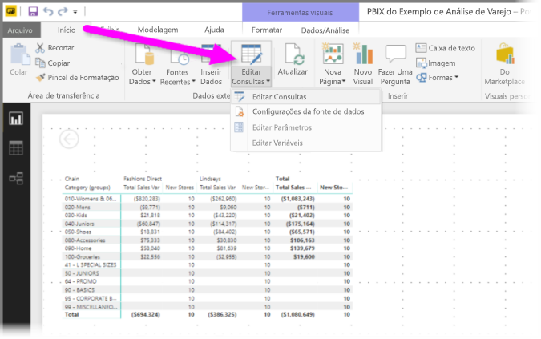
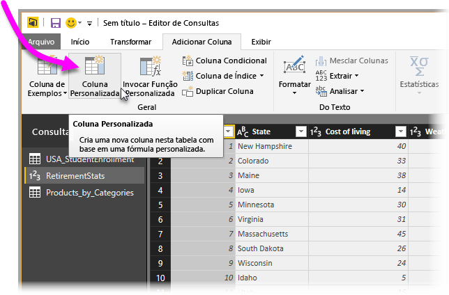
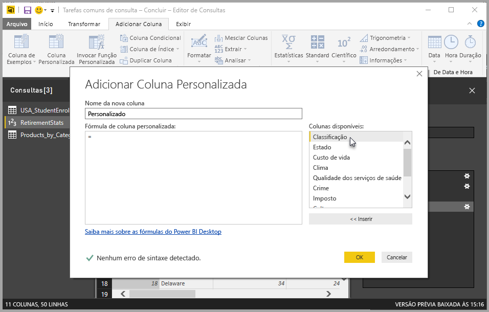
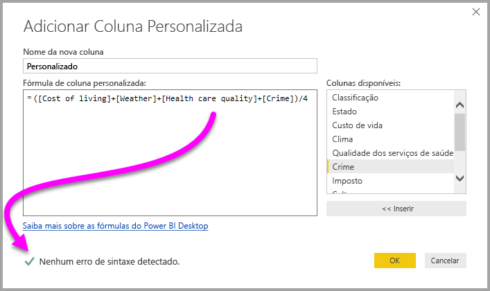
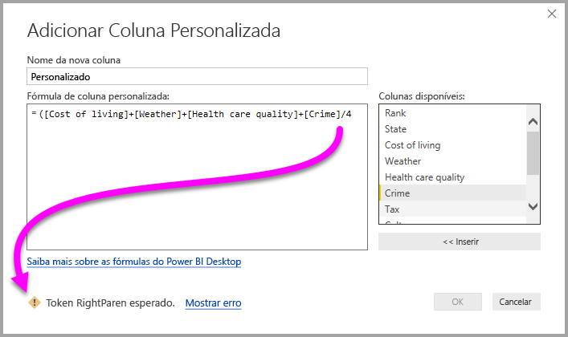
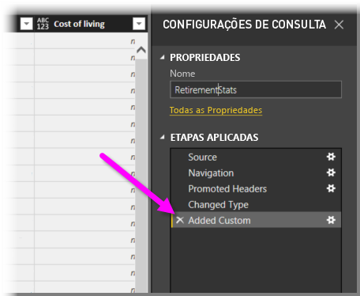
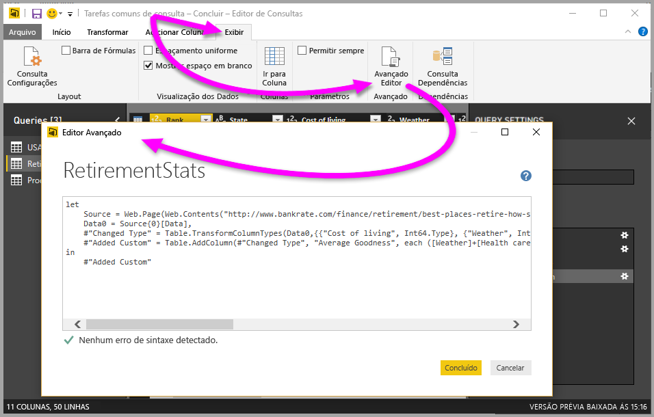

# Adicionar uma coluna personalizada no Power BI Desktop

No Power BI Desktop, adicione com facilidade uma nova coluna personalizada de dados ao modelo usando o Editor de Consultas. Com o Editor de Consultas, crie e renomeie sua coluna personalizada para criar [consultas de fórmula M do PowerQuery](https://docs.microsoft.com/powerquery-m/quick-tour-of-the-power-query-m-formula-language) a fim de definir a coluna personalizada. As consultas de fórmula M do PowerQuery têm um [conjunto de conteúdo de referência de função abrangente](https://docs.microsoft.com/powerquery-m/power-query-m-function-reference). 

Quando você cria uma coluna personalizada no Editor de Consultas, o Power BI Desktop a adiciona como uma **Etapa Aplicada** às **Configurações de Consulta** da consulta. Ela pode ser alterada, movida ou modificada a qualquer momento.

## Usar o Editor de Consultas para adicionar uma coluna personalizada

Para começar a criar uma coluna personalizada, siga estas etapas:

1. Inicie o Power BI Desktop e carregue alguns dados.

2. Na guia **Página Inicial** da faixa de opções, selecione **Editar Consultas** e, em seguida, selecione **Editar Consultas** no menu.

   

   A janela do **Editor de Consultas** será exibida. 

2. Na guia **Adicionar Coluna** da faixa de opções, selecione **Coluna Personalizada**.

   

   A janela **Adicionar Coluna Personalizada** será exibida.

## A janela Adicionar Coluna Personalizada

A janela **Adicionar Coluna Personalizada** apresenta os seguintes recursos: 
- Uma lista de colunas disponíveis, na lista **Colunas disponíveis** à direita.

- O nome inicial da coluna personalizada, na caixa **Nome da nova coluna**. Você pode renomear essa coluna.

- As [consultas de fórmula M do PowerQuery](https://docs.microsoft.com/powerquery-m/power-query-m-function-reference), na caixa **Fórmula de coluna personalizada**. Crie essas consultas criando a fórmula na qual a nova coluna personalizada é definida. 

   

## Criar fórmulas para a coluna personalizada

1. Selecione uma coluna na lista **Colunas disponíveis** à direita e, em seguida, selecione **Inserir** abaixo da lista para adicioná-las à fórmula de coluna personalizada. Adicione também uma coluna clicando duas vezes nela na lista.

2. Conforme você insere a fórmula e cria a coluna, observe o indicador na parte inferior da janela **Adicionar Coluna Personalizada**. 

   Se não houver erros, você verá uma marca de seleção verde e a mensagem *Nenhum erro de sintaxe foi detectado*.

   

   Se houver um erro de sintaxe, você verá um ícone de aviso amarelo, juntamente com um link para o local em que o erro ocorreu na fórmula.

   

3. Selecione **OK**. 

   O Power BI Desktop adiciona a coluna personalizada ao modelo e adiciona a etapa **Personalização Adicionada** à lista **Etapas Aplicadas** da consulta em **Configurações de Consulta**.

   

4. Para modificar a coluna personalizada, clique duas vezes na etapa **Personalização Adicionada** na lista **Etapas Aplicadas**. 

   A janela **Adicionar Coluna Personalizada** será exibida com a fórmula de coluna personalizada que você criou.

## Usar o Editor Avançado para colunas personalizadas

Depois de criar a consulta, use também o **Editor Avançado** para modificar qualquer etapa da consulta. Para fazer isso, siga estas etapas:

1. Na janela do **Editor de Consultas**, selecione a guia **Exibir** na faixa de opções. 

2. Selecione **Editor Avançado**.

   A página do **Editor Avançado** será exibida, o que dá a você controle total sobre a consulta. 

   

   
## Próximas etapas

- Você pode criar uma coluna personalizada de outras formas, como a criação de uma coluna com base nos exemplos fornecidos ao Editor de Consultas. Para obter mais informações, confira [Adicionar uma coluna de um exemplo no Power BI Desktop](desktop-add-column-from-example.md).

- Para obter informações de referência da linguagem M do Power Query, confira [Referência de função M do Power Query](/powerquery-m/power-query-m-function-reference).

