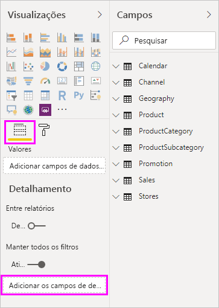
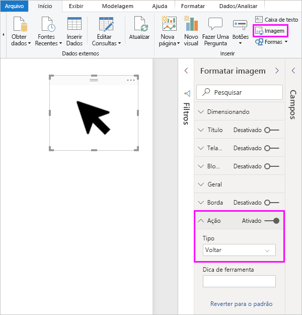
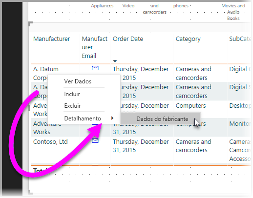
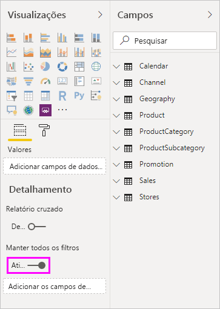
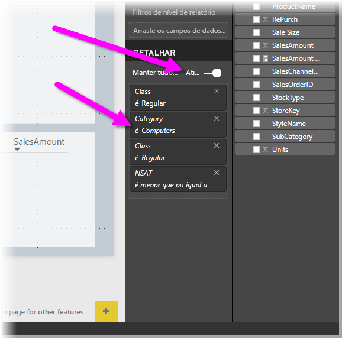
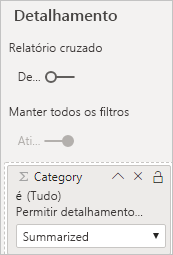

# Configurar o drill-through nos relatórios do Power BI
Com o *drill-through* nos relatórios do Power BI, você pode criar uma página em seu relatório que tenha como foco uma entidade específica, como um fornecedor, cliente ou fabricante. Quando seus leitores de relatório usam o drill-through, clique com o botão direito do mouse em um ponto de dados em outras páginas de relatório e execute uma consulta drill-through na página de foco para obter detalhes filtrados para esse contexto. Você também pode [criar um botão que executa uma consulta drill-through](desktop-drill-through-buttons.md) para obter detalhes quando se clica neles.

Você pode configurar o drill-through em seus relatórios no Power BI Desktop ou no serviço do Power BI.

## Configurar a página de destino de drill-through
1. Para configurar o drill-through, crie uma página de relatório que tenha os visuais desejados para o tipo de entidade para o qual você fornecerá o drill-through. 

    Por exemplo, vamos supor que você deseje executar uma consulta drill-through para fabricantes. Nesse caso, você poderá criar uma página de drill-through com visuais que mostram o total de vendas, o total de unidades enviadas, vendas por categoria, vendas por região e assim por diante. Dessa forma, quando você executa uma consulta drill-through nessa página, os visuais são específicos do fabricante selecionado.

2. Em seguida, na página de drill-through, na seção **Campos** do painel **Visualizações**, arraste o campo para o qual você deseja habilitar o drill-through na caixa **Filtros de drill-through**.

    

    Quando você adiciona um campo à caixa **Filtros de drill-through**, o Power BI cria automaticamente um visual do botão *voltar*. Esse elemento visual transforma-se em um botão nos relatórios publicados. Os usuários que consomem seu relatório no serviço do Power BI usam esse botão para voltar para a página do relatório de origem.

    

> [!IMPORTANT]
> Você pode configurar e fazer o detalhamento em uma página do mesmo relatório, no entanto, não é possível detalhar uma página em um relatório diferente.  

## Use sua própria imagem para um botão Voltar    
 Como o botão Voltar é uma imagem, você pode substituir a imagem desse elemento visual por qualquer imagem desejada. Ele ainda funciona como um botão voltar para que os consumidores do relatório possam voltar para a página original. 

Para usar sua própria imagem para um botão voltar, siga estas etapas:

1. Na guia **Página Inicial**, selecione **Imagem**. Em seguida, localize a imagem e coloque-a na página de drill-through.

2. Selecione a nova imagem na página de drill-through. No painel **Formatar imagem**, defina o controle deslizante **Ação** como **Ativado** e, em seguida, defina o **Tipo** como **Voltar**. Sua imagem agora funciona como um botão Voltar.

    

    
     Agora os usuários podem clicar com o botão direito do mouse em um ponto de dados no seu relatório e obter um menu de contexto que dá suporte ao drill-through dessa página. 

    

    Quando os consumidores do relatório escolherem o detalhamento, a página é filtrada para mostrar informações sobre o ponto de dados de origem do clique com o botão direito do mouse. Por exemplo, vamos supor que eles clicaram com o botão direito do mouse em um ponto de dados sobre a Contoso, um fabricante e selecionaram para detalhar. A página de drill-through que eles acessam está filtrada para Contoso.

## Passar todos os filtros em drill-through

Você pode passar todos os filtros aplicados para a janela de drill-through. Por exemplo, você pode selecionar apenas uma determinada categoria de produtos e os visuais filtrados para essa categoria e, em seguida, selecionar o drill-through. Provavelmente você vai querer saber como esse drill-through ficará com todos esses filtros aplicados.

Para manter todos os filtros aplicados, na seção **Drill-through** do painel **Visualizações**, defina o **Manter todos os filtros** como **Ativado**. 

Em seguida, ao fazer o detalhamento em um visual, você poderá ver quais filtros foram aplicados como resultado da aplicação de filtros temporários no visual de origem. Na seção **Drill-through** do painel **Visualização**, esses filtros transitórios são mostrados em itálico. 

Embora você pudesse fazer isso com páginas de dicas de ferramenta, essa seria uma experiência estranha, porque a dica de ferramenta não pareceria estar funcionando corretamente. Por esse motivo, fazer isso com dicas de ferramenta não é recomendado.

## Adicionar uma medida ao drill-through

Além de passar todos os filtros para a janela de drill-through, você também pode adicionar uma medida ou uma coluna numérica resumida para a área de drill-through. Arraste o campo de drill-through para o cartão **Drill-through** a fim de aplicá-lo. 

Quando você adiciona uma medida ou uma coluna numérica resumida, você pode fazer uma busca detalhada até a página quando o campo é usado na área *Valor* de um visual.

E isso é tudo o que é necessário para usar o drill-through em seus relatórios. É uma ótima maneira de obter uma exibição expandida das informações de entidade selecionadas para o filtro de drill-through.

## Próximas etapas

Você também pode estar interessado nos seguintes artigos:

* [Usar o drill-through entre relatórios no relatório Power BI](desktop-cross-report-drill-through.md)
* [Usando segmentações no Power BI Desktop](../visuals/power-bi-visualization-slicers.md)
