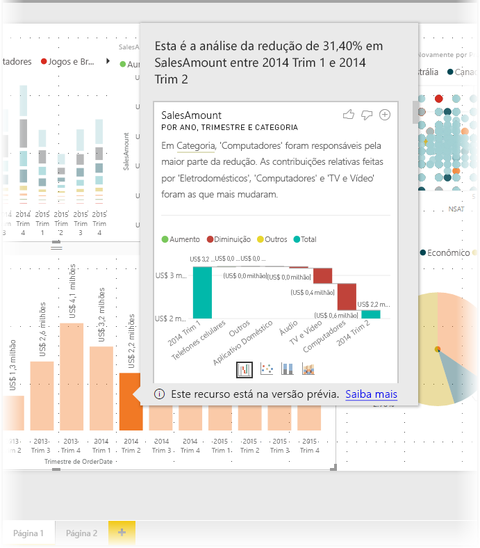
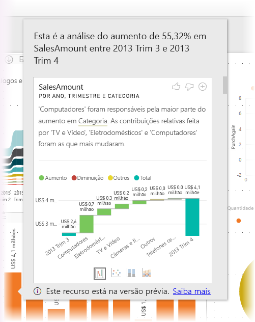
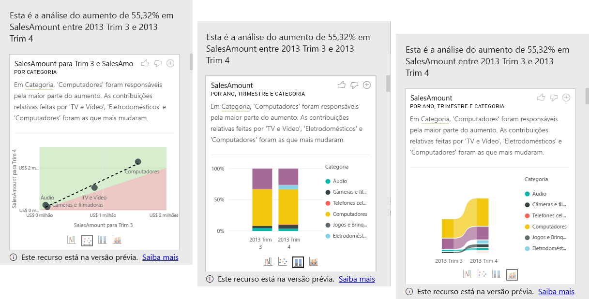

# Aplicar insights no Power BI Desktop para explicar flutuações em visuais (versão prévia)

Muitas vezes nos visuais, você vê um grande aumento e, em seguida, uma queda brusca nos valores e questiona a causa dessas flutuações. Com os **insights** no **Power BI Desktop** você pode saber a causa com apenas alguns cliques.

Por exemplo, considere o seguinte visual que mostra *Valor de Vendas* por *Ano* e *Trimestre*. Uma grande diminuição nas vendas ocorre em 2014, com as vendas caindo bruscamente no *1º Trimestre* e no *2º Trimestre*. Nesses casos, você pode explorar os dados para explicar a alteração ocorrida. 

É possível pedir ao **Power BI Desktop** para explicar aumentos ou diminuições e ver fatores de distribuição em gráficos, além de obter uma análise rápida, automatizada e repleta de insights sobre seus dados. Basta clicar com o botão direito do mouse em um ponto de dados e selecionar **Analisar > Explicar a diminuição** (ou o aumento, se a barra anterior era menor) ou **Analisar > Encontrar o local em que a distribuição é diferente** e o insight será fornecido em uma janela fácil de usar.

O recurso de insights é contextual e baseia-se no ponto de dados imediatamente anterior – como a coluna ou a barra anterior.

> [!NOTE]
> Esse recurso está em versão prévia e sujeito a alterações. O recurso de insights está habilitado e ativado por padrão (não é necessário marcar uma caixa Versão Prévia para habilitá-lo) a partir da versão de setembro de 2017 do **Power BI Desktop**.

## Usando insights
Para usar os insights para explicar os aumentos ou as diminuições mostrados nos gráficos, basta clicar com o botão direito do mouse em qualquer ponto de dados em um gráfico de barras ou de linhas e selecionar **Analisar > Explicar o aumento** (ou *Explicar a diminuição*, pois todos os insights são baseados na alteração em relação ao ponto de dados anterior).

Em seguida, o **Power BI Desktop** executa seus algoritmos de aprendizado de máquina sobre os dados e popula uma janela com um visual e uma descrição que indica quais categorias influenciaram mais o aumento ou a diminuição. Por padrão, os insights são fornecidos como um visual de *cascata*, conforme mostrado na imagem a seguir.

Selecionando os ícones pequenos na parte inferior do visual de cascata, você pode optar por fazer com que os insights exibam um gráfico de dispersão, gráfico de colunas empilhadas ou gráfico de faixa de opções.

Os ícones *polegar para cima* e *polegar para baixo* na parte superior da página são fornecidos para que você possa fornecer comentários sobre o visual e o recurso. Isso fornece comentários, mas, no momento, não treina o algoritmo para influenciar os resultados retornados na próxima vez que você usar o recurso.

Além disso, o mais importante é o botão **+** na parte superior do visual, que permite adicionar o visual selecionado ao relatório, como se você tivesse criado o visual manualmente. Em seguida, você pode formatar ou, de outro modo, ajustar o visual adicionado exatamente como faria em qualquer outro visual do relatório. Você só pode adicionar um visual de insight selecionado quando estiver editando um relatório no **Power BI Desktop**.

Use os insights quando o relatório estiver no modo de leitura ou de edição, tornando-o versátil para a análise de dados e para a criação de visuais que podem ser adicionados com facilidade aos relatórios.

## Detalhes dos resultados retornados

Os detalhes retornados pelos insights destinam-se a realçar o que estava diferente entre os dois períodos para ajudá-lo a entender a alteração entre eles.  

Por exemplo, se as *Vendas* aumentaram em 55% em geral do *3º trimestre* para o *4º trimestre*, se as vendas também aumentaram para cada *Categoria* de produto (as vendas de Computers, Audio e assim por diante também aumentaram em 55%) e também para todos os países e para todos os tipos de cliente, não há muito a ser identificado nos dados para ajudar a explicar a alteração. No entanto, essa situação não é a mais comum e, normalmente, é possível encontrar diferenças no que ocorreu, por exemplo, entre todas as categorias, *Computers* e *Home Appliances* cresceram mais, a uma taxa de 63%, enquanto *TV and Audio* cresceu menos, a apenas 23% e, portanto, *Computers* e *Home Appliances* contribuíram com um valor maior do total no *4º trimestre* do que no *3º trimestre*.  Considerando esse exemplo, uma explicação razoável sobre o aumento seria: *vendas especificamente sólidas para Computers e TV and Audio*. 

Então, o algoritmo não está simplesmente retornando os valores que representam o maior valor da alteração. Por exemplo, se a grande maioria (98%) das vendas veio dos EUA, provavelmente a maior parte do aumento também veio dos EUA. Porém, se os EUA ou outros países tiveram uma alteração significativa em suas contribuições relativas ao total, *País* não seria considerado interessante nesse contexto.  

Para simplificar, entenda que o algoritmo obtém todas as outras colunas no modelo e, em seguida, calcula a divisão por essa coluna para os períodos de tempo *antes* e *depois*, determinando o tamanho da alteração ocorrida nessa divisão e, em seguida, retorna as colunas com a maior alteração. Por exemplo, *Categoria* foi selecionado no exemplo acima porque a contribuição feita por *TV e Vídeo* caiu 7%, de 33% para % 26, enquanto a contribuição de *Home Appliances* cresceu de zero para mais de 6%. 

Para cada coluna retornada, há quatro visuais que podem ser exibidos. Três desses visuais destinam-se a realçar a alteração na contribuição entre os dois períodos. Por exemplo, para obter a explicação do aumento do *2º trimestre* para o *3º trimestre*.

### O gráfico de dispersão

O visual de gráfico de dispersão mostra o valor da medida no primeiro período (no eixo x) em relação ao valor da medida no segundo período (no eixo y), para cada valor da coluna (*Categoria*, nesse caso). Assim, conforme é mostrado na imagem a seguir, os pontos de dados ficam na região verde quando o valor aumenta e na região vermelha quando ele diminui. 

A linha pontilhada mostra o melhor ajuste e, assim, os pontos de dados acima dessa linha aumentaram mais do que a tendência geral e os que estão abaixo dela, aumentaram menos.  

Observe que os itens de dados cujo valor estava em branco em qualquer período não são exibidos no gráfico de dispersão (por exemplo, *Home Appliances*, nesse caso)

### O gráfico de colunas 100% empilhadas

O visual de gráfico de colunas 100% empilhadas mostra o valor da medida antes e depois, pela coluna selecionada, mostrada como uma coluna 100% empilhada. Isso permite uma comparação lado a lado da contribuição antes e depois. As dicas de ferramenta mostram a contribuição real para o valor selecionado.

### O gráfico de faixa de opções

O visual de gráfico de faixa de opções também mostra o valor da medida antes e depois. Ele é muito útil para mostrar as alterações nas contribuições quando elas causam uma alteração na *ordenação* das contribuições (por exemplo, se a categoria *Computers* era a primeira em contribuição antes, mas, em seguida, caiu para o terceiro lugar). 

### O gráfico de cascata

O quarto visual é um gráfico de cascata, que mostra os principais aumentos ou diminuições reais entre os períodos. Esse visual mostra claramente as alterações reais, mas não indica sozinho as alterações no nível de contribuição que, na verdade, destacam o motivo pelo qual a coluna foi escolhida como interessante. 

Durante a classificação da coluna em relação a qual tem as maiores diferenças nas contribuições relativas, é considerado o seguinte: 

* A cardinalidade é fatorada, pois uma diferença é menos significativa estatisticamente e menos interessante quando uma coluna tem uma cardinalidade grande. 

* As diferenças para essas categorias em que os valores originais são muito altos ou muito próximos de zero são ponderadas mais do que outras. Por exemplo, se uma categoria contribuía apenas com 1% das vendas e passou a contribuir com 6%, isso é mais significativo estatisticamente e, portanto, considerado mais interessante, do que uma categoria cuja contribuição foi alterada de 50% para 55%. 

* Várias heurísticas são utilizadas para selecionar os resultados mais significativos, por exemplo, considerando as outras relações entre os dados.
 
Depois de examinar as diferentes colunas, aquelas que mostram a maior alteração na contribuição relativa são escolhidas e apresentadas no resultado. Para cada uma, os valores que tiveram a alteração mais significativa na contribuição são destacados na descrição. Além disso, os valores que tiveram os maiores aumentos e diminuições reais também são indicados.

## Considerações e limitações
Como esses insights são baseados na alteração em relação ao ponto de dados anterior, eles não estão disponíveis quando o primeiro ponto de dados é selecionado em um visual. 

A lista a seguir é a coleção de cenários sem suporte no momento para **explicar o aumento ou a diminuição**:

* Filtros TopN
* Filtros Incluir/excluir
* Filtros de medida
* Medidas não numéricas
* Uso de "Mostrar valor como"
* Medidas filtradas – medidas filtradas são cálculos no nível do visual com um filtro específico aplicado (por exemplo, *Total de Vendas na França*) e são usadas em alguns dos visuais criados pelo recurso de insights
* Colunas categóricas no eixo X, a menos que ele defina uma classificação por coluna que seja escalar. Se você estiver usando uma hierarquia, todas as colunas na hierarquia ativa deverão corresponder a essa condição

Além disso, atualmente, não há suporte para os seguintes tipos de modelo e fontes de dados em insights:

* DirectQuery
* Live Connect
* Reporting Services local
* Inserção

## Próximas etapas
Para obter mais informações sobre o **Power BI Desktop** e como começar, confira os artigos a seguir.

* [O que é o Power BI Desktop?](../fundamentals/desktop-what-is-desktop.md)
* [Visão geral de Consulta com o Power BI Desktop](../transform-model/desktop-query-overview.md)
* [Fontes de dados no Power BI Desktop](../connect-data/desktop-data-sources.md)
* [Conectar-se a dados no Power BI Desktop](../connect-data/desktop-connect-to-data.md)
* [Formatar e combinar dados com o Power BI Desktop](../connect-data/desktop-shape-and-combine-data.md)
* [Tarefas comuns de consulta no Power BI Desktop](../transform-model/desktop-common-query-tasks.md)   
