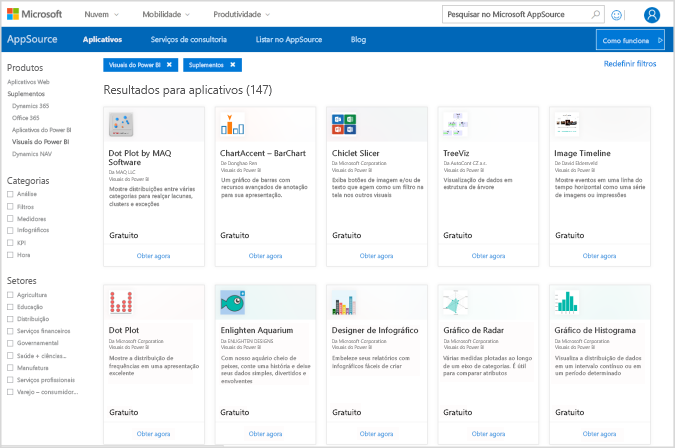
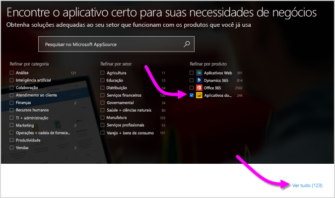
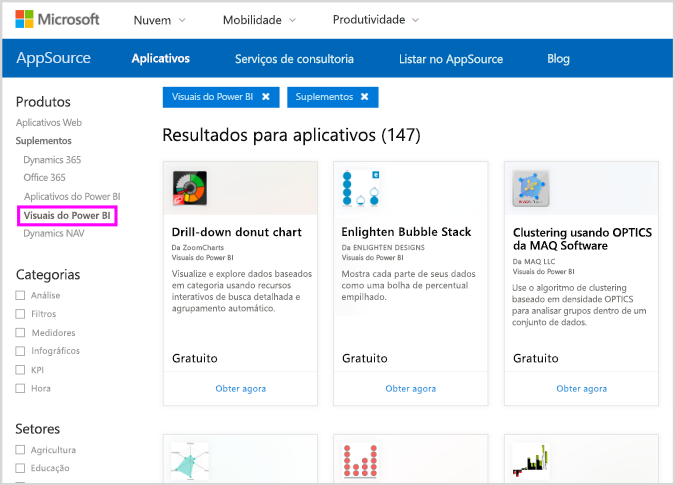
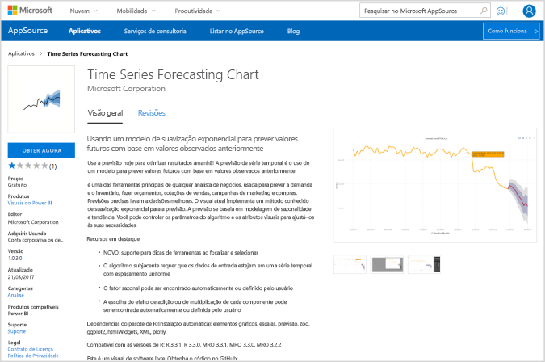
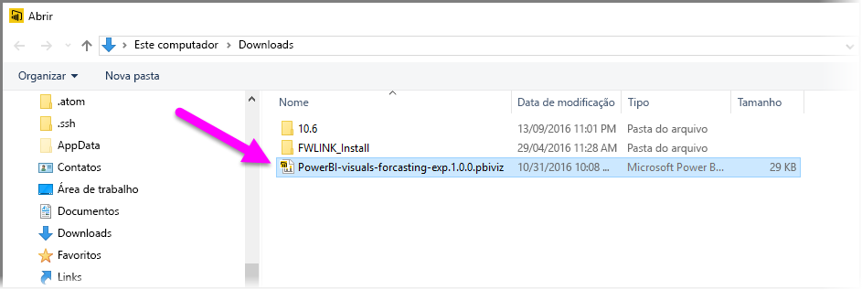
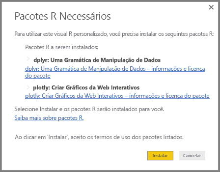
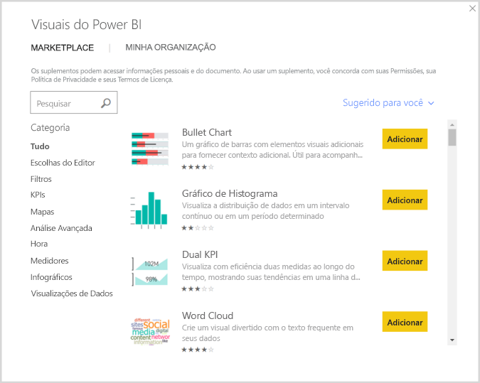

# Usar visuais do Power BI baseados em R no Power BI

No **Power BI Desktop** e no **serviço do Power BI**, você pode usar visuais do Power BI baseados em R sem nenhum conhecimento de R e sem nenhum script de R. Isso permite que você aproveite o poder analítico e visual de elementos visuais e dos scripts do R, sem a necessidade de aprender ou fazer programação em R.

Para usar visuais do Power BI baseados em R, primeiro, selecione e baixe o visual personalizado de R em que está interessado na galeria [**AppSource**](https://appsource.microsoft.com/marketplace/apps?product=power-bi-visuals&page=1) de **visuais do Power BI**.

As seções a seguir descrevem como selecionar, carregar e usar elementos visuais baseados em R no **Power BI Desktop**.

## Usar visuais do Power BI em R

Para usar visuais do Power BI baseados em R, baixe cada visual da biblioteca de **visuais do Power BI**, depois, use o visual como qualquer outro tipo de visual no **Power BI Desktop**. Há duas maneiras de obter visuais do Power BI: você pode baixá-los do site **AppSource** online ou procurar e obtê-los no **Power BI Desktop**. 

### Obter visuais do Power BI do AppSource

Abaixo estão as etapas para procurar e selecionar visuais no site **AppSource** online:

1. Navegue até a biblioteca dos visuais do Power BI, encontrada em [https://appsource.microsoft.com](https://appsource.microsoft.com/). Selecione a caixa de seleção de *aplicativos do Power BI* em *Refinar por produto* e, em seguida, selecione o link **Ver todos**.

   

2. Na página da biblioteca [Visuais do Power BI](https://appsource.microsoft.com/marketplace/apps?product=power-bi-visuals&page=1), selecione **Visuais do Power BI** da lista de Suplementos no painel esquerdo.

   

3. Selecione o **visual** que desejar usar da galeria e você será levado para uma página que descreve o visual. Selecione o botão **Obtê-lo agora** para baixar.

   > [!NOTE]
    > Para criar no **Power BI Desktop**, você precisa ter o R instalado no computador local. Mas quando os usuários desejarem exibir um elemento visual baseado em R no **serviço do Power BI** eles não precisam ter o R instalado localmente.

   

   Você não precisa instalar o R para usar visuais do Power BI baseados em R no **serviço do Power BI**, no entanto, se quiser usar visuais do Power BI baseados em R no **Power BI Desktop**, *instale* o R no computador local. Você pode baixar o R nos seguintes locais:

   * [CRAN](https://cran.r-project.org/)
   * [MRO](https://mran.microsoft.com/)

4. Depois que visual é baixado (que é como baixar de qualquer arquivo do seu navegador), vá para **Power BI Desktop** e clique em **Mais opções** (...) no painel **Visualizações** e selecione **Importar do arquivo**.

   
5. Você recebe um aviso sobre como importar um elemento visual personalizado, conforme mostrado na imagem a seguir:

   
6. Navegue para onde o arquivo do elemento visual foi salvo, depois, selecione o arquivo. Visualizações personalizadas do **Power BI Desktop** têm a extensão .pbiviz.

   
7. Quando você retorna ao Power BI Desktop, é possível ver o novo tipo de elemento visual no painel de **Visualizações**.

   
8. Quando você importar o novo visual (ou abrir um relatório que contém um elemento visual personalizado baseado em R), o **Power BI Desktop** instala os pacotes do R necessários.

   

9. A partir daí, você pode adicionar dados para o elemento visual assim como faria com qualquer outro elemento visual do **Power BI Desktop**. Ao concluir, é possível ver seu elemento visual concluído na tela. No elemento visual a seguir, o elemento visual baseado em R de **Previsão** foi usado com projeções de taxa de nascimento das Nações Unidas (NU) (elemento visual à esquerda).

    

    Como qualquer outro elemento visual do **Power BI Desktop**, você pode publicar esse relatório com seus elementos visuais baseados em R no **serviço do Power BI** e compartilhá-lo com outras pessoas.

    Verifique a biblioteca com frequência, pois novos visuais estão sendo adicionados o tempo todo.

### Obter visuais do Power BI do **Power BI Desktop**

1. Você também pode obter visuais do Power BI do **Power BI Desktop**. No **Power BI Desktop**, clique nas reticências (...) no painel **Visualizações** e selecione **Importar do marketplace**.

   

2. Quando você faz isso, a caixa de diálogo **Visuais do Power BI** é exibida, na qual você pode percorrer os visuais do Power BI disponíveis e selecionar o que você deseja. Você pode pesquisar por nome, selecionar uma categoria ou apenas percorrer os visuais disponíveis. Quando você estiver pronto, basta selecionar **Adicionar** para adicionar o visual personalizado para **Power BI Desktop**.

   

## Contribuir com visuais do Power BI baseados em R

Se você criar elementos visuais do R para uso em seus relatórios, poderá compartilhar esses elementos visuais com o mundo colocando o seu elemento visual personalizado na **galeria de visuais do Power BI**. Contribuições são feitas por meio do GitHub e o processo é descrito nas seguintes localizações:

* [Contribuição com a galeria de visuais do Power BI baseados em R](https://github.com/Microsoft/PowerBI-visuals#building-r-powered-custom-visual-corrplot)

## Solução de problemas com visuais do Power BI baseados em R

Os visuais do Power BI baseados em R têm determinadas dependências que devem ser atendidas para que funcionem corretamente. Quando os visuais do Power BI baseados em R não são executados ou carregados corretamente, o problema é geralmente um dos seguintes:

* O mecanismo de R está ausente
* Erros no script de R no qual o elemento visual se baseia
* Os pacotes de R estão ausentes ou desatualizados

A seção a seguir descreve as etapas de solução de problemas que podem ser seguidas para ajudar a resolver os problemas que você encontrar.

### Pacotes de R ausentes ou desatualizados

Ao tentar instalar um elemento visual personalizado baseado em R, você pode encontrar erros quando houver pacotes de R ausentes ou desatualizados; isso ocorre devido a um dos seguintes motivos:

* A instalação do R é incompatível com o pacote do R,
* Configurações de proxy, software antivírus ou um firewall estão impedindo o R de conectar-se com a Internet
* A conexão com a Internet está lenta ou há um problema de conexão com a Internet

A equipe do Power BI está trabalhando ativamente para atenuar esses problemas antes que eles cheguem a você e o próximo Power BI Desktop incorporará atualizações para resolver esses problemas. Até lá, você pode executar uma ou mais das etapas a seguir para atenuar os problemas:

1. Remova o elemento visual personalizado e instale-o novamente. Isso iniciará uma reinstalação dos pacotes de R.
2. Se sua instalação do R não estiver atualizada, atualize sua instalação do R e, em seguida, remova e reinstale o elemento visual personalizado conforme descrito na etapa anterior.

   As versões de R com suporte estão listadas na descrição de cada elemento visual personalizado baseado em R, conforme mostrado na imagem a seguir.

     
    > [!NOTE]
    > Mantenha a instalação original do R e associe apenas o Power BI Desktop com a versão atual que instalar. Vá para **Arquivo > Opções e configurações > Opções > Script de R**.

3. Instale os pacotes de R manualmente, usando qualquer console do R. As etapas desta abordagem são as seguintes:

   a.  Baixe o script de instalação do elemento visual baseado em R e salve esse arquivo em uma unidade local.

   b.  No console do R, execute o seguinte:

       source("C:/Users/david/Downloads/ScriptInstallPackagesForForecastWithWorkarounds.R")

   Os locais típicos de instalação padrão são os seguintes:

       c:\Program Files\R\R-3.3.x\bin\x64\Rterm.exe (for CRAN-R)
       c:\Program Files\R\R-3.3.x\bin\x64\Rgui.exe (for CRAN-R)
       c:\Program Files\R\R-3.3.x\bin\R.exe (for CRAN-R)
       c:\Program Files\Microsoft\MRO-3.3.x\bin\R.exe (for MRO)
       c:\Program Files\Microsoft\MRO-3.3.x\bin\x64\Rgui.exe (for MRO)
       c:\Program Files\RStudio\bin\rstudio.exe (for RStudio)
4. Se as etapas anteriores não funcionarem, tente o seguinte:

   a. Use o **R Studio** e siga a etapa descrita acima em 3.b. (executar a linha de script do console do R).

   b. Se a etapa anterior não funcionar, altere **Ferramentas > Opções globais > Pacotes** no **R Studio** e habilite a caixa de seleção **Usar a biblioteca/proxy do Internet Explorer para HTTP** e, em seguida, repita a etapa 3.b. das etapas acima.

## Próximas etapas

Analise as informações adicionais a seguir sobre o R no Power BI.

* [Galeria de Visuais do Power BI](https://app.powerbi.com/visuals/)
* [Executando scripts do R no Power BI Desktop](../connect-data/desktop-r-scripts.md)
* [Criar elementos visuais do R no Power BI Desktop](desktop-r-visuals.md)
* [Usar um IDE R externo com o Power BI](../connect-data/desktop-r-ide.md)
