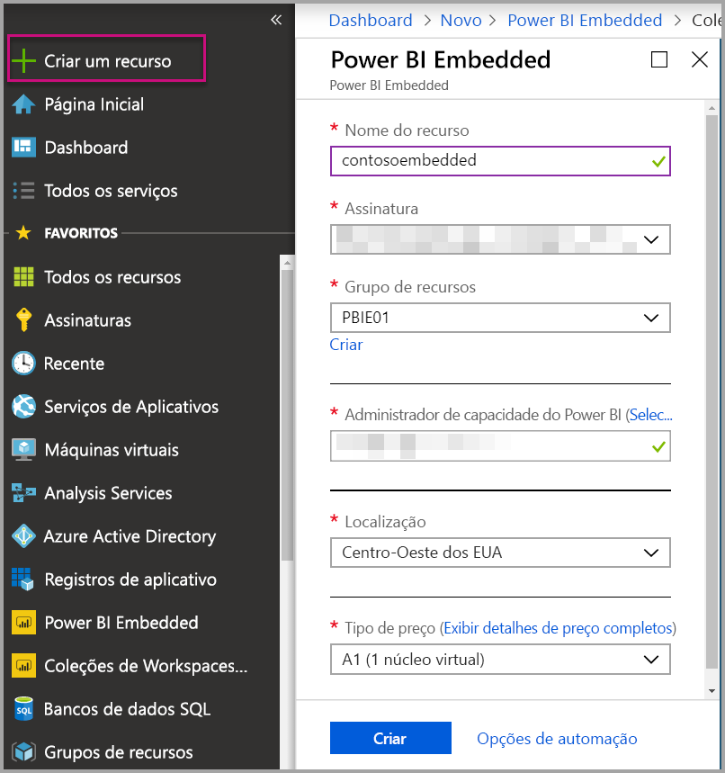
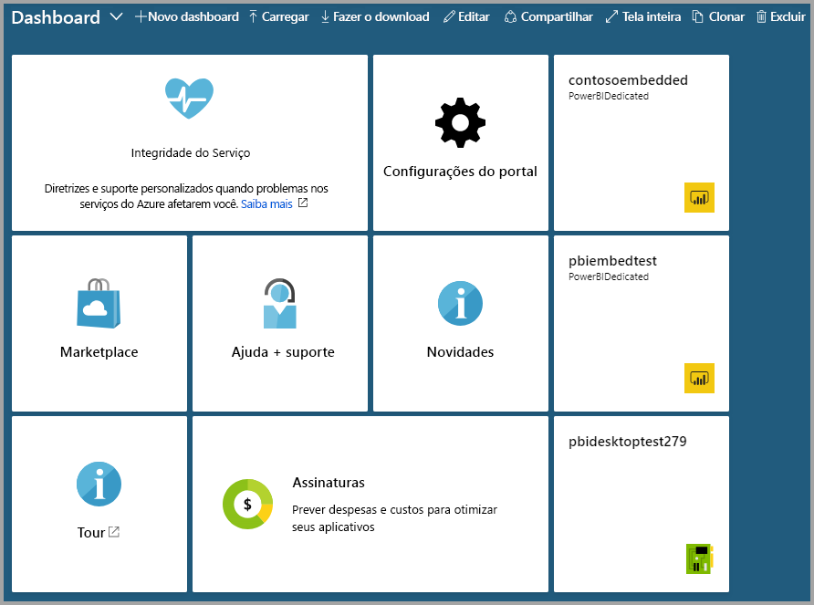

# Criar uma capacidade do Power BI Embedded no portal do Azure

Este artigo explica como criar uma capacidade do [Power BI Embedded](azure-pbie-what-is-power-bi-embedded.md) no Microsoft Azure. O Power BI Embedded simplifica as funcionalidades do Power BI, ajudando você a adicionar rapidamente visuais, relatórios e dashboards impressionantes aos aplicativos.

Se você não tiver uma assinatura do Azure, crie uma [conta gratuita](https://azure.microsoft.com/free/) antes de começar.

> [!VIDEO https://www.youtube.com/embed/aXrvFfg_iSk]

## Antes de começar

Para concluir este início rápido, você precisa:

* **Assinatura do Azure:** visite a [Avaliação Gratuita do Azure](https://azure.microsoft.com/free/) para criar uma conta.
* **Azure Active Directory:** sua assinatura precisa estar associada a um locatário do AAD (Azure Active Directory). Além disso, ***você precisa estar conectado ao Azure com uma conta nesse locatário***. Não há suporte para contas Microsoft. Para obter mais informações, confira [Autenticação e permissões de usuário](https://docs.microsoft.com/azure/analysis-services/analysis-services-manage-users).
* **Locatário do Power BI:** pelo menos uma conta no seu locatário do AAD precisa estar inscrita no Power BI.
* **Grupo de recursos:** use um grupo de recursos existente ou [crie um](https://docs.microsoft.com/azure/azure-resource-manager/resource-group-overview).

## Criar uma capacidade

1. Entre no [Portal do Azure](https://portal.azure.com/).

2. Na caixa de pesquisa, procure *Power BI Embedded*.

3. No Power BI Embedded, selecione **Criar**.

4. Preencha as informações necessárias e, em seguida, selecione **Criar**.

    

    |Configuração |Descrição |
    |---------|---------|
    |**Nome do recurso**|Um nome para identificar a capacidade. O nome do recurso é exibido no portal do Azure e também no portal de administração do Power BI.|
    |**Assinatura**|A assinatura na qual você deseja criar a capacidade.|
    |**Grupo de recursos**|O grupo de recursos que contém essa nova capacidade. Escolha um grupo de recursos existente ou crie outro. Para obter mais informações, confira [Visão geral do Azure Resource Manager](https://docs.microsoft.com/azure/azure-resource-manager/resource-group-overview).|
    |**Administrador de capacidade do Power BI**|Os administradores de capacidade do Power BI podem exibir a capacidade no portal de administração do Power BI e conceder permissões de atribuição a outros usuários. Por padrão, o administrador de capacidade é a sua conta. O administrador de capacidade precisa pertencer ao locatário do Power BI.|
    |**Local**|O local em que o Power BI está hospedado para seu locatário. O local padrão é sua região de residência, mas você pode alterar o local usando [Opções de Multi-Geo](embedded-multi-geo.md).
    |**Tipo de preço**|Selecione o SKU (contagem de núcleos virtuais e tamanho da memória) que atende às suas necessidades.  Para obter detalhes, confira [Preços do Power BI Embedded](https://azure.microsoft.com/pricing/details/power-bi-embedded/)|

Você pode navegar para **Todos os serviços** > **Power BI Embedded** para ver se sua capacidade está pronta. Como alternativa, você pode selecionar **Fixar no dashboard** na seção notificações ou dentro de folha para navegar até seu dashboard para ver a nova capacidade.

## Próximas etapas

Para usar a nova capacidade do Power BI Embedded, navegue até o portal de administração do Power BI para atribuir workspaces. Para obter mais informações, confira [Gerenciar capacidades no Power BI Premium e no Power BI Embedded](https://powerbi.microsoft.com/documentation/powerbi-admin-premium-manage/).

Se você não precisa usar essa capacidade, é possível pausá-la para interromper a cobrança. Para obter mais informações, confira [Pausar e iniciar a capacidade do Power BI Embedded no portal do Azure](azure-pbie-pause-start.md).

Para começar a inserir conteúdo do Power BI em seu aplicativo, confira [Como inserir dashboards, relatórios e blocos do Power BI](https://powerbi.microsoft.com/documentation/powerbi-developer-embedding-content/).

Mais perguntas? [Experimente perguntar à Comunidade do Power BI](https://community.powerbi.com/)