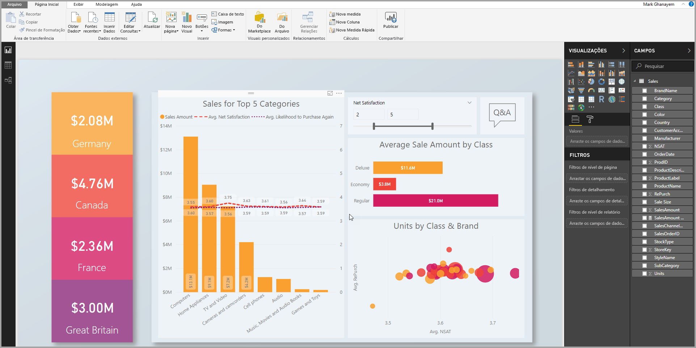
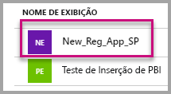
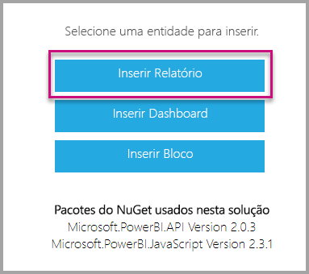
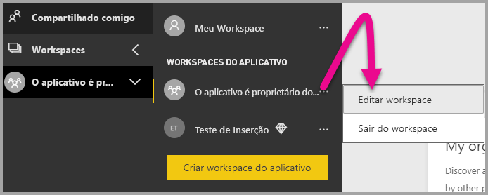
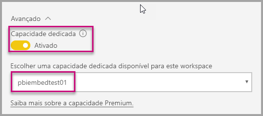
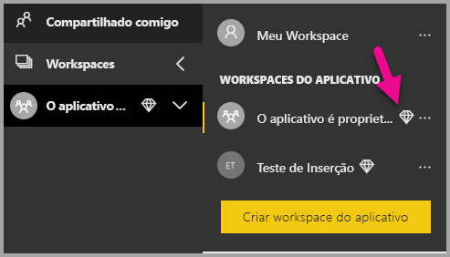

# <a name="tutorial-embed-power-bi-content-into-an-application-for-your-customers"></a>Tutorial: Inserir conteúdo do Power BI em um aplicativo para seus clientes

Com o **Power BI Embedded no Azure** ou a **Inserção do Power BI no Office**, você pode inserir relatórios, dashboards ou blocos em um aplicativo usando app owns data. **App owns data** representa um aplicativo que usa o Power BI como sua plataforma de análise incorporada. Como um **ISV** ou um **desenvolvedor**, é possível criar conteúdo do Power BI que exiba relatórios, dashboards ou blocos em um aplicativo totalmente integrado e interativo, sem precisar que os usuários tenham uma licença do Power BI. Este tutorial demonstra como integrar um relatório em um aplicativo usando o SDK do .NET do Power BI com a API JavaScript do Power BI.


Neste tutorial, você aprenderá a:
> [!div class="checklist"]
> * Registrar um aplicativo no Azure.
> * Insira um relatório do Power BI em um aplicativo.

## <a name="prerequisites"></a>Pré-requisitos

Para começar, você precisa ter:

* Uma [conta Power BI Pro](../../fundamentals/service-self-service-signup-for-power-bi.md) (uma conta mestra que é um nome de usuário e senha para entrar em sua conta do Power BI Pro) ou uma [entidade de serviço (token somente de aplicativo)](embed-service-principal.md).
* Você precisa ter seu próprio [locatário do Azure Active Directory](create-an-azure-active-directory-tenant.md) configurado.

Se não estiver inscrito no **Power BI Pro**, [inscreva-se para uma avaliação gratuita](https://powerbi.microsoft.com/pricing/) antes de começar.

## <a name="set-up-your-embedded-analytics-development-environment"></a>Configurar seu ambiente de desenvolvimento de análise integrada

Antes de começar a inserir relatórios, dashboard ou blocos no seu aplicativo, você precisará verificar se o ambiente permite inserção com o Power BI.

Você pode examinar a [Ferramenta de configuração de integração](https://aka.ms/embedsetup/AppOwnsData) para que possa iniciar rapidamente e baixar um aplicativo de exemplo que ajuda a criar um ambiente e a inserir um relatório.

No entanto, se você optar por configurar o ambiente manualmente, você poderá continuar abaixo.

### <a name="register-an-application-in-azure-active-directory-azure-ad"></a>Registrar um aplicativo no Azure AD (Azure Active Directory)

[Registre seu aplicativo](register-app.md) no Azure Active Directory para permitir que ele tenha acesso às [APIs REST do Power BI](https://docs.microsoft.com/rest/api/power-bi/). Registrando o aplicativo, você pode estabelecer uma identidade para ele e especificar permissões para recursos REST do Power BI. Dependendo de se você deseja usar uma conta mestra ou [entidade de serviço](embed-service-principal.md), determine como começar a registrar um aplicativo.

O método você adota afeta o tipo de aplicativo que você registra no Azure.

Se você continuar usando uma conta mestra, continue com o registro de um aplicativo **nativo**. Você usa um aplicativo Nativo porque você está trabalhando com um logon não interativo.

No entanto, se você continuar usando a entidade de serviço, precisará continuar com o registro de um **aplicativo Web do lado do servidor**. Registre um aplicativo Web do lado do servidor para criar um segredo do aplicativo.

## <a name="set-up-your-power-bi-environment"></a>Configurar seu ambiente do Power BI

### <a name="create-a-workspace"></a>Criar um workspace

Se você estiver inserindo relatórios, dashboards ou blocos para seus clientes, precisará colocar o conteúdo dentro de um workspace. Há diferentes tipos de workspaces que você pode configurar: o [workspaces tradicionais](../../collaborate-share/service-create-workspaces.md) ou o [novos workspaces](../../collaborate-share/service-create-the-new-workspaces.md). Se você está usando uma conta *mestra*, não importa qual tipo de workspaces você usa. No entanto, se você usa *[entidade de serviço](embed-service-principal.md)* para entrar em seu aplicativo, é necessário que você use os novos workspaces. Em qualquer cenário, tanto a conta *mestra* quanto a *entidade de serviço* devem ser administradoras dos workspaces envolvidos com o seu aplicativo.

### <a name="create-and-publish-your-reports"></a>Crie e publique seus relatórios

É possível criar seus relatórios e conjuntos de dados usando o Power BI Desktop e, em seguida, publicar esses relatórios em um workspace. Há duas maneiras de realizar essa tarefa: Como um usuário final, você pode publicar relatórios para um workspace tradicional com uma conta mestra (licença do Power BI Pro). Se você estiver usando a entidade de serviço, poderá publicar relatórios nos novos workspaces usando as [APIs de REST do Power BI](https://docs.microsoft.com/rest/api/power-bi/imports/postimportingroup).

As etapas a seguir explicam como publicar seu relatório PBIX em seu workspace do Power BI.

1. Baixe o exemplo [Blog Demo](https://github.com/Microsoft/powerbi-desktop-samples) do GitHub.

    

2. Abra o relatório de exemplo do PBIX no **Power BI Desktop**.

   

3. Publique em **workspaces**. Esse processo é diferente dependendo de se você está usando uma conta mestra (licença do Power Pro) ou entidade de serviço. Se você estiver usando uma conta mestra, poderá publicar seu relatório por meio do Power BI Desktop.  Agora, se você estiver usando a entidade de serviço, deverá usar as APIs REST do Power BI.

## <a name="embed-content-using-the-sample-application"></a>Insira conteúdo usando o aplicativo de exemplo

Este exemplo é deliberadamente mantido simples para fins de demonstração. Cabe a você ou aos seus desenvolvedores proteger o segredo do aplicativo ou as credenciais da conta mestra.

Siga as etapas abaixo para começar a inserir seu conteúdo usando o aplicativo de exemplo.

1. Baixe o [Visual Studio](https://www.visualstudio.com/) (versão 2013 ou posterior). Baixe a versão mais recente do [pacote do NuGet](https://www.nuget.org/profiles/powerbi).

2. Baixe o [exemplo App Owns Data](https://github.com/Microsoft/PowerBI-Developer-Samples) do GitHub para começar.

    

3. Abra o arquivo **Web.config** no aplicativo de exemplo. Há campos que você precisa preencher para executar o aplicativo. Você pode escolher **MasterUser** ou **ServicePrincipal** para **AuthenticationType**. Dependendo de qual tipo de método de autenticação é escolhido, há campos diferentes para preencher.

    > [!Note]
    > O padrão **AuthenticationType** neste exemplo é MasterUser.

    <center>

    | **MasterUser** <br> (licença do Power BI Pro) | **ServicePrincipal** <br> (token somente de aplicativo)|
    |---------------|-------------------|
    | [applicationId](#application-id) | [applicationId](#application-id) |
    | [workspaceId](#workspace-id) | [workspaceId](#workspace-id) |
    | [reportId](#report-id) | [reportId](#report-id) |
    | [pbiUsername](#power-bi-username-and-password) |  |
    | [pbiPassword](#power-bi-username-and-password) |  |
    |  | [applicationsecret](#application-secret) |
    |  | [tenant](#tenant) |

   </center>

    

### <a name="application-id"></a>ID do aplicativo

Esse atributo é necessário para ambos os AuthenticationTypes (conta mestra e [entidade de serviço](embed-service-principal.md)).

Preencha as informações de **applicationId** com a **ID do Aplicativo** do **Azure**. A **applicationId** é usada pelo aplicativo para identificar-se aos usuários para os quais você está solicitando permissões.

Para obter a **applicationId**, siga estas etapas:

1. Entre no [Portal do Azure](https://portal.azure.com).

2. No painel de navegação, selecione **Todos os serviços** e **Registros de aplicativo**.

    

3. Selecione o aplicativo que precisa usar a **applicationId**.

    

4. Há uma **ID do Aplicativo** listada como GUID. Use essa **ID do aplicativo** como a **applicationId** do aplicativo.

    

### <a name="workspace-id"></a>ID do workspace

Esse atributo é necessário para ambos os AuthenticationTypes (conta mestra e [entidade de serviço](embed-service-principal.md)).

Preencha as informações de **workspaceId** com o GUID do workspace (grupo) do Power BI. Você pode obter essas informações da URL quando conectado ao serviço do Power BI ou usando o Powershell.

URL <br>


PowerShell <br>

```powershell
Get-PowerBIworkspace -name "App Owns Embed Test"
```

   

### <a name="report-id"></a>ID do Relatório

Esse atributo é necessário para ambos os AuthenticationTypes (conta mestra e [entidade de serviço](embed-service-principal.md)).

Preencha as informações de **reportId** com o GUID de relatório do Power BI. Você pode obter essas informações da URL quando conectado ao serviço do Power BI ou usando o Powershell.

URL<br>


PowerShell <br>

```powershell
Get-PowerBIworkspace -name "App Owns Embed Test" | Get-PowerBIReport
```


### <a name="power-bi-username-and-password"></a>Nome de usuário e senha do Power BI

Esses atributos são necessárias somente para a conta mestra AuthenticationType.

Se você estiver usando [entidade de serviço](embed-service-principal.md) para autenticar, não precisa cumprir os atributos de nome de usuário ou senha.

* Preencha o **pbiUsername** com a conta mestra do Power BI.
* Preencha o **pbiPassword** com a senha da conta mestra do Power BI.

### <a name="application-secret"></a>Segredo do aplicativo

Esse atributo é necessário somente para a [entidade de serviço](embed-service-principal.md) AuthenticationType.

Preencha as informações de **ApplicationSecret** da seção **Chaves** na seção **Registros de aplicativo** no **Azure**.  Esse atributo funciona ao usar a [entidade de serviço](embed-service-principal.md).

Para obter o **ApplicationSecret**, siga estas etapas:

1. Entre no [portal do Azure](https://portal.azure.com).

2. No painel de navegação, selecione **Todos os serviços** e **Registros de aplicativo**.

    

3. Selecione o aplicativo que precisa usar o **ApplicationSecret**.

    

4. Selecione **Certificados e segredos** em **Gerenciar**.

5. Selecione **Segredos do novo cliente**.

6. Insira um nome na caixa **Descrição** e selecione uma duração. Em seguida, selecione **Salvar** para obter o **Valor** para seu aplicativo. Quando você fecha o painel **Chaves** depois de salvar o valor da chave, o campo de valor é mostrado como oculto. Neste ponto, você não pode recuperar o valor da chave. Se você perder o valor da chave, crie uma nova no portal do Azure.

    

### <a name="tenant"></a>Locatário

Esse atributo é necessário somente para a [entidade de serviço](embed-service-principal.md) AuthenticationType.

Preencha as informações do **locatário** com sua ID de locatário do Azure. Essas informações podem ser obtidas no [centro de administração do Azure AD](/onedrive/find-your-office-365-tenant-id) quando você estiver conectado ao serviço do Power BI ou usando o Powershell.

### <a name="run-the-application"></a>Execute o aplicativo

1. Selecione **Executar** no **Visual Studio**.

    

2. Selecione **Inserir Relatório**. Dependendo do conteúdo que você optar por testar – relatórios, painéis ou blocos –, selecione essa opção no aplicativo.

    

3. Agora, você pode exibir o relatório no aplicativo de exemplo.

    

## <a name="embed-content-within-your-application"></a>Inserir conteúdo em seu aplicativo

Embora as etapas para inserir seu conteúdo possam ser feitas com as [APIs REST do Power BI](https://docs.microsoft.com/rest/api/power-bi/), os códigos de exemplo descritos neste artigo são feitos com o **SDK do .NET**.

A inserção para seus clientes dentro de seu aplicativo exige que você obtenha um **token de acesso** para sua conta mestra ou [entidade de serviço](embed-service-principal.md) do **Azure AD**. É necessário obter um [token de acesso do Azure AD](get-azuread-access-token.md#access-token-for-non-power-bi-users-app-owns-data) para o seu aplicativo do Power BI antes de fazer chamadas a [APIs REST do Power BI](https://docs.microsoft.com/rest/api/power-bi/).

Para criar o cliente do Power BI com o **token de acesso**, crie o objeto de cliente do Power BI que permitirá interagir com as [APIs REST do Power BI](https://docs.microsoft.com/rest/api/power-bi/). Crie o objeto do cliente do Power BI encapsulando o **AccessToken** com um objeto ***Microsoft.Rest.TokenCredentials***.

```csharp
using Microsoft.IdentityModel.Clients.ActiveDirectory;
using Microsoft.Rest;
using Microsoft.PowerBI.Api.V2;

var tokenCredentials = new TokenCredentials(authenticationResult.AccessToken, "Bearer");

// Create a Power BI Client object. it's used to call Power BI APIs.
using (var client = new PowerBIClient(new Uri(ApiUrl), tokenCredentials))
{
    // Your code to embed items.
}
```

### <a name="get-the-content-item-you-want-to-embed"></a>Obter o item de conteúdo que você deseja inserir

É possível usar o objeto do cliente do Power BI para recuperar uma referência ao item que deseja inserir.

Veja um exemplo de código de como recuperar o primeiro relatório de um workspace específico.

*Um exemplo de obtenção de um item de conteúdo, seja um bloco, um relatório ou um dashboard que você deseja inserir, está disponível no arquivo Services\EmbedService.cs no [aplicativo de exemplo](https://github.com/Microsoft/PowerBI-Developer-Samples).*

```csharp
using Microsoft.PowerBI.Api.V2;
using Microsoft.PowerBI.Api.V2.Models;

// You need to provide the workspaceId where the dashboard resides.
ODataResponseListReport reports = await client.Reports.GetReportsInGroupAsync(workspaceId);

// Get the first report in the group.
Report report = reports.Value.FirstOrDefault();
```

### <a name="create-the-embed-token"></a>Criar o token de inserção
Gere um token de inserção, que pode ser usado por meio da API do JavaScript. Há dois tipos de APIs, o primeiro grupo contém cinco APIs, cada uma gera um token de inserção para um item específico. O segundo grupo, que contém apenas uma API, gera um token que pode ser usado para inserir vários itens.

**APIs para gerar um token de inserção para um item específico**

O token de inserção criado com essas APIs é específico do item que está sendo inserido. Sempre que você inserir um item do Power BI (assim como um relatório, dashboard ou bloco) com essas APIs, será necessário criar um token de inserção para ele.
* [GenerateTokenInGroup de dashboards](https://docs.microsoft.com/rest/api/power-bi/embedtoken/dashboards_generatetokeningroup)
* [GenerateTokenInGroup de conjuntos de dados](https://docs.microsoft.com/rest/api/power-bi/embedtoken/datasets_generatetokeningroup)
* [GenerateTokenForCreateInGroup de relatórios](https://docs.microsoft.com/rest/api/power-bi/embedtoken/reports_generatetokenforcreateingroup)
* [GenerateTokenInGroup de relatórios](https://docs.microsoft.com/rest/api/power-bi/embedtoken/reports_generatetokeningroup)
* [GenerateTokenInGroup de blocos](https://docs.microsoft.com/rest/api/power-bi/embedtoken/tiles_generatetokeningroup)

Exemplos de criação de um token de inserção para um relatório, dashboard ou bloco, estão disponíveis nos seguintes arquivos no [aplicativo de exemplo](https://github.com/Microsoft/PowerBI-Developer-Samples).
* Services\EmbedService.cs
* Models\EmbedConfig.cs
* Models\TileEmbedConfig.cs

Veja abaixo um exemplo de código para usar a API de token de inserção GenerateTokenInGroup de relatórios.
```csharp
using Microsoft.PowerBI.Api.V2;
using Microsoft.PowerBI.Api.V2.Models;

// Generate Embed Token.
var generateTokenRequestParameters = new GenerateTokenRequest(accessLevel: "view");
EmbedToken tokenResponse = client.Reports.GenerateTokenInGroup(workspaceId, report.Id, generateTokenRequestParameters);

// Generate Embed Configuration.
var embedConfig = new EmbedConfig()
{
    EmbedToken = tokenResponse,
    EmbedUrl = report.EmbedUrl,
    Id = report.Id
};
```

**API para gerar um token de inserção para vários itens**<a id="multiEmbedToken"></a>

A API de inserção [Gerar Token](https://docs.microsoft.com/rest/api/power-bi/embedtoken/generatetoken) gera um token que pode ser usado para inserir vários itens.

Ele também pode ser usado para selecionar dinamicamente um conjunto de dados ao inserir um relatório. Para obter mais informações sobre esse uso da API, confira [associação dinâmica](embed-dynamic-binding.md).


Veja abaixo um exemplo de como usar essa API.
 
```csharp
using Microsoft.PowerBI.Api.V2;
using Microsoft.PowerBI.Api.V2.Models;

var reports = new List<GenerateTokenRequestV2Report>()
{ 
    new GenerateTokenRequestV2Report()
    {
        AllowEdit = false,
        Id = report1.Id
    },
    new GenerateTokenRequestV2Report()
    {
        AllowEdit = true,
        Id = report2.Id
    }
};

var datasets= new List<GenerateTokenRequestV2Dataset>()
{
    new GenerateTokenRequestV2Dataset(dataset1.Id),
    new GenerateTokenRequestV2Dataset(dataset2.Id),
    new GenerateTokenRequestV2Dataset(dataset3.Id),
};

var targetWorkspaces = new List<GenerateTokenRequestV2TargetWorkspace>()
{
    new GenerateTokenRequestV2TargetWorkspace(workspace1.Id),
    new GenerateTokenRequestV2TargetWorkspace(workspace2.Id),
};

var request = new GenerateTokenRequestV2()
{
    Datasets = datasetsRequestDetails ?? null,
    Reports = reportsRequestDetails,
    TargetWorkspaces = targetWSRequestdetials ?? null,
};

var token = client.GetClient().EmbedToken.GenerateToken(request);
```

### <a name="load-an-item-using-javascript"></a>Carregar um item usando o JavaScript

Use o JavaScript para carregar um relatório em um elemento div na página da Web.

Para obter um exemplo completo de como usar a API JavaScript, use a [ferramenta de Playground](https://microsoft.github.io/PowerBI-JavaScript/demo). A ferramenta de Playground é uma maneira rápida de experimentar diferentes tipos de exemplos do Power BI Embedded. Também é possível obter mais informações sobre a API de JavaScript, acessando a página da [wiki PowerBI-JavaScript](https://github.com/Microsoft/powerbi-javascript/wiki).

Aqui está uma amostra que usa um modelo de **EmbedConfig** e de **TileEmbedConfig**, juntamente com as exibições de um relatório.

*Um exemplo de adição de uma exibição de um bloco, relatório ou painel está disponível nos arquivos Views\Home\EmbedReport.cshtml, Views\Home\EmbedDashboard.cshtml ou Views\Home\Embedtile.cshtml no [aplicativo de exemplo](#embed-content-using-the-sample-application).*

```javascript
<script src="~/scripts/powerbi.js"></script>
<div id="reportContainer"></div>
<script>
    // Read embed application token from Model
    var accessToken = "@Model.EmbedToken.Token";

    // Read embed URL from Model
    var embedUrl = "@Html.Raw(Model.EmbedUrl)";

    // Read report Id from Model
    var embedReportId = "@Model.Id";

    // Get models. models contains enums that can be used.
    var models = window['powerbi-client'].models;

    // Embed configuration used to describe what and how to embed.
    // This object is used when calling powerbi.embed.
    // This also includes settings and options such as filters.
    // You can find more information at https://github.com/Microsoft/PowerBI-JavaScript/wiki/Embed-Configuration-Details.
    var config = {
        type: 'report',
        tokenType: models.TokenType.Embed,
        accessToken: accessToken,
        embedUrl: embedUrl,
        id: embedReportId,
        permissions: models.Permissions.All,
        settings: {
            filterPaneEnabled: true,
            navContentPaneEnabled: true
        }
    };

    // Get a reference to the embedded report HTML element
    var reportContainer = $('#reportContainer')[0];

    // Embed the report and display it within the div container.
    var report = powerbi.embed(reportContainer, config);
</script>
```

## <a name="move-to-production"></a>Mover para a produção

Agora que você terminou o desenvolvimento do seu aplicativo, é hora de conferir uma capacidade dedicada ao workspace. 

> [!Important]
> É necessário ter capacidade dedicada para passar para a produção. Todos workspaces (aqueles que contêm os relatórios ou dashboards e os que contêm os conjuntos de dados) devem ser atribuídos a uma capacidade.

### <a name="create-a-dedicated-capacity"></a>Criar uma capacidade dedicada

Ao criar uma capacidade dedicada, é possível tirar proveito de um recurso dedicado para o seu cliente. Há dois tipos de capacidade dentre as quais você pode escolher:
* **Power BI Premium** – uma assinatura do Office 356 de nível de locatário disponível em duas famílias de SKU, *EM* e *P*. Ao inserir conteúdo do Power BI, essa solução é conhecida como *inserção do Power BI*. Para obter mais informação sobre essa assinatura, consulte [o que é Power BI Premium?](../../admin/service-premium-what-is.md)
* **Azure Power BI Embedded** – é possível comprar uma capacidade dedicada no [portal do Microsoft Azure](https://portal.azure.com). Essa assinatura usa os SKUs *A*. Para obter detalhes sobre como criar uma capacidade do Power BI Embedded, veja [Criar capacidade do Power BI Embedded no portal do Azure](azure-pbie-create-capacity.md).
> [!NOTE]
> Com SKUs A, não é possível acessar o conteúdo do Power BI com uma licença gratuita do Power BI.

A tabela a seguir descreve os recursos e limites de cada SKU. Para determinar qual capacidade atende melhor às suas necessidades, consulte a tabela [Qual SKU devo comprar para meu cenário](https://docs.microsoft.com/power-bi/developer/embedded-faq#which-solution-should-i-choose).

| Nós de Capacidade | Total de núcleos virtuais | Núcleos virtuais de back-end | RAM (GB) | Núcleos virtuais de front-end | DirectQuery/Conexão Dinâmica (por s) | Paralelismo de atualização de modelo |
| --- | --- | --- | --- | --- | --- | --- |
| EM1/A1 | 1 | 0,5 | 2.5 | 0,5 | 3,75 | 1 |
| EM2/A2 | 2 | 1 | 5 | 1 | 7,5 | 2 |
| EM3/A3 | 4 | 2 | 10 | 2 | 15 | 3 |
| P1/A4 | 8 | 4 | 25 | 4 | 30 | 6 |
| P2/A5 | 16 | 8 | 50 | 8 | 60 | 12 |
| P3/A6 | 32 | 16 | 100 | 16 | 120 | 24 |
| | | | | | | |

### <a name="development-testing"></a>Testes de desenvolvimento

Usar tokens inseridos com licenças Pro destina-se a teste de desenvolvimento, portanto, o número de tokens inseridos que uma conta mestra ou entidade de serviço do Power BI pode gerar é limitado. Uma capacidade dedicada requer inserção em um ambiente de produção. Não há limite para a quantidade de tokens inseridos que você pode gerar com uma capacidade dedicada. Acesse [Recursos Disponíveis](https://docs.microsoft.com/rest/api/power-bi/availablefeatures/getavailablefeatures) para verificar o valor de uso que indica o uso inserido atual, em percentual. A quantidade de uso é por conta mestre.

Para obter mais informações, consulte [Artigo sobre planejamento de capacidade de análise integrada](https://aka.ms/pbiewhitepaper).

### <a name="assign-a-workspace-to-a-dedicated-capacity"></a>Atribua um workspace a uma capacidade dedicada

Depois de criar uma capacidade dedicada, você pode atribuir o workspace a uma capacidade dedicada.

Todos os workspaces que contêm recursos do Power BI relacionados ao conteúdo inserido (incluindo conjuntos de dados, relatórios e dashboards) precisam ser atribuídos a capacidades dedicadas. Por exemplo, se um relatório inserido e o conjunto de dados vinculado a ele residirem em workspaces diferentes, ambos os workspaces precisarão ser atribuídos a capacidades dedicadas.

Para atribuir uma capacidade dedicada a um workspace usando [entidade de serviço](embed-service-principal.md), use a [API REST do Power BI](https://docs.microsoft.com/rest/api/power-bi/capacities/groups_assigntocapacity). Quando você estiver usando as APIs REST do Power BI, use a [ID de objeto de entidade de serviço](embed-service-principal.md).

Siga as etapas abaixo para atribuir uma capacidade dedicada a um workspace usando uma **conta mestre**.

1. No **serviço do Power BI**, expanda os workspaces e selecione as reticências do workspace que você está usando para inserir seu conteúdo. Depois, selecione **Editar workspaces**.

    

2. Expanda **Avançado**, habilite **Capacidade dedicada** e selecione a capacidade dedicada criada por você. Depois, selecione **Salvar**.

    

3. Depois que você selecionar **Salvar**, será exibido um **losango** próximo ao nome do workspace.

    

## <a name="next-steps"></a>Próximas etapas

Neste tutorial, você aprendeu como inserir o conteúdo do Power BI em um aplicativo para seus clientes. Você também pode tentar inserir o conteúdo do Power BI para sua organização.

> [!div class="nextstepaction"]
>[Inserir para a organização](embed-sample-for-your-organization.md)

Mais perguntas? [Experimente perguntar à Comunidade do Power BI](https://community.powerbi.com/)
