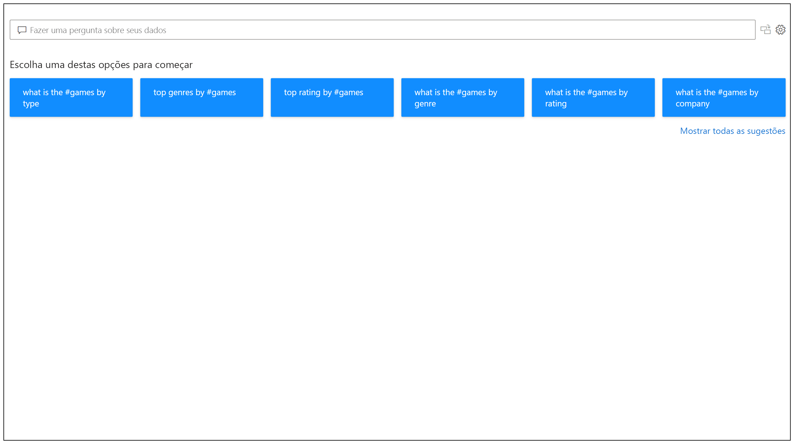
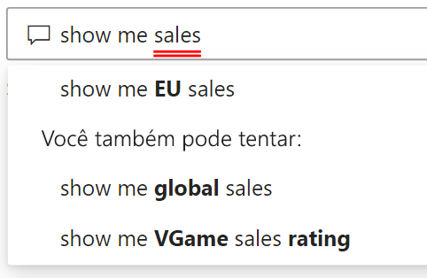
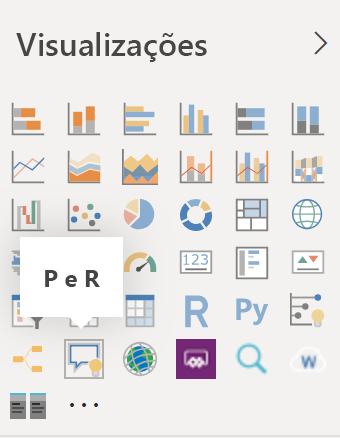

# Introdução à P e R do Power BI

Às vezes, a maneira mais rápida de obter uma resposta de seus dados é fazer uma pesquisa em seus dados usando o idioma natural. O recurso de P e R do Power BI permite que você explore seus dados com suas próprias palavras usando o idioma natural. A P e R é interativa e até mesmo divertida. Muitas vezes, uma pergunta leva a outras, pois as visualizações revelam caminhos interessantes a serem seguidos. A pergunta é apenas o começo. Explore seus dados refinando ou expandindo sua pergunta, descobrindo novas informações, concentrando-se em detalhes e afastando-se para obter uma visão mais ampla. A experiência é interativa e rápida, alimentada por armazenamento na memória. 

A P e R do Power BI é gratuita e está disponível para todos os usuários. No Power BI Desktop, os designers de relatórios podem usar P e R para explorar dados e criar visualizações. No serviço do Power BI, todos podem explorar dados com P e R. Se você tiver permissão para editar um dashboard ou relatório, também poderá fixar seus resultados de P e R.

## Como usar a P e R

Mesmo antes de começar a digitar, a P e R exibe uma nova tela com sugestões para ajudá-lo a formar sua pergunta. Comece com uma das perguntas sugeridas ou digite suas próprias perguntas. A P e R é compatível com uma ampla gama de perguntas, incluindo, entre outras:

- **Fazer perguntas naturais** Que vendas têm a receita mais alta?
- **Usar filtragem de data relativa** Mostrar as vendas no último ano
- **Retornar apenas os N principais** 10 principais produtos por vendas
- **Fornecer um filtro** Mostrar as vendas nos EUA
- **Fornecer condições complexas** Mostrar vendas em que a categoria de produto é a Categoria 1 ou a Categoria 2
- **Retornar um visual específico** Mostrar as vendas por produto como um gráfico de pizza
- **Usar agregações complexas** Mostrar as vendas medianas por produto
- **Classificar resultados** Mostrar os 10 principais países por vendas ordenadas por código de país
- **Comparar dados** Mostrar a data pelo total de vendas versus o custo total
- **Exibir tendências** Mostrar vendas ao longo do tempo

### Preenchimento automático

Ao digitar sua pergunta, a P e R do Power BI mostra sugestões relevantes e contextuais para ajudá-lo a se tornar rapidamente produtivo com o idioma natural. Ao digitar, você obtém comentários e resultados imediatos. A experiência é semelhante à de digitar em um mecanismo de pesquisa.

### Sublinhado em vermelho e azul

A P e R mostra palavras com sublinhados para ajudá-lo a ver quais palavras o sistema entendeu ou não reconheceu. Um sublinhado em azul sólido indica que o sistema combinou com êxito à palavra a um campo ou valor no modelo de dados. O exemplo a seguir mostra que a P e R reconheceu a palavra *Vendas da UE*.

Geralmente, quando você digita uma palavra na P e R, ela é marcada com um sublinhado em vermelho. Um sublinhado em vermelho pode indicar um destes dois problemas em potencial. O primeiro tipo de problema é classificado como *baixa confiança*. Se você digitar uma palavra vaga ou ambígua, o campo será sublinhado em vermelho. Um exemplo poderia ser a palavra "Vendas". Vários campos podem conter a palavra "Vendas", assim, o sistema usa um sublinhado em vermelho para solicitar que você escolha o campo desejado. Outro exemplo de baixa confiança poderia ser você digitar a palavra "Área", mas a coluna correspondente ser "Região". A P e R do Power BI reconhece palavras com o mesmo significado graças à integração com o Bing e o Office. A P e R sublinha a palavra em vermelho para que você saiba que ela não é uma correspondência direta.

O segundo tipo de problema é quando a P e R não reconhece a palavra. Você poderá encontrar esse problema a usar um termo específico de domínio que não é mencionado em nenhum lugar nos dados ou quando os campos de dados têm nomes definidos incorretamente. Um exemplo poderia ser usar a palavra "Custos", embora ela não exista em nenhum lugar dos dados. A palavra está no dicionário em inglês, mas a P e R marca esse termo com um sublinhado vermelho.

> [!NOTE]
> Você pode personalizar as cores de sublinhado em azul/vermelho no painel **Formatação visual** da P e R. Além disso, o artigo [Ferramenta de P e R](q-and-a-tooling-teach-q-and-a.md) explica *Ensinar P e R*, que você usa para definir os termos que a P e R não reconheceu.

### Resultados da visualização

Ao digitar sua pergunta, a P e R tenta interpretar e visualizar instantaneamente a resposta. Como parte das atualizações mais recentes, a P e R agora tenta interpretar a pergunta e plotar os campos automaticamente para o eixo correto. Por exemplo, se você digitar "Vendas por ano", a P e R detectará que o ano é um campo de data e sempre priorizará colocar esse campo no eixo X. Se você quiser alterar o tipo de visualização, digite "como *tipo de gráfico*" após a pergunta. No momento, a P e R é compatível com estes tipos de visualização:

- Gráfico de linhas
- Gráfico de barras
- Matriz
- Tabela
- Cartão
- Área
- Gráfico de pizza
- Gráfico de dispersão/bolha
 

## Adicionar P e R a um relatório

Você pode adicionar P e R a um relatório no Power BI Desktop ou no serviço do Power BI de duas maneiras diferentes:

- Adicionar um visual de P e R.
- Adicionar um botão de P e R.

Para adicionar o visual de P e R a um relatório, selecione o novo ícone de **P e R**, então selecione o novo visual de P e R no painel Visualização. Como alternativa, clique duas vezes em qualquer lugar na tela de relatório para inserir o visual de P e R.

Para adicionar um botão, na faixa de opções **Página inicial**, selecione **Botões** > **P e R** Você pode personalizar completamente a imagem do botão de P e R.

> [!NOTE]
> Ao iniciar a P e R por meio do botão, ele ainda usa a antigo P e R. As versões subsequentes do Power BI mudarão isso.

## Usar P e R para dashboards

Por padrão, a P e R está disponível na parte superior dos dashboards. Para usar a P e R, digite a caixa **Fazer uma pergunta em seus dados**.

## Próximas etapas

Você pode integrar o idioma natural a seus relatórios de várias maneiras. Para obter mais informações, confira estes tópicos:

* [Visual de P e R](../visuals/power-bi-visualization-q-and-a.md)
* [Melhores práticas de P e R](q-and-a-best-practices.md)
